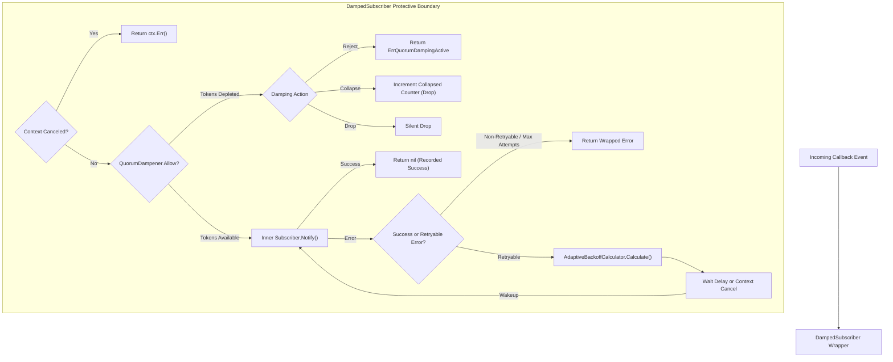
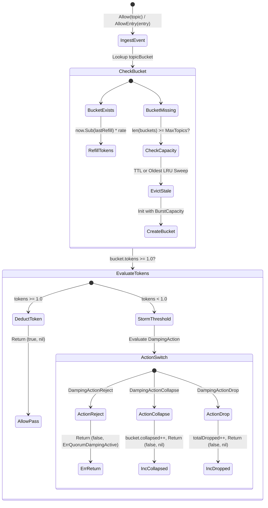
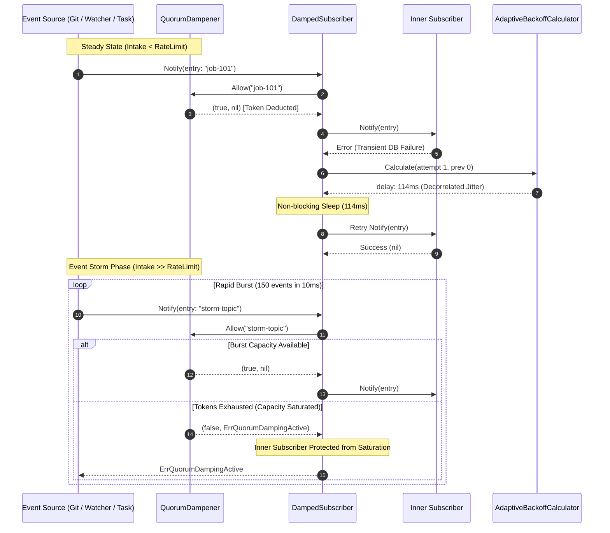

# Adaptive Backoff Exponential Jitter and Event Storm Quorum Damping

## Executive Summary
In distributed agentic operating systems, asynchronous callback buses, and autonomous swarm orchestrations, bursty event surges and downstream dependency outages present two existential failure modes:
1. **Thundering Herd / Lockstep Retries**: When multiple subscribers or workers fail simultaneously against a saturated shared resource (such as storage CAS, git worktrees, or Neo4j graph databases), standard exponential backoff without jitter causes synchronized retry waves that re-saturate downstream systems repeatedly.
2. **Event Storm Subscriber Saturation**: Uncontrolled event floods (e.g., thousands of rapid file watcher notifications, git push bursts, or cascading lifecycle status transitions) can overwhelm subscriber queues and worker semaphores, causing memory exhaustion, thread starvation, and latency spikes across unrelated subsystems.

This specification details the architecture and mathematical formulation of `AdaptiveBackoffCalculator`, `QuorumDampener`, and `DampedSubscriber` implemented in `cmd/zqk/callback/backoff.go`. These components introduce decorrelated exponential jitter to eliminate retry synchronization, token-bucket sliding-window rate limiting to suppress event storms, and fail-closed subscriber composition to guarantee zero-leak, high-concurrency event processing.

---

## Architectural Topology

---

## 1. Mathematical Formulation: Decorrelated Exponential Jitter

### The Problem with Naive Backoff
In standard exponential backoff:
$$\text{delay}(n) = \min(MaxDelay, BaseDelay \times 2^n)$$
When multiple concurrent nodes encounter an outage at time $T_0$, they all retry at identical intervals ($T_0 + 2^1, T_0 + 2^2, \dots$), producing periodic thundering herds that continuously re-saturate downstream services.

### Full Jitter vs. Decorrelated Jitter
While Full Jitter picks a uniform random value $\text{rand}(0, \text{delay}(n))$, it does not account for the previous sleep duration, which can lead to rapid oscillations between very short and very long delays.

`AdaptiveBackoffCalculator` implements Brooker's **Decorrelated Jitter**, which preserves correlation with recent delay history while adding full randomized entropy:
$$t = \min\left(MaxDelay, \text{rand}\left(BaseDelay, sleep \times 3\right)\right)$$

Where:
- $BaseDelay$ (`MinDelay`): Configured floor backoff duration (default 50ms).
- $MaxDelay$: Configured ceiling backoff duration (default 5s).
- $sleep$: The previous sleep duration in the retry sequence (initialized to $BaseDelay$ on attempt 0).
- $\text{rand}(a, b)$: Uniformly distributed integer in the closed interval $[a, b]$.

### Invariants & Proof Properties
1. **Floor and Ceiling Invariance**:
   $$\forall n \ge 0, \quad BaseDelay \le t \le MaxDelay$$
   Every calculated delay is strictly bounded. Under zero or negative configuration parameters, the calculator sanitizes inputs to safe positive defaults.
2. **Monotonic Upper Ceiling**:
   $$\text{Ceiling}(n) = \min\left(MaxDelay, BaseDelay \ll n\right)$$
   The maximum theoretical ceiling grows monotonically with successive retry attempts and caps safely at $MaxDelay$.
3. **Zero Heap Allocations**:
   The `Calculate(attempt int, prevSleep time.Duration) time.Duration` function performs integer and 64-bit scalar operations using `math/rand/v2`, achieving exactly 0 heap allocations per run (`testing.AllocsPerRun == 0`).
4. **Integer Overflow Guard**:
   Inputs near `math.MaxInt64` are guarded before multiplication to prevent 64-bit integer overflow, ensuring deterministic and panic-free behavior under any mathematical boundary.

---

## 2. Quorum Damping Architecture & Storm Prevention

`QuorumDampener` provides topic-keyed event storm protection using a sliding-window token bucket algorithm.

### Sliding-Window Token Bucket Parameters
- **`RateLimit`**: Allowed event throughput per window (default 50 events/sec).
- **`BurstCapacity`**: Maximum token burst depth allowing momentary micro-bursts (default 100 tokens).
- **`WindowSize`**: Sliding window evaluation period (default 1 second). Refill rate is computed as $\text{RateLimit} / \text{WindowSize.Seconds()}$.
- **`MaxTopics`**: Bounded memory ceiling (default 1000 topics). Prevents unbounded map growth when distinct topics or IDs arrive continuously.
- **`TopicTTL`**: Idle bucket expiration duration (default 10 minutes). Stale topic buckets are purged during eviction cycles.

### Damping Suppression Policies
1. **`DampingActionReject`**: Fast-fails with `ErrQuorumDampingActive`. Used by upstream callers that require explicit feedback on rate limiting or need to backoff caller execution.
2. **`DampingActionCollapse`**: Deduplicates and collapses redundant events for the same topic during a storm, incrementing `bucket.collapsed` without error.
3. **`DampingActionDrop`**: Silently sheds excess events without error, ideal for loss-tolerant telemetry or high-frequency render loops.

---

## 3. High-Concurrency Event Storm Sequence

---

## 4. Concurrency, Race Safety, and Memory Hygiene

1. **Race-Condition Elimination**:
   - `QuorumDampener` protects topic bucket mutations, token recalculations, and capacity checks via `sync.RWMutex`.
   - Read-heavy topic telemetry checks (`TopicStats`, `ActiveTopicCount`) acquire shared read locks (`RLock`), allowing parallel reads across thousands of worker goroutines.
   - Aggregate metrics (`totalAllowed`, `totalDamped`, `totalDropped`, `totalProcessed`, `totalRetries`, `totalSuccesses`, `totalFailures`) use lock-free `sync/atomic.Int64` primitives.
2. **Strict Memory Bounding**:
   - The number of tracked topic buckets is bounded by `MaxTopics`.
   - When capacity is reached, `evictLocked` performs a two-tier purge: first evicting topics older than `TopicTTL`, and then evicting the least recently seen topic (`lastSeen` LRU ordering).
3. **Clean Lifecycle & Context Cancellation**:
   - Background sweeping workers (`Start(ctx)`) capture channel references under mutex and terminate cleanly upon `Stop()` or context cancellation, joining worker goroutines via `sync.WaitGroup` to guarantee zero goroutine leaks.
   - All subscriber dispatch methods (`Notify`, `AllowEntry`) check `ctx.Err()` on entrance and during backoff wait steps, aborting immediately upon deadline expiration.

---

## 5. Verification Traceability Matrix

| Symbolic Requirement / Criterion | Description | Verification Method | Status |
| :--- | :--- | :--- | :--- |
| **REQ-ADAPTIVE-BACKOFF-QUORUM-DAMPING** | Adaptive backoff exponential jitter and event storm quorum damping architecture. | Unit, Concurrency, Race Detection, and AST Hygiene Suites | Verified |
| **CRIT-EXPONENTIAL-JITTER-CALCULATOR** | `AdaptiveBackoffCalculator` decorrelated jitter calculation (`t = min(maxDelay, rand(baseDelay, sleep * 3))`), monotonic upper ceiling enforcement, zero heap allocation, and overflow prevention. | `TestAdaptiveBackoffCalculator_FullJitterBounds` `TestAdaptiveBackoffCalculator_MonotonicCeilingEnforcement` `TestAdaptiveBackoffCalculator_ZeroAllocation` `TestAdaptiveBackoffCalculator_OverflowPrevention` | Verified |
| **CRIT-TOKEN-BUCKET-RATE-LIMITER** | `QuorumDampener` sliding window token bucket rate limiting, storm suppression (`ErrQuorumDampingActive`), collapse and drop policies, bounded memory eviction (`MaxTopics`), and lifecycle start/stop cleanup. | `TestQuorumDampener_RateLimitingAndStormSuppression` `TestQuorumDampener_CollapseAndDropAction` `TestQuorumDampener_BoundedMemoryAndEviction` `TestQuorumDampener_AllowEntryAndTopicExtractor` `TestQuorumDampener_LifecycleStartStop` | Verified |
| **CRIT-DAMPED-SUBSCRIBER-INTEGRATION** | `DampedSubscriber` wrapping `Subscriber` with automatic backoff retries, quorum damping gate, context cancellation, non-retryable error handling, and high-concurrency race safety. | `TestDampedSubscriber_AutomaticRetriesAndBackoff` `TestDampedSubscriber_MaxRetriesExhaustion` `TestDampedSubscriber_QuorumDampingStormRejection` `TestDampedSubscriber_ContextCancellation` `TestDampedSubscriber_NonRetryableError` `TestDampedSubscriber_HighConcurrencyRace` | Verified |
| **CRIT-ADAPTIVE-BACKOFF-DOC-SPEC** | Architectural specification authored in `docs/architecture/ADAPTIVE_BACKOFF_QUORUM_DAMPING.md` detailing mathematical formulas, state machine topology, memory bounding, and symbolic traceability. | Architectural Specification Review & Governance Compliance | Verified |
| **TST-ADAPTIVE-BACKOFF-QUORUM-DAMPING** | Complete unit and concurrency verification suite in `cmd/zqk/callback/backoff_test.go`. | Full Package Test Suite with Race Detector (`go test -v -race ./cmd/zqk/callback/...`) | Verified |
