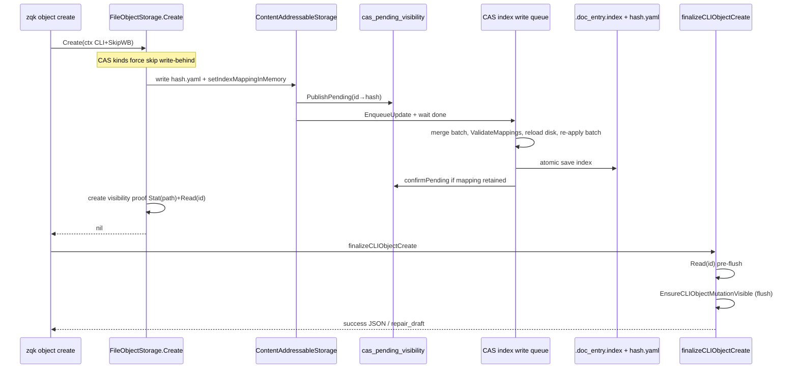
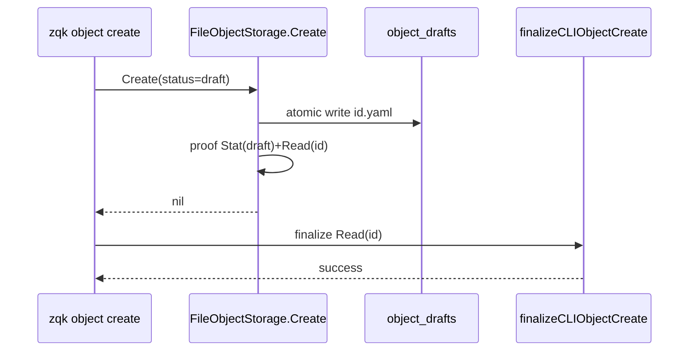

# CAS create → gettability flow (and object draft plane)

**Last Verified:** 2026-08-31


TRACK: `[REDACTED-ID]`

Diagnoses create→get ghosts (`repair_draft`). Each CLI `zqk object create` is a **short-lived process** that shares on-disk CAS index, pending visibility JSON, and hash files with peers (other CLIs, MCP daemon).

**Terminology:** “Membrane” in the data-cell sense means path/profile boundaries (`CellMembrane`, `MembraneReadPaths` — see [DATA_CELL_MODEL.md](./DATA_CELL_MODEL.md)). This doc is about **create→get gettability**, not the data-cell membrane API. Older wording “membrane proof” here means **create visibility proof** (Stat + Read after persist).

## Object draft plane (preliminary status)

Lifecycle-**preliminary** objects on CAS kinds (non-stream) now persist under **`.zqk/object_drafts/<kind>/<shard>/<id>.yaml`** — mutable, id-keyed, **no** content hash / CAS index. Instance mint uses this plane (`zqk new object --title`). `.zqk/drafts/` remains for **non-instance** scaffolds (bundles, object-spec, create repair dumps) and is not a second home for minted objects.

| Event | Plane |
|-------|--------|
| Create with preliminary status (e.g. `doc_entry` `draft`) | Draft plane |
| Get / Exists by id | Draft plane first, then CAS (dual-read) |
| **List / Count** | **CAS / post-membrane only** — draft-plane objects are not in the normal list |
| Update while still preliminary | Rewrite draft plane |
| Update leaving preliminary (e.g. promote `draft`→`review`) | **Materialize** via CAS write, then delete draft file (fail closed) |
| Delete | Remove draft file (+ best-effort leftover CAS) |

Draft enumeration is a **separate** plane — preliminary items must not appear in `object list`. Any lifecycle status marked `preliminary: true` that is listable from CAS is a **Layer-0 membrane integrity violation**, regardless of its spelling (`draft`, `exploring`, `proposed`, etc.). Remediate by promoting/parking a ready object or rematerializing genuine ideation onto the draft plane through the CLI.

**`zqk system check`** reports an **Object draft plane** section (counts by kind with a few sample ids nested under each kind; JSON/YAML field `object_draft_plane` / `sample_ids_by_kind`) so the bucket cannot become a black hole. Presence alone does not fail the check; ≥50 drafts adds a backlog warning in that section.

### Mint UX (`zqk new object`)

```text
zqk new object <kind> --title "…"
  → Create (origin/preliminary) → .zqk/object_drafts/…/{id}.yaml
  → (default) stay on draft plane — fill fields, then promote when ready
  → optional: --promote enqueues SCH-mint-promote-<id> (object promote)
  → on promote success: CAS + list/count; draft file removed
```

- Background promote is **opt-in** (`--promote`). Title-only mints are rarely promote-ready.
- **In-process promote-ready create:** `pkgctx.WithPromoteOnCreate(ctx)` keeps a valid shovel-ready status on Create so the write skips the draft plane (same intent as `--promote` when the payload is already complete — used by hourglass escalations).
- YAML scaffolds: `zqk object template <kind>` (not `new object`).
- **Promote stick:** promote re-validates at the *next* lifecycle status. Thin objects often fail (missing description/refs/checklist) and stay on the draft plane — gettable, not in list.

### Draft-plane ops (`zqk object draft`)

Orphans and intentional drafts accumulate under `.zqk/object_drafts/` and stay invisible to `object list`/`count`. Ops:

```bash
# Default dry-run — list matches (never deletes CAS); peers may classify
zqk object draft sweep --dry-run --all
zqk object draft promote --dry-run --all

# Apply deletes — requires ACC with RBAC delete:object_draft_plane (not seat nicknames)
zqk object draft sweep --kind agent_task --older-than 24h --all --dry-run=false
zqk object draft promote --kind agent_task --all --dry-run=false

# Filters: --kind, --id-prefix, --status, --older-than, --max
```

**Promote vs sweep (do not conflate):**

| Command | Purpose | When |
|---------|---------|------|
| **`draft promote`** | One lifecycle hop + re-validate; on success → CAS materialize + remove draft file | Default path for intentional drafts. If promote **sticks**, read reject reasons → `object update` fix fields/refs → re-promote. Stick is not failure of the plane — it is unpaid validation debt. |
| **`draft sweep`** | Delete draft-plane YAML only (never CAS) | **RBAC** `delete:object_draft_plane` on authenticated ACC (owner/steward/admin). Not a substitute for promote. Peers/doers: dry-run/classify + promote/fix only. Seat nicknames are not auth. |

**Forbidden:** applying sweep without RBAC grant; sweeping to clean counts; sweeping because promote failed; seat-string allowlists; env privilege overrides (`ZQK_ALLOW_*`). Glossary: `GLS-1786417022441021000-78a4f453` + `GLS-DRAFT-SWEEP-RBAC-PERM-001`. Policy: `POL-AGENT-DRAFT-SWEEP-TPM-001`. Decision: `DEC-DRAFT-SWEEP-RBAC-001`. Env-override removal: tech-debt CVS `REDACTED` / `BLI-ENV-BREAKGLASS-REMOVE-001`.

Implementation: `pkg/storage/object_draft_plane_match.go` + sweep/promote; CLI `zqk object draft sweep|promote` (TRACK `REDACTED` / `REDACTED`).

Also indexed in `scripts/mesh/README.md` (ops).

Implementation: `pkg/storage/object_draft_plane.go`, wired in Create / Read / Update / Delete / List.

## Happy path (sync CAS create — non-preliminary)



## Happy path (preliminary → draft plane)



## Root cause (2026-08-01): BatchingObjectStorage ghost ACK

**Symptom:** CLI `repair_draft` with envelope `object` = `{id,kind,title}` only — no `.zqk/object_drafts/` file. In-process `FileObjectStorage.Create` stayed green; CLI sequential mint under load failed ~2–50%.

**Evidence:** debug on Create exit showed `BatchCreateReturn err=<nil> id=BLI-… status=<nil> nkeys=3` with **no** matching `FileObjectStorage.Create` exit for that id. The global provider cache wraps every create in `BatchingObjectStorage` (intended for Neo4j swarm writes). When the in-process queue flushed with `len>1`, it called `BulkCreate`, which:
1. runs `ensureObjectID` (sets `id` on the caller map),
2. queues `FileObjectTransaction.Create` (no metadata / no draft write),
3. returns `(result, nil)` even with per-object failures,
4. and the batcher broadcast that nil to every waiter → CLI finalize → `repair_draft`.

**Fixes:**
1. **Bypass batching** when ctx has `WithSkipWriteBehind` or `WithCLIOperation` (CLI create already sets both).
2. On multi-op flush: map `BulkResult.Errors` by index; **refuse ghost ACK** if status is still empty after bulk.
3. Draft-plane hardening (still valuable): live-map `useDraftPlane`, visibility proof before audit/journal, CLI finalize skips CAS flush for draft-plane ids, Create never uses write-behind.

**Still open for non-preliminary CAS** (`status=planned` etc.): index merge / pending races across short-lived CLIs — same TRACK BLI.

## Preferred shape: `pkg/pipeline` (not ad-hoc logs)

Create→gettability should be a named pipeline kind (e.g. `cas_object_create`) using [`pkg/pipeline`](../../pkg/pipeline) + [data-pipeline-lifecycle.md](./data-pipeline-lifecycle.md). Draft-plane creates can share FINALIZE (proof) with a `plan=draft_plane` DECIDE outcome.

**Runner fact:** `Pipeline.Run` is **strictly sequential** (no parallel `AddStage`).

### Stage map (proposed)

| Lifecycle stage | Create work | Allowed effects | Outcome keys (sketch) |
|-----------------|-------------|-----------------|------------------------|
| **INGEST** | Resolve kind, id, marshal payload, compute hash (CAS) | read-only + pure | `object_id`, `kind`, `content_hash` |
| **NORMALIZE** | Bucket key, paths, schema defaults | pure | `storage_dir`, `bucket_key`, `hash_file` |
| **DECIDE** | Existence check; plan `draft_plane` \| `cas_sync` \| `stream` \| `reject` | pure | `plan` |
| **COMMIT** | Draft write **or** hash.yaml → pending → index | authoritative writes | `draft_written` / `hash_file_written`, … |
| **TRIGGER** *(opt)* | Audit / change-journal / notifications | side effects only | `audit_ok`, `journal_ok` |
| **FINALIZE** | Visibility proof: Stat + Read; CLI flush; success vs `repair_draft` | cleanup / visibility proof | `proof_ok`, `finalize_read_ok` |

## Related code

- `pkg/storage/object_draft_plane.go` — draft plane I/O
- `cmd/zqk/object/create.go` / `create_helpers.go` — CLI ctx + finalize
- `pkg/storage/object_storage_file_create.go` — skip-WB + visibility proof
- `pkg/storage/cas_index_write_queue_worker.go` — merge / re-apply batch
- `pkg/storage/cas_pending_visibility_cache.go` — pending + confirm
- `pkg/pipeline/pipeline.go` — builder / sequential `Run` / stage metrics
