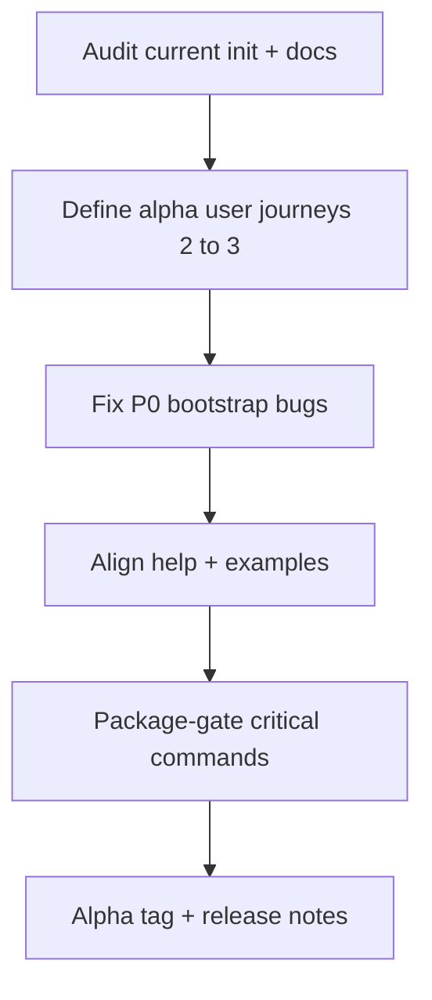

# CLI alpha launch — technical plan

**Status:** Plan (executable)  
**Tags:** `alpha`, `CLI`, `launch`, `bootstrap`, `onboarding`, `security`  
**Priority plan (CAS):** `PRI-EXAMPLE` — *CLI alpha launch readiness*  
**Index:** [ASSESSMENT_AND_ONBOARDING_INDEX.md](./ASSESSMENT_AND_ONBOARDING_INDEX.md)  
**Metrics & target date:** [METRICS_TREASURE_MAP_AND_ALPHA_TIMELINE.md](./METRICS_TREASURE_MAP_AND_ALPHA_TIMELINE.md)  
**`doc_entry`:** `DOC-EXAMPLE` — `zqk object get DOC-EXAMPLE`

Goal: a **usable** alpha CLI that does not frustrate customers — enough to **build and orchestrate digital representatives of human intent** (objects, policies, scheduler work) with **clear** human and AI-agent paths.

---

## 1. Alpha bar (what “ready” means)

| Criterion | Measurable signal |
|-----------|-------------------|
| **First run works** | Documented install → `zqk init` (or equivalent) → first successful `object list` / `system check` |
| **Errors are actionable** | No raw panics; messages cite next step or doc link |
| **Output is consistent** | JSON/YAML/table per `--format`; stable keys |
| **Background work** | Long tests documented; scheduler path for bundles |
| **Security baseline** | No accidental credential logging; keystore path documented (see repository `README.md` — *Security basics (alpha)*) |

---

## 2. Workstreams (prioritized)

### P0 — Documentation order

| Item | Deliverable |
|------|-------------|
| **Single entry** | One “Getting started” path from README → init → first object |
| **Troubleshooting** | Scheduler off, cache lock, common validation errors |
| **AI + human** | `AGENT_GUIDELINES` + Cursor rules parity for copy-paste workflows |

### P0 — Bootstrap and initialization

| Item | Deliverable |
|------|-------------|
| **Idempotent init** | Second run does not corrupt state |
| **Profiles** | `human` / `ai-agent` / `debug` documented |
| **Paths** | `.zqk/` layout expectations; link `FILESYSTEM_DATA_LAYOUT` |

### P1 — Core CLI UX

| Item | Deliverable |
|------|-------------|
| **Help parity** | Spec-driven help; examples run as written |
| **Timeouts** | Global `--timeout` behavior documented for long commands |
| **Membrane** | `schema_version` on structured payloads where applicable |

### P1 — Human + AI onboarding

| Item | Deliverable |
|------|-------------|
| **Safe defaults** | No destructive flags without confirmation |
| **Session / context** | How `ZQK_SESSION_ID` (or successor) scopes work — link REQ/CLI docs |
| **Object workflow** | Create → validate → list → update happy path |

### P2 — Quality and release hygiene

| Item | Deliverable |
|------|-------------|
| **Measurement outcomes** | Convergence measurements expose a **single primary outcome** per [MEASUREMENT_OUTCOME_TAXONOMY.md](./MEASUREMENT_OUTCOME_TAXONOMY.md); implementation **`BLI-EXAMPLE`** |
| **Version** | `zqk version` shows executable and version string; **git commit and build datetime** require **`-ldflags`** (see **`Makefile`** target **`build-local`**, or release builds). A plain **`go build`** without those flags leaves defaults (`dev`, `unknown`) — acceptable for dev, not for release reporting. |
| **Changelog** | Alpha section for breaking CLI changes |

---

## 3. Technical sequence (recommended)

1. **Journey A — Operator:** install → init → `system check` → `scheduler` status.  
2. **Journey B — Author:** `object template` → create → get → update → optional delete.  
3. **Journey C — Agent:** non-interactive flags, JSON output, error codes for scripting. **Doc + example script:** [AI_AGENT_ONBOARDING.md](../onboarding/AI_AGENT_ONBOARDING.md) (*Journey C — non-interactive JSON scripting*); backlog **`BLI-EXAMPLE`**.

---

## 4. Backlog seed (create via `zqk` CLI — not done here)

Link items to **`PRI-EXAMPLE`** with milestones as you add them:

- **Data cell program (alpha readiness):** same object-management and persistence story before and after alpha — **the full umbrella must be operationally complete before alpha**, not a read-path/tick subset: **`BLI-EXAMPLE`** plus child **`BLI-177608*`** items and linked follow-ons (envelope execution depth, migration, bundles—see [DATA_CELL_MODEL.md](./DATA_CELL_MODEL.md) § *Program completion*); track via **`zqk object get PRI-EXAMPLE`** (**note** lists the set).  
- **BLI (deferred):** **`BLI-EXAMPLE`** — documentation graph (manual cross-links → automated linking); deferred to focus capacity on the data-cell program — see [EXPERTISE_ARCHITECTURE_AND_CODE_QUALITY.md](./EXPERTISE_ARCHITECTURE_AND_CODE_QUALITY.md) and [ASSESSMENT_AND_ONBOARDING_INDEX.md](./ASSESSMENT_AND_ONBOARDING_INDEX.md).  
- BLI: Alpha — README + init golden path  
- BLI: Alpha — `system check` and scheduler “degraded mode” UX  
- BLI: Alpha — First-run object tutorial (`template` → `create`)  
- BLI: Alpha — Security copy review (logging, redaction)  

---

## 5. Tests

| Scope | Tool |
|-------|------|
| **CLI package** | Targeted `go test --package ./cmd/zqk/...` per touched area |
| **E2E** | Existing integration tests + one new “cold start” scenario if missing |

---

## 6. Positioning / marketing hooks (product copy)

Use these when writing **website**, **one-pagers**, or **sales engineering** blurbs—they are true to the implementation (see [PATH_ALIAS_RESOLUTION.md](./PATH_ALIAS_RESOLUTION.md), [DATA_CELL_RUNTIME_ORGANISM.md](./DATA_CELL_RUNTIME_ORGANISM.md)).

| Hook | One-liner |
|------|-----------|
| **Path-aware project layout** | The CLI resolves important directories and small config files through a **path alias cache**, not hardcoded strings—so you can **relocate** `docs`, streams, metrics trees, or operator JSON (feature flags, tray, CLI hooks) by editing **`zqk-settings.yaml`**. |
| **Safe partial overrides** | Brand **`paths.aliases`** **merge on top of** built-in defaults—you override only what you move; you do **not** have to copy the entire alias table or risk losing unrelated paths. |
| **Runtime organism** | Feature flags, hook profile, and tray share a documented **runtime layout** (`pkg/datacell`) and stable **protocol version**—a foundation for future storage backends without changing operator UX. |

**Short pitch (example):** *“zqk doesn’t trap your project in a fixed folder layout: path aliases and settings let you move data and config while the CLI keeps resolving the right places.”*

---

## 7. Related documents

- [GREENFIELD_TEAM_OPERATING_PLAN.md](./GREENFIELD_TEAM_OPERATING_PLAN.md) — standards seed  
- [scripts/onboarding_roadmap/README.md](../../scripts/onboarding_roadmap/README.md) — curriculum-as-data templates, seed job pointer, **advanced-tutorial reference pattern**  
- [ONBOARDING_ROADMAP_AND_CERTIFICATION.md](../process/architecture/ONBOARDING_ROADMAP_AND_CERTIFICATION.md) — onboarding objects and certification design narrative  
- [CLI_MEMBRANE_AND_SYSTEM_ANATOMY.md](./CLI_MEMBRANE_AND_SYSTEM_ANATOMY.md) — vocabulary  
- [PRE_CHANGE_CHECKLIST.md](./PRE_CHANGE_CHECKLIST.md) — change discipline  
- [PATH_ALIAS_RESOLUTION.md](./PATH_ALIAS_RESOLUTION.md) — alias cache, brand merge  
- [DATA_CELL_RUNTIME_ORGANISM.md](./DATA_CELL_RUNTIME_ORGANISM.md) — runtime config paths (flags, hooks, tray)

---

## 8. Convergence

Track execution under **`CVS-EXAMPLE`**; update `desired_end_state` when alpha scope is met or reprioritized.

### Handoff signals (operators and agents)

After you **abandon or supersede** a thread, older test-bundle outcomes can still appear in rolling `health.jsonl` windows while rollup or the vetting matrix is already green. Before treating **`zqk scheduler test-failures list`** as the ground truth, **refresh** the relevant packages with **`zqk scheduler go test --package …`** (see [PRE_COMMIT_BACKGROUND_RESULTS.md](./PRE_COMMIT_BACKGROUND_RESULTS.md)). Traceability: **`BLI-EXAMPLE`**.
