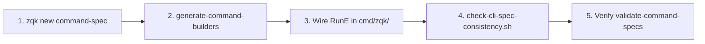

# CLI DNA Happy Path & Fail-Closed Membrane Guide

**Last Verified:** 2026-08-31


**Backlog Item:** `BLI-1786686487292065000-d623ad8e`  
**Requirement:** `REQ-1786686474136979000-d3cfc737`  
**Priority Plan:** `PRI-1786686563805309000-842068b2`  
**Criteria:** `CRIT-1786696710475127000-3ffcbf14`

---

## 1. Overview & Core Principles

All `zqk` subcommands follow the **Spec-Driven CLI DNA Pattern**. Adding or modifying a CLI command must never be done by ad-hoc hand-crafting of raw Cobra commands alone. 

Every command originates from declarative YAML DNA under `.zqk/cli/specs/`, projects into generated Go builders in `pkg/cli/bldr_cli_cmd_v1/`, and binds to execution handlers (`RunE`) in `cmd/zqk/`.

### Invariants:
1. **Single Authoring Source:** `.zqk/cli/specs/` is the sole source of truth for CLI definitions (DEC-1786732826125502000-ef80a104).
2. **Fail-Closed Before Ship:** New subcommands without corresponding YAML DNA or with un-generated builder drift are caught and rejected by native validation gates.
3. **Traceability:** Command flags, documentation, examples, and options stay synchronized across code, help output, and documentation.

---

## 2. CLI DNA Happy Path (5-Step Mechanical Flow)



### Step 1: Scaffold YAML Command DNA
Create the initial spec using the canonical command-spec generator:
```bash
./bin/zqk-stable new command-spec <group>/<command> --short "Short description" --description "Detailed markdown help description"
```
*Output:* Creates `.zqk/cli/specs/<group>/<command>_command.yaml` with schema validation `$schema: "../../../.zqk/cli/specs/schemas/command_spec.schema.json"`.

Define custom local flags, positional args, examples, and aliases directly in this YAML spec.

### Step 2: Generate Strongly-Typed Command Builders
Materialize the Go builder projections from the YAML specs:
```bash
./bin/zqk-admin system generate-command-builders --overwrite --specs-dir .zqk/cli/specs
```
*Output:* Updates / creates `pkg/cli/bldr_cli_cmd_v1/<group>_<command>_command_builder.go`.

### Step 3: Wire Execution Handler (`RunE`)
In `cmd/zqk/<group>/<command>.go`, construct the Cobra command using the generated builder and bind your business logic:

```go
func NewMyCommandCmd() *cobra.Command {
    bldr := bldr_cli_cmd_v1.NewMyCommandCommandBuilder()
    cmd := bldr.Build()
    cmd.RunE = func(cmd *cobra.Command, args []string) error {
        // Execute command logic
        return nil
    }
    return cmd
}
```

Add the new command to the parent command group in `cmd/zqk/<group>/<group>.go`.

### Step 4: Validate Native Spec Consistency
Run the consolidated fail-closed consistency verification script from repo root:
```bash
./scripts/check-cli-spec-consistency.sh
```

This verification suite checks:
1. **Generated Builder Parity:** Ensures `pkg/cli/bldr_cli_cmd_v1` has zero uncommitted codegen diffs.
2. **Flag DNA Registration:** Validates that live registered Cobra flags exactly match the YAML declaration (`Test.*CommandSurfaceMatchesYAMLSpecs`).
3. **Critical Builder Use:** Verifies that no command builders produce empty `Use` fields.
4. **Builder Slop Detection:** Fails if numeric CAS stems or malformed builder names exist (`check-cli-builder-slop.sh`).
5. **Live Tree Parity:** Runs `zqk system validate-command-specs` asserting zero unaccounted drift.

### Step 5: Test & Verify
Run package-specific DNA tests:
```bash
ZQK_TEST_ROOT=. go test -v ./pkg/zqkcli -run "Test.*CommandSurfaceMatchesYAMLSpecs"
```

---

## 3. Native Fail-Closed Gate Reference

| Gate / Command | Purpose | Error Condition & Recovery |
| :--- | :--- | :--- |
| `zqk system validate-command-specs` | Verifies live Cobra command tree matches `.zqk/cli/specs/` | Fails on new un-spec'd commands. Fix: add YAML spec in `.zqk/cli/specs/`. |
| `./scripts/check-cli-spec-consistency.sh` | End-to-end CI gate for builders, flags, and tree parity | Fails if builders need regeneration or flags differ. Fix: run `zqk-admin system generate-command-builders --overwrite`. |
| `TestInternalCommandSurfaceMatchesYAMLSpecs` | Unit test in `pkg/zqkcli/command_spec_dna_test.go` | Fails on flag name mismatches between code and YAML. Fix: synchronize flags in spec YAML. |
