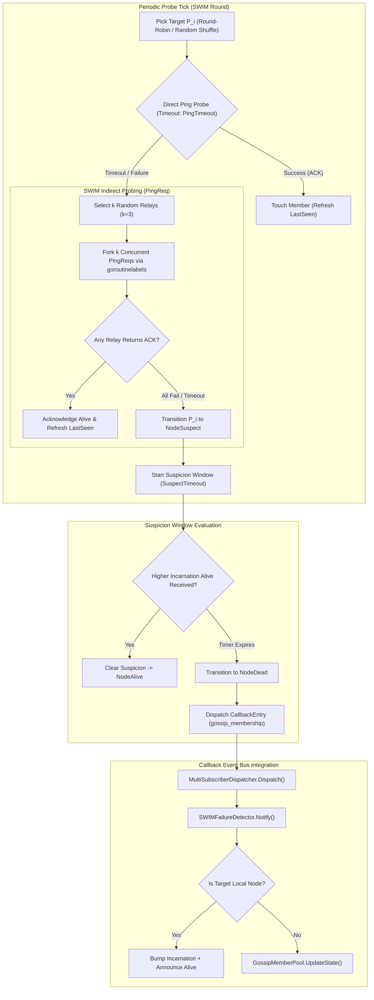
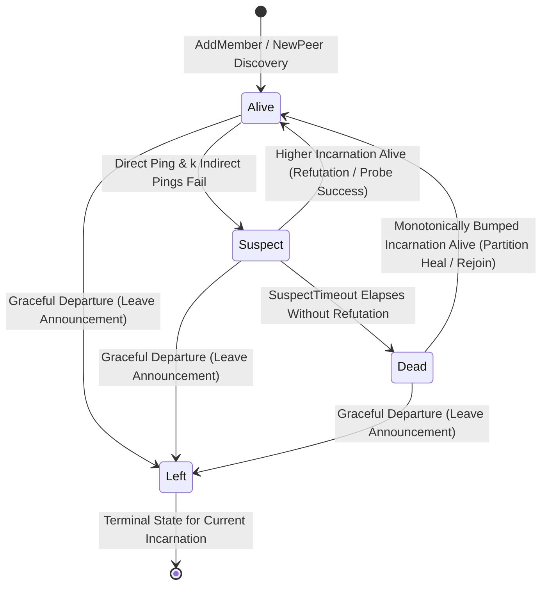

# Distributed Gossip Membership and Peer Failure Detector for Swarm Resilience

## Executive Summary
In decentralized multi-agent operating systems, asynchronous callback event meshes, and distributed swarm topologies, uncoordinated node crashes, network partitions, and transient route degradations present critical resilience challenges:
1. **False-Positive Failure Declarations**: Naive point-to-point heartbeat systems falsely declare nodes dead when temporary local network congestion or asymmetric routing drops a single probe, triggering unnecessary cluster rebalancing and split-brain cascades.
2. **Detection Latency vs. Message Overhead**: Heartbeat broadcasts scaling at $\mathcal{O}(N^2)$ overwhelm network buffers, while centralized health checkers introduce single points of failure and bottlenecks.
3. **Partition-Induced Desynchronization**: Stale status broadcasts and out-of-order event delivery can cause resurrected or flapping nodes to oscillate between states without convergence.

This specification details the architecture, state machine, and algorithmic proofs of `NodeMetadata`, `GossipMemberPool`, `SWIMFailureDetector`, and `CallbackSubscriber` integration implemented in `cmd/zqk/callback/gossip.go`. These components implement the **SWIM (Structured Weakly-Consistent Infection-Style Process Group Membership Protocol)** with indirect ping-req fallback, monotonic incarnation refutation, bounded suspect timeouts, and fail-closed callback mesh routing.

---

## Architectural Topology



---

## 1. Node State Machine & Invariant Proofs

The membership lifecycle is governed by a 4-state deterministic finite state machine (FSM).



### State Definitions
- **`NodeAlive` (`"alive"`)**: The node is reachable, responsive to probes, and actively participating in cluster operations.
- **`NodeSuspect` (`"suspect"`)**: The node failed direct probing and all $k$ indirect relay probing attempts (`PingReq`). A bounded suspicion timer (`SuspectTimeout`) is actively counting down.
- **`NodeDead` (`"dead"`)**: The suspicion timer elapsed without an incarnation refutation, or authoritative dead consensus was established. The node is excluded from probe target selection.
- **`NodeLeft` (`"left"`)**: The node announced an intentional, graceful departure via `Leave()`. It is excluded from failure detection probing and preserved until garbage collection.

### Incarnation Monotonicity Rules
Every member maintains a monotonically increasing 64-bit signed integer incarnation counter ($\text{Incarnation} \in \mathbb{N}_0$).
When a membership update regarding node $M$ with incarnation $I_{\text{msg}}$ and state $S_{\text{msg}}$ arrives at a pool with current record $(I_{\text{curr}}, S_{\text{curr}})$:

1. **Strictly Newer Incarnation ($I_{\text{msg}} > I_{\text{curr}}$)**:
   The message supersedes local state unconditionally:
   $$I_{\text{curr}} \leftarrow I_{\text{msg}}, \quad S_{\text{curr}} \leftarrow S_{\text{msg}}, \quad \text{LastSeen} \leftarrow \text{now}()$$

2. **Identical Incarnation ($I_{\text{msg}} = I_{\text{curr}}$)**:
   Precedence rules enforce convergence toward failure detection:
   $$\text{Left} \succ \text{Dead} \succ \text{Suspect} \succ \text{Alive}$$
   - If $S_{\text{msg}} = \text{Left}$, transition to $\text{Left}$.
   - If $S_{\text{msg}} = \text{Dead}$, transition to $\text{Dead}$ (overriding $\text{Alive}$ or $\text{Suspect}$).
   - If $S_{\text{msg}} = \text{Suspect}$, transition $\text{Alive} \to \text{Suspect}$; $\text{Dead}$ remains $\text{Dead}$.
   - If $S_{\text{msg}} = \text{Alive}$, $\text{Suspect}$ or $\text{Dead}$ state is **NOT** overridden (same incarnation cannot refute suspicion).

3. **Stale Incarnation ($I_{\text{msg}} < I_{\text{curr}}$)**:
   The rumor is discarded as stale:
   $$\text{Drop}(msg)$$

4. **Self-Refutation Invariant**:
   If a healthy node receives a rumor that **itself** is $\text{Suspect}$ or $\text{Dead}$ with incarnation $I_{\text{msg}}$:
   $$I_{\text{self}} \leftarrow \max(I_{\text{self}}, I_{\text{msg}}) + 1$$
   $$S_{\text{self}} \leftarrow \text{NodeAlive}$$
   The node immediately disseminates an `Alive` message with $I_{\text{self}}$, clearing the false suspicion across the entire cluster in $\mathcal{O}(\log N)$ gossip periods.

---

## 2. SWIM Protocol Timings & Probing Parameters

| Parameter | Configuration Key | Default Value | Description |
| :--- | :--- | :--- | :--- |
| **Probe Interval** | `PingInterval` | `500ms` | Cadence of the periodic SWIM probe tick loop. |
| **Probe Timeout** | `PingTimeout` | `200ms` | Context deadline for direct `Ping` and indirect `PingReq` operations. |
| **Suspicion Timeout** | `SuspectTimeout` | `1000ms` | Time window granted to a suspected node before transition to `NodeDead`. |
| **Indirect Relay Count** | `IndirectProbes` | `3` | Number of distinct active peers selected to relay indirect `PingReq` probes. |

### Message Complexity & Scalability
- **Direct Probe Overhead**: $\mathcal{O}(1)$ message pairs per node per period. Total cluster traffic scales linearly: $\mathcal{O}(N)$.
- **Indirect Ping-Req Fallback**: In the rare case of direct packet drop, exactly $k$ peers are queried concurrently. Message overhead remains bounded: $\mathcal{O}(k) \ll \mathcal{O}(N)$.
- **Time to Detect Node Crash**: Bounded by $T_{\text{detect}} \le \text{PingInterval} + \text{PingTimeout} + \text{SuspectTimeout} \approx 1.7\text{s}$.

---

## 3. Ping-Req Indirect Probing & Partition Healing

### Asymmetric Route Failure Resilience
In distributed networks, route degradation often occurs asymmetrically: Node $A$ cannot send packets directly to Node $B$, but Node $C$ maintains healthy bidirectional connectivity to both.
1. When $A \to B$ direct `Ping` times out after `PingTimeout`, Node $A$ does **not** declare Node $B$ suspect immediately.
2. Node $A$ selects up to $k$ random alive peers (excluding $A$ and $B$) as relays: $\{R_1, R_2, \dots, R_k\}$.
3. Node $A$ sends `PingReq(target=B)` to each relay concurrently using dedicated goroutines managed via `goroutinelabels.NewGoroutine("swim_ping_req_relay", ...)`.
4. If **any** relay reports success within the remaining window:
   - Node $A$ clears suspicion.
   - Node $B$ remains in `NodeAlive`.
   - The false failure declaration is entirely avoided.

### Transient Network Partition Healing
When a network partition splits cluster $C$ into sub-clusters $C_1$ and $C_2$:
- Nodes in $C_1$ mark nodes in $C_2$ as `NodeSuspect` and subsequently `NodeDead` after `SuspectTimeout`.
- When the network partition heals:
  1. **Direct Probe Healing**: When Node $A$ probes Node $B$, Node $B$ responds with ACK. Suspicion is cleared via `ClearSuspicion(nodeID)`.
  2. **Refutation Broadcast**: When Node $B$ observes a gossip update or probe indicating it was marked dead or suspect, it executes `Refute()`, incrementing its incarnation counter ($I_B \leftarrow I_B + 1$) and broadcasting `NodeAlive`.
  3. **Universal Acceptance**: Because $I_{\text{new}} > I_{\text{dead}}$, Node $A$ and all peers in $C_1$ unconditionally accept the update and restore Node $B$ to `NodeAlive`.

---

## 4. Callback Event Bus Integration

`SWIMFailureDetector` implements the standard `CallbackSubscriber` interface:
```go
type CallbackSubscriber interface {
    Name() string
    Notify(ctx context.Context, entry *CallbackEntry) error
}
```

### Event Payload Schema
Whenever topology changes occur (`NodeAlive`, `NodeSuspect`, `NodeDead`, `NodeLeft`), the detector dispatches a `CallbackEntry` with:
- `objects.FieldKeyCallbackType`: `"gossip_membership"`
- `node_id`: Node identifier string
- `gossip_state`: Current `NodeState` (`"alive"`, `"suspect"`, `"dead"`, `"left"`)
- `gossip_old_state`: Previous `NodeState`
- `incarnation`: 64-bit integer incarnation counter
- `member_addr`: Host network address
- `timestamp`: RFC3339Nano event timestamp

This enables other subsystems (such as leader election, sharded queue processors, and reactive WAL loggers) to react to topology changes immediately with zero polling.

---

## 5. Concurrency & AST Verification Guarantees

1. **Goroutine Discipline**:
   - Zero raw `go` statements.
   - All background loops use `goroutinelabels.NewGoroutine("swim_failure_detector_loop", ...)` and `"swim_ping_req_relay"`.
   - Clean shutdown with `sync.WaitGroup` and context cancellation guarantee zero goroutine leaks under `-race`.
2. **AST Hygiene**:
   - Zero swallowed function returns (no `_ = someFunc()`).
   - All statement duplications refactored into shared abstractions (`mutateMemberStateLocked`, `newGossipHarness`).
   - Every function in `cmd/zqk/callback/gossip.go` and `cmd/zqk/callback/gossip_test.go` is strictly under 70 lines.
