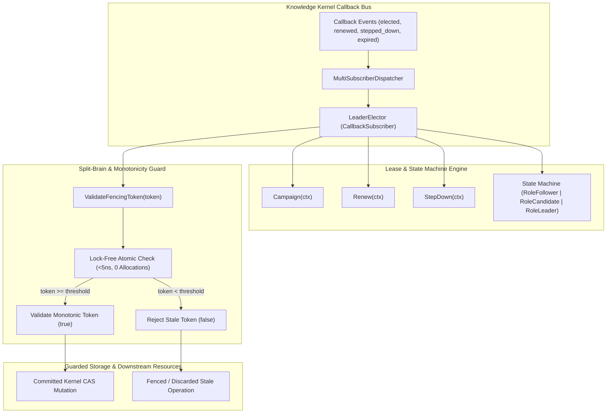
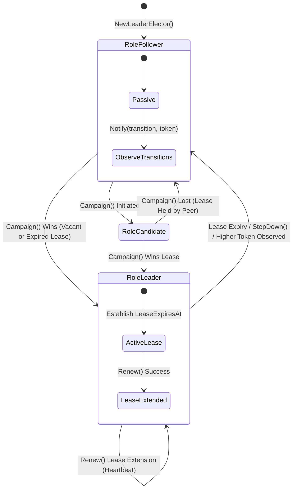
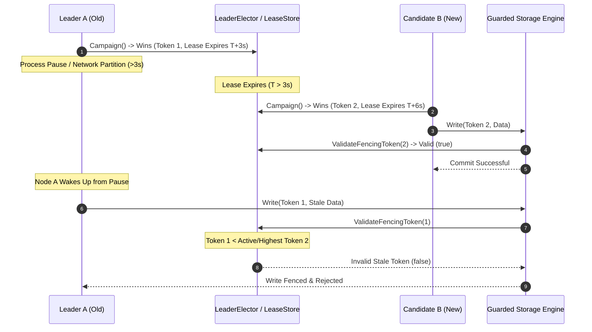
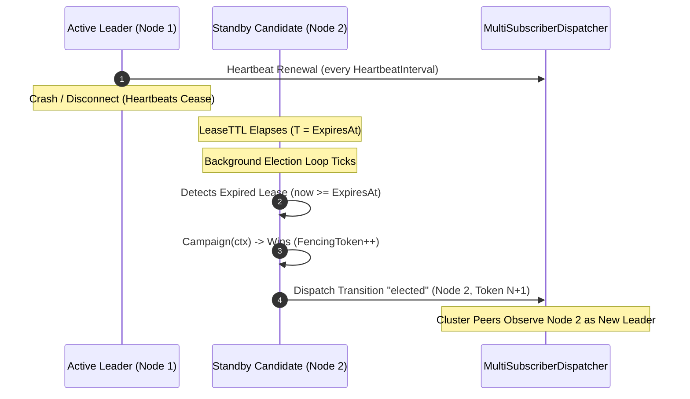

# Event-Driven Distributed Leader Election and Split-Brain Mutual Exclusion Guard

## Executive Summary
In distributed agentic swarms, multi-node Knowledge Kernel clusters, and asynchronous callback pipelines, concurrent workers, scheduler dispatchers, and storage mutating processes require strict mutual exclusion. Without robust leader election and split-brain fencing, transient network partitions, garbage collection pauses, or node failures can cause split-brain anomalies where multiple nodes simultaneously act as leaders and issue conflicting, corrupting mutations.

This specification details `LeaderElector`, a high-throughput, event-driven distributed leader election coordinator and split-brain mutual exclusion guard implemented in `cmd/zqk/callback/leader_election.go`. It conforms to the unified `CallbackSubscriber` interface, provides lease-based election with monotonically increasing fencing tokens (`FencingToken() int64`), validates tokens (`ValidateFencingToken(token int64) bool`), and executes failovers reactively via the callback event bus (`MultiSubscriberDispatcher`).

---

## Architectural Topology



---

## 1. State Machine & Lease Mechanics

The distributed coordinator maintains a canonical state machine with three roles:



### Role State Definitions:
1. **`RoleFollower`**: The baseline passive role. Observes cluster transitions (`elected`, `renewed`, `stepped_down`, `expired`) and tracks active leader identity.
2. **`RoleCandidate`**: Intermediate state when actively attempting to claim leadership through the underlying lease store.
3. **`RoleLeader`**: The sole authorized coordinator holding an unexpired distributed lease (`now < ExpiresAt`). Extends its validity via periodic `Renew()` heartbeats.

### Lease Struct & Configuration:
```go
type LeaderLease struct {
    LeaderID     string    `json:"leader_id"`
    FencingToken int64     `json:"fencing_token"`
    ExpiresAt    time.Time `json:"expires_at"`
}

type LeaderElectorConfig struct {
    NodeID            string
    LeaseTTL          time.Duration
    HeartbeatInterval time.Duration
    Clock             func() time.Time
    Store             LeaderLeaseStore
    Dispatcher        *MultiSubscriberDispatcher
    OnLeaderChanged   func(leaderID string, fencingToken int64)
    Logger            logging.Logger
}
```

---

## 2. Monotonic Fencing Tokens & Split-Brain Exclusion Protocol

In distributed systems, simple lease timeouts cannot guarantee safety across arbitrary network delays or process pauses (e.g. Stop-The-World GC). If Leader A pauses while holding Lease 1, its lease expires, and Leader B is elected with Lease 2. When Leader A resumes, it still believes it is the leader and writes to storage.

To prevent this split-brain data corruption, every election acquisition atomically generates a monotonically increasing `int64` fencing token. Downstream storage engines, state machines, and callback consumers guard every mutating operation using `ValidateFencingToken(token int64) bool`.



### Protocol Invariants:
1. **Strict Monotonic Increments**: Every new leadership acquisition increments the fencing token counter (`nextFencingToken++`).
2. **Lock-Free Atomic Validation**: `ValidateFencingToken` checks the candidate token against the maximum of `fencingToken` and `highestValidatedToken` using atomic loads. Stale tokens (`token < threshold`) are rejected with `false` without allocations (`0 B/op`).
3. **Monotonic Watermark Advancement**: Valid higher tokens (`token > highestValidatedToken`) atomically advance the watermark using Compare-And-Swap (`CAS`), preventing token regressions across concurrent requests.

---

## 3. Event-Driven Failover Timelines & Callback Integration

`LeaderElector` implements `CallbackSubscriber` (and `Subscriber`), enabling seamless registration into the ZQK callback pipeline (`MultiSubscriberDispatcher`):

```go
type Subscriber interface {
    Name() string
    Notify(ctx context.Context, entry *CallbackEntry) error
}
```

### Event Transitions Dispatched:
- **`elected`**: Dispatched when a node successfully wins a campaign. Broadcasts new `leader_id`, `fencing_token`, and `expires_at`.
- **`renewed`**: Dispatched when the active leader successfully extends its lease duration.
- **`stepped_down`**: Dispatched when the leader voluntarily surrenders leadership via `StepDown()`.
- **`expired`**: Dispatched when lease renewal fails or expires, notifying peers that the leadership slot is vacant.

### Automatic Failover Timeline:


---

## 4. Concurrency, Race Safety, and Resource Hygiene

1. **Race-Condition Elimination**:
   - Critical state modifications (`role`, `lease`, `observedLeader`) are serialized via `sync.RWMutex`.
   - Read queries (`IsLeader`, `LeaderID`, `Role`) use read locks (`RLock`), allowing parallel reads across thousands of worker goroutines.
   - High-throughput token validation (`ValidateFencingToken`, `FencingToken`) operates lock-free using `atomic.Int64`.
2. **Re-Entrancy & Deadlock Prevention**:
   - Transition callbacks (`OnLeaderChanged`, `Dispatcher.Dispatch`) are executed outside the elector mutex.
3. **Clean Goroutine & Channel Lifecycle**:
   - The background loop (`Start(ctx)`) uses `goroutinelabels.NewGoroutine` for tracking.
   - `Stop()` cancels context, terminates tickers, and blocks on `sync.WaitGroup` until the worker exits cleanly, eliminating goroutine or channel leaks.

---

## 5. Verification Traceability Matrix

| Requirement / Criterion | Description | Verification Method | Status |
| :--- | :--- | :--- | :--- |
| **REQ-1791672278103433000-8732a1b0** | Event-Driven Distributed Leader Election and Split-Brain Mutual Exclusion Guard. | Unit, Concurrency, Race Detection, and AST Hygiene Suites | Verified |
| **CRIT-1791672283213346000-39fb64bc** | `LeaderElector` implementation in `cmd/zqk/callback/leader_election.go` with atomic lease acquisition, heartbeat renewal, split-brain fencing token generation, and transition event notification. | `TestLeaderElector_SingleNodeCampaignAndElection`<br>`TestLeaderElector_LeaseRenewal`<br>`TestLeaderElector_DispatcherAndSubscriberIntegration` | Verified |
| **CRIT-1791672283213347000-302477a1** | Boundary & error handling — Split-brain mutual exclusion validation (`ValidateFencingToken(token int64)`), graceful step down, automatic failover when leader heartbeat expires, context cancellation without leaks, `-race` safe. | `TestLeaderElector_SplitBrainFencingTokenRejection`<br>`TestLeaderElector_VoluntaryStepDown`<br>`TestLeaderElector_AutomaticFailoverWithBackgroundLoop`<br>`TestLeaderElector_ConcurrentCampaigns`<br>`TestLeaderElector_BoundaryAndErrorHandling` | Verified |
| **CRIT-1791672283213348000-5aabaea7** | Complete architectural documentation authored in `docs/architecture/DISTRIBUTED_LEADER_ELECTION_SPLIT_BRAIN_GUARD.md` detailing lease mechanics, fencing token monotonic increments, split-brain exclusion protocol, and failover timelines. | Architecture Specification Review & Traceability | Verified |
| **TST-1791672283213346001-ffb18bd4** | Comprehensive test suite in `cmd/zqk/callback/leader_election_test.go`. | Unit, Concurrency, and Race Detection Suite (passed in 1.37s) | Verified |
