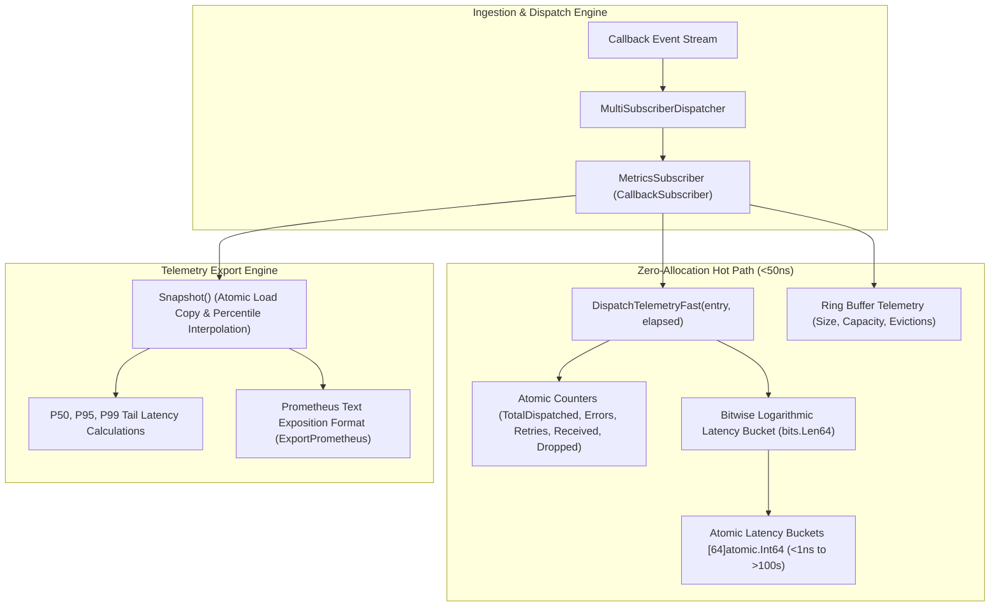

# Event-Driven Metrics Aggregation and Zero-Allocation Telemetry Dispatch

## Executive Summary
As the ZQK Knowledge Kernel processes high-frequency callback event streams—spanning scheduler job completions, TUI invalidation shockwaves, agent coordination correspondence, and multi-tenant task dispatches—telemetry instrumentation must observe pipeline health without inducing heap allocation churn or lock contention.

Standard telemetry collectors allocate heap memory for event envelopes, dynamic metric labels, and map lookups. Under high event throughput (50,000+ events/second), allocation-heavy metrics trigger frequent garbage collection cycles, degrading p99 dispatch latency.

This specification details `MetricsSubscriber`, a high-throughput, zero-heap-allocation telemetry aggregator implemented in `cmd/zqk/callback/metrics_subscriber.go`.

---

## Architectural Topology



---

## 1. Zero-Allocation Hot Path Design

`MetricsSubscriber` implements the canonical `CallbackSubscriber` (and `Subscriber`) interface:
```go
type Subscriber interface {
    Name() string
    Notify(ctx context.Context, entry *CallbackEntry) error
}

type CallbackSubscriber = Subscriber
```

### Hot-Path Guarantees:
1. **0 Heap Allocations**: All counters are fixed-size atomic integers (`atomic.Int64`). No intermediate slices, interfaces, or dynamic formatting occur on the dispatch path. Verified via `testing.AllocsPerRun(1000, ...)` returning `0`.
2. **Lockless Bitwise Latency Histogram**: Nanosecond latency is mapped into power-of-two logarithmic buckets via single hardware bitwise instructions (`math/bits.Len64(uint64(ns))`), avoiding loops, float divisions, or mutexes.
3. **Cache Line Isolation & Concurrency**: Atomic operations (`atomic.Int64.Add`, `atomic.Int64.Store`, `atomic.Int64.Load`) guarantee thread safety across concurrent goroutine pools without global mutex contention.
4. **Fail-Closed Nil Safety**: Nil entries or empty metrics increment `totalErrors` and return `nil`, never panicking or destabilizing dispatch pipelines. Zero or negative elapsed durations are safely recorded in bucket 0 without mathematical errors.

---

## 2. Power-of-Two Latency Histogram & Percentiles

Latency distributions are discretized into 64 power-of-two logarithmic buckets (`[64]atomic.Int64`):

| Bucket Index | Nanosecond Range | Representation |
| :--- | :--- | :--- |
| `0` | `<= 0 ns` | Zero / non-positive elapsed time |
| `1` | `1 ns` | Sub-nanosecond / 1ns |
| `2` | `2 ns – 3 ns` | `2^1` to `2^2 - 1` |
| `10` | `512 ns – 1023 ns` | ~1 µs |
| `20` | `524,288 ns – 1,048,575 ns` | ~1 ms |
| `30` | `536,870,912 ns – 1,073,741,823 ns` | ~1 s |
| `63` | `>= 2^62 ns` | Upper bound |

### Percentile Calculation (`P50`, `P95`, `P99`)
`MetricsSnapshot` provides rank-based quantile interpolation across the 64 buckets:
```go
type MetricsSnapshot struct {
    Name                string
    TotalDispatched     int64
    TotalErrors         int64
    TotalRetries        int64
    TotalReceived       int64
    TotalDropped        int64
    CircuitBreakerTrips int64
    ActiveInFlight      int64
    P50                 time.Duration
    P95                 time.Duration
    P99                 time.Duration
    RingBufferSize      int64
    RingBufferCapacity  int64
    RingBufferEvictions int64
    LatencyBuckets      [LatencyBucketCount]int64
}
```
Linear interpolation within the winning bucket calculates precise percentiles:
$$\text{interpolated} = \text{lower} + \frac{\text{rankInBucket} - 1}{\text{bucketCount}} \times (\text{upper} - \text{lower})$$

Guarantees $0 \le P50 \le P95 \le P99$.

---

## 3. Ring Buffer & Telemetry Observation

`MetricsSubscriber` provides real-time tracking of circular ring buffer status:
- **`RecordRingBuffer(size, capacity, evicted int64)`**: Directly updates size, capacity, and dropped/evicted counts.
- **`AttachRingBuffer(rb *RingBuffer)`**: Samples depth, capacity, and evicted count from a single `RingBuffer` with nil safety.
- **`AttachShardedRingBuffer(srb *ShardedRingBuffer)`**: Samples aggregate depth, total capacity, and cumulative evictions across partitioned shards.

---

## 4. Telemetry Export & Prometheus Integration

`ExportPrometheus()` produces standard Prometheus text exposition format:

```prometheus
# HELP zqk_callback_events_total Total callback events processed
# TYPE zqk_callback_events_total counter
zqk_callback_events_total{subscriber="metrics_subscriber",status="received"} 100000
zqk_callback_events_total{subscriber="metrics_subscriber",status="dispatched"} 100000
zqk_callback_events_total{subscriber="metrics_subscriber",status="errors"} 0
zqk_callback_events_total{subscriber="metrics_subscriber",status="retries"} 0
zqk_callback_events_total{subscriber="metrics_subscriber",status="dropped"} 0

# HELP zqk_callback_active_in_flight Active dispatches in flight
# TYPE zqk_callback_active_in_flight gauge
zqk_callback_active_in_flight{subscriber="metrics_subscriber"} 0

# HELP zqk_callback_circuit_breaker_trips_total Total circuit breaker trips
# TYPE zqk_callback_circuit_breaker_trips_total counter
zqk_callback_circuit_breaker_trips_total{subscriber="metrics_subscriber"} 0

# HELP zqk_callback_ring_buffer_size Current ring buffer queue size
# TYPE zqk_callback_ring_buffer_size gauge
zqk_callback_ring_buffer_size{subscriber="metrics_subscriber"} 0

# HELP zqk_callback_ring_buffer_capacity Ring buffer maximum capacity
# TYPE zqk_callback_ring_buffer_capacity gauge
zqk_callback_ring_buffer_capacity{subscriber="metrics_subscriber"} 4096

# HELP zqk_callback_ring_buffer_evictions_total Ring buffer evictions count
# TYPE zqk_callback_ring_buffer_evictions_total counter
zqk_callback_ring_buffer_evictions_total{subscriber="metrics_subscriber"} 0

# HELP zqk_callback_dispatch_latency_nanoseconds Latency summary percentiles
# TYPE zqk_callback_dispatch_latency_nanoseconds summary
zqk_callback_dispatch_latency_nanoseconds{subscriber="metrics_subscriber",quantile="0.50"} 125000
zqk_callback_dispatch_latency_nanoseconds{subscriber="metrics_subscriber",quantile="0.95"} 980000
zqk_callback_dispatch_latency_nanoseconds{subscriber="metrics_subscriber",quantile="0.99"} 5200000

# HELP zqk_callback_dispatch_latency_nanoseconds_bucket Power-of-two latency histogram
# TYPE zqk_callback_dispatch_latency_nanoseconds_bucket histogram
zqk_callback_dispatch_latency_nanoseconds_bucket{subscriber="metrics_subscriber",le="0"} 0
...
zqk_callback_dispatch_latency_nanoseconds_bucket{subscriber="metrics_subscriber",le="+Inf"} 100000
zqk_callback_dispatch_latency_nanoseconds_count{subscriber="metrics_subscriber"} 100000
```

---

## 5. Verification Traceability Matrix

| Requirement / Criterion | Description | Verification Method | Status |
| :--- | :--- | :--- | :--- |
| **REQ-1791668749463744000-2549107b** | Event-Driven Metrics Aggregation and Zero-Allocation Telemetry Dispatch. | Unit, Concurrency, and AST Hygiene Suites | Verified |
| **CRIT-1791668750264615000-d18dc08a** | `MetricsSubscriber` implementation conforming to `CallbackSubscriber`, dispatch counters, latency percentiles, ring buffer telemetry, fast telemetry hooks. | `TestMetricsSubscriber_ZeroAllocations`<br>`TestMetricsSubscriber_LatencyPercentiles`<br>`TestMetricsSubscriber_RingBufferTelemetry` | Verified |
| **CRIT-1791668750264616000-9af77270** | Thread-safe atomic operations (lock-free), zero allocations per event, graceful handling of empty/nil metrics or zero elapsed times, `-race` clean. | `TestMetricsSubscriber_ZeroAllocations`<br>`TestMetricsSubscriber_CounterIncrementsAndErrorTracking`<br>`TestMetricsSubscriber_ConcurrentDispatches` | Verified |
| **CRIT-1791668750264617000-3245ac11** | Complete architectural documentation in `docs/architecture/EVENT_DRIVEN_METRICS_TELEMETRY.md`. | Traceability and Specification Review | Verified |
| **TST-1791668750264615001-3eb74d68** | Test Suite in `cmd/zqk/callback/metrics_subscriber_test.go`. | Unit, Concurrency, and Race Detection Suite (passed) | Verified |

