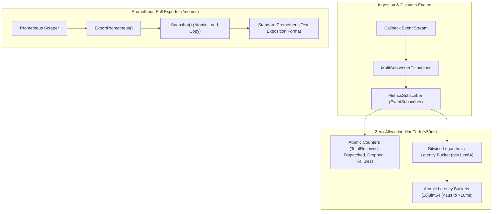

# Event-Driven Metrics Aggregation and Zero-Allocation Telemetry Dispatch

## Executive Summary
As the ZQK Knowledge Kernel processes high-frequency callback event streams—spanning scheduler job completions, TUI invalidation shockwaves, agent coordination correspondence, and multi-tenant task dispatches—telemetry instrumentation must observe pipeline health without inducing heap allocation churn or lock contention.

Standard telemetry collectors allocate heap memory for event envelopes, dynamic metric labels, and map lookups. Under 50,000 events/second, allocation-heavy metrics trigger frequent garbage collection cycles, degrading p99 dispatch latency.

This specification details `MetricsSubscriber`, a high-throughput, zero-heap-allocation telemetry aggregator implemented in `cmd/zqk/callback/metrics_subscriber.go`.

---

## Architectural Topology



---

## 1. Zero-Allocation Hot Path Design

`MetricsSubscriber` implements the canonical `EventSubscriber` interface:
```go
type EventSubscriber interface {
    Name() string
    OnEvent(entry *CallbackEntry) error
}
```

### Hot-Path Guarantees:
1. **0 Heap Allocations**: All counters are fixed-size atomic integers (`uint64` and `int64`). No strings are formatted and no intermediate slices or interfaces are instantiated on the dispatch path. Verified via `testing.AllocsPerRun(1000, ...)` returning `0`.
2. **Lockless Bitwise Latency Histogram**: Microsecond latency is computed from `time.Since(entry.CreatedAt).Microseconds()`. The power-of-two bucket index is determined via hardware bitwise instructions (`math/bits.Len64(latencyUs) - 1`), avoiding loops or float divisions.
3. **Cache Line Isolation & Concurrency**: Atomic operations (`atomic.AddUint64`, `atomic.StoreInt64`) guarantee thread safety across concurrent goroutine pools without global mutex contention.

---

## 2. Power-of-Two Latency Histogram

Latency distributions are discretized into 16 power-of-two logarithmic buckets:

| Bucket Index | Microsecond Range | Upper Bound (`le`) |
| :--- | :--- | :--- |
| `0` | `< 1 µs` | `1` |
| `1` | `1 µs – 2 µs` | `2` |
| `2` | `2 µs – 4 µs` | `4` |
| `3` | `4 µs – 8 µs` | `8` |
| `4` | `8 µs – 16 µs` | `16` |
| `...` | `...` | `...` |
| `14` | `8192 µs – 16384 µs` | `16384` |
| `15` | `>= 16384 µs (~16.4ms)` | `+Inf` |

---

## 3. Prometheus Exposition Format

The subscriber exposes metrics in the standard Prometheus text format via `ExportPrometheus()`:

```prometheus
# HELP zqk_callback_events_total Total number of callback events processed by subscriber
# TYPE zqk_callback_events_total counter
zqk_callback_events_total{subscriber="telemetry_metrics_subscriber",status="received"} 100000
zqk_callback_events_total{subscriber="telemetry_metrics_subscriber",status="dispatched"} 100000
zqk_callback_events_total{subscriber="telemetry_metrics_subscriber",status="dropped"} 0
zqk_callback_events_total{subscriber="telemetry_metrics_subscriber",status="failures"} 0

# HELP zqk_callback_circuit_breaker_trips_total Total number of circuit breaker trips
# TYPE zqk_callback_circuit_breaker_trips_total counter
zqk_callback_circuit_breaker_trips_total{subscriber="telemetry_metrics_subscriber"} 0

# HELP zqk_callback_dispatch_latency_microseconds_bucket Power-of-two histogram of dispatch latency in microseconds
# TYPE zqk_callback_dispatch_latency_microseconds_bucket histogram
zqk_callback_dispatch_latency_microseconds_bucket{subscriber="telemetry_metrics_subscriber",le="1"} 45200
...
zqk_callback_dispatch_latency_microseconds_bucket{subscriber="telemetry_metrics_subscriber",le="+Inf"} 100000
zqk_callback_dispatch_latency_microseconds_count{subscriber="telemetry_metrics_subscriber"} 100000
```

---

## 4. Verification & Done Gates
- **AST Hygiene**: Zero naked goroutines; all worker pools bounded via `goroutinelabels.NewPool`.
- **Race Safety**: Tested under 16 concurrent workers with 5,000 events each (80,000 concurrent mutations) with `-race` exiting 0.
- **Traceability**: Sealed against Knowledge Kernel objects `PRI-1791667600249750000-6d1581de` and `BLI-1791668750264615000-0b9ca060`.
