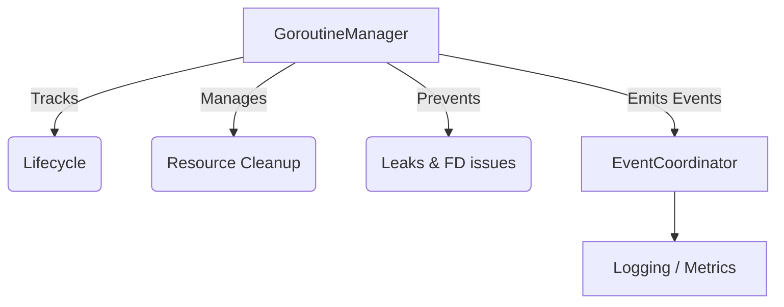

# Goroutine Manager Specification

**Last Verified:** 2026-09-09
**Status:** Active
**Package:** `pkg/runtime`

## Overview

The GoroutineManager provides OS-level tracking and management of all goroutines in the system. It ensures there are no goroutine leaks, provides graceful shutdown mechanisms, tracks resource usage, and ensures safe file descriptor operations. It integrates directly with the EventCoordinator to emit lifecycle events for observability.

## Architecture

The GoroutineManager acts as a centralized registry for all active goroutines:



## Core Capabilities

### 1. Registration & Lifecycle Management
Every goroutine MUST be registered with the GoroutineManager via the `Start` function (or standard builder).
- **Start**: Registers the goroutine with a unique ID, Name, Purpose, and Category.
- **Running**: Tracks the active execution.
- **Stop**: Unregisters on normal or error exit.

### 2. Graceful Shutdown & Pool Draining
The system enforces bounded shutdown operations.
- **Context Cancellation**: All managed goroutines receive a cancellation signal.
- **Timeout Protection**: The manager enforces a strict timeout for draining all goroutines (e.g., 30s) to prevent indefinite shutdown hangs.
- **Pool Draining**: Goroutines within wait groups or worker pools are drained deterministically.

### 3. Leak Prevention
Goroutine leaks occur when a background routine continues running after its parent context is cancelled.
- **Leak Detection**: The manager identifies goroutines that fail to stop within the shutdown window.
- **Rules**: 
  - Always check `ctx.Done()` in loops.
  - Never use unbuffered channels without an alternative `ctx.Done()` path.
  - Store cleanup resources (tickers, timers) and guarantee `.Stop()` using `defer`.

### 4. File Descriptor Safety
Goroutines handling files or network connections must register their resource handlers with the manager.
- Upon goroutine stop, the manager executes all registered `CleanupFunc` callbacks to guarantee file descriptors are closed safely, even if a panic occurs.

## Usage Pattern

```go
import "github.com/lanceman/zqk/pkg/runtime"

// Start a tracked goroutine
id, ctx, err := manager.Start(runtime.GoroutineConfig{
    Name:     "periodic_worker",
    Purpose:  "Background processing",
    Category: "worker",
    Resources: []runtime.Resource{
        {
            Type:        "ticker",
            ID:          "worker_ticker",
            CleanupFunc: func() error { ticker.Stop(); return nil },
        },
    },
}, func(ctx context.Context) error {
    for {
        select {
        case <-ctx.Done():
            return ctx.Err()
        case <-ticker.C:
            // Do work
        }
    }
})
```

## Observability & Coordination
All events map to `goroutine_lifecycle.*` (start, stop, error, leaked, cleanup_error) and are sent to the EventCoordinator. Do not rely on direct logging (`logger.Info`) for these events.
