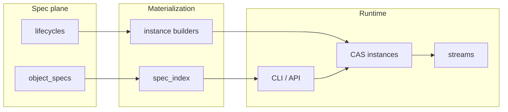
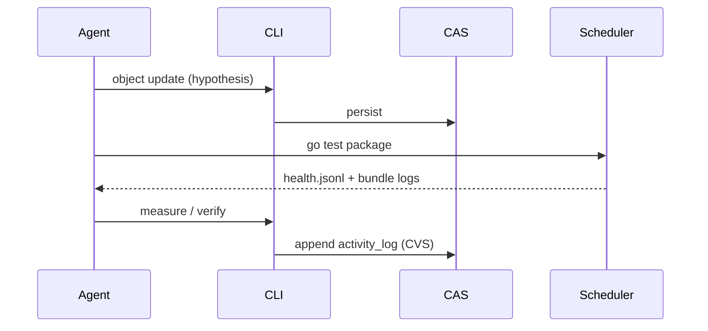

# Greenfield team operating plan — seed for a zqk-class system

**Status:** Strategy / seed document  
**Tags:** `onboarding`, `greenfield`, `standards`, `architecture`, `security`, `quality-gates`  
**Audience:** New human + AI pair building a **similar** product with the **same** engineering discipline (specs, CAS, CLI, scheduler) but an empty realm.

**Index:** [ASSESSMENT_AND_ONBOARDING_INDEX.md](./ASSESSMENT_AND_ONBOARDING_INDEX.md)  
**Related backlog (platform, optional):** `BLI-EXAMPLE` — evolve documentation from manual cross-links toward ontology-backed linking ([EXPERTISE_ARCHITECTURE_AND_CODE_QUALITY.md](./EXPERTISE_ARCHITECTURE_AND_CODE_QUALITY.md)); **deferred** while the data-cell program is the alpha-track focus. **`GLS-EXAMPLE`** names the concept; **`zqk object get BLI-EXAMPLE`** lists **`related_object_refs`**. Not required to bootstrap a greenfield tree.

This document is the **handoff seed**: standards, gates, and diagrams you would instantiate on day one so you arrive at a zqk-like system **faster** and with **less debt**.

---

## 1. SDE engineering standards (engineering practice)

| Standard | Rule |
|----------|------|
| **Single spec plane** | All kinds defined in YAML; no parallel “hidden” schemas in app code. |
| **Codegen** | Instance builders and CLI command builders generated from specs — no hand-edit of generated files. |
| **Hot path** | No `LoadFields` on create, no unnecessary cache clears on hot paths. |
| **Tests** | Short `go test` with `-timeout` for probes; package gates via scheduler + log files. |
| **Literals** | Field keys and env keys via constants / `zqktime` for timestamps — no raw `ZQK_*` strings in `os.Getenv`. |
| **Process data** | CAS objects under `docs/architecture/` only via CLI — never direct YAML edits for instances. |

---

## 2. Software architecture standards

| Layer | Responsibility |
|-------|----------------|
| **Spec origin** | Ontology, lifecycles, traits, validation. |
| **Storage** | CAS (instances), streams (volume), optional graph — orthogonal to spec semantics. |
| **CLI** | Membrane: versioned JSON/YAML, `--format`, no raw `fmt.Print` for user output. |
| **Scheduler** | Background work, test bundles, policy engine for job execution. |
| **Coordination** | Events, metrics, audit — one pipeline, not ad hoc side channels. |

---

## 3. Security standards

| Topic | Bar |
|-------|-----|
| **Contexts** | System vs user security context; no privilege escalation in tests except explicit bypass env. |
| **Secrets** | Keystore; redact in logs per `AGENT_GUIDELINES`. |
| **Field access** | Spec `access` / `permissions` — plan toward uniform enforcement. |
| **Multi-tenant** | Namespace isolation for org/domain objects. |

---

## 4. SLAs (internal / alpha)

| Metric | Target |
|--------|--------|
| **First-run** | `init` + first `object create` succeeds in < 2 minutes on clean machine (documented). |
| **CLI latency** | Interactive commands return in < 5s cold start where feasible; long work via scheduler. |
| **Test signal** | Every merge touches a package: targeted bundle green before merge. |

---

## 5. Quality gates

| Gate | Tool / artifact |
|------|-----------------|
| **Spec coherence** | `generate-spec-index`, validators |
| **Field keys** | `scripts/check-field-key-literals-repo.sh` |
| **Env keys** | `scripts/check-zqk-env-literals-repo.sh` |
| **Bundle health** | `.zqk/logs/scheduler/cvs/test-bundles/health.jsonl` |
| **Lint** | `golangci-lint` / pre-commit |

---

## 6. Patterns to adopt (not yet universal)

| Pattern | Where |
|---------|--------|
| **`zqktime` + UTC policy** | All persisted timestamps |
| **`FormatOutput` / `WriteOutput`** | All structured CLI results |
| **Scheduler `go test`** | Package-level verification |
| **Convergence sessions** | Any multi-iteration remediation with measurable end state |
| **Data origination pipeline** | Spec → storage → lifecycle → gates (see `DATA_ORIGINATION_PIPELINE_VISION.md`) |

---

## 7. Patterns to deprecate or constrain

| Pattern | Replacement |
|---------|-------------|
| Direct edits to `docs/architecture/**/*.yaml` instances | `zqk object create|update|bulk` |
| Long foreground `go test` on heavy packages | `go test` / `test-runner.sh` |
| Ad hoc `grep` for field-key gates | `check-field-key-literals-repo.sh` |
| **Overlapping** kind synonyms | Explicit alias table + tests when adding kinds |

---

## 8. Process / activity view (convergence)

---

## 9. First-week checklist (greenfield)

1. Stand up spec repo + **one** kind end-to-end (create/list/get).  
2. Add **one** scheduler job category and **one** test bundle.  
3. Wire **CLI** create from file with `EnsureKindMatches`.  
4. Add **PRE_CHANGE_CHECKLIST** equivalent in your repo.  
5. Add **glossary** sync stub for ontology terms.  

---

## 10. Doc hygiene

- Treat **`docs/reports/`** as time-stamped observations; promote stable truths into **`docs/architecture/`**.  
- Snapshot or zip old reports into **`docs/archive/snapshots/`** (see `docs/archive/README.md`).
