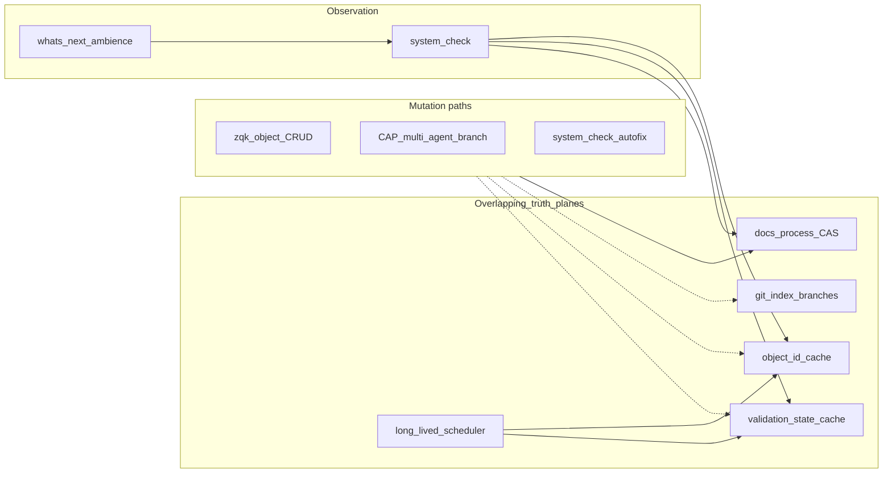

# Kernel coherence and the reference graph

**Last Verified:** 2026-08-31


**Status:** Active diagnosis + shovel-ready program  
**PRI:** `PRI-1786387443811997000-3241eddd` (Kernel coherence — referential close + honest check taxonomy)  
**Glossary:** `GLS-1786387587046059000-857ed54a` (`kernel_coherence_ref_graph`)  
**Baseline classifier:** `scripts/classify-system-check-coherence.py`

## Verdict

Flakes that look like “ghost refs / out-of-sync / cache refresh required” are usually **not** random cache bugs. They come from a **missing referential-coherence control plane**: mutations can leave the object graph open, health is reported through a **cache-shaped lens**, and process truth spans **overlapping planes** (CAS, git, caches, long-lived scheduler) that only loosely converge.

Live baseline (example from 2026-08-10 `system-check.json`): ~48 blocking issues split roughly into **GhostRef** (target absent — refresh cannot help) vs **CasDrift** (hash/index mismatch). Spot-checks of hot “missing in cache” IDs (`PRI-KERNEL-SYSCHECK-GREEN-001`, `PRI-1785784837719634000-c9473ae7`, …) returned **object not found**.

## Issue taxonomy (required)

| Class | Meaning | Operator action |
|-------|---------|-----------------|
| **GhostRef** | Referenced ID does not exist (`object get` / storage Exists false) | **Restore** the missing CAS blob when it is archived CRIT lineage under a complete BLI (never `heal-dangling --apply` on that cohort). Otherwise `zqk object delete --unlink-references` going forward. Git unpaired-delete break-glass still scans inbound `*_refs`. |
| **CasDrift** | On-disk CAS bytes / path disagree with index or content hash | CAS repair / index rebuild paths — **not** blanket `--refresh-cache` |
| **CacheLag** | Target **Exists** but object-id (or validation) cache miss | Targeted invalidate / `--refresh-cache` / prewarm — **only this class** |

Check copy must emit distinct codes/remediation. Recommending `--refresh-cache` for GhostRef **trains agents to thrash refresh** and mislabels graph debt as “out of sync.”

## Overlapping truth planes



## Missing control plane (process gap)

1. **Referential close on mutate** — Prefer `delete --unlink-references` / `heal-dangling`. Agent/CAP demote-remint-branch flows often skip close → fan-in ghosts (one missing PRI cited many times).
2. **Coherence epoch** — CLI, daemon, and git worktree can diverge; long-lived scheduler Ms retain stale maps. **Restart gate documented:** The daemon relies on an in-memory object cache and validation cache. After bulk CLI mutations (e.g., `bulk-delete` or git checkouts), you must restart the daemon (e.g., `zqk scheduler stop` then `zqk scheduler start`) to re-sync its caches.
3. **Honest observation** — System check target architecture ([`system-check-cache-first-and-async.md`](./system-check-cache-first-and-async.md)) is incomplete; today’s messaging still conflates GhostRef with CacheLag ([historical note](../status/SYSTEM_CHECK_RESOLUTION.md)).
4. **Ship gate for process CAS** — No mandatory “ref graph closed + touched CAS committed” before claiming column complete; dirty `.zqk/process/` + branch lag reintroduces oscillation.
5. **CAP amplification** — Anti-idle remint of “stable” PRI aliases without redirect leaves permanent dangling edges.

## Tool map

| Symptom | Tool |
|---------|------|
| GhostRef | `zqk system kernel-integrity heal-dangling` [`--apply`]; `object delete … --unlink-references` |
| CasDrift | CAS / index repair (`repair-cas-corruption` family); do not refresh-only |
| CacheLag | `--refresh-cache`, `cache_prewarm`, targeted invalidation |
| Classify latest check JSON | `python3 scripts/classify-system-check-coherence.py` |

## Shovel-ready BLIs (on this PRI)

| Tier | ID | Title |
|------|-----|--------|
| P0 | `BLI-1786387465409533000-45bd780c` | Check issue codes: GhostRef vs CacheLag (no refresh for ghosts) |
| P0 | `BLI-1786387471491126000-4ac428ca` | Agent/CAP delete path: unlink-references or fail-closed |
| P1 | `BLI-1786387476749704000-923a3f3c` | Heal hot GhostRefs to zero |
| P1 | `BLI-1786387482116958000-16970248` | Daemon/CLI cache coherence epoch |
| P2 | `BLI-1786387490126670000-a197312e` | Cache-first system check: outstanding ≠ ghosts |

## Ops posture (now)

- If `object get <ref>` fails → **GhostRef** → heal/unlink — **not** `--refresh-cache`.
- Ambience “N blocking” while GhostRef dominates → **graph debt**, not CAP theater.
- Do not remint stable PRI aliases; unlink dependents or restore-same-id.

## What is *not* the main bug

- Idle Go OS thread count on the scheduler (parked Ms) — orthogonal to ref-graph debt.
- “Refresh the cache more often” as a strategy — papers over GhostRef and burns CPU.
- Treating all blockers as false positives — hot missing IDs are often **absent**, not merely uncached.

## Partial code land (P0 messaging)

`cmd/zqk/system/check_references_helpers.go` — after cache miss **and** storage Exists false, issues use category **`GhostRef`** and `buildGhostRefDiagnostic` (heal-dangling / unlink first; `--refresh-cache` only if `object get` succeeds). Remaining CacheLag-only path and unlink-default for agents are still tracked on the BLIs above.

## Measured baseline

Regenerate anytime:

```bash
python3 scripts/classify-system-check-coherence.py
python3 scripts/classify-system-check-coherence.py --probe
```

Historical snapshot (pre-heal fan-in, 2026-08-10 morning check): ~48 blocking ≈ **~34 GhostRef-worded** + **~14 CasDrift/hash**; hottest absences included `PRI-KERNEL-SYSCHECK-GREEN-001`, `PRI-1785784837719634000-c9473ae7`. Fixture: [`scripts/fixtures/coherence_baseline_2026-08-10.json`](../scripts/fixtures/coherence_baseline_2026-08-10.json). Later same-day check JSON may show lower counts after unrelated churn — always re-run the classifier on current `.zqk/pre-commit/system-check.json`.

## Related

- [`GRAPH_EDGE_OWNERSHIP.md`](./GRAPH_EDGE_OWNERSHIP.md) — typed refs are one-way; first-class `edge_role` (`membership` \| `composition` \| `associate`) is what query/shockwave consult; `related_object_refs` is not a second object store
- [`CAS_MUTATION_SHOCKWAVE.md`](./CAS_MUTATION_SHOCKWAVE.md) — erase/update must fire the same synchronous dependency shockwave as promote/demote; linger tombstone; delete-worthiness at `archived`
- [`CACHE_MANAGEMENT_STRATEGY.md`](./CACHE_MANAGEMENT_STRATEGY.md)
- [`system-check-cache-first-and-async.md`](./system-check-cache-first-and-async.md)
- [`object-id-cache-invalidation.md`](./object-id-cache-invalidation.md)
- [`FILESYSTEM_DATA_LAYOUT.md`](./FILESYSTEM_DATA_LAYOUT.md) (CAS vs drafts)
- Pre-change checklist §6 / agent posture: prefer heal-dangling over refresh for absent refs
