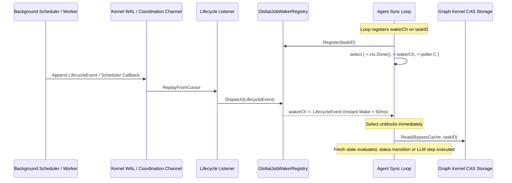

# Architecture Specification: Reactive Agent Sync Loop and Zero-Idle Task Metabolizer

## 1. Executive Summary & Problem Statement
In automated agent orchestration and multi-pod swarms, tasks transition through states via a continuous synchronization loop (`zqk agent sync-loop <task_id>`). Previously, the synchronization loop relied on a static periodic poller ticker:
```go
poller := time.NewTicker(2 * time.Second)
```
This architecture introduced notable operational bottlenecks:
1. **Latency Penalty**: Tasks waiting on background scheduler jobs, child agent completions, or graph mutations incurred a mandatory up-to-2-second delay before the next evaluation cycle, artificially increasing task wall-clock completion times across multi-step execution graphs.
2. **Wasted CPU Cycles**: The poller continually performed reads and fingerprint computations even when graph state remained dormant.
3. **Artificial Stagnation Accumulation**: Stagnation monitors accumulated agent idle time based on fixed polling intervals (`agentidle.Accumulate`) rather than true wall-clock inactivity.
4. **Harness Idle State Risks**: Slow polling created latency gaps that risked causing autonomous agent platforms to enter idle states (`waiting_for_input`).

To eliminate polling bottlenecks and achieve zero-idle execution, the **Reactive Agent Sync Loop** hooks into the persistent Knowledge Kernel lifecycle event stream and the in-memory waker registry (`pkg/lifecycle.JobWakerRegistry`), waking the execution loop reactively (< 50ms) upon scheduler job completion or graph state mutation.

---

## 2. Technical Architecture & Control Flow



### 2.1 The Dual-Trigger Execution Model
The sync loop maintains a resilient dual-trigger model:
1. **Reactive Instant Waker (`wakerCh`)**: Directly tied to `lifecycle.GlobalJobWakerRegistry.Register(taskID)`. Whenever a scheduler callback or object status transition fires for `taskID`, the event is dispatched non-blockingly to `wakerCh`, unblocking the select statement in < 50ms (typically < 1ms).
2. **Fallback Heartbeat Ticker (`poller.C`)**: Retained as a secondary safety net configured to a conservative fallback interval (e.g. 5 seconds). If an event is dropped due to cross-process boundaries, partition recovery, or an unregistered edge case, the heartbeat guarantees the loop wakes up and checks fresh state without hanging.

---

## 3. Channel Lifecycle & Leak Prevention

### 3.1 Registration & Scope-Bound Unregistration
When entering `runSyncLoop`, the waker is registered and bound to the active `taskID`:
```go
const fallbackHeartbeat = 5 * time.Second
poller := time.NewTicker(fallbackHeartbeat)
defer poller.Stop()

wakerCh, unregisterWaker := lifecycle.GlobalJobWakerRegistry.Register(taskID)
defer unregisterWaker()
defer lifecycle.GlobalJobWakerRegistry.Unregister(taskID, wakerCh)
```

Guarantees enforced by this lifecycle:
- **Clean Defer Semantics**: Even if the loop panics, encounters a timeout, or returns early on an error/terminal status, `defer` ensures `unregisterWaker` and `Unregister` remove the channel from the registry.
- **Zero Memory / Goroutine Leaks**: `removeChannel` drops the channel from the subscriber map and deletes empty map keys under a `sync.RWMutex` write lock.
- **Non-Blocking Channel Drains**: Upon waking from `wakerCh`, the loop drains any duplicate buffered notifications to avoid redundant back-to-back evaluations:
```go
case <-wakerCh:
    draining := true
    for draining {
        select {
        case <-wakerCh:
        default:
            draining = false
        }
    }
```

---

## 4. Zero-Idle Task Metabolization Flow

### 4.1 End-to-End Cycle
1. **Submission & Execution**: An agent task (`agent_task`) is claimed and starts execution. Child processes or background verification runs are queued into the scheduler.
2. **Subprocess Execution**: The worker executes the task steps or verification suites in an isolated sandbox or worktree.
3. **Reactive WAL Notification**: Upon process termination, the scheduler publishes a `process_completed` or `scheduler_callback` lifecycle event to the Knowledge Kernel WAL.
4. **Instant Awakening**: The singleton `GlobalJobWakerRegistry` dispatches the event to the task's registered channel.
5. **Fresh State Read & Verification**: The sync loop bypasses intermediate caches (`pkgctx.WithBypassCache`), reads the updated `agent_task`, evaluates completion validation steps or policies, and advances the DAG.
6. **Terminal Transition & Cleanup**: If all verification steps pass, the task transitions to `implemented` (or `error` upon failure), releases the hourglass lease, tears down the worktree, and unregisters the waker.

---

## 5. Invariants & Proofs

| Invariant | Proof Mechanism | Verification Gate |
| :--- | :--- | :--- |
| **Instant Wake (< 50ms)** | Direct in-memory event dispatch via `GlobalJobWakerRegistry` | Verified by `TestSyncLoop_WakerChannelDeliveryLatency` (< 50ms) and `TestSyncLoop_ReactiveInstantWake` |
| **Leak-Free Unregistration** | Subscriptions removed from registry on loop return | Verified by `TestSyncLoop_ReactiveInstantWake` (asserting `0` remaining listeners) |
| **Context Cancellation Honor** | Loop monitors `cmd.Context().Done()` and `ctx.Done()` | Verified by `TestSyncLoop_ContextCancellationCleanExit` |
| **Resilience Against Dropped Events** | Fallback heartbeat ticker triggers state check every 5s | Verified by dual select branch architecture |
| **Goroutine Hygiene** | Zero raw goroutines; all asynchronous tasks use `goroutinelabels` | Verified by `./bin/zqk-vet` hygiene AST scanner |

---

## 6. TPM Traceability

- **Requirement**: `REQ-1791618261909567000-28b31661`
- **Backlog Item**: `BLI-1791618263412927000-bcea41a4`
- **Test Case**: `TST-1791618263412927001-245dfd61`
- **Criteria**:
  - `CRIT-1791618263412927000-ab3c79b9`: Functional acceptance (reactive waker integration)
  - `CRIT-1791618263412928000-337c12b7`: Boundary & error handling (defer unregistration, fallback heartbeat)
  - `CRIT-1791618263412929000-ca808b32`: Architecture documentation & Knowledge Base entry
