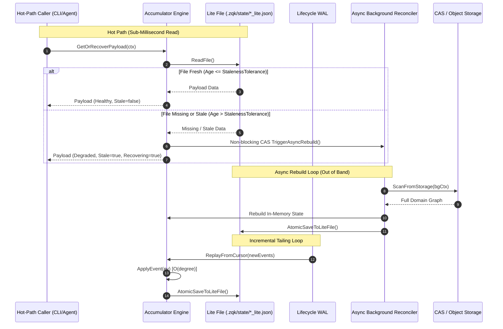

# Reactive Materialized View & Status Accumulator Pattern

**Status**: Approved / Canonical Architectural Pattern  
**Domain**: Kernel Execution, Telemetry, and Storage Projections  
**Associated Policies**: `POL-CODE-001`, `POL-CODE-007`, `POL-PERF-001`, `POL-DOC-002`  
**Target Package**: `pkg/accumulator`

---

## 1. Executive Summary & Intent

As the ZQK Knowledge Kernel scales across multi-agent swarms, distributed daemons, and deep dependency graphs, querying system status via synchronous, full-depth filesystem or CAS sweeps introduces unacceptable latency spikes ($O(N)$ degradation with $N > 10^4$ objects).

The **Reactive Materialized View & Status Accumulator Pattern** replaces synchronous graph scans with an event-driven, incrementally updated in-memory graph that flushes to an atomic, zero-cost on-disk JSON projection (`.zqk/state/<view>_lite.json`). 

This architecture guarantees:
1. **Zero Hot-Path Scan Invariant**: Hot-path consumers (CLI queries, triage probes, agent decision loops) read directly from the materialized snapshot in sub-millisecond time ($< 5\text{ms}$, benchmarked at $\sim 40\mu\text{s}$) without touching the underlying storage plane.
2. **Pure Functional Predicates**: Graph evaluation is computed via side-effect-free, deterministic predicates.
3. **Async Circuit-Breaker Recovery**: When event disruption, cold-boot cache misses, or sequence gaps occur, the hot path immediately serves the last-known-good or skeleton state with explicit degradation telemetry (`stale: true, recovering: true`) and triggers a debounced, non-blocking background reconciler.
4. **Spec-Driven Code Generation**: Accumulators are declared via high-level specs (`AccumulatorSpec`) and assembled via a fluent builder pipeline (`AccumulatorBuilder`), standardizing synchronization, WAL tailing, atomic persistence, and recovery mechanics while eliminating snowflake implementations.

---

## 2. Problem Statement: The "Snowflake" Anti-Pattern

Historically, three independent reactive views emerged across the codebase:
- **Test Dashboard** (`cmd/zqk/test/dashboard.go` $\to$ `.zqk/state/test_dashboard_lite.json`)
- **Strategic Readiness** (`pkg/tpm/strategic_readiness_view.go` $\to$ `.zqk/state/strategic_readiness_lite.json`)
- **Whats-Next** (`pkg/workflow/whatsnext/materialized_view.go` $\to$ `.zqk/state/whats_next_lite.json`)

Each component independently re-implemented:
- Atomic temporary file generation and filesystem renaming.
- Lifecycle Write-Ahead Log (`lifecycle_events.wal`) tailing loops and replay cursor bookkeeping.
- Thread-safety with `sync.RWMutex`.

Crucially, **divergence in failure handling** compromised system stability: while `whats-next` instituted a non-blocking async recovery circuit-breaker, `test dashboard` and `strategic readiness` still degraded into multi-second synchronous filesystem walks upon cache invalidation, violating the core zero-cost contract.

---

## 3. Formal Mathematical Model

An Accumulator models state evolution as a discrete stream processing system:

### 3.1. Stream & Graph Transition
Let $\mathcal{E} = \{ e_1, e_2, \dots, e_t \}$ be the sequence of kernel lifecycle events emitted to the WAL.  
The in-memory accumulator graph $\mathcal{G}$ evolves at each event via a deterministic state transition function $\delta$:

$$\mathcal{G}_t = \delta(\mathcal{G}_{t-1}, e_t)$$

where $\delta$ operates in $O(\text{degree})$ time by indexing direct object references (e.g., updating only the affected requirement, plan, or test case node).

### 3.2. Pure Evaluation Predicates
Given the current graph state $\mathcal{G}_t$, pure functional predicates $\Phi_k(\mathcal{G}_t)$ compute derivative metrics without mutation:

$$\mathcal{P}_t = \Pi(\Phi_1(\mathcal{G}_t), \Phi_2(\mathcal{G}_t), \dots, \Phi_m(\mathcal{G}_t))$$

where $\mathcal{P}_t$ is the domain-specific serialized payload.

### 3.3. Projection & Staleness Invariant
The materialized view file $V$ is updated atomically:

$$V \leftarrow \text{AtomicWrite}(\text{Envelope}(\mathcal{P}_t, t_{\text{mat}}))$$

For any read request at time $t_{\text{req}}$:
- **Fresh Path** ($t_{\text{req}} - t_{\text{mat}} \le \tau_{\text{stale}}$):
  $$\text{Response} = \mathcal{P}_t, \quad \text{Latency} \le 5\text{ms}$$
- **Degraded / Recovery Path** ($t_{\text{req}} - t_{\text{mat}} > \tau_{\text{stale}}$ or $V \notin \text{Disk}$):
  $$\text{Response} = \text{Envelope}(\mathcal{P}_{\text{LKG}}, \text{stale}=\text{true}, \text{recovering}=\text{true})$$
  $$\text{CAS}(\text{Reconciling}, 0, 1) \implies \text{Spawn}(\text{BackgroundRebuild})$$

---

## 4. System Architecture



---

## 5. Spec-Driven Builder Architecture

To eliminate boilerplate and ensure consistency, accumulators are designed around a **spec-driven builder model**.

### 5.1. The Universal Envelope: `Envelope[T]`
All projections wrap domain payloads in a standardized telemetry and lifecycle envelope:

```go
package accumulator

import "time"

// Envelope wraps a domain payload with universal observability and health metadata.
type Envelope[T any] struct {
    SchemaVersion  string    `json:"schema_version"`
    MaterializedAt time.Time `json:"materialized_at"`
    Stale          bool      `json:"stale,omitempty"`
    Recovering     bool      `json:"recovering,omitempty"`
    DegradedReason string    `json:"degraded_reason,omitempty"`
    Payload        T         `json:"payload"`
}
```

### 5.2. Domain Interface: `Accumulator[T]`
A domain author implements only the business logic and evaluation rules:

```go
package accumulator

import (
    "context"
    "github.com/lanceman/zqk/pkg/lifecycle"
    "github.com/lanceman/zqk/pkg/storage"
)

// Accumulator defines the domain hooks required to power an event-driven view.
type Accumulator[T any] interface {
    // Name identifies the accumulator (used for file naming and log tracing).
    Name() string
    // DefaultPayload returns the skeleton structure for cold boot.
    DefaultPayload() T
    // ApplyEvent applies a single WAL lifecycle event to the in-memory graph.
    ApplyEvent(ev *lifecycle.LifecycleEvent) (mutated bool)
    // BuildPayload renders the current in-memory graph into the serialized format T.
    BuildPayload() T
    // ScanFromStorage performs an out-of-band full rebuild from storage.
    ScanFromStorage(ctx context.Context, sp storage.ObjectStorageProvider) error
}
```

### 5.3. Fluent Engine Builder: `AccumulatorBuilder[T]`
The builder constructs the runtime engine, injecting configuration, logging, and concurrency controls:

```go
package accumulator

import "time"

type AccumulatorBuilder[T any] struct {
    spec AccumulatorSpec
    acc  Accumulator[T]
}

func NewBuilder[T any](acc Accumulator[T]) *AccumulatorBuilder[T] {
    return &AccumulatorBuilder[T]{
        acc: acc,
        spec: AccumulatorSpec{
            StalenessTolerance: 2 * time.Minute,
            RebuildTimeout:     45 * time.Second,
            PollInterval:       200 * time.Millisecond,
        },
    }
}

func (b *AccumulatorBuilder[T]) WithProjectRoot(root string) *AccumulatorBuilder[T] {
    b.spec.ProjectRoot = root
    return b
}

func (b *AccumulatorBuilder[T]) WithStalenessTolerance(d time.Duration) *AccumulatorBuilder[T] {
    b.spec.StalenessTolerance = d
    return b
}

func (b *AccumulatorBuilder[T]) WithSchemaVersion(version string) *AccumulatorBuilder[T] {
    b.spec.SchemaVersion = version
    return b
}

func (b *AccumulatorBuilder[T]) Build() (*Engine[T], error) {
    return NewEngine(b.spec, b.acc)
}
```

---

## 6. Package Characteristics & Runtime Guarantees

| Characteristic | Specification | Guarantee |
| :--- | :--- | :--- |
| **Hot-Path Read Latency** | Direct file read of local JSON | $\le 5\text{ms}$ SLA (Typical: $30\text{--}60\mu\text{s}$) |
| **Write Atomicity** | `fileutil.WriteFile(tmp)` + `os.Rename` | POSIX atomic rename; zero file truncation reads |
| **Recovery Concurrency** | `atomic.CompareAndSwapUint32` | Exactly one background reconciler active at any time |
| **WAL Consumption** | Polled `walutil.ReplayCursor` | Resilient, cursor-tracked, monotonic event ingestion |
| **Thread-Safety** | `sync.RWMutex` protecting in-memory graph | Safe concurrent reads, exclusive single-event mutations |
| **Process Decoupling** | Background goroutine via `goroutinelabels` | Crashes or timeouts in reconciler cannot crash caller |

---

## 7. Migration & Consolidation Roadmap

```mermaid
flowchart LR
    subgraph Legacy Snowflakes
        A1[Test Dashboard Lite]
        A2[Strategic Readiness Lite]
        A3[Whats-Next Lite]
    end

    subgraph Generic Framework (pkg/accumulator)
        B1[Accumulator Interface]
        B2[AccumulatorBuilder]
        B3[Generic Engine]
        B4[Universal Envelope]
    end

    subgraph Refactored Endpoints
        C1[zqk test dashboard]
        C2[zqk system align / runway]
        C3[zqk workflow whats-next]
    end

    A1 -.->|Migrate to| B1
    A2 -.->|Migrate to| B1
    A3 -.->|Migrate to| B1

    B2 --> B3
    B1 --> B3
    B4 --> B3

    B3 --> C1
    B3 --> C2
    B3 --> C3
```

1. **Phase 1: Engine Foundation**: Implement `pkg/accumulator` housing `Engine[T]`, `AccumulatorBuilder[T]`, `Envelope[T]`, and atomic persistence utilities.
2. **Phase 2: Whats-Next Alignment**: Migrate `pkg/workflow/whatsnext/materialized_view.go` to be the flagship reference consumer of `pkg/accumulator`.
3. **Phase 3: Strategic Readiness & Test Dashboard Retrofit**: Retrofit `StrategicReadinessView` and `DashboardState`, eradicating redundant WAL streaming loops and equipping both with the non-blocking async circuit breaker.
4. **Phase 4: Generator Integration**: Expose `zqk system generate-accumulator` within the CLI builder pipeline to scaffold typed accumulators and test suites on-demand.
5. **Phase 5: Daemon Supervision & Zero-Cost Default Routing**: Host continuous WAL subscribers inside long-lived daemons (`pkg/scheduler`, `pkg/objects/daemon`), deprecate synchronous full-storage sweeps on `whats-next`, and position zero-cost `.zqk/state/*_lite.json` projections as the strict default hot-path.

---

## 8. Daemon-Hosted Continuous WAL Supervision & Zero-Cost Default Routing

### 8.1. Architectural Principle: Daemon-Hosted WAL Streams
A critical design vulnerability in initial reactive projections was their reliance on lazy, on-demand instantiation by transient CLI callers. Under this anti-pattern:
- Inactive periods resulted in stale projections exceeding `StalenessTolerance` ($\tau_{\text{stale}}$).
- Subsequent CLI invocations faced either degraded states or fell back to $O(N)$ synchronous storage sweeps, reintroducing multi-second latency spikes.

**The Daemon Supervision Invariant**:
Long-lived background daemons ([`pkg/scheduler`](file:///Users/lanceettl/zqk-restore-clone/cmd/zqk/scheduler/scheduler_daemon.go) and/or [`pkg/objects/daemon.go`](file:///Users/lanceettl/zqk-restore-clone/pkg/objects)) MUST host, start, and supervise background WAL subscribers (`StartBackgroundWALSubscriber`) for all registered accumulators upon boot.
- Subscribers run in isolated goroutines tracked via `goroutinelabels`.
- They tail `lifecycle_events.wal` via cursor replay at sub-second polling intervals ($\le 200\text{ms}$).
- Memory graphs evolve via $O(\text{degree})$ incremental mutations and flush atomically to disk whenever mutations occur.
- Disk projections remain fresh ($\text{age} < 1\text{s}$) continuously without requiring hot-path CLI callers to drive lifecycle reconciliation.

### 8.2. Deprecation of Synchronous Snowflake Sweeps
The legacy synchronous fallback path in [`cmd/zqk/workflow/whats_next.go`](file:///Users/lanceettl/zqk-restore-clone/cmd/zqk/workflow/whats_next.go) (which executed full-depth `storage.List` sweeps across thousands of plans and backlog items upon cache miss) is **strictly deprecated**:
1. **Strict Default Hot Path**: `zqk workflow whats-next` and related telemetry commands read directly from the zero-cost projection file (`.zqk/state/whats_next_lite.json`).
2. **Sub-Millisecond Read Contract**: Hot reads complete in $\le 5\text{ms}$ (typical $30\text{--}60\mu\text{s}$) without touching the underlying storage plane or holding process locks.
3. **Non-Blocking Recovery**: If the projection is missing, corrupted, or stale, the hot path returns the last-known-good or skeleton state with `stale: true, recovering: true` and triggers an asynchronous non-blocking background rebuild (`GetOrRecoverPayload`).
4. **Emergency Diagnostics Only**: The full synchronous storage sweep is isolated behind a legacy diagnostic flag (`--sync-sweep`), strictly intended for cold disaster recovery and unit test harnesses.

### 8.3. Dual-Format Backward-Compatible Envelope Deserialization
To eliminate false-positive cache invalidations caused by schema version drift:
- `Engine.LoadFromLiteFile()` and domain accumulators (such as `StrategicReadinessView`) must support **dual-format unmarshaling**:
  1. Attempt unmarshaling into `Envelope[T]` (`schema_version`, `materialized_at`, `payload`).
  2. If the file contains a legacy flat payload (where top-level keys map directly to domain fields and `payload` is missing), deserialize directly into `T` and synthesize an envelope wrapper with the file's modification timestamp.
- On the next background mutation or save, `SaveToLiteFile()` serializes into the canonical wrapped `Envelope[T]` format, cleanly migrating the file on disk without downtime.

