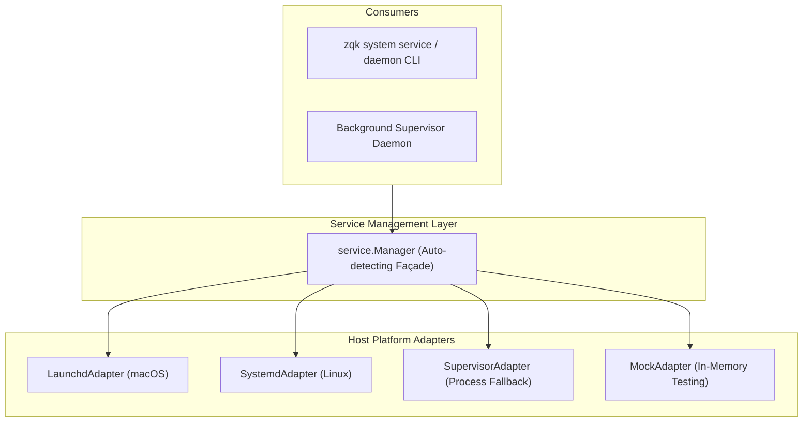

# Zero-Coupling ServiceAdapter Specification & Architecture

## Overview
The `pkg/service` package defines a pure, zero-coupling contract for managing OS-level service daemons (such as launchd, systemd, and local process supervisors) with zero internal dependencies on `pkg/kernel` or internal ZQK runtime facilities.

## Architecture

## Core Contracts & Invariants

1. **Zero Internal Coupling**:
   - `pkg/service` imports only standard library packages and path utilities.
   - It contains zero imports of `pkg/kernel`, `pkg/storage`, or internal runtime layers, enabling standalone library extraction.

2. **Pluggable Host Adapters**:
   - `LaunchdAdapter`: Generates valid XML plists and manages launchctl services on Darwin.
   - `SystemdAdapter`: Generates compliant systemd unit files on Linux.
   - `SupervisorAdapter`: Provides portable cross-platform process management when host supervisors are unavailable.
   - `MockAdapter`: In-memory test double supporting full lifecycle simulation and legacy cleanup.

3. **Autonomous Host Detection**:
   - `service.NewManager(nil)` detects the host operating system (`runtime.GOOS`) and instantiates the appropriate adapter automatically.
