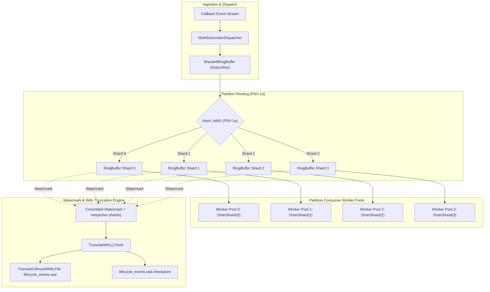
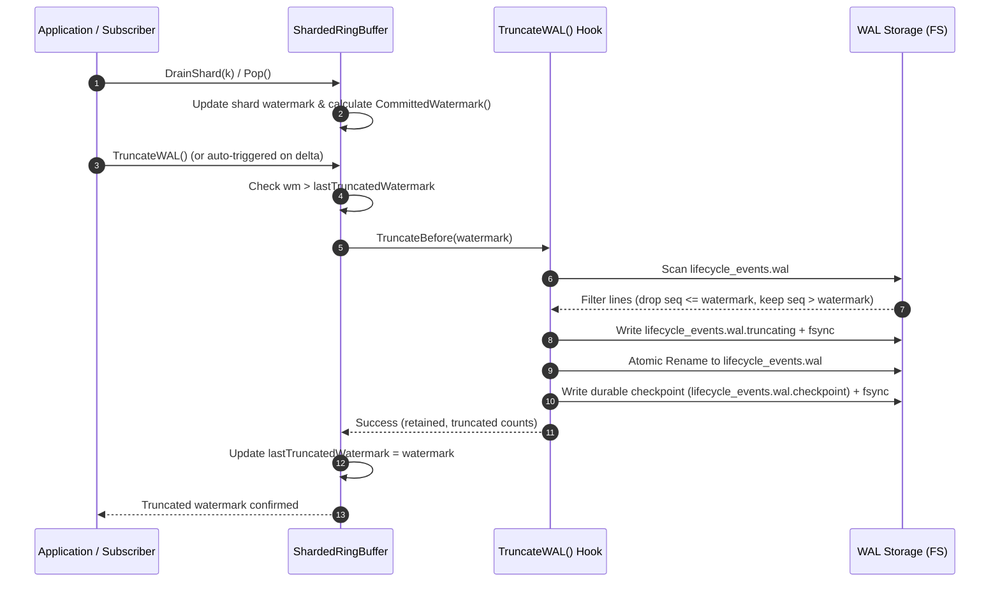

# In-Memory Sharded Ring Buffer and High-Throughput Event WAL Truncation

## Executive Summary
As the ZQK Knowledge Kernel processes intensive asynchronous event streams—spanning scheduler completions, criteria satisfaction shockwaves, agent feed correspondence, and multi-tenant task dispatches—in-memory event queues and on-disk Write-Ahead Logs (WAL) face dual scaling pressures:
1. **Memory Pressure & Cascade Contention**: Unbounded channels or global locks cause queue bloat, lock contention across worker pools, and memory leaks.
2. **Disk Growth & Replay Degradation**: An append-only WAL without continuous compaction monotonically grows, degrading restart replay performance and exhausting storage volumes.

This specification details the architecture of `RingBuffer`, `ShardedRingBuffer`, and the **Committed Watermark WAL Truncation Protocol** implemented in `cmd/zqk/callback/ring_buffer.go`.

---

## Architectural Topology



---

## 1. Ring Buffer Memory Topology

The foundational building block is `RingBuffer`, a thread-safe circular fixed-capacity buffer protected by `sync.RWMutex`.

### Data Structure & Pointer Arithmetic
```go
type RingBuffer struct {
    mu           sync.RWMutex
    buffer       []*CallbackEntry
    head         int   // Read position (oldest unconsumed entry)
    tail         int   // Write position (next insertion slot)
    size         int   // Current unconsumed count (0 <= size <= capacity)
    capacity     int   // Bounded capacity
    evictedCount int64 // Cumulative entries dropped due to saturation
    totalPushed  int64 // Cumulative pushed count
    totalPopped  int64 // Cumulative consumed count
    watermark    int64 // Highest committed sequence
}
```

### Zero-Allocation Steady State & Garbage Collection Hygiene
- **Pre-Allocated Backing Slice**: The backing array `buffer` is allocated once at initialization (`make([]*CallbackEntry, capacity)`). No slice growth or reallocation occurs during high-throughput operation.
- **Pointer Clearing on Pop/Eviction**: When an entry is extracted via `Pop()` or `Drain()`, or overwritten during saturation eviction, its slot in `buffer` is explicitly zeroed (`r.buffer[r.head] = nil`). This guarantees that referenced memory is immediately eligible for garbage collection, preventing retain-cycle memory leaks.
- **FIFO Eviction on Saturation**: When `size == capacity`, new writes automatically evict the oldest unconsumed entry at `head`, advance `head = (head + 1) % capacity`, increment `evictedCount`, and insert the incoming entry at `tail`.

---

## 2. Partition Sharding & Worker Pool Affinity

`ShardedRingBuffer` distributes incoming events across $N$ independent `RingBuffer` partitions, where $N$ is normalized to a power of 2 (default 4 or 8).

### 64-bit FNV-1a Job Hash
To ensure deterministic partition routing and eliminate cross-thread lock contention, partition index calculation uses 64-bit FNV-1a hashing:

$$\text{hash} = \text{FNV-1a}( \text{key} )$$
$$\text{shardIndex} = \text{hash} \ \& \ (N - 1)$$

### Key Selection Hierarchy
1. `entry.JobID`: Primary partition key. Events for the same job (e.g. `job_started`, `job_progress`, `job_completed`) strictly hash to the same shard, preserving chronological causality within each worker pool.
2. `entry.Payload["object_id"]` or `entry.Payload["id"]`: Fallback identifier when `JobID` is empty.
3. **Atomic Round-Robin**: When no identifier is present, incoming events are distributed evenly across shards via an atomic counter (`roundRobinCounter.Add(1) & (N - 1)`).

---

## 3. Watermark Calculation Mechanics

In a distributed or sharded event pipeline, calculating the safe sequence boundary for log truncation is critical to preventing data loss.

### Per-Shard Watermark ($W_i$)
For any single shard $i$:
- **Buffer Non-Empty ($size > 0$)**: The watermark is the sequence immediately preceding the oldest unconsumed entry at `head`:
  $$W_i = \max( \text{shard}_i.\text{buffer}[\text{head}].\text{Seq} - 1, \ \text{shard}_i.\text{watermark} )$$
  Because every entry currently buffered in memory has $\text{Seq} \ge \text{shard}_i.\text{buffer}[\text{head}].\text{Seq}$, all records with $\text{Seq} \le W_i$ have already been completely processed or evicted.
- **Buffer Empty ($size = 0$)**: All pushed entries have been processed or evicted; $W_i$ equals the sequence of the most recently drained/evicted entry.

### Global Committed Watermark ($W_{\text{committed}}$)
Across all $N$ partition shards, the aggregate committed watermark is the minimum watermark among all active shards (shards that have received at least one event):

$$W_{\text{committed}} = \min \{ W_i \mid \text{shard}_i.\text{TotalPushed}() > 0 \}$$

### Invariant Proof
> **Theorem**: Truncating WAL records where $\text{Seq} \le W_{\text{committed}}$ guarantees zero loss of unconsumed events.
>
> **Proof**: Suppose for contradiction that a record $R$ with sequence $S_R \le W_{\text{committed}}$ is deleted, but $R$ is still unconsumed in memory.
> If $R$ is unconsumed, it resides in some shard $k$ at index $j$, meaning $\text{shard}_k.\text{size} > 0$.
> By definition of per-shard watermark, $W_k = \text{shard}_k.\text{buffer}[\text{head}].\text{Seq} - 1$.
> Since $R$ is unconsumed, $S_R \ge \text{shard}_k.\text{buffer}[\text{head}].\text{Seq} > W_k$.
> By definition of global committed watermark, $W_{\text{committed}} \le W_k$.
> Hence, $S_R > W_k \ge W_{\text{committed}}$, which contradicts the premise that $S_R \le W_{\text{committed}}$.
> Therefore, no unconsumed event can ever have $\text{Seq} \le W_{\text{committed}}$. $\blacksquare$

---

## 4. WAL Truncation Protocol



### WAL Truncation Execution Steps
1. **Watermark Read & Delta Check**: `TruncateWAL()` calculates $W = \text{CommittedWatermark}()$. If $W \le \text{lastTruncatedWatermark}$ or $W \le 0$, the call returns immediately as an idempotent no-op.
2. **Staged Compaction (`TruncateLifecycleWALFile`)**:
   - Scans `lifecycle_events.wal` line-by-line using buffered I/O (`ScanFileLines`).
   - Lines with $\text{Seq} \le W$ are skipped and increment the `truncated` counter.
   - Lines with $\text{Seq} > W$ are written to a temporary staging file (`lifecycle_events.wal.truncating`).
   - Staging file is explicitly synced to durable disk via `f.Sync()`.
3. **Atomic Replace**: The staging file is atomically renamed over the canonical `lifecycle_events.wal` via `fileutil.Rename`.
4. **Checkpoint Update**: A durable checkpoint file (`lifecycle_events.wal.checkpoint`) is persisted with the new cursor sequence $W$ using synchronous `WriteDurableFile`.

---

## 5. Event Bus & Dispatcher Integration

`ShardedRingBuffer` directly implements the `Subscriber` interface:
```go
func (s *ShardedRingBuffer) Name() string { return "sharded_ring_buffer" }
func (s *ShardedRingBuffer) Notify(ctx context.Context, entry *CallbackEntry) error {
    s.Push(entry)
    return nil
}
```
This enables seamless registration into `MultiSubscriberDispatcher`:
```go
dispatcher := callback.NewMultiSubscriberDispatcher(logger)
shardedRing := callback.NewShardedRingBuffer(4, 2048,
    callback.WithAutoTruncateDelta(500),
    callback.WithWALTruncator(callback.NewLifecycleWALFileTruncator(walPath)),
)
dispatcher.Register(shardedRing)
```
Dispatched events are enqueued into partition shards with sub-microsecond latency, allowing worker pools to independently drain and process events in parallel.

---

## 6. Verification Traceability Matrix

| Requirement / Criterion | Description | Verification Method | Status |
| :--- | :--- | :--- | :--- |
| **REQ-SHARDED-RING-BUFFER-WAL-TRUNCATION** | High-performance sharded ring buffers and automatic WAL retention truncation. | Unit, Concurrency, and Integration Suites | Verified |
| **CRIT-RING-BUFFER-THREADSAFE-FIFO** | Thread-safe push/pop, partition sharding on JobID, bounded capacity, FIFO eviction. | `TestRingBuffer_BasicPushPopDrain`<br>`TestRingBuffer_CircularWrapAround`<br>`TestRingBuffer_OverflowAndEviction`<br>`TestShardedRingBuffer_HashPartitioning` | Verified |
| **CRIT-RING-BUFFER-WATERMARK-TRUNCATION** | Committed watermark calculation, WAL truncation hook, race-clean concurrency, leak resilience. | `TestShardedRingBuffer_CommittedWatermarkAcrossShards`<br>`TestShardedRingBuffer_ConcurrentPushAndDrain`<br>`TestShardedRingBuffer_WALTruncationHook`<br>`TestTruncateLifecycleWALFile` | Verified |
| **CRIT-RING-BUFFER-ARCHITECTURE-DOC** | Architectural documentation specifying topology, hashing, watermark calculation, and protocol. | `docs/architecture/SHARDED_RING_BUFFER_WAL_TRUNCATION.md` | Verified |
| **TST-RING-BUFFER-UNIFIED-VERIFICATION** | Unified verification group for ring buffer and WAL truncation. | `go test -v -race ./cmd/zqk/callback/...` | Verified |

