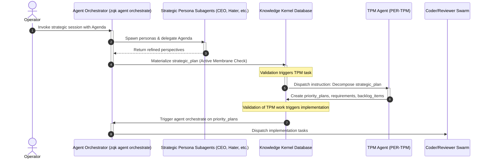

# Strategic Planning Meeting: Agent Orchestration & Lifecycle Wiring

**Version**: 1.0  
**Status**: Approved Design  
**Type**: Architecture Specification

---

## 1. Architectural Concept

To automate ZQK roadmap planning with consistency and traceability, we wire the **Strategic Planning Meeting** directly into the native `agent orchestrate` loop. This transforms strategic planning from an ad-hoc manual process into a closed-loop, deterministic state machine.



---

## 2. Wiring Strategic Meetings to `agent orchestrate`

When `zqk agent orchestrate` is run with a strategic focus, it bypasses traditional code implementation stages and enters the **Strategic Synthesis Pipeline**:

1.  **Orchestrator Stage 1 (Resolve Agenda):** The orchestrator accepts an agenda input (either file-based or semantic reference).
2.  **Orchestrator Stage 2 (Spawn Personas):** Natively triggers subagents mapped to CEO (`PER-CEO`), Architecture (`PER-ARCH`), Quality (`PER-QA`), Security (`PER-SEC`), and Hater (`PER-HATER`).
3.  **Orchestrator Stage 3 (Collect, Critique & Align):** Evaluates individual persona responses and passes them to the Hater persona for critical, anti-hallucination verification. The orchestrator queries the kernel database for all in-flight (`status=in_progress`) and next-in-line items, feeding them into the debate context to enforce roadmap continuity and prevent haphazard planning pivots.
4.  **Orchestrator Stage 4 (Materialize Deliverable):** Combines refined, continuity-aligned perspectives into a single unified `strategic_plan` object and commits it to the Knowledge Kernel.

---

## 3. Membrane Constraints for `strategic_plan` Injection

The deliverable `strategic_plan` must satisfy strict validation rules before transitioning to `active` status. These rules are implemented in the Go spec-builders:

```go
// From pkg/specbuilder/bldr_instance_v1/strategic_plan_instance_builder.go
type StrategicPlanInstance struct {
    ID              string      `json:"id" yaml:"id"`
    Title           string      `json:"title" yaml:"title"`
    PlanningHorizon string      `json:"planning_horizon" yaml:"planning_horizon"`
    Phases          []PlanPhase `json:"phases" yaml:"phases"`
    Status          string      `json:"status" yaml:"status"`
}
```

### Active Membrane Validation Rules:
1.  **ID Prefix**: Must strictly match URN schema `STRAT-PLAN-####`.
2.  **Planning Horizon**: Must contain a valid date range (e.g. `2026-06-01 to 2027-05-31`).
3.  **Phase Structural Requirements**: Each entry in `phases` must have:
    *   `phase`: Non-empty title specifying timeframe.
    *   `workstreams`: At least one referenced workstream.
    *   `goals`: Reference to existing or proposed goal IDs.

---

## 4. TPM Notification & Decomposition Lifecycle

Once the `strategic_plan` object is successfully validated and set to `active`:

1.  **Event Trigger:** A post-write event in the Storage Provider detects the new active `strategic_plan`.
2.  **TPM Task Generation:** The system automatically creates a new `agent_task` assigned to the Technical Program Manager (`PER-TPM`) persona.
3.  **TPM Mandate:** The TPM must decompose the `strategic_plan` phases into:
    *   `priority_plan` instances mapping to each phase.
    *   `backlog_item` instances representing specific deliverables.
    *   `requirement` and `test_case` objects for trace-linking.
    *   `technical_debt` items to address performance/arch warnings.
4.  **TPM Validation:** The TPM's deliverables are validated. Specifically, every `backlog_item` must trace back to a `requirement` which must trace back to a `test_case`.
5.  **Downstream Execution:** Successful validation of the TPM deliverables triggers `zqk agent orchestrate <PRIORITY-PLAN-ID>`, launching the Coder and Reviewer swarm to implement the code.

---

## 5. Maximizing LLM Strengths & Minimizing Weaknesses

To add predictability and consistency to the orchestration pipeline, ZQK leverages LLMs where they are strong while constraining them where they are weak:

| LLM Capability | Strength / Weakness | ZQK Mitigation / Guardrail |
| :--- | :--- | :--- |
| **Perspective Simulation** | **Strength:** Excellent at adopting specific personas (CEO, Hater) to analyze strategy from multiple angles. | **Leveraged:** Spawns distinct persona subagents to evaluate the agenda from their respective domains. |
| **Critical Deconstruction** | **Strength:** Good at finding gaps and contradictions when explicitly instructed to be critical. | **Leveraged:** The **Hater** persona acts as an anti-hallucination sentinel, checking assertions against real git diffs and test results. |
| **Structured Output Compliance** | **Weakness:** Hallucinates schema fields, outputs stray markdown text, or invents nonexistent object IDs. | **Mitigated:** All LLM outputs must pass through Go spec-builders (`pkg/specbuilder/`) and database reference validators before write. Invalid output is rejected at the database membrane. |
| **Tool Execution Predictability** | **Weakness:** Random execution paths, timeouts, or calling unsafe commands. | **Mitigated:** Bound to the Tool Pod Mesh with strict execution constraints, timeouts, and sandboxing. |
| **Verification Credibility** | **Weakness:** Prone to declaring task "completed successfully" without verifying actual logic. | **Mitigated:** Verification is never self-declared by the LLM. It must pass deterministic exit-code validation scripts (TDD tests) evaluated by the runner. |
