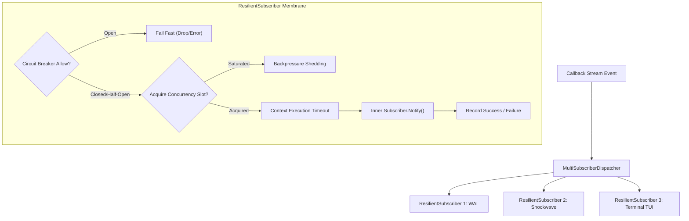

# Subscriber Backpressure, Concurrency Throttling, and Circuit Breaking Architecture

## Overview
The ZQK Knowledge Kernel event-driven callback subsystem processes asynchronous notifications from scheduler jobs, lifecycle transitions, and external agent interactions. When multiple subscribers (such as WAL logging, shockwave broadcasting, and TUI progress renderers) listen to high-throughput callback streams, slow or failing subscribers can induce cascade starvation across the entire event bus.

`ResilientSubscriber` introduces three defensive layers around any `CallbackSubscriber`:
1. **Adaptive Backpressure & Queue Bounding**: Prevents unbounded memory growth and goroutine accumulation by enforcing configurable shedding policies (`BackpressureDropSilent`, `BackpressureDropError`, `BackpressureBlock`).
2. **Concurrency Throttling**: Bounds concurrent executions per subscriber using an unbuffered token semaphore (`chan struct{}`), ensuring deterministic CPU and I/O utilization.
3. **Trip-and-Reset Circuit Breaking**: Integrates `pkg/circuitbreaker.CircuitBreaker` to detect consecutive failures, fail fast during outage intervals, and probe recovery via half-open state testing without stalling callers.

---

## Architectural Topology



---

## Configuration & Policies

```go
type ResilientSubscriberConfig struct {
    MaxConcurrent      int
    ExecutionTimeout   time.Duration
    BlockTimeout       time.Duration
    BackpressurePolicy BackpressureStrategy
    Breaker            circuitbreaker.CircuitBreaker
    Logger             logging.Logger
}
```

### Backpressure Strategies
- `BackpressureDropSilent`: Used for non-essential telemetry and terminal updates where dropped frames under load are preferred over backpressure stalls.
- `BackpressureDropError`: Used for critical subscribers where dropped messages must be explicitly signaled upstream for retry or compensation.
- `BackpressureBlock`: Bounded wait up to `BlockTimeout` before shedding, smoothing out temporary micro-bursts without causing unbounded latency.

---

## Verification & Telemetry
- **Telemetry Counters**: Every `ResilientSubscriber` maintains atomic telemetry counters for `inFlight`, `dropped`, `total`, and `failures` accessible via `Metrics()`.
- **Concurrency Invariant**: Verified under concurrent test suites (`go test -v -race ./cmd/zqk/callback/...`) to guarantee that active executions never exceed `MaxConcurrent` and zero data races occur.
