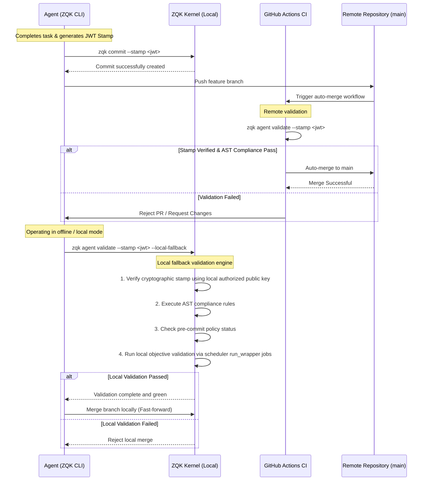

# Cryptographic Agent Stamp Protocol

This architecture specification describes the sequence and paths for validating Cryptographic Agent Stamps in the ZQK kernel, including remote CI auto-merge and local offline fallback paths.

## Sequence Diagram

## Description
- **Remote CI Path:** Normal operation where GitHub Actions runs `zqk agent validate` to enforce pre-commit, objective, and stamp policies. If all pass, the PR is auto-merged.
- **Local Fallback Path:** When CI is unavailable, developers use the `--local-fallback` flag on `zqk agent validate` to use local authorized keys for stamp verification and to trigger local background testing via the scheduler. This provides an authoritative offline path to approve merges.
