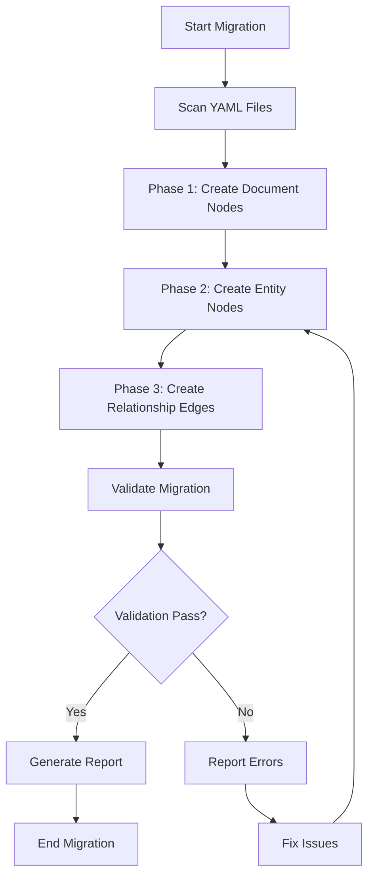

# Migration Strategy: File-Based to Graph Backend v1.0

**Version:** 1.0.0  
**Created:** 2025-12-24  
**Status:** Design Complete  
**Related:** BLI-240, BLI-237, BLI-238, BLI-239, MIL-035

## Overview

This document defines the comprehensive migration strategy for transitioning from file-based YAML storage to a graph backend implementation. The strategy ensures data continuity, prevents data loss, and minimizes system disruption during transition. The migration follows the three-layer GraphRAG architecture (Document, Entity, Relationship layers) defined in the GraphRAG Schema Design v1.0.

## Migration Principles

1. **Zero Data Loss**: All data must be preserved during migration
2. **Incremental Migration**: Support migrating subsets of objects for testing and validation
3. **Reversible**: Full rollback capability to file-based storage
4. **Validated**: Comprehensive validation at each migration phase
5. **Auditable**: Complete migration logs and reports
6. **Non-Disruptive**: System remains operational during migration

## Current State Analysis

### File Structure

Objects are currently stored in YAML files organized by type:

```
docs/architecture/
├── backlog/          # Backlog items (BLI-*.yaml)
├── goals/            # Goals (GOAL-*.yaml)
├── milestones/       # Milestones (MIL-*.yaml)
├── workstreams/      # Workstreams (WS-*.yaml)
├── priority_plans/   # Priority plans (PRI-*.yaml, PRIO-*.yaml)
├── criteria/         # Criteria (CRIT-*.yaml)
├── requirements/     # Requirements (REQ-*.yaml, REQU-*.yaml)
├── tests/            # Test cases (TEST-*.yaml)
├── roadmaps/         # Roadmaps (ROAD-*.yaml)
├── decisions/        # Decisions (DEC-*.yaml)
└── _internal/        # System objects (specs, lifecycles)
```

### Data Characteristics

- **Object Count**: ~100-500 objects per project (varies by project size)
- **File Format**: YAML v3 with schema_version 2.0.0
- **Reference Fields**: All `*_ref` and `*_refs` fields use `scheme:id` format
- **Metadata**: All objects include `created_at`, `created_by`, `updated_at`, `updated_by`
- **Relationships**: Explicit references via fields (e.g., `milestone_refs`, `goal_refs`)

## Migration Architecture

The migration follows the three-layer GraphRAG architecture:

### Phase 1: Document Layer Population

**Objective**: Read all YAML files and create Document nodes in the graph.

**Process**:
1. Scan `docs/architecture/` directory structure
2. Identify all YAML files (exclude `_internal/` directory)
3. Read file content and metadata
4. Create Document nodes with:
   - `id`: `doc_{object_type}_{object_id}` (e.g., `doc_backlog_item_BLI-237`)
   - `type`: Object type from file path or YAML `kind` field
   - `source_path`: Full file path relative to project root
   - `content`: Full YAML content as string
   - `metadata`: File metadata (created_at, updated_at, etc.)

**Chunking Strategy**:
- Small files (< 10KB): Single chunk
- Large files (> 10KB): Chunk by YAML sections (top-level keys)
- Chunk ID format: `chunk_{object_id}_{index}`

**Output**:
- Document nodes for all YAML files
- Document-to-source-path mapping
- Chunk metadata for large files

### Phase 2: Entity Layer Extraction

**Objective**: Parse YAML files and create Entity nodes for all objects.

**Process**:
1. For each Document node:
   - Parse YAML content
   - Extract object properties
   - Create Entity node matching object type
   - Link Entity to Document via `HAS_SOURCE` edge
2. Extract all object properties:
   - BaseObject fields (id, title, kind, status, etc.)
   - Extended fields (category, priority, etc.)
   - Reference fields (milestone_refs, goal_refs, etc.)
3. Generate embeddings:
   - Combine title, context, description fields
   - Generate vector embedding using configured model
   - Store in Entity node `embedding` property

**Entity Node Creation**:
```cypher
// Example: Backlog Item Entity
CREATE (b:BacklogItem {
  id: "BLI-237",
  kind: "backlog_item",
  title: "Define Comprehensive System Ontology",
  status: "complete",
  category: "Architecture",
  priority: "critical",
  priority_plan_ref: "PRI-207",
  priority_tier: "P0",
  created_at: "2025-12-24T05:45:00Z",
  created_by: "account:lanceettl",
  updated_at: "2025-12-24T07:40:02Z",
  updated_by: "client:cursor-vscode@1.0.0",
  embedding: [0.123, 0.456, ...]  // Vector embedding
})
```

**Reference Field Handling**:
- Extract all `*_ref` and `*_refs` fields
- Store as properties (for querying)
- Do NOT create edges yet (Phase 3)

**Output**:
- Entity nodes for all objects
- Entity-to-Document links
- Embeddings for semantic search
- Reference field extraction log

### Phase 3: Relationship Layer Construction

**Objective**: Process all reference fields and create graph edges.

**Process**:
1. For each Entity node:
   - Extract all reference fields
   - Resolve references to target entities
   - Create edges according to System Ontology
2. Edge creation rules:
   - `milestone_refs`: Create `BELONGS_TO` edges to Milestone nodes
   - `goal_refs`: Create `SUPPORTS` edges to Goal nodes
   - `workstream_refs`: Create `PART_OF` edges to Workstream nodes
   - `priority_plan_ref`: Create `ASSIGNED_TO` edges to PriorityPlan nodes
   - `criteria_refs`: Create `VALIDATED_BY` edges to Criteria nodes
   - `requirement_refs`: Create `IMPLEMENTS` edges to Requirement nodes
   - See System Ontology v1.0 for complete edge type mapping

**Edge Creation**:
```cypher
// Example: Backlog Item to Milestone relationship
MATCH (b:BacklogItem {id: "BLI-237"})
MATCH (m:Milestone {id: "MIL-035"})
CREATE (b)-[:BELONGS_TO {
  created_at: "2025-12-24T05:45:00Z",
  source_field: "milestone_refs"
}]->(m)
```

**Reference Resolution**:
- Parse `scheme:id` format (e.g., `milestone:MIL-035`)
- Lookup entity by ID (not by scheme prefix)
- Validate entity exists before creating edge
- Log unresolved references as errors

**Output**:
- All relationship edges created
- Reference resolution report
- Orphaned entity detection

## Migration Tool Requirements

### Core Functionality

1. **YAML File Scanner**
   - Recursively scan `docs/architecture/` directory
   - Filter by object type or file pattern
   - Support incremental scanning (only new/modified files)

2. **YAML Parser**
   - Parse YAML v3 format
   - Extract object properties
   - Handle schema version differences
   - Preserve all metadata fields

3. **Graph Writer**
   - Create Document nodes
   - Create Entity nodes
   - Create Relationship edges
   - Support batch operations for performance

4. **Reference Resolver**
   - Parse `scheme:id` format
   - Resolve to entity IDs
   - Validate entity existence
   - Handle missing references gracefully

5. **Embedding Generator**
   - Generate vector embeddings for entities
   - Support configurable embedding models
   - Cache embeddings for incremental updates

### Validation Features

1. **Reference Validation**
   - Verify all references resolve to existing entities
   - Report unresolved references
   - Check for circular references

2. **Data Integrity Checks**
   - Verify all required fields present
   - Validate field types and formats
   - Check for duplicate entity IDs

3. **Orphan Detection**
   - Identify entities with no relationships
   - Flag potential data quality issues

4. **Edge Type Validation**
   - Verify edge types match System Ontology
   - Check for invalid edge types
   - Validate edge directionality

### Incremental Migration Support

1. **Object Type Filtering**
   - Migrate specific object types (e.g., only backlog items)
   - Support type-based incremental migration

2. **Date Range Filtering**
   - Migrate objects created/updated in date range
   - Support time-based incremental migration

3. **Change Detection**
   - Track file modification times
   - Only migrate changed files
   - Support incremental updates

### Rollback Capabilities

1. **Graph to YAML Export**
   - Export graph data back to YAML format
   - Maintain original file structure
   - Preserve all object properties

2. **Partial Rollback**
   - Rollback specific object types
   - Rollback by date range
   - Selective entity/edge removal

3. **Backup and Restore**
   - Create graph backup before migration
   - Restore from backup if needed
   - Maintain file-based backup

### Reporting Features

1. **Migration Statistics**
   - Objects migrated count
   - Edges created count
   - Processing time
   - Error count

2. **Error Reporting**
   - Unresolved references
   - Parse errors
   - Validation failures
   - Missing entities

3. **Validation Reports**
   - Reference resolution status
   - Orphaned entities
   - Edge type validation results
   - Data integrity check results

## Implementation Details

### Tool Architecture

```
migration-tool/
├── scanner/          # YAML file scanning
├── parser/           # YAML parsing and extraction
├── writer/           # Graph node/edge creation
├── resolver/         # Reference resolution
├── validator/        # Validation logic
├── exporter/         # Graph to YAML export
└── reporter/         # Report generation
```

### Migration Workflow



### Command-Line Interface

```bash
# Full migration
migration-tool migrate --source docs/process --target graph://localhost:7687

# Incremental migration (specific types)
migration-tool migrate --source docs/process --target graph://localhost:7687 \
  --types backlog_item,milestone,goal

# Incremental migration (date range)
migration-tool migrate --source docs/process --target graph://localhost:7687 \
  --from-date 2025-12-01 --to-date 2025-12-24

# Validation only
migration-tool validate --source docs/process

# Export graph to YAML (rollback)
migration-tool export --source graph://localhost:7687 --target docs/process-backup

# Generate report
migration-tool report --source graph://localhost:7687 --output migration-report.json
```

### Configuration

```yaml
# migration-config.yaml
migration:
  source:
    path: "docs/process"
    exclude_patterns:
      - "_internal/**"
  
  target:
    provider: "memgraph"  # or "neo4j", "rdf"
    connection:
      host: "localhost"
      port: 7687
      database: "zqk"
  
  embedding:
    model: "text-embedding-3-small"
    provider: "openai"
    api_key: "${OPENAI_API_KEY}"
  
  validation:
    strict: true
    fail_on_unresolved_refs: false
    fail_on_orphans: false
  
  reporting:
    output_dir: "migration-reports"
    include_statistics: true
    include_errors: true
```

## Validation Requirements

### Pre-Migration Validation

1. **File System Validation**
   - Verify all YAML files are readable
   - Check for parse errors
   - Validate file structure

2. **Schema Validation**
   - Verify schema_version compatibility
   - Check required fields present
   - Validate field types

3. **Reference Validation**
   - Check all references use `scheme:id` format
   - Verify referenced entities exist
   - Detect circular references

### Post-Migration Validation

1. **Entity Validation**
   - Verify all entities created
   - Check entity properties match source
   - Validate embeddings generated

2. **Relationship Validation**
   - Verify all edges created
   - Check edge types match System Ontology
   - Validate edge directionality

3. **Query Validation**
   - Test multi-hop queries
   - Verify reference resolution
   - Test semantic search

### Ongoing Validation

1. **Data Integrity Monitoring**
   - Monitor for orphaned entities
   - Check for broken references
   - Validate edge consistency

2. **Performance Validation**
   - Measure query performance
   - Check index usage
   - Monitor graph size

## Rollback Strategy

### Full Rollback

1. **Export Graph to YAML**
   - Export all entities to YAML files
   - Maintain original file structure
   - Preserve all properties and metadata

2. **Restore File System**
   - Replace `docs/architecture/` with exported files
   - Verify file integrity
   - Test system with file-based storage

### Partial Rollback

1. **Selective Export**
   - Export specific object types
   - Export by date range
   - Export specific entities

2. **Incremental Restore**
   - Restore only changed objects
   - Merge with existing files
   - Preserve manual edits

### Backup Strategy

1. **Pre-Migration Backup**
   - Create full backup of `docs/architecture/`
   - Store backup with timestamp
   - Verify backup integrity

2. **Graph Backup**
   - Create graph database backup
   - Store backup with timestamp
   - Enable point-in-time recovery

## Transition Timeline

### Phase 1: Preparation (Week 1)

- [ ] Implement migration tool core functionality
- [ ] Create test dataset
- [ ] Validate migration tool with test data
- [ ] Document migration procedures

### Phase 2: Pilot Migration (Week 2)

- [ ] Migrate test project (small dataset)
- [ ] Validate migration results
- [ ] Test rollback procedures
- [ ] Refine migration tool based on results

### Phase 3: Production Migration (Week 3-4)

- [ ] Migrate production project incrementally
- [ ] Validate each migration phase
- [ ] Monitor system performance
- [ ] Generate migration reports

### Phase 4: Validation and Cutover (Week 5)

- [ ] Comprehensive validation
- [ ] Performance testing
- [ ] User acceptance testing
- [ ] Final cutover to graph backend

## Risk Mitigation

### Data Loss Risks

**Risk**: Data corruption during migration  
**Mitigation**: 
- Comprehensive backups before migration
- Validation at each phase
- Rollback procedures tested

**Risk**: Reference resolution failures  
**Mitigation**:
- Pre-migration reference validation
- Graceful handling of missing references
- Detailed error reporting

### Performance Risks

**Risk**: Slow migration for large datasets  
**Mitigation**:
- Batch processing
- Incremental migration
- Parallel processing where possible

**Risk**: Graph query performance degradation  
**Mitigation**:
- Proper indexing strategy
- Query optimization
- Performance monitoring

### Operational Risks

**Risk**: System disruption during migration  
**Mitigation**:
- Incremental migration approach
- Dual-write mode (file + graph)
- Gradual cutover

**Risk**: Rollback complexity  
**Mitigation**:
- Comprehensive rollback procedures
- Automated rollback tools
- Regular rollback testing

## Success Criteria

1. **Data Completeness**: 100% of objects migrated successfully
2. **Reference Resolution**: 100% of valid references resolved
3. **Performance**: Query performance meets or exceeds file-based performance
4. **Validation**: All validation checks pass
5. **Rollback**: Successful rollback tested and verified
6. **Documentation**: Complete migration documentation and procedures

## Related Documents

- **System Ontology v1.0**: `docs/architecture/ontology/system-ontology-v1.0.md`
- **GraphRAG Schema Design v1.0**: `docs/architecture/architecture/graphrag-schema-design-v1.0.md`
- **Pluggable Backend Interface v1.0**: `docs/architecture/architecture/pluggable-graph-backend-interface-v1.0.md`
- **Backlog Item**: BLI-240 (Design Migration Strategy from File-Based to Graph Backend)
- **Milestone**: MIL-035 (Knowledge Kernel Graph Structure)

## Next Steps

1. ✅ **Complete**: System Ontology v1.0
2. ✅ **Complete**: GraphRAG Schema Design v1.0
3. ✅ **Complete**: Pluggable Backend Interface v1.0
4. ✅ **Complete**: Migration Strategy v1.0
5. **Next**: BLI-623 - Implement File-Based to Graph Migration Tools (Phase 2)
6. **Next**: BLI-624 - Implement MemGraph Backend Driver (Phase 2)

---

**Status**: Design Complete - Ready for Implementation  
**Approved By**: Architecture Review  
**Last Updated**: 2025-12-24

