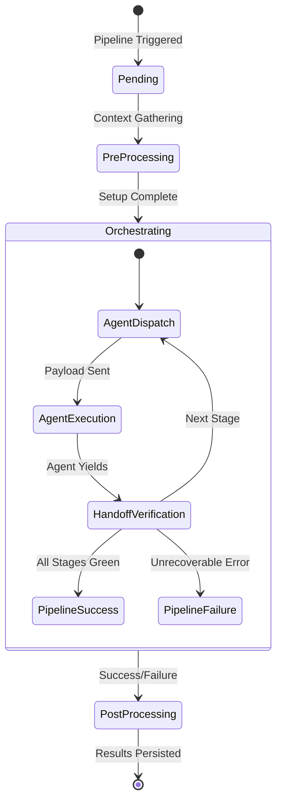

# v2.8 Orchestrate Multi-Agent Pipeline Architecture

## 1. Executive Summary
The v2.8 roadmap introduces a formal orchestration engine for multi-agent pipelines. Currently, our agents operate in localized Swarms or isolated Background Tasks. The Multi-Agent Pipeline will formalize the routing of work across heterogeneous agents, allowing them to collaborate efficiently on complex, multi-stage workflows (e.g., Code Review -> Refactor -> Testing -> Security Scan -> Merge).

## 2. State Machine Design

The pipeline operates as a deterministic state machine within the Knowledge Kernel, ensuring traceability and safe restarts.



## 3. Data Schema & Object Modeling

Pipelines will be represented as top-level objects in the ZQK Object Graph.

### 3.1. `pipeline_definition` Object
Defines the template and structure of the pipeline.
- `schema_version`: `1.0.0`
- `stages`: Array of `pipeline_stage` definitions.
- `triggers`: Event hooks that initiate the pipeline.

### 3.2. `pipeline_execution` Object
Tracks an active, running instance of a `pipeline_definition`.
- `definition_ref`: Pointer to the `pipeline_definition`.
- `current_stage`: String identifier of the active stage.
- `context_payload`: Arbitrary JSON dict holding the working context passed between agents.
- `audit_trail`: Array of operations performed by the agents in sequence.

## 4. Plugin Architecture

To ensure the pipeline is extensible, we will introduce a standard **Pipeline Plugin Interface**.

### 4.1. Core Interfaces

```go
package pipeline

// PipelinePlugin defines the contract for any executable stage in a pipeline.
type PipelinePlugin interface {
    // Name returns the unique string identifier for the plugin
    Name() string
    
    // Execute runs the plugin logic, mutating the payload or initiating a subagent
    Execute(ctx context.Context, payload map[string]any) (map[string]any, error)
    
    // Validate ensures the output of this plugin satisfies the next stage's requirements
    Validate(ctx context.Context, output map[string]any) error
}
```

### 4.2. Recommended Initial Plugins
1. **Context Hydration Plugin**: Gathers relevant codebase context (Git diffs, issue descriptions) before dispatching to an agent.
2. **Subagent Invocation Plugin**: The core executor that dispatches the `Prompt` to an LLM Subagent, waits for completion, and parses the structured response.
3. **Artifact Finalization Plugin**: Merges the results, handles PR creation, and writes summaries to the kernel graph.

## 5. Next Steps for Implementation
1. Add `pipeline_definition` and `pipeline_execution` to the Spec Builder schema registry.
2. Implement the `pkg/pipeline` state machine and orchestrator engine.
3. Develop the Initial Plugins.
4. Integrate with `zqk scheduler` to allow asynchronous, persistent pipeline execution.
