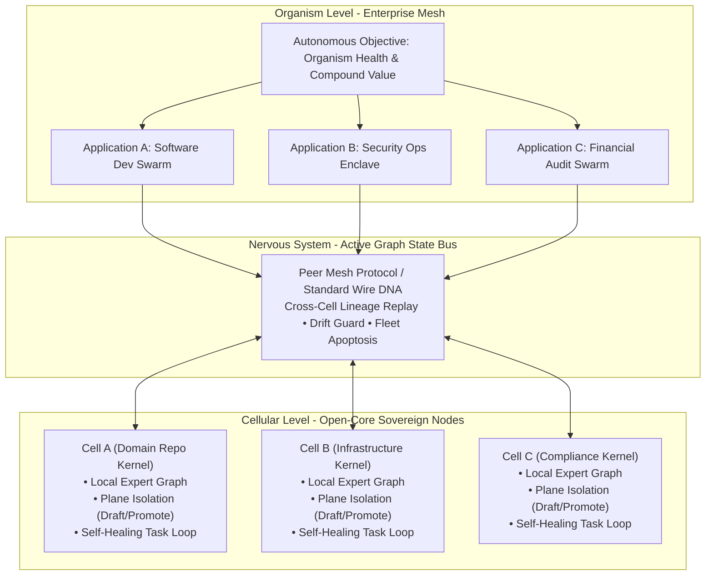

# Strategic Panel Evaluation: Cellular Knowledge Operating System (Cellular OS)

> [!IMPORTANT]
> **Source Material Analyzed**: [`Cellular_Knowledge_Operating_System.pdf`](file:///Users/lanceettl/Desktop/Cellular_Knowledge_Operating_System.pdf)
> **Strategic Council Convened**:
> 1. **Visionary Product Executive (`visionary-exec`)**: Category creation, biological positioning, open-core vs. enterprise monetization boundary.
> 2. **Adversarial Auditor (`adversarial-auditor`)**: Devil's advocate, competitive threat analysis, distributed consensus risks, and cognitive overhead audit.
> 3. **Principal Go Systems Architect (`go-architect`)**: 3-tier layering model, memory plane isolation, Go concurrency, and codegen quarantine.
> 4. **Lead Strategy Architect / TPM (`strategy-architect`)**: Risk-adjusted roadmapping, critical path, Gantt matrix, and data model rationalization.

---

## Executive Synthesis: The Category Shift

The comparative analysis against **Herdr** and the broader agent landscape crystallizes a fundamental category recalibration:

| Dimension | Legacy Framing (What Markets Assume) | Recalibrated Category (Cellular OS Reality) |
| :--- | :--- | :--- |
| **Identity** | AI IDE / Terminal Wrapper / Devtool | **Distributed Biological Computing Substrate** |
| **Unit of Scale** | Monolithic prompt script / Vector data lake | **Sovereign Cellular Microkernel (Local Domain Authority)** |
| **Coordination** | Ephemeral chat loops / Terminal multiplexing | **Inter-Cellular Mesh Nervous System (Active Graph State Bus)** |
| **Application Model** | Monolithic codebase with glued scripts | **Symbiotic swarms of agents self-governing on the mesh** |
| **Boundary Safety** | Unchecked direct repo edits / context pollution | **Multi-Plane Transaction Isolation (`Draft` $\rightarrow$ `Staged` $\rightarrow$ `Promoted`)** |



---

## Persona 1: Commentary by the Visionary Product Executive

> *"Stop building fragile agent scripts. Run cellular swarms that govern, heal, and coordinate themselves."*

### 1. The Category Truth: Defining the Enemy
The agent market is suffocating in two traps:
1. **The Vector Swamp**: Dumping uncurated agent exhaust into massive vector databases, producing hallucinations and context rot.
2. **The Terminal Illusion (Herdr, tmux)**: Multiplexing split terminals as if visual concurrency equates to autonomous execution.

ZQK does not compete with Herdr or Claude Code at the glass layer; **ZQK is the operating system running underneath them**. While Herdr manages panes and processes, ZQK provides the transactional truth, cryptographic provenance, and multi-plane isolation that prevents multi-agent hallucinations from corrupting production codebases.

### 2. The Biological Metaphor: Why It Sells
Software analogies fail because traditional OS architectures assume centralized CPU/memory supremacy. In an agentic world, intelligence is inherently distributed and fallible.
- **The Cell**: Sovereign local kernel with its own private metabolism and local truth.
- **The Membrane**: The fail-closed boundary ensuring only structurally validated, invariant-passing state mutates reality.
- **The Nervous System**: The active graph bus that turns state changes into real-time operational signals.
- **The Organism**: The networked mesh achieving compound goals without moment-to-moment human oversight.

### 3. Open-Core vs. Enterprise Boundary
- **Free & Sovereign Open-Core (Single Cell)**: Zero toll on running discrete, sovereign local kernels. Full local runtime, file/graph state, draft/promote planes, deterministic task scheduler, and local CLI.
- **Monetizable Enterprise Mesh (Organism Infrastructure)**: Federated mesh routing, cross-cell knowledge synchronization, fleet-wide drift guards, automated apoptosis (quarantining misbehaving cells), and enterprise compliance audit graphs.

---

## Persona 2: Commentary by the Adversarial Auditor

> *"Brutal truth: A brilliant biological metaphor will collapse under market reality if you do not solve inter-node friction and epistemic drift."*

### 1. The Vulnerabilities & Market Traps
1. **Cognitive Overhead (The 'Complexity Tax')**:
   - Herdr's 37.2k GitHub stars reflect developer thirst for immediate, zero-config ergonomics.
   - If adopting ZQK requires understanding URNs, MetaSchemas, CAS staging pairs, and plane transitions before writing a single line of code, developers will run to simpler tools.
   - **Mandate**: The single-node experience (`zqk run` or `zqk cell init`) must be as frictionless as running a local Docker container or git repo.
2. **The Distributed Consensus & Semantic Drift Trap**:
   - When multiple independent cells operate over days, how do you prevent Cell A's definition of `TaskDone` from drifting away from Cell B's?
   - Without deterministic wire protocol schemas, autonomous multi-cell systems devolve into inter-agent babel.
3. **The "Single-Maintainer Surface Area" Exposure**:
   - A microkernel, graph store, AST codegen engine, scheduler, IDE bridge, and CLI is a massive surface area.
   - Quarantining `internal/codegen` is a vital first step, but the open-core must be rigorously scoped to bare primitives so maintenance remains sustainable.

### 2. Radical Corrective Actions Required
- **Strict Wire Protocol Spec (v1.0)**: Publish an unopinionated RFC for inter-kernel IPC (gRPC/HTTP + JSON-LD/Protobuf) so any external runtime (Claude Code, Cursor, custom Python scripts) can interface with a cell.
- **Automated Cell Apoptosis Proof**: Implement empirical unit and integration tests proving that when an agent cell hallucinates or produces corrupt diffs, the mesh boundary isolates the blast radius without infecting peer nodes.

---

## Persona 3: Commentary by the Principal Go Systems Architect

> *"The engineering solution is not subtraction; it is rigorous 3-tier layering."*

### 1. Validation of the 3-Tier Layering Model
The user's intuition was spot-on: stripping the engine down to 4 bare primitives (`State`, `Plane`, `Graph`, `Task`) would have crippled ZQK's proven orchestration reliability. The solution validated in the PDF is **Layering**:

```
+-------------------------------------------------------------------------+
| LAYER 3: DOMAIN PROFILES & WORKFLOWS                                    |
| (Software Dev Swarms • Security Ops Enclaves • Financial Audit Swarms)  |
+-------------------------------------------------------------------------+
                                    ▲
                                    │ Implements / Instantiates
                                    ▼
+-------------------------------------------------------------------------+
| LAYER 2: THE KERNEL STANDARD LIBRARY (Core DNA Schema)                  |
| (Intent/Epic • WorkUnit/BLI • Invariant/Gate • Verdict • Lineage/ADR)   |
+-------------------------------------------------------------------------+
                                    ▲
                                    │ Built Upon
                                    ▼
+-------------------------------------------------------------------------+
| LAYER 1: MICROKERNEL RUNTIME ENGINE                                     |
| (Graph State Bus • Multi-Plane Memory Isolation • IPC Wire • Scheduler) |
+-------------------------------------------------------------------------+
```

### 2. Systems Audit of Completed Sector Work
- **Sector 1 (`pkg/dna`)**: Primitive composition via `BaseObject`, `Auditable`, `Lifecycle`, and `MetaSchema` establishes the cellular nucleus.
- **Sector 2 (`pkg/dna/pm`)**: Re-anchoring PM objects as the "Standard Library" rather than engine hardcoding ensures clean separation.
- **Sector 3 (`pkg/kernel`)**: `MemoryAdjacencyEngine` and `PlaneBoundaryEnforcer` decouple the graph state bus from domain entities, enforcing plane isolation across causal links.
- **Sector 4 (`internal/codegen`)**: Moving the AST synthesizers and macro generators into `internal/codegen` with structural import ban tests (`TestPkgKernelMustNotImportCodegen`, `TestPkgDNAMustNotImportCodegen`) successfully quarantined the compiler secret sauce.

---

## Persona 4: Commentary by the Strategy Architect / TPM Lead

> *"Translate the biological vision into an optimized, risk-adjusted execution ledger."*

### 1. The Strategic Phased Roadmap

```mermaid
flowchart LR
    subgraph Phase 1 [Months 1-3: Foundation]
        P1A[Decouple Core Primitives<br/>DONE] --> P1B[Quarantine Codegen<br/>DONE]
        P1B --> P1C[Data Model Audit &<br/>CAS Boundary Hygiene]
        P1C --> P1D[Community Repo Bootstrap<br/>PRI-COMMUNITY-001]
    end

    subgraph Phase 2 [Months 4-6: Protocol]
        P2A[Standard Node Wire Protocol<br/>HTTP/gRPC/JSON-LD] --> P2B[Single-Node Self-Healing &<br/>Local Apoptosis]
        P2B --> P2C[Developer Quickstarts &<br/>Plug-in Node Runtime]
    end

    subgraph Phase 3 [Months 7-12: Enterprise Organism]
        P3A[Federated Mesh Gateway] --> P3B[Cross-Cell Knowledge Sync<br/>& Drift Guard]
        P3B --> P3C[Fleet Apoptosis &<br/>Multi-Tenant Governance]
    end

    Phase 1 --> Phase 2 --> Phase 3
```

### 2. Immediate Tactical Priority: The Data Model Rationalization & CAS Boundary Cleanse
Before cutting the open-core community bootstrap, we must complete the **Data Model Rationalization & Schema Property Audit** requested by the user:

1. **Enforce Mandatory `description` Across the CAS Boundary**:
   - `zqk system check --layer 1` surfaced 79 non-blocking warnings where `description` is unpopulated across Milestones, Personas, Roadmaps, Decisions, and Workstreams.
   - Enforcing `description` at the CAS boundary eliminates semantic ambiguity and ensures every object across the cellular graph is self-documenting.
2. **Prune Redundant / Abandoned Properties**:
   - Formal audit across all object schemas (e.g. `persona.name` duplicate of `title`).
   - Remove fields whose original intent was never realized or abandoned, ensuring our data model is lean, efficient, and intentional before open-core release.
3. **Advance to `PRI-COMMUNITY-REPO-BOOTSTRAP-001`**:
   - Package the decoupled, sanitized single-node kernel repository ready for public Apache 2.0 release.
