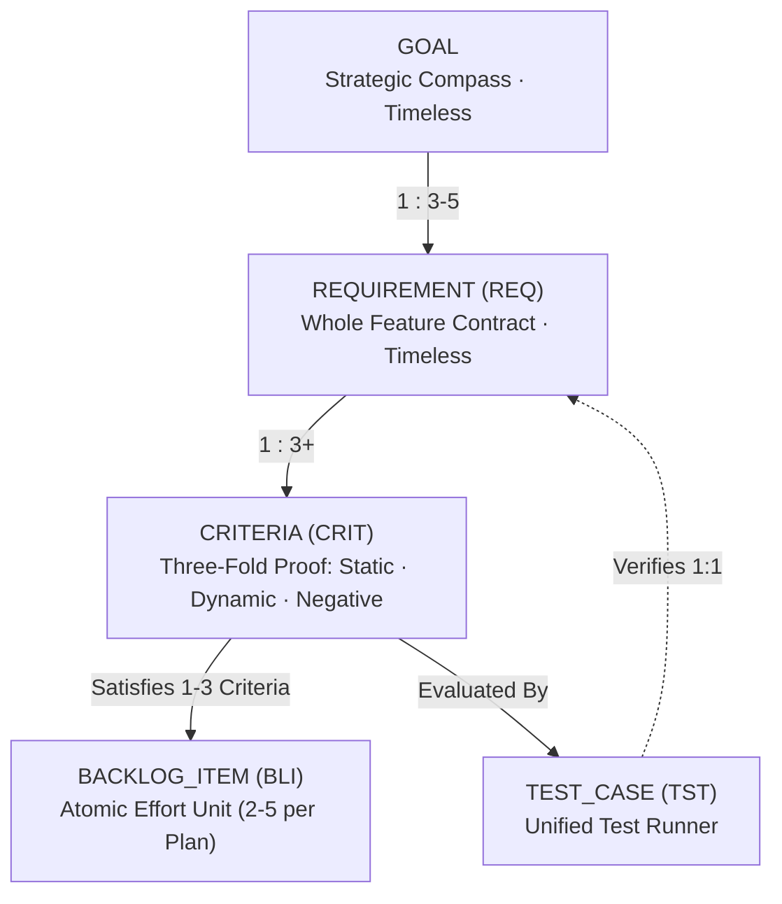
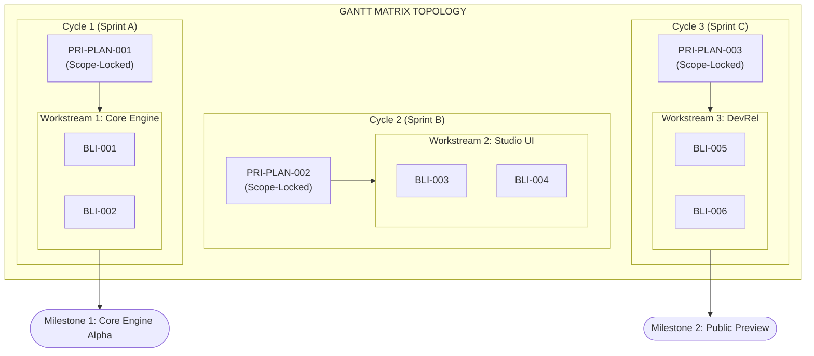
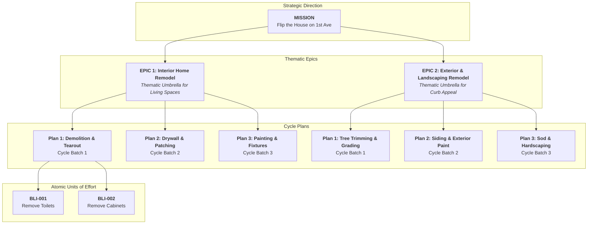

# Process Administration & Management: Kernel Objects
**Taxonomy, Slicing Standards, Cardinality, and the Shift-Left Directive**

---

## 1. Executive Summary: The Shift-Left Mandate

In transient, chat-based agent harnesses, agents write massive, monolithic changes across entire codebases with superficial PR summaries. In the **ZQK Knowledge Kernel**, reality is governed by verified, immutable graph objects.

Waiting for `git commit` check-valves or `zqk-vet` to catch errors is a late-stage fail-safe. **Process Administration must Shift Left**: agents and human operators must understand the exact purpose, trigger, boundaries, and cardinality of kernel objects *before* minting objects or writing code.

---

## 2. Kernel Object Taxonomy (What / When / Why / How Many)

| Object Kind | **What** (Definition) | **When** (Trigger) | **Why** (Rationale) | **How Many** (Cardinality Ratio) |
| :--- | :--- | :--- | :--- | :--- |
| **`goal`** | **Timeless Strategic Compass.** | Project kickoff or major strategic direction shift. | Anchors strategic North Star outside of sprints/schedules; defines ultimate launch conditions. | **1 per product tier / mission** |
| **`milestone`** | **Chronological Boundary Event.** | Key external release or major capability delivery. | **Adds the time constraint**: represents a time-bounded subgoal across delivered reality that plans aim toward. | **1 to 3 per Goal** |
| **`epic`** | **Thematic container grouping multiple plans.** | When an initiative spans multiple time cycles or sprints. | Keeps related execution cycles organized under one identifiable umbrella. | **1 to 3 per Goal** |
| **`priority_plan`** | **1-cycle time-bounded execution block.** | Start of each execution cycle / sprint. | **Reigns in scope commitments** to ensure work gets completed, not parked. Scope-locked upon `in_progress`. | **2 to 5 per Epic** *(1 cycle of work)* |
| **`requirement`** (REQ) | **Timeless Feature Contract** (`MUST`, `MUST NOT`). | Outlined during design to bound problem statement and operational scope. | Formalizes functional truth and boundary conditions independently of code or schedules. | **3 to 5 per Goal** *(1 to 3 per Epic)* |
| **`test_case`** (TST) | **Unified test runner proving a requirement.** | TDD upfront test harness created before or alongside code. | Cryptographically proves all linked criteria in a single logical test command. | **1:1 with Requirement** |
| **`criteria`** (CRIT) | Mathematical measurement or falsifiable condition. | Created alongside the requirement before coding begins. | Eliminates hand-waving; drives automatic shockwave state graduation. | **Minimum 3 per REQ** *(The Three-Fold Proof)* |
| **`backlog_item`** (BLI) | **Atomic unit of effort** & commit evidence. | Sliced before coding starts for a single cohesive subsystem. | Enables swarm parallelism, limits blast radius, provides deterministic AST rollback. | **2 to 5 per Plan** *(Each satisfies 1–3 CRIT)* |
| **`technical_debt`** (TDE) | **Tactical non-functional behavior plane.** | Discovered smells, test flakes, performance hotpaths, or bugs. | Direct entry point into technical work supporting goals. Rollups codify architectural policies. | **Tactical / As-Discovered** *(Rollup into Policies)* |

---

## 3. The 5-Layer Relational Cascade

### Critical Linkage Rules
1. **Goals and Requirements are Timeless Contracts:**
   - **`goal` and `requirement` exist completely outside of any sprint, schedule, or calendar constraint.**
   - They define strategic compass intent and verifiable feature contracts.
   - **Strictly NO `priority_plan_ref` or `priority_plan_refs` on `goal` or `requirement`.** They must never be scheduled or bound to execution cycles directly.
2. **Goals DO NOT have `criteria_refs`:**
   Goals are high-level strategic compasses. They decompose into **Requirements** via child `requirement.goal_refs`. Only Requirements own `criteria_refs`.
3. **Milestones Add the Time Dimension:**
   - **`milestone` introduces chronological and time constraints** across delivered reality.
   - Acts as a time-bounded subgoal or significant milestone release event that `priority_plan` cycles aim toward.
4. **Priority Plans Group Exactly 1 Cycle of Work:**
   - **`priority_plan` schedules atomic units of effort (`backlog_item` and tactical `technical_debt`)** aiming toward a target milestone.
   - Plans are strictly scope-locked upon transitioning to `in_progress`.
5. **Requirements own `criteria_refs`:**
   Every requirement MUST define at least 3 criteria satisfying the Three-Fold Proof.
6. **Test Cases are 1:1 with Requirements:**
   A test case wraps all criteria linked to a requirement. Running `zqk test run <tst_id>` evaluates the complete feature contract in one unified pass.
7. **Backlog Items satisfy 1–3 Criteria (Never Monolithic 1:1 REQ):**
   A Backlog Item is an atomic slice of implementation effort. Never build an entire feature contract in a single monolithic BLI. Each plan must have 2 to 5 BLIs.

---

## 4. The Gantt Matrix Topology

In ZQK Studio and execution planning, the graph renders as an audited two-dimensional execution grid:

* **Workstreams (Rows / Swimlanes):** Ongoing functional domains (e.g., *Core Engine*, *Studio UI*, *Developer Relations*).
* **Epics (Grouping Banners):** Unifying thematic containers that span across multiple cycles.
* **Priority Plans (Columns / Blocks):** Discrete, 1-cycle execution windows that lock scope.
* **Backlog Items (Intersections):** The units of effort executed within that cycle and lane.
* **Milestones (Flags / Anchors):** Significant stakeholder boundary events crossing delivered reality.

---

## 5. Epics: Giving Semantic Shape to Multi-Plan Initiatives

### The "Phases of Work" Cognitive Dilemma
In large engineering endeavors and strategic roadmaps, initiatives naturally span multiple cycles or phases of work. However, referring to abstract labels like *"Phase 1, Phase 2, Phase 3, Phase 4"* is a notorious source of cognitive confusion:
* Stakeholders, executives, and agents constantly lose track of when capabilities arrive: *"Was the database migration in Phase 2, or is that upcoming in Phase 4?"*
* Numerical phase designations strip away domain intent and obscure the overarching milestone being delivered.

**The `epic` exists to give concrete, human-legible semantic shape to the overall thing.** It aggregates multiple 1-cycle `priority_plan` blocks under a recognizable, domain-cohesive umbrella container.

### The Home Remodel Analogy: From Vision to Epics and Plans
Consider a real-world physical engineering endeavor: flipping an old home.
* **Vision:** *"Become the most successful, quality-driven real estate developer in the region."* (Timeless inspirational direction).
* **Mission:** *"Flip the house on 1st Ave and achieve a 25% net return on investment."* (Core initializing intent).
* **Goals & Requirements:** Code-compliant modern electrical, brand-new plumbing, energy-efficient HVAC, flawless curb appeal (Timeless functional contracts and quality floors).

Rather than slicing the execution into ambiguous *"Phase 1 through 6"*, work is structured under domain-cohesive **Epics**:

* **Epic 1: "Interior Home Remodel"**
  * `priority_plan` 1: **Demolition & Tearout** (BLIs: remove old toilets, pull out broken cabinetry, rip out carpets).
  * `priority_plan` 2: **Drywall & Patching** (BLIs: hang sheetrock, tape, mud, smooth sand).
  * `priority_plan` 3: **Painting & Fixture Installation** (BLIs: prime walls, two coats interior paint, install vanities & light fixtures).
* **Epic 2: "Exterior & Landscaping Remodel"**
  * `priority_plan` 1: **Tree Trimming & Site Grading**
  * `priority_plan` 2: **Siding Repair & Exterior Paint**
  * `priority_plan` 3: **Sod Installation & Hardscaping**

Everyone—from human executives to autonomous worker agents—immediately grasps where any piece of work belongs without tracking abstract phase numbers.

### Epic Shockwaves & Permissive Scope Invariant
* **Child ➔ Parent Shockwave Progression:**
  * When the *first* linked `priority_plan` transitions to `in_progress`, the parent `epic` automatically shockwaves from `planned` ➔ `in_progress`.
  * When *all* linked priority plans reach `complete`, the parent `epic` automatically shockwaves ➔ `completed`.
* **Permissive Scope Invariant:**
  * **Priority Plans** are strictly **scope-locked** upon entering `in_progress` to guarantee that the current cycle completes without scope creep.
  * **Epics** are **permissive by default**. As an initiative evolves across cycles and teams discover new work (e.g., discovering dry rot during demolition requiring an additional subfloor repair plan), operators and agents can freely attach new `priority_plan` objects to an in-progress `epic`.
  * An `epic` can be explicitly sealed by setting `execution_locked: true` when no further plans or phases may be added.

---

## 6. The Non-Functional Behavior Plane & Technical Debt (`technical_debt`)

### Definition & Purpose
While `requirement` objects define the **functional contract plane** (what the user or system must do), **`technical_debt` represents the non-functional behavior plane**. It serves as a tactical entry point into technical work that must be done—frequently in support of one or more strategic goals, but not directly specified as a functional feature deliverable.

### Discovery Sources
Technical debt items are discovered across operational and engineering reality:
1. **Code smells & complexity**: Cyclomatic spikes, map extraction boilerplate, long condition cascades.
2. **Test flakes & teardown bottlenecks**: Premature context cancellation, unmanaged goroutines, unbuffered channel locks.
3. **Performance hotpaths**: High-latency storage scans, redundant reflection, N+1 query patterns.
4. **Security & robustness**: Swallowed errors, unvalidated input boundaries, missing negative test assertions.
5. **Missed invariants**: Edge cases uncovered during chaos testing or regression audits.

### The Rollup & Categorization Principle
**Technical debt items must not be treated as isolated fire-fighting tickets.**
The true value of the Knowledge Kernel's non-functional plane lies in the **Rollup & Categorization Principle**:
* **The Anti-Pattern Story:** When multiple technical debt items of similar category (e.g., `testing`, `performance`, `maintainability`, `concurrency`) accumulate across workstreams or cycles, their collective rollup paints a crystal-clear picture of an underlying anti-pattern or systemic friction point.
* **Instituting Best Practices & Policies:** The resolution of a tech debt bucket must NOT merely patch the code. It must be codified into a formal kernel **`policy`** (`zqk new policy`), an AST audit rule, or an automated architectural check-valve (`pkg/validation/qa/ast_audit.go`).
* **Future Prophylaxis:** By translating anti-pattern stories into machine-enforced policies, all future endeavors across the organization automatically inherit and benefit from the institutional memory codified in the Knowledge Kernel.

---

## 7. Cardinal Anti-Patterns vs. Correct Practice

### Anti-Pattern 1: The "BLI Hijacking" Anti-Pattern (Scope Stacking)
* **Violation:** The user asks for a new Web UI or macro feature, and the agent tacks it onto an existing or completed BLI (e.g. adding a prompt studio to `BLI-REPLY-ENGINE-001`).
* **Correct Practice:** Never mutate or stack scope onto an in-flight or completed BLI. Mint a new BLI (`zqk new bli "Prompt Studio Web UI" --plan PRI-xxx`).

### Anti-Pattern 2: The Degenerate 1:1:1:1 Pipeline
* **Violation:** 1 Goal ➔ 1 Plan ➔ 1 BLI ➔ 1 REQ ➔ 1 CRIT. The BLI becomes a massive monolithic PR bundling database, engine, kill switch, and UI into one commit.
* **Correct Practice:** Decompose the plan into 2 to 5 orthogonal BLIs, each satisfying 1–3 criteria.

### Anti-Pattern 3: The Three-Fold Proof Omission
* **Violation:** Defining a single criterion: `CRIT-001: Works as expected`.
* **Correct Practice:** Every requirement must have at least:
  1. **Static Invariant Floor:** Schema validated, types correct, lint zero.
  2. **Operational Dynamic Proof:** Programmatic test suite exits 0 with asserted output.
  3. **Negative / Adversarial Boundary:** Invalid inputs, timeouts, or unauthorized calls fail closed safely.

### Anti-Pattern 4: Coupling Timeless Contracts to Execution Schedules
* **Violation:** Assigning `priority_plan_ref` directly to a `goal` or `requirement`.
* **Correct Practice:** Keep Goals and Requirements timeless. Use `milestone` to introduce the time constraint across delivered reality, and bind `priority_plan` cycles to `milestone` and atomic `backlog_item` units of effort.

