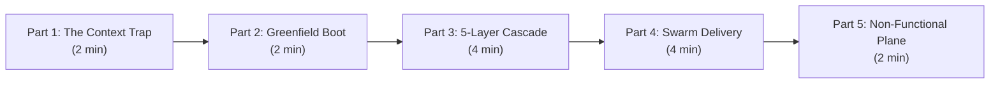
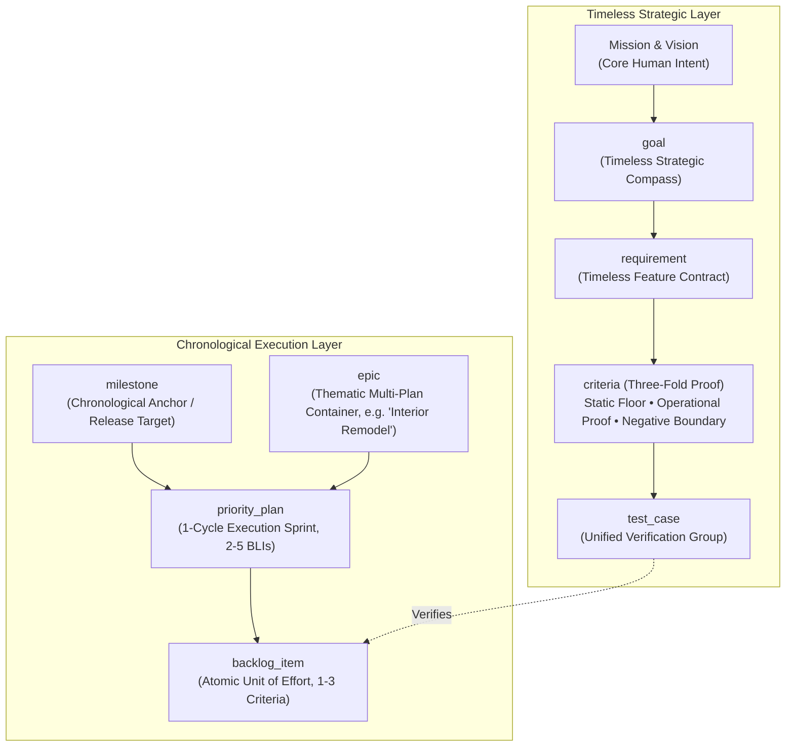
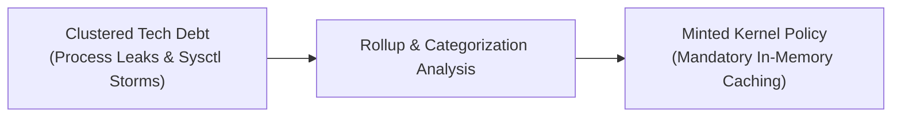

# YouTube Project Demo Blueprint: Autonomous Engineering with the ZQK Knowledge Kernel

**Document Reference:** `docs/guides/YOUTUBE_DEMO_BLUEPRINT.md`  
**Target Video Duration:** 12–15 Minutes  
**Target Audience:** Autonomous Agent Practitioners, Staff Engineers, Open-Source Devs

---

## 1. Episode Arc & High-Level Flow

This blueprint provides a production-ready, step-by-step screen recording curriculum designed to showcase why ZQK is fundamentally superior to ephemeral, prompt-promiscuous chat harnesses (Cursor Composer, Claude Code, Devin).



---

## 2. Step-by-Step Screen Recording Script

### Scene 1: The Prompt Harness Trap (0:00 - 2:15)
- **Visual**: Screen split showing a messy 80-turn Claude/Cursor chat session on the left, vs a clean terminal on the right.
- **Voiceover**:
  > *"We've all hit the 50-turn wall with AI coding assistants. You prompt Cursor or Claude Code, they edit five files, break two tests, hallucinates a missing package, and by message 60, they have completely forgotten your original acceptance criteria. Why? Because chat windows are transient, lossy context buffers.*
  >
  > *In ZQK, requirements, acceptance criteria, test suites, and backlog items are not prompt text. They are immutable, verifiable graph objects in a persistent Knowledge Kernel. Let's build a real project from scratch in an empty directory and watch autonomous agents deliver code without human intervention."*

---

### Scene 2: First Contact & Greenfield Boot (2:15 - 4:30)
- **Terminal Setup**: Clean shell in a brand new directory `~/demo/modern-portfolio`.
- **Command 1: Greenfield Initialization**
  ```bash
  mkdir -p ~/demo/modern-portfolio && cd ~/demo/modern-portfolio
  zqk system init --project-name modern-portfolio
  ```
  - **Screen Cue**: Show immediate generation of the `.zqk/` content-addressable storage membrane.
- **Command 2: Agent Discovery & Seating**
  ```bash
  zqk system agent-onboard
  ```
  - **Screen Cue**: Highlight auto-detection of host agent (Antigravity, Cursor, or Headless POSIX), seating `PER-DEFAULT-COMMUNITY-AGENT`, and priming the kernel graph.
- **Command 3: Ambient Discovery**
  ```bash
  zqk workflow whats-next
  ```
  - **Voiceover**:
    > *"Notice that we never ask the agent 'What should we do?' The agent runs `zqk workflow whats-next`, which queries the Knowledge Kernel graph, inspects unverified criteria, and outputs the exact next priority plan."*

---

### Scene 3: The 5-Layer Ontological Cascade (4:30 - 8:30)
- **Visual**: On-screen Mermaid graphic illustrating timeless contracts vs chronologically bounded execution cycles.



- **Live CLI Minting**:
  ```bash
  # 1. Timeless Strategic Compass
  zqk new goal --title "Deliver High-Performance Static Portfolio Site"

  # 2. Whole Feature Contract (Strictly NO priority_plan_ref attached)
  zqk new req --title "Responsive Portfolio Grid and Dynamic Project Showcase"

  # 3. Three-Fold Acceptance Proofs
  zqk new crit --title "Static Floor: Zero unminified CSS/JS bundle assets"
  zqk new crit --title "Operational Proof: Lighthouse performance score exceeds 95"
  zqk new crit --title "Negative Boundary: Missing markdown frontmatter yields validation error"

  # 4. Chronological Execution Cycle
  zqk new milestone --title "Sprint 1: Core Shell Delivery"
  zqk new epic --title "Frontend Portfolio Foundations"
  zqk new plan --title "Portfolio Shell & Static Site Generator Scaffold"

  # 5. Atomic Unit of Effort
  zqk new bli --title "Scaffold HTML5 Semantic Grid and Asset Build Pipeline"
  ```
- **Voiceover Commentary**:
  > *"Notice this fundamental shift-left discipline: Goals and Requirements exist outside of calendar time. They never mention sprints or priority plans. Milestones introduce the time constraint, Priority Plans group exactly one cycle of work, and Epics provide semantic domain clarity—just like grouping demolition, drywall, and painting under 'Interior Home Remodel'."*

---

### Scene 4: Autonomous Swarm Execution & AST Verification (8:30 - 12:30)
- **Visual**: Terminal showing real-time agent execution with live `StepTracker` progress.
- **Command: Orchestrate Agent Swarm**
  ```bash
  zqk agent orchestrate
  ```
- **Screen Cue**:
  - Show the `StepTracker` live spinner animating:
    `⠋ Running object_update [0.45s]`
  - Highlight AST check-valves preventing bad commits:
    ```bash
    zqk test run TST-001
    ```
  - Show criteria shockwave state transitions:
    `CRIT-001 [PASS] ➔ CRIT-002 [PASS] ➔ CRIT-003 [PASS]`
    `⚡ Shockwave Ripple: Requirement satisfied and transitioned to [COMPLETE]`

---

### Scene 5: The Non-Functional Plane & Tech Debt Rollup (12:30 - 14:30)
- **Visual**: Show tech debt clustering and lasting policy extraction.
- **Voiceover**:
  > *"What happens when a test flakes or a process leaks memory? In standard workflows, it gets lost in chat history. In ZQK, tactical defects enter the non-functional plane as `technical_debt` objects.*
  >
  > *When multiple tech debt items cluster around the same pattern—like un-cached Darwin process lookups or unbounded directory walks—we roll them up into lasting architectural policies. The system actually learns and prevents future anti-patterns."*



---

## 3. Negative Adversarial Boundary & Fail-Fast Safeguards

To prevent demo failures during live screen recordings, the walkthrough script integrates automated pre-flight assertions:
1. **Binary Check**: Validates `bin/zqk` is compiled, ad-hoc signed, and accessible before recording.
2. **Clean Room Verification**: Enforces that the demo directory is isolated from the repository root to demonstrate authentic stranger-onboarding.
3. **Fail-Fast Error Diagnostics**: If a command encounters missing prerequisites or unseeded templates, execution halts immediately with a deterministic remedy command:
   ```bash
   zqk system check --auto-remedy
   ```
