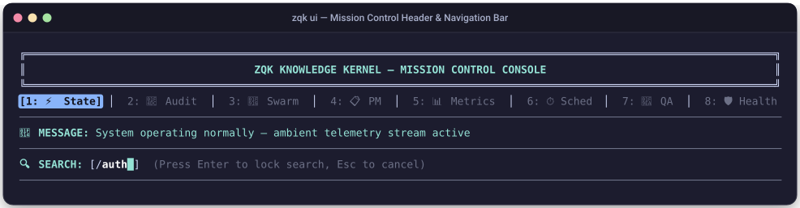
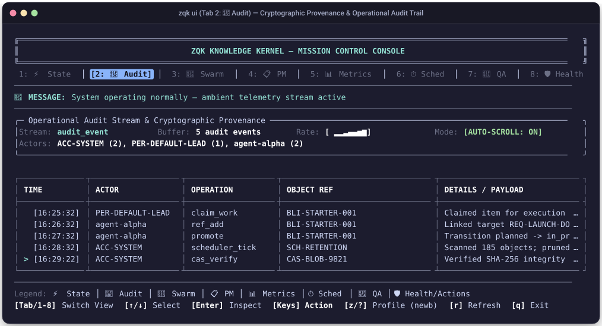
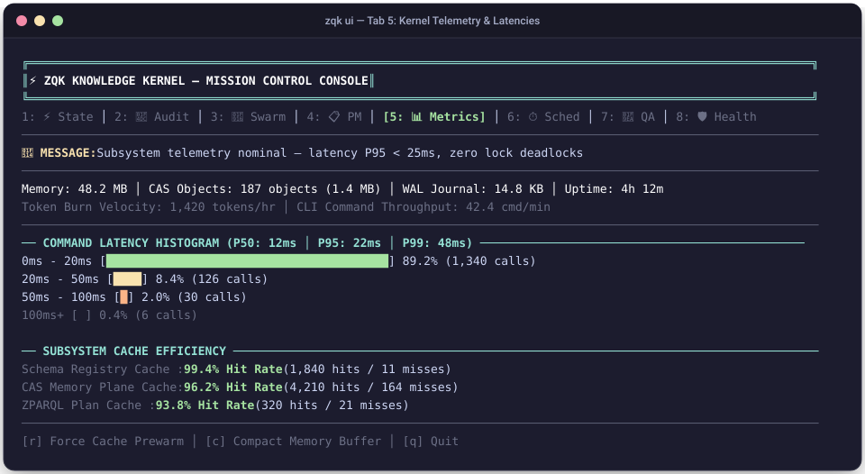
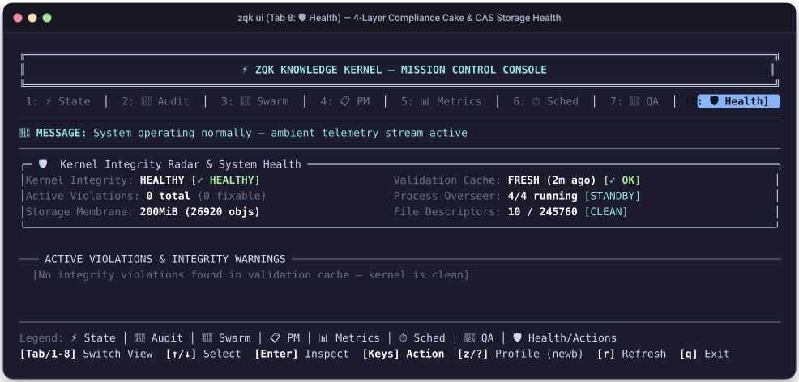
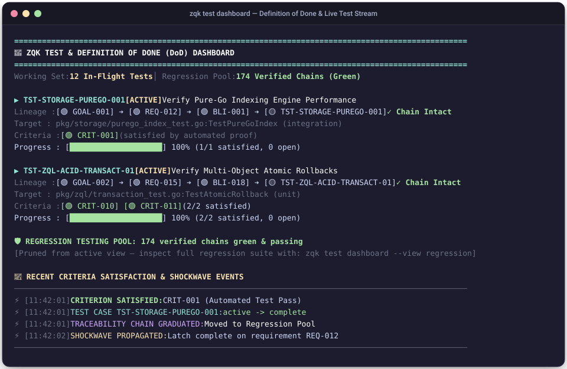
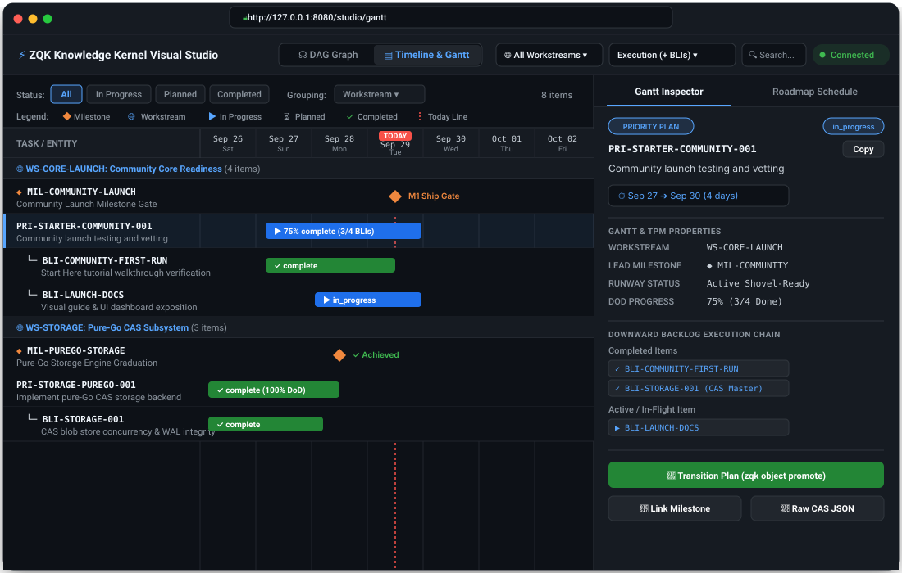
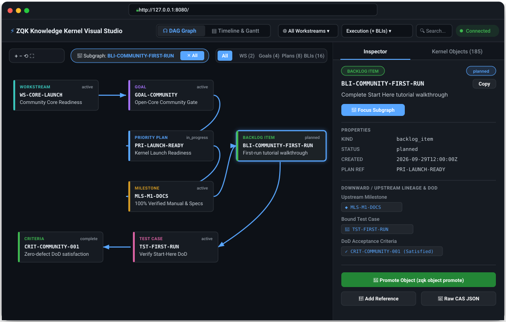

# Manual: Mission Control TUI, Web Studio & Diagnostics Visual Guide

This visual guide documents the full interface layout, visual components, interactive hotkeys, and data interpretations for the **ZQK Mission Control Console (`zqk ui`)**, **Visual Web Studio (`zqk ui -w`)**, and **Test Verification Dashboard (`zqk test dashboard`)**.

---

## 1. System Navigation & Header Anatomy

When launched in a terminal (`zqk ui`), Mission Control renders a responsive ANSI terminal user interface (TUI). 

### Visual Terminal Screenshot: Header & Navigation Bar

### Datapoint Breakdown & Operator Guidance:

| Datapoint / Component | Visual Format | Semantic Meaning | Why It Is Useful & Action Required |
| :--- | :--- | :--- | :--- |
| **Active Tab** | Reverse video `[1: ⚡ State]` | Indicates the currently active telemetry projection. | Use number keys `[1]`–`[8]` or `[Tab]` / `[Shift+Tab]` to cycle views instantly. |
| **Editor Profile** | `newb` / `pro` / `jedi` | Display density profile. Press `[z]` to cycle. | `newb` shows full borders; `pro` compresses into 1-line top bar; `jedi` maximizes screen rows for high-density monitors. |
| **Dynamic Message Line** | `🔔 MESSAGE: <status>` | Real-time ambient status accumulator and alert banner. | Green `✓` means normal; Yellow `⚡`/`⏳` indicates background compaction or sync; Red `✗` indicates blocked work or broken invariants. |
| **Interactive Search Buffer** | `🔍 SEARCH: [/<query>█]` | In-memory substring filter active across current tab rows. | Press `[/]` to enter search query, `[Enter]` to commit, `[n]`/`[N]` to jump between matches, `[Esc]` to clear. |

---

## 2. Tab 1: ⚡ State (Real-Time State Seismograph & Mutation Journal)

The State Tab provides a real-time seismograph of kernel mutations flowing through the change journal Write-Ahead Log (WAL).

### Visual Terminal Screenshot: Tab 1

### Datapoints & Diagnostics:
- **Rate Sparkline (`Rate: ▄▆█▇▅▃ `)**: Moving 60-second mutation frequency. Sudden tall bars indicate active batch ingestion or agent swarms committing work.
- **Active Plane**: Identifies whether the displayed view represents `PlaneDraft` (unverified agent workspace) or `PlanePromoted` (CAS authoritative master).
- **Auto-Scroll Mode**: When active (`[AUTO-SCROLL: ON]`), the viewport tracks the live stream tail. Press `[Space]` or `[↑]` to pause the stream and inspect past diffs without missing new records.
- **Event Badges**:
  - `[CREATE]`: New entity originated.
  - `[UPDATE]`: Scalar attribute or reference modified.
  - `[PROMOTE]`: Entity graduated across membrane from draft to CAS master.
  - `[LATCH]`: Acceptance criterion satisfied by an objective verification test.

---

## 3. Tab 2: 📜 Audit (Operational Audit Log & CAS Cryptographic Provenance)

The Audit Tab provides non-repudiable audit logs tracking which human or AI agent performed each action.

### Visual Terminal Screenshot: Tab 2

### Datapoints & Diagnostics:
- **Actor Breakdown**: Summarizes event volume by persona or system process (`ACC-SYSTEM`, `agent-alpha`, etc.). Unbalanced event distributions point to thrashing agents or runaway loops.
- **Operation Column**: Precise API verb executed.
- **Cryptographic Provenance**: Selecting any row and pressing `[Enter]` displays the full JSON cryptographic receipt: including parent hash, caller account ID, signature, and immutable timestamp.

---

## 4. Tab 3: 🤖 Swarm (Multi-Agent Swarm Topology & Seating)

The Swarm Tab visualizes running agent processes, seated roles, active task assignments, and message queues.

### Visual Terminal Screenshot: Tab 3

### Datapoints & Diagnostics:
- **Status Column**:
  - `IDLE`: Holon waiting for Shovel-Ready work. If runway > 0 and agents remain idle, verify agent seating with `zqk system agent-onboard`.
  - `EXECUTING`: Actively modifying workspace files within a claimed `BLI-*` envelope.
  - `VALIDATING`: Running tests (`zqk test run`) or waiting for VDS Done-Gate evaluation.
  - `BLOCKED`: Work is paused due to an unmet precondition or locked dependency.
- **Heartbeat Age**: Time since last ambient ping. Agents older than `60s` are flagged yellow; older than `180s` are highlighted in red as potentially hung.

---

## 5. Tab 4: 📋 PM (Gantt Matrix, Workstreams & Priority Plans)

The PM Tab displays the Technical Program Management (TPM) Gantt matrix and backlog status breakdown.

### Visual Terminal Screenshot: Tab 4

### Datapoints & Diagnostics:
- **Runway Depth**: Number of shovel-ready tasks with all prerequisites met. A runway depth `<= 1` triggers TPM replenishment warnings.
- **Priority Tier (`P0`–`P3`)**:
  - `P0`: Critical blocker. Halts ordinary grooming until resolved.
  - `P1`: Milestone core deliverable.
  - `P2`: Secondary polish and optimization.
  - `P3`: Hygiene, documentation formatting, housekeeping.

---

## 6. Tab 5: 📊 Metrics (Kernel Vitals & Subsystem Telemetry)

The Metrics Tab reports operational telemetry, execution latencies, and cache efficiency.

### Visual Terminal Screenshot: Tab 5

### Datapoints & Diagnostics:
- **Latency Histogram**: Tracks execution responsiveness. A shift in the P99 latency past 250ms indicates file lock contention or heavy unindexed query traversals.
- **Cache Hit Rates**: Low hit rates (<80%) on the Schema Registry indicate redundant spec reloading. Run `zqk system check` to verify index health.

---

## 7. Tab 6: ⏱️ Sched (Scheduler Daemons & Maintenance Jobs)

The Sched Tab monitors autonomous background jobs, self-healing timers, and retention sweeps.

### Visual Terminal Screenshot: Tab 6

### Datapoints & Diagnostics:
- **Daemon Health**: If the daemon displays `STOPPED`, background self-healing is suspended. Start it immediately using `zqk scheduler start`.
- **Status Badges**:
  - `[PASS]`: Execution completed within SLA and zero errors.
  - `[FAIL]`: Job failed. Selecting the row and pressing `[Enter]` displays error stack traces. Refer to runbook [`RB-SCH-001`](../runbooks/RB-SCH-001-SCHEDULER-DAEMON-TRIAGE.md).

---

## 8. Tab 7: 🧪 QA (Definition of Done & Verification Radar)

The QA Tab provides full downward traceability verification: proving every backlog item is grounded in verifiable test cases and acceptance criteria.

### Visual Terminal Screenshot: Tab 7

### Datapoints & Diagnostics:
- **DoD Compliance Score**: Percentage of active work units with closed acceptance criteria. Projects cannot be released if DoD compliance is below 100%.
- **Lineage Health (`✓ INTACT` vs `✗ BROKEN`)**:
  - `✓ INTACT`: Fully grounded from `Goal` ➔ `Requirement` ➔ `BLI` ➔ `TestCase` ➔ `Criteria`.
  - `✗ BROKEN`: Missing parent requirement or floating test case. Fails VDS Done-Gate.

---

## 9. Tab 8: 🛡️ Health (Kernel Storage & Membrane Integrity)

The Health Tab reports storage plane consistency, filesystem watcher health, and lock state.

### Visual Terminal Screenshot: Tab 8

### Datapoints & Diagnostics:
- **CAS Integrity**: Confirms every hash-addressed file in `.zqk/process/` matches its payload content. A mismatch indicates disk corruption; repair immediately with runbook [`RB-CAS-001`](../runbooks/RB-CAS-001-CAS-CORRUPTION-RECOVERY.md).
- **Integrity Score**: Measures strategic alignment between committed code and documented intent.

---

## 10. The Test Verification Dashboard (`zqk test dashboard`)

For dedicated CI/CD runs and local terminal verification, `zqk test dashboard --check-dod` provides a live stream of test execution and criteria latches.

### Visual Terminal Screenshot: Test Dashboard

### Key Elements & Interpretation:
1. **Target Line**: Specifies exact Go test function and execution scope (`unit`, `integration`, `e2e`).
2. **Criteria Pills (`[🟢 CRIT-*]`)**: Real-time representation of acceptance criteria. Green indicates verified; yellow indicates currently testing; white indicates unverified.
3. **Chain Graduation**: When all criteria in a test case are green, the entire chain automatically graduates into the **Regression Testing Pool**, preventing test output noise.

---

---

## 11. Visual Web Studio (`zqk ui -w` at http://127.0.0.1:8080)

When launched with the `-w` flag (`zqk ui -w`), ZQK starts a zero-dependency HTTP server embedded directly in the core binary, providing browser-based interactive exploration across two distinct projections:
1. **Chronological Timeline & Gantt Roadmap (`/studio/gantt`)**: Technical Program Management (TPM), milestone gates, swimlane groupings, and execution schedules.
2. **Ontology & Causal Dependency DAG Visualizer (`/studio/dag-visualizer`)**: Directed acyclic graph exploring upstream goals down to cryptographic acceptance criteria.

---

### 11.1 View 1: Timeline & Gantt Roadmap (`/studio/gantt`)

The Timeline & Gantt view projects the Knowledge Kernel's strategic roadmap along a continuous chronological timeline. It groups work by workstreams, anchors progress against the current day, and visualizes milestone delivery gates.

#### Visual Web Studio Screenshot: Timeline & Gantt View

#### Datapoint Breakdown & Operator Guidance:

| UI Component / Datapoint | Visual Location | Semantic Meaning | Diagnostic Value & Operator Action |
| :--- | :--- | :--- | :--- |
| **View Switcher Tabs** | Header (Center-Left) | Toggles between `☊ DAG Graph` and `▤ Timeline & Gantt`. | Click to switch instantly between topological graph view and chronological time projection without losing active node focus. |
| **Status Filter Pills** | Sub-Toolbar (Left) | Interactive status toggles: `[All]`, `[In Progress]`, `[Planned]`, `[Completed]`. | Filters visible Gantt rows. Click `[In Progress]` during daily standups to isolate active work units across all workstreams. |
| **Grouping Selector** | Sub-Toolbar (Center) | Dropdown menu: `Workstream`, `Priority Plan`, `Milestone`. | Restructures timeline swimlanes. Default `Workstream` groups tasks into top-level themes (`WS-CORE-LAUNCH`, `WS-STORAGE`). |
| **Task Counter** | Sub-Toolbar (Right) | Badge reporting visible item count (e.g. `8 items`). | Confirms the total quantity of roadmap entities matching active filter criteria. |
| **Interactive Legend Bar** | Top Bar | Defines visual markers: `◆ Milestone` (Orange), `🌐 Workstream` (Blue), `▶ In Progress` (Blue), `⏳ Planned` (Gray), `✓ Completed` (Green), `| Today Line` (Red). | Reference guide for reading roadmap entity types and completion states at a glance. |
| **Calendar Axis & Day Ticks** | Header Grid (Top) | Seven-day continuous calendar axis with weekday sub-labels (`Sep 26 Sat` to `Oct 02 Fri`). | Provides temporal grounding for work estimates. Grid columns expand proportionally across available browser viewport width. |
| **Vertical "Today" Line** | Full Canvas Height | High-contrast red dashed vertical line (`#f85149`) with `TODAY` badge at top. | Anchors current time. Items strictly to the left of the line represent past deliverables; items bisected by the line are in-flight; items to the right are future runway. |
| **Swimlane Section Headers** | Timeline Canvas | Dark container bars grouping related items (e.g. `🌐 WS-CORE-LAUNCH (4 items)`). | Visually segregates distinct architectural initiatives and displays aggregate task count per workstream. |
| **Milestone Diamond Markers** | Timeline Grid | High-visibility diamond glyphs (`◆` in `#f0883e`) aligned to deadline dates. | Critical strategic release gates (e.g. `MIL-COMMUNITY-LAUNCH`). Shows `✓ Achieved` when all constituent priority plans and criteria latch complete. |
| **Horizontal Gantt Progress Bars** | Timeline Grid | Rounded task bars spanning start date to target completion date. | Bar length reflects scheduled duration; inner text indicates completion percentage (e.g. `▶ 75% complete`) or state (`✓ complete`). |
| **Interactive Selection Highlight** | Timeline Row | Blue vertical accent bar and glowing background tint on selected row. | Clicking any row highlights its bar and automatically populates the right-hand **Gantt Inspector** drawer. |
| **Gantt Inspector Drawer** | Right Sidebar (372px) | Expandable detail panel showing selected entity's metadata, duration, parent milestone, downward backlog chain, and action buttons. | Click `🚀 Transition Plan` to graduate states (`zqk object promote`), `🔗 Link Milestone` to mutate relations, or `📜 Raw CAS JSON` to audit cryptographic hashes. |

---

### 11.2 View 2: Ontology DAG Dependency Graph (`/studio/dag-visualizer`)

The DAG Dependency Graph view maps the causal dependency chain linking strategic intentions down to automated test latches.

#### Visual Web Studio Screenshot: Ontology DAG Visualizer

#### Datapoint Breakdown & Operator Guidance:

| UI Component / Datapoint | Visual Location | Semantic Meaning | Diagnostic Value & Operator Action |
| :--- | :--- | :--- | :--- |
| **Directed Bezier Splines** | DAG Canvas | Smooth cubic Bezier curves (`M... C...`) with directional arrowheads. | Traces causal influence from upstream goals (`GOAL-*`) through requirements (`REQ-*`), priority plans (`PRI-*`), and backlog items (`BLI-*`) down to test cases (`TST-*`) and acceptance criteria (`CRIT-*`). |
| **Node Kind Color Palette** | Canvas Nodes | Color-coded entity card borders: |
| | • `WORKSTREAM` (`#39c5bb` Teal) | Top-level architectural themes and program boundaries. |
| | • `GOAL` (`#a371f7` Purple) | Strategic product and engineering business objectives. |
| | • `PRIORITY PLAN` (`#58a6ff` Blue) | Groomed, shovel-ready milestones scheduled for execution. |
| | • `BACKLOG ITEM` (`#3fb950` Green) | Discrete units of work claimed and executed by agents. |
| | • `TEST CASE` (`#db61a2` Pink) | Executable automated verification suites. |
| | • `CRITERIA` (`#3fb950` Emerald) | Objective Definition of Done (DoD) verification latches. |
| **Subgraph Focus Banner** | Top-Center Toolbar | Pill indicator: `🎯 Subgraph: <id>` with `✕ All` reset button. | Isolates the complete upstream and downstream causal ancestry of any selected node, hiding visual noise from unrelated subsystems. |
| **Kind Visibility Filter Chips** | Top-Right Toolbar | Multi-select chips: `All`, `WS`, `Goals`, `Plans`, `BLIs`. | Filters graph density to focus on strategic layers (Goals/Plans) or operational layers (BLIs/Tests/Criteria). |
| **Canvas Pan & Zoom Controls** | Top-Left Toolbar | `+` (Zoom In), `−` (Zoom Out), `⟲` (Reset Zoom), `⛶` (Fit to Window). | Navigates large-scale knowledge kernel graphs containing hundreds of connected entities. |
| **Schema & Lineage Side Drawer** | Right Sidebar (372px) | Authoritative object inspection showing kind, status, timestamps, upstream/downstream refs, and one-click CLI mutation actions. | Inspects SHA-256 CAS payload integrity and triggers atomic lifecycle transitions without leaving the browser. |

---

## 12. Operator Quick Cheatsheet

| Command | Action | Primary Output |
| :--- | :--- | :--- |
| `zqk ui` | Launch full Mission Control TUI console | 8-tab interactive terminal interface |
| `zqk ui -w` | Start local visual Web Studio | Web browser at `http://127.0.0.1:8080` |
| `zqk ui --tab qa` | Launch directly into QA DoD radar | Vitals card, test matrix, and criteria bars |
| `zqk test dashboard` | Terminal test verification dashboard | Active test cards and WAL shockwave stream |
| `zqk test dashboard --check-dod` | Verify 100% Definition of Done | Fails closed (exit code 1) if criteria open |
| `zqk state stream --dashboard` | Stream real-time mutations | Visual ANSI seismograph with auto-scroll |
| `zqk object inspect <kind> [id]` | Deep object inspection | TUI radar, CAS profile, and Policy Studio |
