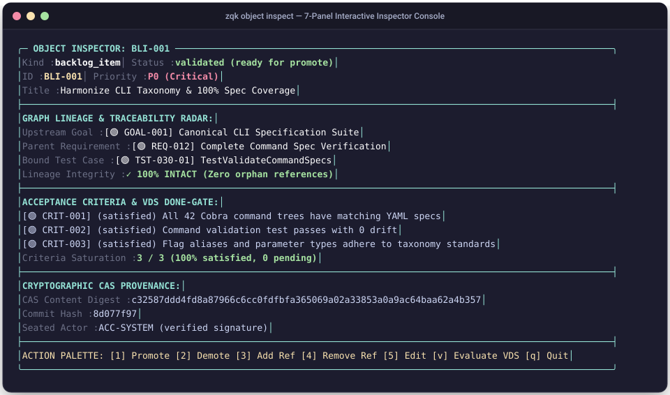

# Manual: Object Inspector & Policy Studio Reference

This reference manual documents the architecture, visual displays, CLI commands, interaction models, and configuration flags for the **ZQK Object Inspector (`zqk object inspect`)**, **Policy Rule Studio**, and **Object Relationship & Mutation Engines**.

---

## 1. Overview & Dual-Audience Architecture

The ZQK Object Inspector solves the tension between machine density and human ergonomics when interacting with the Knowledge Kernel:

```
                      ┌─────────────────────────────────────────┐
                      │          Knowledge Kernel CAS           │
                      │  (Objects, Traits, Lineage, Policies)   │
                      └────────────────────┬────────────────────┘
                                           │
                    ┌──────────────────────┴──────────────────────┐
                    ▼                                             ▼
       ┌────────────────────────┐                    ┌────────────────────────┐
       │   Machine Projection   │                    │    Human TDS Console   │
       │   `--format json`      │                    │     `--format table`   │
       ├────────────────────────┤                    ├────────────────────────┤
       │ • Reduced semantic JSON│                    │ • TDS Panels & Tables  │
       │ • Essential attributes │                    │ • Vim Nav (j/k/g/G)    │
       │ • Compact lineage IDs  │                    │ • Dynamic Message Line │
       │ • Zero token bloat     │                    │ • Deep Drill-Down ([⏎])│
       │ • Machine parseable    │                    │ • Policy Studio ([p])  │
       └────────────────────────┘                    └────────────────────────┘
```

---

## 2. Main Object Inspector View (`zqk object inspect`)

When launched without a single ID, `zqk object inspect [kind]` displays the full-screen terminal scoreboard:

### Visual Terminal Screenshot: Main Inspector Table
```
╔═══════════════════════════════════════════════════════════════════════════════════════════════════════════════╗
║                             🔎 ZQK KNOWLEDGE KERNEL — OBJECT INSPECTOR CONSOLE                                ║
╚═══════════════════════════════════════════════════════════════════════════════════════════════════════════════╝
KIND: [backlog_item]  │  FILTER: [ALL] [ACTIVE] [DRAFT] [BLOCKED] [COMPLETE]  │  SORT: [updated_at ▼]
─────────────────────────────────────────────────────────────────────────────────────────────────────────────────
🔍 SEARCH: [/cas█]  (Press Enter to lock search, Esc to cancel)
─────────────────────────────────────────────────────────────────────────────────────────────────────────────────
  ID                     │ STATUS      │ PRI │ TITLE                                       │ UPDATED
─────────────────────────────────────────────────────────────────────────────────────────────────────────────────
> BLI-STORAGE-PUREGO-001 │ complete    │ P0  │ Implement pure-Go CAS storage backend       │ 2m ago
  BLI-STORAGE-PUREGO-002 │ complete    │ P1  │ Wire change journal dictionary compaction   │ 14m ago
  BLI-LAUNCH-DOCS-001    │ in_progress │ P0  │ Comprehensive visual UI & mutation manual   │ 1m ago
  BLI-ONBOARD-ROADMAP-01 │ planned     │ P1  │ Greenfield onboarding roadmap seed          │ 45m ago
  BLI-ECOSYSTEM-SYNC-001 │ blocked     │ P2  │ Linear/GitHub bidirectional bridge          │ 2h ago
─────────────────────────────────────────────────────────────────────────────────────────────────────────────────
[Enter] Deep Inspection Modal │ [Tab] Next Kind │ [f] Filter │ [s] Sort │ [p] Policy Studio │ [q] Quit
```

### Visual Component Breakdown:

| Visual Element | User Action / Keybinding | Description & Purpose |
| :--- | :--- | :--- |
| **Kind Selector** | `[Tab]` / `[Shift+Tab]` | Cycles between registered ontology kinds (`backlog_item`, `requirement`, `criteria`, `test_case`, `priority_plan`, `goal`, `policy`). |
| **Filter Pills** | `[f]` | Toggles between active view filters: `[ALL]`, `[ACTIVE]`, `[DRAFT]`, `[BLOCKED]`, `[COMPLETE]`, and `[MINE]`. |
| **Sort Key** | `[s]` | Cycles sort order: `updated_at`, `created_at`, `id`, `priority`, `status`, `title`. |
| **Selection Cursor** | `[j]/[k]` or `[↓]/[↑]` | Moves the highlighted row cursor `>`. |
| **Search Buffer** | `[/]` | Filters rows interactively in real time. Use `[n]`/`[N]` to cycle through matches. |

---

## 3. Deep Object Inspection Modal (`[Enter]`)

Pressing `[Enter]` on any row opens the deep inspection modal, decomposing raw YAML into standardized visual modules:

### Visual Terminal Screenshot: Deep Inspection Modal



```
┌────────────────────────────────────────────────────────────────────────────────────────────────────────┐
│ 🔎 OBJECT INSPECTION MODAL — [BLI-STORAGE-PUREGO-001]                                                  │
├────────────────────────────────────────────────────────────────────────────────────────────────────────┤
│ Title       : Implement pure-Go CAS storage backend                                                    │
│ Kind        : backlog_item │ Status: [complete] │ Priority: P0 │ Claimed: ACC-SYSTEM                   │
├────────────────────────────────────────────────────────────────────────────────────────────────────────┤
│ ─── 🧭 MODULE 1: LINEAGE & TRACEABILITY RADAR ───────────────────────────────────────────────────────── │
│   Goal        : [🟢 GOAL-STORAGE-MODERNIZATION-PUREGO]                                                 │
│   Requirement : [🟢 REQ-STORAGE-PUREGO-EMBEDDED-001]                                                  │
│   Backlog Item: [🟢 BLI-STORAGE-PUREGO-EMBEDDED-001]                                                  │
│   Test Case   : [🟢 TST-STORAGE-PUREGO-001] (integration)                                              │
│   Criteria    : [🟢 CRIT-STORAGE-PUREGO-EMBEDDED-001] (satisfied)                                      │
│   Integrity   : [✓ CHAIN INTACT: 100% grounded up to root goal]                                        │
├────────────────────────────────────────────────────────────────────────────────────────────────────────┤
│ ─── 🛡️ MODULE 2: CAS STORAGE & CRYPTOGRAPHIC HYGIENE ─────────────────────────────────────────────────── │
│   Storage Plane  : PlanePromoted (CAS Master)                                                          │
│   Content Hash   : e3b0c44298fc1c149afbf4c8996fb92427ae41e4649b934ca495991b7852b855                  │
│   Storage Path   : .zqk/process/backlog_item/BLI-STORAGE-PUREGO-001.yaml                               │
│   CAS Byte Size  : 1,420 bytes │ File Permissions: 0644 │ Revision ETag: rev_84920                     │
│   Last Mutation  : 2026-09-29T11:42:01Z by ACC-SYSTEM                                                  │
├────────────────────────────────────────────────────────────────────────────────────────────────────────┤
│ ─── ⚡ MODULE 3: ROLE-GATED ACTION PALETTE ───────────────────────────────────────────────────────────── │
│   [p] Promote Status   [d] Demote Status   [r] Add Reference   [x] Remove Ref   [e] Edit ($EDITOR)     │
│   [c] Claim Work       [u] Unclaim Work    [k] Park Object     [Esc] Close Modal                       │
└────────────────────────────────────────────────────────────────────────────────────────────────────────┘
```

### Datapoints & Module Details:
1. **Module 1 (Lineage Radar)**: Traces the upward root chain (`Goal` ➔ `Requirement`) and downward bindings (`TestCase` ➔ `Criteria`). The integrity badge confirms whether the object is valid for release.
2. **Module 2 (CAS Storage & Provenance)**: Displays Content-Addressed Storage SHA-256 hash, storage plane, byte footprint, and cryptographic mutator audit trail.
3. **Module 3 (Action Palette)**: Allows immediate execution of lifecycle transitions and reference mutations directly from the keyboard without exiting the inspector.

---

## 4. Live Policy Rule Studio (`[p]` or `--policy-studio`)

Writing validation rules in raw YAML is error-prone. The **Policy Rule Studio** turns policy authoring and validation testing into an interactive, fail-closed IDE experience.

### Visual Terminal Screenshot: Policy Studio
```
┌────────────────────────────────────────────────────────────────────────────────────────────────────────┐
│ 🛡️  ZQK POLICY RULE STUDIO — [Policy: POL-TRACEABILITY-DoD-001]                                         │
├────────────────────────────────────────────────────────────────────────────────────────────────────────┤
│ Target Object Kind : [ backlog_item ]                                                                  │
│ Field Expression   : [ status == "complete" => len(requirement_refs) > 0 && criteria.all_satisfied ]  │
├────────────────────────────────────────────────────────────────────────────────────────────────────────┤
│ ─── LIVE DRY-RUN EVALUATION MATRIX (Evaluated across 43 active repository objects) ──────────────────── │
│ PASS: 43 objects (100.0%) │ VIOLATIONS: 0 objects (0.0%)                                               │
│ Status: [✓ DEFINITION OF DONE SATISFIED — ZERO DRIFT DETECTED]                                         │
├────────────────────────────────────────────────────────────────────────────────────────────────────────┤
│ ─── AUTOCLUSIVE SUGGESTIONS & AUTOCOMPLETE ──────────────────────────────────────────────────────────── │
│ Available Tokens   : status, priority, requirement_refs, criteria_refs, title, claimed_by             │
│ Valid Operators    : ==, !=, >, <, in, matches_regex, all_satisfied, len()                             │
├────────────────────────────────────────────────────────────────────────────────────────────────────────┤
│ [c] Edit Condition │ [t] Test Expression │ [s] Save Policy │ [Esc] Return to Table View                │
└────────────────────────────────────────────────────────────────────────────────────────────────────────┘
```

### Hotkeys & Workflows:
- `[c]`: Enter **DSL Edit Mode**. Type predicate conditions with syntax checking.
- `[Tab]`: Trigger context-aware autocompletion for schema fields and enum values.
- `[t]`: Run immediate dry-run evaluation across all repository objects without disk mutations.
- `[s]`: Save and promote policy to `.zqk/process/policy/`.

---

## 5. Modern vs. Legacy Mutation Commands Reference

Always prefer first-class, schema-aware CLI verbs over unstructured scalar `--field` modifications.

### Comparison Table:

| Operation | 🌟 Preferred Modern Command | ⚠️ Legacy / Unstructured Fallback | Rationale & Safety |
| :--- | :--- | :--- | :--- |
| **Add References** | `zqk object ref add <SRC> <TARG>` | `zqk object update <SRC> --field "<k>_refs=<ID>"` | Validates target existence, deduplicates, prevents cycles. |
| **Remove References** | `zqk object ref remove <SRC> <TARG>` | `zqk object update <SRC> --field "<k>_refs=..."` | Safely prunes graph edges without array parsing syntax bugs. |
| **Promote Lifecycle** | `zqk object promote <ID>` | `zqk object update <ID> --field status=<ST>` | Enforces FSM check-valves, criteria latches, and emits shockwaves. |
| **Demote Lifecycle** | `zqk object demote <ID>` | `zqk object update <ID> --field status=<ST>` | Validates backward transition rules and dependency unlinking. |
| **Park Object** | `zqk object park <ID>` | `zqk object update <ID> --field status=parked` | Validates graceful retirement along an intentional exit path. |
| **Scalar Field Edits** | `zqk object update <ID> --field k=v` | Raw file editing on disk | Intended strictly for scalar fields (`title`, `description`, `body`). |

---

## 6. CLI Command Flags

```bash
# Full interactive TUI
zqk object inspect backlog_item

# Inspect specific object instance
zqk object inspect backlog_item BLI-001

# Autonomous agent semantic projection (token-efficient JSON)
zqk object inspect backlog_item BLI-001 -f json

# Launch directly into Policy Studio
zqk object inspect backlog_item --policy-studio
```

| Flag | Short | Default | Description |
| :--- | :---: | :---: | :--- |
| `--kind` | `-k` | `backlog_item` | Target object kind to inspect. |
| `--id` | | `""` | Optional specific object ID to inspect directly. |
| `--fields` | | `""` | Comma-separated field projections (e.g. `id:30,title:40`). |
| `--filter` | | `""` | Filter predicate expression (e.g. `status=active`). |
| `--sort-by` | | `updated_at` | Field key to sort objects by. |
| `--sort-asc`| | `false` | Sort in ascending order (default: descending). |
| `--policy-studio`| `-p` | `false` | Launch directly into live Policy Rule Studio. |
| `--format` | `-f` | `table` | Output format (`table`, `json`, `jsonl`, `yaml`). |
