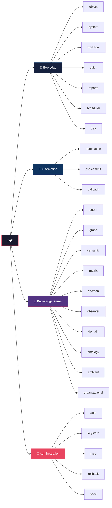
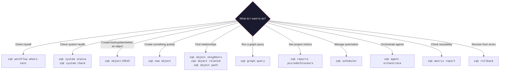

# ZQK CLI Command Taxonomy & Operations Reference

> **Purpose:** This reference teaches humans and AI agents *which CLI command to use* for any given task. It's the companion to the [Object Taxonomy Reference](OBJECT_TAXONOMY_REFERENCE.md) — that doc tells you *what objects to create*; this doc tells you *how to operate on them*.
>
> **Audience:** New agents onboarding, human operators, anyone asking "which command do I run?"

---

## Command Surface Map



## The 4 Command Surfaces

| Surface | Commands | Audience | Purpose |
|:---|:---|:---|:---|
| **🔧 Everyday** | `object`, `system`, `workflow`, `grep` (`zgrep`), `quick`, `reports`, `scheduler`, `tray`, `new` | All users | Day-to-day operations — CRUD, search, health, workflow |
| **⚡ Automation** | `automation`, `pre-commit`, `callback` | CI/CD, hooks | Git hooks, CI pipelines, automated checks |
| **🧠 Knowledge Kernel** | `agent`, `graph`, `semantic`, `matrix`, `docman`, `observer`, `domain`, `ontology`, `ambient`, `organizational`, `mesh` | Advanced operators | Graph queries, agent orchestration, semantic analysis |
| **🔐 Administration** | `auth`, `keystore`, `mcp`, `rollback`, `spec`, `version` | Admins, system ops | Authentication, key management, system recovery |

---

## Global Flags (Available on All Commands)

| Flag | Purpose | Example |
|:---|:---|:---|
| `--context` | Context profile: `ai-agent`, `human`, `debug` | `--context ai-agent` |
| `--format` / `-f` | Output format: `table`, `json`, `jsonl`, `yaml`, `csv`, `json-rpc`, `stream` | `-f json` |
| `--timeout` | Command timeout (0 = auto-calculate) | `--timeout 30s` |
| `--cpuprofile` | Write CPU profile to file | (debugging only) |

> [!TIP]
> **For agents:** Always use `--context ai-agent` — it sets machine-parseable defaults and suppresses interactive prompts.

---

## 🔧 Everyday Commands

### `zqk new` — Simple Object Instantiation
> *The preferred way to create objects interactively or simply without rigid arguments.*

| Subcommand | Purpose | Example |
| `new object <kind> --title "..."` | Mint a new object onto the draft plane (`.zqk/object_drafts/`) | `zqk new object backlog_item --title "Implement X"` |

### `zqk object` — Object CRUD & Lifecycle Operations
> *The workhorse. Every object interaction starts here.*
> **⚠️ IMPORTANT:** Avoid writing shell loops to do one-by-one updates! ALWAYS use batch commands instead of looping scripts.

| Subcommand | Purpose | Example |
|:---|:---|:---|
| `list <kind>` | List objects by kind with optional filters | `zqk object list backlog_item --filter status=in_progress` |
| `get <id>` | Retrieve a single object by ID | `zqk object get BLI-626` |
| `update <id>` | Update fields on an existing object via file or fields | `zqk object update BLI-626 --file update.yaml` |
| `promote <id>` | Advance object lifecycle stage (canonical state transition) | `zqk object promote BLI-626` |
| `demote <id>` | Revert object lifecycle stage to previous valid state | `zqk object demote BLI-626` |
| `delete <id>` | Delete an object by ID | `zqk object delete BLI-626` |
| `count <kind>` | Count objects of a kind | `zqk object count priority_plan` |
| `<kind> fields` | Show the field schema for a kind | `zqk object backlog_item fields` |
| `template <kind>` | Generate a blank YAML template | `zqk object template requirement --output tmp.yaml` |
| `bulk create` | 🔥 **RECOMMENDED:** Create multiple objects from a YAML file | `zqk object bulk create backlog_item --file items.yaml` |
| `bulk update` | 🔥 **RECOMMENDED:** Update multiple objects at once | `zqk object bulk update --file updates.yaml` |
| `export` | Export objects to YAML/JSON | `zqk object export goal --format yaml` |
| `import` | Import objects from file | `zqk object import --file backup.yaml` |
| `neighbors <id>` | Find objects directly linked to an object (depth=1) | `zqk object neighbors GOAL-001` |
| `related <id>` | Find objects related via reference fields | `zqk object related BLI-626` |
| `path <from> <to>` | Find a reference path between two objects | `zqk object path VIS-001 BLI-626` |
| `pplan` | Priority plan navigation (current, next, prev) | `zqk object pplan current` |
| `splan` | Strategic plan operations | `zqk object splan` |
| `rename <id>` | Change an object's ID | `zqk object rename OLD-ID --to NEW-ID` |
| `move <id>` | Move an object to a different kind/directory | `zqk object move <id>` |

**Key `list` flags:**

| Flag | Purpose | Example |
|:---|:---|:---|
| `--filter` | Filter by field value (repeatable) | `--filter status=active --filter priority_tier=P0` |
| `--format` | Output format | `--format json` |
| `--all` | Show all (with `update`) | `--all --kind backlog_item` |

**Key `update` flags:**

| Flag | Purpose | Example |
|:---|:---|:---|
| `--field` | Set a field (repeatable) | `--field status=complete --field note="Done"` |
| `--auto-status` | Advance to next valid lifecycle state | `--auto-status` |
| `--override` | Force lifecycle-protected changes | `--override --reason-code hotfix` |
| `--reason-code` | Required with `--override` | `--reason-code migration` |
| `--add-ref` | Add a reference | `--add-ref milestone_refs=MIL-001` |
| `--remove-ref` | Remove a reference | `--remove-ref milestone_refs=MIL-001` |
| `--dry-run` | Preview without applying | `--dry-run` |
| `--unset-field` | Remove a field entirely | `--unset-field obsolete_field` |

> [!IMPORTANT]
> **Never edit YAML files in `.zqk/process/` directly.** Always use `zqk object` commands. The YAML files in `.zqk/process/` are gitignored runtime data managed by the storage engine. Direct edits bypass lifecycle enforcement, validation, and audit trails.
>
> See: [Object Taxonomy Reference — Anti-Patterns](OBJECT_TAXONOMY_REFERENCE.md#common-anti-patterns)

---

### `zqk grep` (alias: `zgrep`) — In-Process Trigram & Go AST Code Search
> *Fast in-process pure-Go code search engine with trigram indexing, Go AST structural queries, and token-budgeted JSON output for AI agents.*

| Query Pattern | Purpose | Example |
|:---|:---|:---|
| Literal search | Sub-15ms fast literal text scan | `zqk grep 'MaterializedView'` |
| Case-insensitive | Ignore case across project files | `zqk grep -i 'wal_subscriber'` |
| Regex search | Full regex pattern matching | `zqk grep -e 'func.*Start\('` |
| AST Structs | Discover all Go struct declarations | `zqk grep --ast --kind struct` |
| AST Interfaces | Discover all Go interface declarations | `zqk grep --ast --kind interface` |
| AST Functions | Discover all top-level functions | `zqk grep --ast --kind func` |
| AST Receiver | Discover methods bound to a specific struct/type | `zqk grep --ast --recv Engine` |
| Token Budgeted | Constrain payload tokens and format as JSON for agents | `zqk grep 'error' --max-tokens 2000 -f json` |
| Context Lines | View surrounding context lines | `zqk grep 'NewEngine' -C 3` |
| Extension Filter | Filter by file extensions | `zqk grep 'config' --ext .go,.yaml` |

---

### `zqk system` — System Health & Maintenance
> *Project health, validation, and system administration.*

| Subcommand | Purpose | When to Use |
|:---|:---|:---|
| `status` | Show current project status and active priority plan | Every session start |
| `check` | Object health: registration, lifecycle, policy compliance | Before commits, during audits |
| `validate` | Validate object integrity | After bulk operations |
| `align --gaps` | Find strategic alignment gaps (goals without work) | Planning sessions |
| `init` | Initialize a new ZQK project | First-time setup only |
| `sync` | Synchronize system state | After migrations |
| `clean-branches` | Prune stale merged feature branches | Periodic maintenance |
| `cleanup-duplicates` | Find and remove duplicate objects | After bulk imports |
| `audit-report` | Generate audit report from command metrics | Reviews |
| `audit-stream` | Stream real-time audit events | Monitoring |
| `dashboard` | System dashboard | Overview |
| `evolve` | System evolution management | Upgrades |
| `ensure-retention-jobs` | Create maintenance scheduler jobs | Initial setup |
| `generate-agent-configs` | Generate AGENTS.md, .cursorrules, etc. | After config changes |
| `generate-command-builders` | Generate Go builders from command specs | Development |
| `generate-api-builders` | Generate API spec builders | Development |

---

### `zqk workflow` — Workflow Guidance
> *"What should I work on next?"*

| Subcommand | Purpose | When to Use |
|:---|:---|:---|
| `whats-next` | Composite view: priority plan + backlog + convergence | **Session start** — the primary orientation command |
| `next` | Deterministic next workflow action | When an agent needs a single action |

> [!TIP]
> **Agent boot protocol:** Every new agent session should begin with `zqk workflow whats-next` to self-orient. This is defined in the [Agent Boot Protocol](../../.agents/AGENTS.md).

---

### `zqk new object` — Rapid Object Creation
> *Create common objects from text or files without YAML ceremony.*

| Subcommand | Purpose | Example |
|:---|:---|:---|
| `backlog-item` | Create BLI from file or content | `zqk new object backlog-item --file=notes.md` |
| `decision` | Create decision/ADR from content | `zqk new object decision --content="Use Redis for cache"` |
| `question` | Create question with optional answer | `zqk new object question --content="How do we deploy?"` |
| `bundle` | Create BLI + criteria + agent tasks as a batch | `zqk new object bundle --file=bundle.yaml` |

---

### `zqk reports` — Metrics Reports
> *Project confidence, effort distribution, and blockers.*

| Subcommand | Purpose | Metrics |
|:---|:---|:---|
| `pcs` | **Project Confidence Score** — overall health metric | Aggregated from object completeness |
| `edd` | **Effort Distribution Discrepancy** — are we spending time on the right things? | Compares actual vs. planned effort |
| `blockers` | **Dependencies & Blockers (D&B)** — what's stuck? | Lists active blockers and dependencies |
| `quick --preset` | Quick report from presets | `--preset questions`, `--preset milestones-overdue` |

---

### `zqk scheduler` — Job Scheduling
> *Manage automated recurring work.*

| Subcommand | Purpose | When to Use |
|:---|:---|:---|
| `start` | Start the scheduler daemon | System startup |
| `stop` | Stop the scheduler daemon | System shutdown |
| `status` | Show daemon status | Health checks |
| `list` | List all scheduler jobs | Reviewing automation |
| `activity` | Show recent job activity | Debugging |
| `history` | Execution history summary | Performance review |
| `events` | Health view over metrics summary | Monitoring |
| `health-check` | External health check | Uptime monitoring |
| `issues` | Show scheduler issues | Debugging |
| `clear-issues` | Clear resolved issues | After fixing |
| `config` | Show/set config (e.g., `jobs_paused`) | Operations |
| `scan-tests` | Scan and schedule test runs | CI setup |
| `convergence` | Convergence measurement (test bundles, rollup) | Quality tracking |
| `skip-window` | Bulk skip jobs until a time | Maintenance windows |
| `state` | State-file health summary | Diagnostics |

---

### `zqk new` — Template Generation
> *Generate draft YAML templates for creation.*

| Subcommand | Purpose |
|:---|:---|
| `object <kind>` | Draft template for any object kind |
| `bundle` | Draft scenario bundle |
| `object-spec` | Draft object kind spec YAML |
| `internal <kind>` | Draft internal object template |

---

### `zqk tray` — Named Shortcuts
> *Configurable named shortcuts to zqk subcommands.*

| Subcommand | Purpose | Example |
|:---|:---|:---|
| `list` | List all tray entries | `zqk tray list` |
| `show <name>` | Show a tray entry's config | `zqk tray show scheduler-status` |
| `run <name>` | Execute a tray entry | `zqk tray run scheduler-status` |
| `explain <name>` | Print the underlying command | `zqk tray explain scheduler-status` |

---

## ⚡ Automation Commands

### `zqk pre-commit` — Git Pre-Commit Integration
> *Background check results for pre-commit hooks.*

| Subcommand | Purpose |
|:---|:---|
| `aggregate` | Merge category results into `results.json` |
| `status` | Show results status and required actions |
| `clear` | Clear results after resolving blockers |
| `write-result` | Write a category result file |
| `lint-report` | Show last lint output for creating BLIs |
| `policy-report` | Show policy check output |
| `integrity-report` | Show integrity check output |

### `zqk automation` — CI/CD & Integration

| Subcommand | Purpose |
|:---|:---|
| `docman-sync` | Sync documentation registration | 
| `lint-bypass-audit` | Create audit event for lint bypasses |

### `zqk callback` — Scheduler Callbacks

Handles scheduler job callbacks and notifications.

---

## 🧠 Knowledge Kernel Commands

### `zqk agent` — Multi-Agent Orchestration
> *Route, execute, and manage agent tasks.*

| Subcommand | Purpose | When to Use |
|:---|:---|:---|
| `orchestrate` | Route tasks from a priority plan to sub-agents | Starting a plan execution |
| `execute` | Execute a specific agent task | Manual task execution |
| `next` | Push agent task to next lifecycle state | Task progression |
| `status` | Visualize active hive state | Monitoring agents |
| `evaluate-run` | Evaluate a completed prompt run | Post-execution analysis |
| `recover` | Recover failed agent tasks | Error handling |
| `sync-loop` | Run the Graph-State Sync Loop | State synchronization |
| `synthesize-skill` | Generate an agent skill definition | Skill creation |

### `zqk graph` — Graph Operations
> *Direct graph queries and relationship discovery.*

| Subcommand | Purpose | Example |
|:---|:---|:---|
| `query` | Run raw graph queries (Cypher) | `zqk graph query "MATCH (n:BacklogItem) RETURN n LIMIT 5"` |
| `discover` | Discover object relationships | `zqk graph discover` |

### `zqk semantic` — Semantic Analysis

| Subcommand | Purpose |
|:---|:---|
| `assess` | Assess semantic maturity level |
| `infer` | Run semantic inference |
| `recommend` | Recommend next semantic steps |

### `zqk matrix` — Traceability Matrices

| Subcommand | Purpose | Example |
|:---|:---|:---|
| `list` | List named matrices | `zqk matrix list` |
| `report` | Summarize a matrix (gates, completions) | `zqk matrix report --name test_bundle` |
| `get` | Get rows matching filters | `zqk matrix get --filter fully_vetted=pending` |
| `update` | Update matrix rows | `zqk matrix update --set fully_vetted=yes` |
| `validate` | Validate matrix registry entries | `zqk matrix validate` |

### `zqk docman` — Documentation Management

| Subcommand | Purpose |
|:---|:---|
| `register` | Discover and register docs as `doc_entry` objects |

### `zqk observer` — Code Analysis

| Subcommand | Purpose |
|:---|:---|
| `extract` | Extract code entities (Go AST) |
| `populate` | Extract and populate the knowledge graph |
| `coach` | Generate dynamic workflow tips |

### `zqk organizational` — Org Structure

| Subcommand | Purpose |
|:---|:---|
| `sync` | Sync org structure from file into ZQK |
| `record-change` | Record an organizational change |
| `analyze-impact` | Analyze change impact on ZQK objects |
| `propagate` | Propagate org change to affected objects |

### Other Knowledge Commands

| Command | Purpose |
|:---|:---|
| `zqk domain discover` | Discover registered domain ontologies |
| `zqk domain register` | Register a domain ontology |
| `zqk ontology import` | Import ontology from RDF/OWL |
| `zqk ambient status` | Report ambient EventHub status |
| `zqk mesh advertise/lease/market` | Federated mesh operations |

---

## 🔐 Administration Commands

### `zqk auth` — Authentication

| Subcommand | Purpose |
|:---|:---|
| `login` | Create/reuse a CLI session |
| `logout` | End session, clear state |

### `zqk keystore` — Key Management

Keystore operations: create, list, rotate keys.

### `zqk mcp` — Model Context Protocol

| Subcommand | Purpose |
|:---|:---|
| `serve` | Start the MCP server |
| `list-tools` | List available MCP tools |

### `zqk rollback` — System Recovery

| Subcommand | Purpose |
|:---|:---|
| `list` | List rollback points |
| `apply` | Restore object states from snapshot |
| `reconstruct` | Reconstruct states at a timestamp |
| `retain` | Trim rollback store |

### `zqk spec` — Object Specifications

| Subcommand | Purpose |
|:---|:---|
| `list` | List available object specifications |

---

## Decision Tree: "Which Command Do I Run?"



---

## Common Workflows

### 1. New Agent Session Boot
```bash
zqk workflow whats-next                    # Orient: what's the current plan?
zqk system status                          # Health check
zqk object list backlog_item \
  --filter status=in_progress              # See active work
```

### 2. Create a Goal → Requirements → BLIs Pipeline
```bash
# 1. Mint criteria onto draft plane
zqk new object criteria --title "CLI supports --group-by flag"
# Note the ID (e.g. CRIT-xxx), update fields, and promote:
zqk object update CRIT-xxx --field 'category=functional'
zqk object promote CRIT-xxx

# 2. Mint requirement linked to goal and criteria
zqk new object requirement --title "Group-By Aggregation"
zqk object update REQ-xxx --field 'goal_refs=["GOAL-001"]' --field 'criteria_refs=["CRIT-xxx"]'
zqk object promote REQ-xxx

# 3. Mint backlog item linked to requirement and plan
zqk new object backlog_item --title "Implement --group-by flag"
zqk object update BLI-xxx --field 'requirement_refs=["REQ-xxx"]' --field 'priority_plan_ref=PRI-xxx'
zqk object promote BLI-xxx
```

### 3. Plan Lifecycle Management
```bash
# Check plan status by listing BLIs
zqk object list backlog_item \
  --filter priority_plan_ref=PRI-xxx \
  --format table

# Complete a plan when all BLIs are done
zqk object update PRI-xxx --auto-status

# Or force-complete if lifecycle blocks
zqk object update PRI-xxx \
  --field status=complete \
  --override --reason-code migration
```

### 4. Pre-Commit Workflow
```bash
# Check what's blocking
zqk pre-commit status

# View specific reports
zqk pre-commit lint-report
zqk pre-commit policy-report

# Clear after fixing
zqk pre-commit clear
```

### 5. Investigate Object Relationships
```bash
# Find what's linked to a goal
zqk object neighbors GOAL-001

# Find the path from vision to a BLI
zqk object path VIS-001 BLI-626

# Find all objects related to a requirement
zqk object related REQ-001
```

---

## Anti-Patterns

| Anti-Pattern | Problem | Use Instead |
|:---|:---|:---|
| **Editing YAML directly** | Bypasses lifecycle, validation, audit | `zqk object update` |
| **Using `jq`/`yq` for queries** | Fragile, no lifecycle awareness | `zqk object list --filter`, `zqk graph query` |
| **Using `fmt.Print*` in code** | Violates POL-CODE-007 | Use `logging.Fluent` structured logging |
| **Polling scheduler status** | Wasteful | Use `zqk scheduler events` or callbacks |
| **Manual status transitions** | May violate lifecycle rules | Use `--auto-status` when possible |
| **Skipping `--context ai-agent`** | Gets interactive/human output | Always set for agent workflows |

---

## Cross-Reference: Objects ↔ Commands

| Object Kind | Create (Draft Plane) | List | Update | Promote | Reports |
|:---|:---|:---|:---|:---|:---|
| `goal` | `new object goal --title "..."` | `object list goal` | `object update GOAL-xxx` | `object promote GOAL-xxx` | `system align` |
| `epic` | `new object epic --title "..."` | `object list epic` | `object update EPC-xxx` | `object promote EPC-xxx` | `system align` |
| `requirement` | `new object requirement --title "..."` | `object list requirement` | `object update REQ-xxx` | `object promote REQ-xxx` | `matrix report` |
| `priority_plan` | `new object priority_plan --title "..."` | `object list priority_plan` | `object update PRI-xxx` | `object promote PRI-xxx` | `reports pcs` |
| `backlog_item` | `new object backlog_item --title "..."` | `object list backlog_item` | `object update BLI-xxx` | `object promote BLI-xxx` | `reports edd` |
| `criteria` | `new object criteria --title "..."` | `object list criteria` | `object update CRIT-xxx` | `object promote CRIT-xxx` | `matrix report` |
| `test_case` | `new object test_case --title "..."` | `object list test_case` | `object update TST-xxx` | `object promote TST-xxx` | `scheduler convergence` |
| `decision` | `new object decision --title "..."` | `object list decision` | `object update DEC-xxx` | `object promote DEC-xxx` | — |
| `agent_task` | `new object agent_task --title "..."` | `object list agent_task` | `object update ATK-xxx` | `object promote ATK-xxx` | `agent status` |

> [!NOTE]
> For the complete object kind reference including lifecycles, reference fields, and anti-patterns, see the canonical [**System Objects Guide**](SYSTEM_OBJECTS_GUIDE.md).

---

## Quick Reference Card

```
ORIENT:     zqk workflow whats-next
HEALTH:     zqk system status | check | validate
CREATE:     zqk new object <kind> --title "<title>"
UPDATE:     zqk object update <id> --file <file.yaml>
PROMOTE:    zqk object promote <id>
LIST:       zqk object list <kind> --filter field=value
FIELDS:     zqk object <kind> fields
NEIGHBORS:  zqk object neighbors <id>
METRICS:    zqk reports pcs | edd | blockers
SCHEDULER:  zqk scheduler status | list | start | stop
AGENT:      zqk agent orchestrate | execute | status
GRAPH:      zqk graph query "<cypher>"
ROLLBACK:   zqk rollback list | apply
```
