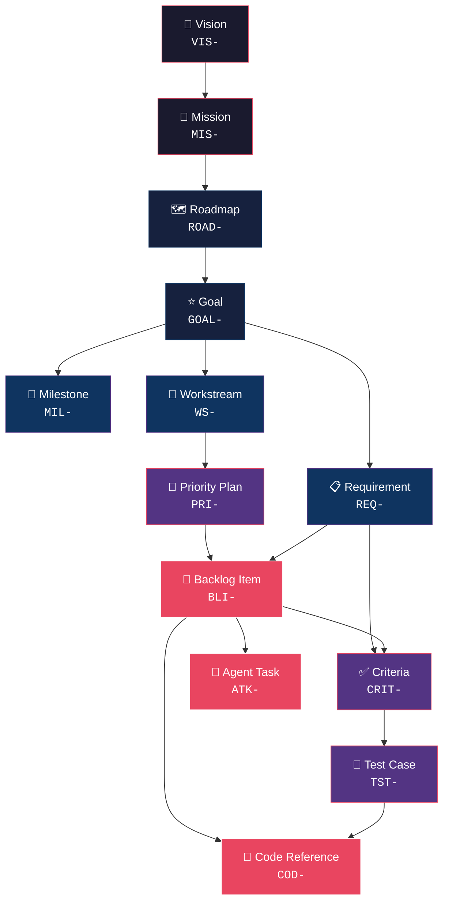
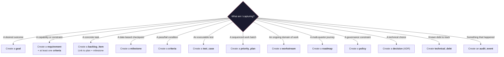

# ZQK Object Taxonomy & Information Architecture Reference

> **Purpose:** This reference teaches humans and AI agents *when*, *why*, and *how* to use each ZQK system object to build a traceable, well-structured knowledge kernel. It replaces the auto-generated field dump with decision-making guidance.
>
> **Companion doc:** [CLI Command Taxonomy](CLI_COMMAND_TAXONOMY.md) — *which command do I run?*
>
> **Audience:** New agents onboarding, human operators, Agents decomposing work, anyone asking "which object do I create?"

---

## The Object Hierarchy at a Glance



## The 7 Tiers

| Tier | Objects | Role |
|:---|:---|:---|
| **🔭 Strategic** | `vision`, `mission`, `roadmap`, `strategic_plan`, `strategic_context` | Define the *why* and *where* — the north star |
| **🎯 Planning** | `goal`, `milestone`, `requirement`, `technical_spec`, `priority_plan`, `workstream` | Define the *what* — decompose strategy into deliverables |
| **🔧 Execution** | `backlog_item`, `agent_task`, `convergence_session`, `pipeline` | Define the *how* — assignable units of work |
| **✅ Verification** | `criteria`, `test_case`, `code_reference`, `verification_matrix` | Prove it — objective evidence of completion |
| **🤖 Orchestration** | `persona`, `role`, `team`, `agent_architecture`, `scheduler_job` | Define *who* does the work and *when* |
| **📊 Observability** | `audit_event`, `base_metric`, `vitality_report`, `maturation_report` | Measure — system health and progress signals |
| **⚙️ Infrastructure** | `lifecycle`, `object_spec`, `policy`, `rule`, `namespace`, `command_spec` | Configure — the kernel's own plumbing |

---

## Tier 1: Strategic Objects

### `vision`
> *"The single sentence that explains why this project exists."*

| | |
|:---|:---|
| **ID Prefix** | `VIS-` |
| **Namespace** | `zqk:kernel` |
| **Lifecycle** | `draft` → `active` → `archived`, `error` |
| **Required Fields** | `narrative` |
| **Reference Fields** | `goal_refs`, `mission_refs`, `workstream_refs` |

**Purpose:** The apex object. There should be exactly **one active vision** per project. Every other object in the system ultimately traces back to this.

**When to create:** At project inception. Rarely changes — it's aspirational and enduring.

**Key references:** None inbound. Everything flows *from* it.

**Example:** `VIS-001: "ZQK — The Agentic OS for hybrid AI+human teams"`

| ✅ Do | ❌ Don't |
|:---|:---|
| Keep it to one sentence | Create multiple visions |
| Make it aspirational, not tactical | Write implementation details |
| Review annually | Change it every sprint |

**FAQ:**
- *Q: Can I have more than one vision?* — No. Multiple visions create strategic ambiguity. If you need sub-visions, use `strategic_context` objects to capture domain-specific interpretations.
- *Q: What if the vision changes?* — Archive the old one, create a new one. The history matters for traceability.

---

### `mission`
> *"How we will achieve the vision — the operating philosophy."*

| | |
|:---|:---|
| **ID Prefix** | `MIS-` |
| **Lifecycle** | `draft` → `active` → `archived`, `error` |
| **Required Fields** | `mission_statement` |
| **Reference Fields** | `goal_refs`, `persona_refs`, `workstream_refs` |

**Purpose:** Translates the vision into an actionable operating mandate. Describes *how* the team will work, what principles guide decisions, and what success looks like. Also supports a `problem_statement` field for capturing pain points and a `vision` field for the desired future state narrative.

**When to create:** After vision is established. One active mission per project.

| ✅ Do | ❌ Don't |
|:---|:---|
| Describe operating principles | Duplicate the vision |
| Reference the vision explicitly | List specific features |
| Update when strategic direction shifts | Create per-sprint missions |

---

### `roadmap`
> *"The phased journey from here to the vision."*

| | |
|:---|:---|
| **ID Prefix** | `ROAD-` |
| **Lifecycle** | `draft` → `published` → `active` → `complete` → `archived` |
| **Reference Fields** | `goal_refs`, `milestone_refs`, `workstream_refs`, `timeline_start`, `timeline_end` |

**Purpose:** A time-oriented plan that sequences major milestones across a horizon (quarters, years). Roadmaps decompose into goals and milestones.

**When to create:** When planning multi-month or multi-quarter work. Multiple roadmaps are fine (e.g., per-year, per-domain).

| ✅ Do | ❌ Don't |
|:---|:---|
| Create per planning horizon (quarterly, annual) | Create per-feature — that's a `goal` |
| Include `timeline_start` and `timeline_end` | Leave them as vague wishlists |
| Transition to `complete` when horizon passes | Delete old roadmaps — history matters |

---

### `strategic_plan` / `strategic_context`
> *"Domain-specific strategy and environmental context."*

| | |
|:---|:---|
| **ID Prefixes** | `STRAT-PLAN-` / `SC-` |
| **Lifecycle** | `planning` → `active` → `complete` → `archived`, `error` |
| **Reference Fields** | `goal_refs`, `workstream_refs` |

**Purpose:** `strategic_plan` captures a formalized multi-year strategy (e.g., "STRAT-PLAN-001: 2026-2028"). `strategic_context` captures environmental factors that influence decisions (market trends, competitive landscape, constraints).

**When to create:** When strategy requires formalization beyond what a roadmap provides.

---

## Tier 2: Planning Objects

### `goal`
> *"A measurable outcome the project must achieve."*

| | |
|:---|:---|
| **ID Prefix** | `GOAL-` |
| **Lifecycle** | `planned` → `active` → `blocked` → `complete` → `archived` |
| **Required Fields** | None kind-specific (inherits `id` from base) |
| **Reference Fields** | `backlog_item_refs`, `milestone_refs`, `requirement_refs`, `workstream_refs`, `commit_refs` |
| **Unique Fields** | `metric` (human-readable, max 120 chars), `target`, `current_value`, `achieved_at`, `authority` |

**Purpose:** The primary decomposition unit from strategy to execution. Goals are **outcome-oriented** (not activity-oriented). They answer: "What will be true when we're done?" Goals support quantitative tracking via `metric`, `target`, and `current_value` fields.

**When to create:** When a roadmap phase or strategic initiative needs concrete targets. Each goal should be independently verifiable.

**Example:** `GOAL-001: "CLI Analytical Intelligence — built-in tools to eliminate ad-hoc scripting for system analysis"`

| ✅ Do | ❌ Don't |
|:---|:---|
| Define a verifiable outcome | Describe an activity ("Build X") |
| Link to at least one requirement | Create orphan goals |
| Set a `priority_tier` (P0-P3) | Leave priority unset — everything becomes equal |
| Set `metric` and `target` for measurability | Leave goals qualitative-only |

**FAQ:**
- *Q: How many goals should be active?* — 3-7 at any time. More than 10 active goals means focus is too diffuse.
- *Q: Goal vs. Milestone?* — A goal is an *outcome*. A milestone is a *checkpoint along the way*. Goals have requirements; milestones gate work.
- *Q: Goal vs. Requirement?* — Goals describe *what we want*. Requirements describe *what the system must do* to achieve it.

---

### `requirement`
> *"A specific capability or constraint that must be satisfied."*

| | |
|:---|:---|
| **ID Prefix** | `REQ-` / `REQU-` |
| **Lifecycle** | `planned` → `active` → `complete` → `deferred` → `rejected` |
| **Required Fields** | `criteria_refs` (min 1), `goal_refs` (min 1) |
| **Reference Fields** | `backlog_item_refs`, `criteria_refs`, `goal_refs`, `milestone_refs`, `test_case_refs`, `technical_spec_refs`, `workstream_refs` |
| **Enum Fields** | `priority`: `p0`, `p1`, `p2`, `p3` (default: `p2`) |

**Purpose:** Decompose goals into testable, implementable specifications. Requirements are the bridge between "what we want" (goal) and "what we build" (backlog item).

> [!IMPORTANT]
> Requirements **require** at least one `criteria_refs` and one `goal_refs` at creation. This enforces the traceability chain: every requirement must be testable and goal-linked.

**When to create:** After a goal is defined. Every goal should have at least one requirement.

| ✅ Do | ❌ Don't |
|:---|:---|
| Provide `criteria_refs` at creation | Skip criteria — creation will fail |
| Link back to the parent goal via `goal_refs` | Create floating requirements |
| Include `acceptance_criteria` text as well | Rely solely on free-text criteria (use `CRIT-` objects) |

---

### `technical_spec`
> *"The implementation blueprint — how a requirement will be built."*

| | |
|:---|:---|
| **ID Prefix** | `TSP-` |
| **Lifecycle** | `proposed` → `approved` → `in_progress` → `implemented` → `archived`, `error` |
| **Required Fields** | `title`, `description`, `requirement_refs` (min 1) |
| **Reference Fields** | `requirement_refs` |
| **Key Fields** | `component` (target module), `description` (architectural explanation) |

**Purpose:** A technical spec describes *how* a requirement will be implemented at the architecture level. While a requirement says "the system must support X," a technical spec says "we will implement X by using approach Y in component Z, with these trade-offs."

**When to create:** After a requirement is defined and before implementation begins. Create a technical spec when the implementation approach is non-obvious, involves architectural decisions, or spans multiple components.

> [!IMPORTANT]
> **Goal vs. Technical Spec:** A goal is an *outcome* ("users can analyze objects by group"). A technical spec is an *implementation design* ("we'll add a `--group-by` flag to `zqk object list` using a map-reduce pattern over the storage engine"). Goals live at the planning tier; specs live at the planning-to-execution boundary.

| ✅ Do | ❌ Don't |
|:---|:---|
| Link to requirements via `requirement_refs` (required) | Create specs without a parent requirement |
| Describe the *approach*, trade-offs, and alternatives considered | Repeat the requirement text |
| Set `component` to identify the affected module | Write specs for trivial changes |
| Include architectural rationale in `description` | Use specs as task tracking (that's a `backlog_item`) |
| Transition to `implemented` when code lands | Leave specs in `approved` forever |

**FAQ:**
- *Q: Technical spec vs. Decision (ADR)?* — A spec is a forward-looking *design document* for a specific requirement. A decision (ADR) records a *choice already made* with rationale. If you're choosing between approaches, create an ADR. If you're detailing how to build something, create a spec.
- *Q: Do I always need a spec?* — No. Simple, well-understood requirements can go straight to BLIs. Specs are for non-trivial implementation where the "how" matters as much as the "what."
- *Q: Can a spec cover multiple requirements?* — Yes, `requirement_refs` is a list. A single spec can describe an implementation that satisfies multiple requirements.

---

### `milestone`
> *"A time-bound checkpoint proving progress."*

| | |
|:---|:---|
| **ID Prefix** | `MIL-` |
| **Lifecycle** | `not_started` → `in_progress` → `blocked` → `complete` → `deferred` → `archived` |
| **Required Fields** | `status` |
| **Reference Fields** | `backlog_item_refs`, `blocked_by_refs`, `criteria_refs`, `goal_refs`, `prerequisite_refs`, `requirement_refs`, `workstream_refs`, `commit_refs` |
| **Enum Fields** | `stage_type`: `tier`, `stage`, `prerequisite`, `validation`, `release_gate` |

**Purpose:** Mark points in time where specific conditions must be true. Milestones don't decompose work — they **gate** it. "By June 30, all P0 criteria must pass."

**When to create:** When you need date-based coordination or release gates. Use `prerequisite_refs` for ordering dependencies and `blocked_by_refs` for tracking impediments.

| ✅ Do | ❌ Don't |
|:---|:---|
| Set concrete `target_date` | Create milestones without dates |
| Define `criteria_refs` (pass/fail conditions) | Use milestones as goals (they're checkpoints, not outcomes) |
| Use `stage_type` for classification | Leave type unset |
| Set `prerequisite_refs` for ordering | Assume implicit ordering |

> [!NOTE]
> Milestones are critical for BLI traceability — backlog items in `planned` or `in_progress` status **must** have at least one `milestone_ref`.

---

### `priority_plan`
> *"A sequenced, prioritized batch of work for a specific period."*

| | |
|:---|:---|
| **ID Prefix** | `PRI-` / `PRIO-` |
| **Lifecycle** | `planning` → `grooming` → `prioritizing` → `active` → `in_progress` → `paused` → `blocked` → `complete` → `cancelled` → `archived` |
| **Required Fields** | `id` |
| **Reference Fields** | `release_ref`, `workflow_ref`, `workstream_ref`, `workstream_refs`, `persona_refs`, `team_configuration_ref`, `next_plan_id`, `previous_plan_id` |
| **Key Fields** | `active_order` (integer, lower = higher priority), `plan_date`, `rationale` |

**Purpose:** Groups backlog items into a coherent work plan with explicit priority ordering. This is the "sprint plan" or "iteration plan" — it answers: "What are we working on *right now*, in what order?"

> [!IMPORTANT]
> Plans **do not reference BLIs directly**. Instead, BLIs reference plans via their `priority_plan_ref` field. Plan completeness is calculated by aggregating the status of all BLIs that point to it.

**When to create:** When moving from planning to execution. Create one per active work context. **Keep the number of active plans minimal** (3-5 max).

**Lifecycle guidance:**
- `planning` → Draft, not yet groomed
- `grooming` → Items being refined and estimated
- `prioritizing` → Items being ordered by priority tier
- `active` → Currently being executed
- `complete` → All linked BLIs are terminal
- `archived` → No longer relevant (no BLIs, superseded, etc.)

| ✅ Do | ❌ Don't |
|:---|:---|
| Complete/archive plans when all BLIs are done | Leave old plans active forever |
| Set `active_order` to differentiate priority | Let all plans default to order=100 |
| Ensure BLIs reference the plan via `priority_plan_ref` | Describe BLIs in `note` field instead of linking |
| Set `rationale` explaining priority decisions | Create plans without justification |
| Use `plan_date` for temporal tracking | Lose track of when plans were created |
| Keep ≤5 plans active at once | Let plan count grow unbounded |

> [!CAUTION]
> **Anti-pattern — The Zombie Plan:** In June 2026, the system accumulated 324 active plans with 0 completed — because agents created plans but never closed them. This made `system status` and `whats-next` unusable. **Always transition plans through their lifecycle.**

> [!CAUTION]
> **Anti-pattern — The Umbrella Plan:** A plan with no BLIs that just references other objects in its `note` field. Plan completeness is calculated from BLI status via `priority_plan_ref`. A plan with 0 BLIs has no measurable progress.

**FAQ:**
- *Q: Priority plan vs. Workstream?* — A workstream is a *stream of related work* (ongoing, long-lived). A priority plan is a *time-boxed batch* from that stream (like a sprint).
- *Q: How do I know when to complete a plan?* — When all BLIs with `priority_plan_ref` pointing to it are in terminal status (`complete`, `archived`, `cancelled`).
- *Q: What's the `active_order` for?* — It determines which plan `system status` and `whats-next` report as the "current" plan. Lower number = higher priority.

---

### `workstream`
> *"An ongoing stream of related work."*

| | |
|:---|:---|
| **ID Prefix** | `WS-` |
| **Lifecycle** | `planned` → `active` → `paused` → `complete` → `archived` |
| **Required Fields** | `entry_point`, `owner_ref` |
| **Reference Fields** | `milestone_refs`, `owner_ref`, `prerequisites`, `requirement_refs`, `workflow_ref`, `workstream_refs` (sub-workstreams) |
| **Enum Fields** | `category`: `application`, `system`, `feature`, `component`, `ops`, `tooling` |

**Purpose:** Groups related work that spans multiple priority plans. Workstreams are long-lived (unlike plans, which are time-boxed). Think "team assignment" or "domain of responsibility."

**When to create:** When a domain of work will span multiple planning cycles. Examples: "CLI UX", "Graph Backend", "Agent Orchestration".

| ✅ Do | ❌ Don't |
|:---|:---|
| Set `owner_ref` (who's responsible) | Create ownerless workstreams |
| Set `entry_point` (canonical doc or script) | Leave `entry_point` blank — it's required |
| Use `category` for classification | Create workstreams for one-off tasks (use BLIs) |
| Use `prerequisites` for dependency ordering | Assume implicit dependencies |

---

## Tier 3: Execution Objects

### `backlog_item`
> *"The atomic unit of deliverable work."*

| | |
|:---|:---|
| **ID Prefix** | `BLI-` |
| **Lifecycle** | `exploring` → `validated` → `roadmap` → `deferred` → `planned` → `in_progress` → `complete` → `archived` → `rejected`, `error` |
| **Required Fields** | `status` |
| **Reference Fields** | `priority_plan_ref`, `goal_refs`, `milestone_refs`, `requirement_refs`, `convergence_session_ref`, `persona_refs`, `workstream_refs`, `commit_refs`, `document_refs` |
| **Enum Fields** | `priority`: `critical`, `high`, `medium`, `low` |

**Purpose:** A concrete, assignable piece of work that produces a verifiable artifact. This is the workhorse of the system — where strategy meets code.

> [!IMPORTANT]
> **Lifecycle enforcement:** BLIs in `planned` or `in_progress` status **must** have both `priority_plan_ref` AND at least one `milestone_ref`. This ensures every active work item is traceable through: BLI → Plan → Workstream → Goal → Vision.

**When to create:** When work needs to be tracked, assigned, and verified.

**Lifecycle guidance:**
- `exploring` → Idea surfaced, not yet validated
- `validated` → Confirmed as real need, not yet on roadmap
- `roadmap` → Accepted onto roadmap, not yet planned for a sprint
- `planned` → Assigned to a priority plan, ready to start (**requires** `priority_plan_ref` + `milestone_refs`)
- `in_progress` → Actively being worked (**requires** `priority_plan_ref` + `milestone_refs`)
- `complete` → Work done and verified

| ✅ Do | ❌ Don't |
|:---|:---|
| Always set `priority_plan_ref` before moving to `planned` | Create orphan BLIs with no plan |
| Link to requirements and criteria | Skip traceability links |
| Set at least one `milestone_refs` | Move to `in_progress` without a milestone |
| Complete BLIs when done (triggers plan completion) | Leave BLIs in limbo |
| Use `acceptance_criteria` for per-BLI conditions | Assume "done" is obvious |

---

### `agent_task`
> *"A discrete unit of work assigned to a specific agent persona."*

| | |
|:---|:---|
| **ID Prefix** | `ATK-` |
| **Lifecycle** | `proposed` → `approved` → `in_progress` → `pending_verification` → `implemented` → `completed`, `error`, `archived` |
| **Reference Fields** | `assignee_persona_ref`, `pipeline_ref`, `policy_refs`, `requirement_refs`, `validation_criteria_refs` |

**Purpose:** Routes work to the right agent. Agent tasks are created by the orchestrator and assigned via `assignee_persona_ref`. They wrap one or more BLIs with agent-specific context, inputs, and expected outputs.

**When to create:** Automatically by the orchestration pipeline, or manually when assigning work to a specific agent persona.

---

### `convergence_session`
> *"A focused execution session with a defined objective."*

| | |
|:---|:---|
| **ID Prefix** | `CVS-` |
| **Lifecycle** | `draft` → `active` → `paused` → `completed` → `abandoned` → `escalated`, `error` |
| **Reference Fields** | `backlog_item_refs`, `glossary_term_ref`, `requirement_refs` |
| **Key Fields** | `hypothesis`, `current_phase` (C1–C6), `desired_end_state`, `before_state_snapshot`, `after_state_snapshot`, `delta_assessment` |

**Purpose:** Time-boxed, objective-driven work sessions. A convergence session groups agent activities toward a specific goal, with phased progress tracking (C1 through C6), built-in drift detection, and hypothesis-driven measurement.

---

### `pipeline`
> *"A multi-step workflow definition."*

| | |
|:---|:---|
| **ID Prefix** | `PIP-` |
| **Reference Fields** | `agent_task_refs`, `stages` |

**Purpose:** Defines ordered sequences of operations (e.g., "analyze → plan → execute → verify"). Pipelines are templates — they define *how* work flows, not *what* work is done.

---

## Tier 4: Verification Objects

### `criteria`
> *"A single, objective, testable condition."*

| | |
|:---|:---|
| **ID Prefix** | `CRIT-` |
| **Lifecycle** | `not_started` → `in_progress` → `validated` → `complete` → `blocked` → `rejected` |
| **Required Fields** | `category`, `status` |
| **Reference Fields** | `backlog_item_refs`, `goal_refs`, `milestone_refs`, `requirement_refs` |
| **Enum Fields** | `category`: `functional`, `non-functional`, `acceptance`, `test`, `performance`, `security`, `compliance`; `validation_method`: `manual_check`, `automated_test`, `metric_threshold`, `code_review`, `external_approval`; `priority`: `critical`, `high`, `medium`, `low` |

**Purpose:** The smallest unit of verification. Each criteria answers a yes/no question: "Is this condition met?" Criteria are referenced by requirements (which *require* at least one), BLIs, milestones, and goals.

**When to create:** When defining what "done" means. **Requirements require at least one criteria_ref at creation**, so create criteria first or concurrently.

| ✅ Do | ❌ Don't |
|:---|:---|
| Set `category` (it's required) | Leave as "uncategorized" |
| Set `validation_method` for clarity | Assume everything is manual |
| Link to requirements via refs | Create standalone criteria with no parent |

---

### `test_case`
> *"Executable proof that a criteria is satisfied."*

| | |
|:---|:---|
| **ID Prefix** | `TST-` / `TEST-` |
| **Lifecycle** | `draft` → `active` → `metrics_captured` → `complete` → `archived`, `error` |
| **Reference Fields** | `backlog_item_refs`, `criteria_refs`, `milestone_refs`, `requirement_refs`, `workstream_refs` |
| **Enum Fields** | `scope`: `unit`, `integration`, `e2e`, `manual`, `scenario`; `priority`: `critical`, `high`, `medium`, `low` |
| **Key Fields** | `path_or_id` (file path, test ID, or command) |

**Purpose:** Maps a criteria to an actual test that can be run. Test cases produce pass/fail results and can reference code via `path_or_id`.

**When to create:** After criteria are defined. TDD mandate: tests before implementation.

---

### `code_reference`
> *"A pointer to a specific code artifact."*

| | |
|:---|:---|
| **ID Prefix** | `COD-` |
| **Reference Fields** | `backlog_item_refs`, `goal_refs`, `milestone_refs`, `requirement_refs`, `test_case_refs`, `workstream_refs` |
| **Key Fields** | `file_path`, `function_name`, `line_start`, `line_end`, `commit_hash`, `change_type`, `lines_added`, `lines_removed` |

**Purpose:** Links system objects to actual code files, functions, or packages. This closes the traceability loop: Vision → Goal → Requirement → BLI → Code. Tracks both location and change metadata.

---

### `verification_matrix`
> *"A cross-reference table of requirements vs. their verification status."*

| | |
|:---|:---|
| **ID Prefix** | `VMX-` |

**Purpose:** Aggregates verification status across multiple requirements and criteria. Used for release gates and quality assessments.

---

## Tier 5: Orchestration Objects

### `persona`
> *"An agent archetype with specific capabilities and constraints."*

| | |
|:---|:---|
| **ID Prefix** | `PER-` |
| **Reference Fields** | `goal_refs`, `mission_refs` |

**Purpose:** Defines roles that agents can assume (e.g., "Technical Program Manager", "Go Architect", "QA Auditor"). Personas have defined capabilities, tool access, and behavioral constraints.

### `role`
> *"A named responsibility within the organization."*

| **ID Prefix** | `ROL-` |
|:---|:---|

### `team` / `team_configuration`
> *"A group of personas/roles working together."*

| **ID Prefixes** | `TEA-` / `TCFG-` |
|:---|:---|

### `agent_architecture`
> *"Agent system topology and integration design."*

| | |
|:---|:---|
| **ID Prefix** | `AGENT-ARCH-` |
| **Reference Fields** | `role_ref`, `components`, `integration_points` |

### `scheduler_job` / `scheduler_handler_binding`
> *"Automated recurring or triggered work."*

| | |
|:---|:---|
| **ID Prefixes** | `SCH-` / `SHB-` |
| **Lifecycle** | `active` → `disabled` → `archived`, `error` |

---

## Tier 6: Governance & Knowledge Objects

### `policy`
> *"A governance rule that constrains system behavior."*

| | |
|:---|:---|
| **ID Prefix** | `POL-*` (varies by category: `POL-CODE-`, `POL-TEST-`, etc.) |
| **Lifecycle** | `draft` → `under_review` → `active` → `deprecated` → `superseded` → `archived` |
| **Required Fields** | `body`, `category`, `id`, `policy_type` |
| **Enum Fields** | `policy_type`: `standard`, `requirement`, `guideline`, `best_practice`, `anti_pattern` |

### `decision`
> *"A technical choice with rationale — Architecture Decision Records."*

| | |
|:---|:---|
| **ID Prefix** | `DEC-` / `ADR-` |
| **Lifecycle** | `draft` → `under_review` → `active` → `approved` → `rejected` → `archived` |
| **Reference Fields** | `decision_refs`, `goal_refs`, `milestone_refs`, `requirement_refs`, `workstream_refs` |

### `technical_debt`
> *"A known shortcut, violation, or quality gap that needs remediation."*

| | |
|:---|:---|
| **ID Prefix** | `TDE-` |
| **Lifecycle** | `identified` → `planned` → `in_progress` → `verifying` → `resolved` → `deferred` → `archived`, `error` |
| **Required Fields** | `description`, `impact_assessment`, `target_resolution_date` |
| **Reference Fields** | `backlog_ref`, `policy_ref` |
| **Enum Fields** | `impact_assessment`: `low`, `medium`, `high`, `critical` |
| **Key Fields** | `file_path`, `function_name`, `linter_rule`, `mitigation_plan`, `resolution_notes`, `tags` |

**Purpose:** Track code quality issues, architectural shortcuts, and policy violations that need future remediation. Unlike a backlog item (which tracks *planned work*), technical debt tracks *known deficiencies* — things that are already in the codebase and need fixing.

**When to create:** When you encounter or introduce a known quality gap:
- Policy violations detected by pre-commit (e.g., `fmt.Print*` instead of structured logging per POL-CODE-007)
- Linter findings you can't fix immediately
- Architectural shortcuts taken under time pressure
- Patterns that work today but won't scale

> [!IMPORTANT]
> **Technical Debt vs. Backlog Item:** A BLI is *new work to be done*. Technical debt is *existing code that doesn't meet standards*. The lifecycle reflects this: debt starts as `identified` (discovered), gets a `mitigation_plan`, and progresses through `verifying` → `resolved`. A debt item can optionally link to a BLI via `backlog_ref` when remediation work is formally planned.

**Lifecycle enforcement:**
- `identified` → `planned`: Requires `mitigation_plan` and `target_resolution_date`
- `planned` → `in_progress`: Recommends `backlog_ref` (if tracked in backlog)
- `verifying` → `resolved`: Requires `resolution_notes`
- Any → `deferred`: Allowed from `identified` or `planned`

| ✅ Do | ❌ Don't |
|:---|:---|
| Set `impact_assessment` honestly (`low`→`critical`) | Mark everything as `low` — it hides real risk |
| Set `target_resolution_date` | Create debt without a remediation timeline |
| Link `policy_ref` when a policy identifies the debt | Ignore which policy the debt violates |
| Set `file_path` and `function_name` for code-level debt | Leave location vague ("somewhere in storage") |
| Add `tags` for categorization (`refactoring`, `performance`) | Skip tags — they enable group-by analysis |
| Write `mitigation_plan` before moving to `planned` | Jump straight to `in_progress` without a plan |
| Write `resolution_notes` when resolving | Resolve without documenting what changed |
| Link `backlog_ref` when a BLI is created for the fix | Track the same work in both systems disconnected |

**FAQ:**
- *Q: When do I use debt vs. a BLI?* — If it's a *new feature or enhancement*, use a BLI. If it's a *known deficiency in existing code*, use technical debt. Often they work together: the debt item identifies the problem, and a linked BLI tracks the fix.
- *Q: Should every linter finding become a debt item?* — For recurring or policy-violating findings, yes. For one-off trivial fixes, just fix them. The rule of thumb: if you can't fix it in this commit, track it.
- *Q: How do I find what policies a debt violates?* — Use `policy_ref` to link to the policy (e.g., `POL-CODE-007` for logging compliance). Run `zqk object list policy --filter category=code_quality` to see relevant policies.

---

### `risk_blocker`
> *"Known risk or impediment."*

| **ID Prefix** | `RIS-` |
|:---|:---|

### Vocabulary Objects
> *"Shared terminology and taxonomy."*

| Kind | ID Prefix | Purpose |
|:---|:---|:---|
| `vocabulary_scheme` | `VOC-` | Names a vocabulary graph (taxonomy/lens network). Fields: `context_scope`, `purpose`, `machine_hints` |
| `glossary_term` | `GLS-` | Operational glossary term. Fields: `definition`, `category`, `semantic_tags`, `agent_prompts`, `machine_hints` |
| `glossary_term_relation` | `GTR-` | Directed edge in vocabulary graph: `source_term_ref` → `target_term_ref` via `predicate_ref`, scoped by `scheme_ref` |

> [!NOTE]
> The vocabulary graph is a first-class knowledge structure: three parallel taxonomy schemes (GAPE lenses, VIS-001 strategic pillars, cross-walk) using typed edges over glossary term nodes. Predicates are themselves glossary terms tagged with `predicate_definition`.

---

## Tier 7: Observability Objects

### `audit_event`
> *"An immutable record of something that happened."*

| | |
|:---|:---|
| **ID Prefix** | `AUD-` |
| **Key Fields** | `target_id`, `target_kind`, `event_type`, `operation`, `severity` |

### `vitality_report` / `maturation_report`
> *"Periodic health assessments of the system."*

### Metric objects
| Kind | ID Prefix | Purpose |
|:---|:---|:---|
| `base_metric` | `BAS-` | Base metric definition |
| `command_metric` | `CMD-` | CLI command performance |
| `code_quality_metric` | `CQM-` | Code quality tracking |
| `scheduler_health_metric` | `SHM-` | Scheduler health |
| `base_sampler` | `BSA-` | Data collection config |
| `sampler_profile` | `SAM-` | Sampling configuration |
| `scalar_metric_sampler` | `SCA-` | Scalar metric sampling |
| `metrics_exchange_contract` | `MXC-` | Data contracts between metric producers/consumers |

---

## Tier 7: Infrastructure Objects

### `lifecycle`
> *"Defines valid states and transitions for an object kind."*

| **ID Prefix** | `LIFECYCLE-` / `LIF-` |
|:---|:---|

**Purpose:** Every object kind has a lifecycle that governs its state machine. There are 58 lifecycle definitions in the system. Manual status updates are blocked — use `--auto-status` or `--override --reason-code <code>`.

### `object_spec`
> *"The schema definition for an object kind."*

| **ID Prefix** | `OBJ-` |
|:---|:---|

128 object specs define the fields, validation rules, and semantic types for every kind.

### `namespace` / `namespace_registry`

| Namespace | Purpose |
|:---|:---|
| `zqk:kernel` | Core objects (goals, BLIs, plans, requirements, policies, etc.) |
| `domain:organizational` | Organizations, divisions, departments, teams, partnerships |
| `zqk:kernel:cli` | CLI profiles and configuration |
| `zqk:kernel:metrics` | Metrics profiles and sampler configuration |

### Other Infrastructure
| Kind | ID Prefix | Purpose |
|:---|:---|:---|
| `command_spec` | `CMS-` | CLI command interface definition |
| `workflow` | `WFL-` | Workflow definitions (referenced by plans and workstreams) |
| `auto_fix_rule` | `AFR-` | Auto-fix rules for system issues |
| `bucketing_strategy` | `BST-` | Object storage partitioning |
| `compression_policy` | `COMPOL-` | Data compression rules |
| `integrity_manifest` | `INT-` | Integrity verification manifests |

---

## The Traceability Chain

Every artifact in the system should be traceable back to the vision through this chain:

```
Vision → Mission → Roadmap → Goal → Requirement → Criteria → Test Case
                                  ↘ Milestone  ↗              ↓
                              Workstream → Priority Plan → Backlog Item → Code Reference
```

> [!IMPORTANT]
> **Lifecycle enforcement guarantees traceability:** BLIs cannot enter `planned` or `in_progress` without `priority_plan_ref` and `milestone_refs`. Requirements cannot be created without `criteria_refs` and `goal_refs`. This means the chain is enforced by the kernel itself, not just by convention.

**The golden rule:** If you can't trace an object back to a goal, it's either:
1. **Orphaned** — it lost its links (fix them)
2. **Speculative** — it was created without strategic justification (question whether it should exist)
3. **Infrastructure** — it's a Tier 5-7 object that supports the system itself (that's fine)

---

## Object Count Guidelines

| Object | Healthy Active Count | Warning Threshold | Action |
|:---|:---|:---|:---|
| `vision` | 1 | >1 | Archive the old one |
| `mission` | 1 | >1 | Merge or archive |
| `roadmap` | 1-3 | >5 | Review for consolidation |
| `goal` | 3-7 | >15 | Prioritize ruthlessly |
| `priority_plan` | 3-5 | >10 | Complete/archive done plans |
| `workstream` | 5-10 | >20 | Merge related streams |
| `backlog_item` (in_progress) | 10-30 | >50 | Too much WIP — focus |
| `convergence_session` (active) | 0-3 | >5 | Close idle sessions |

---

## Decision Tree: "Which Object Do I Create?"



---

## Common Anti-Patterns

| Anti-Pattern | Problem | Fix |
|:---|:---|:---|
| **The Umbrella Plan** | Plan references BLIs in `note` field instead of via `priority_plan_ref` on BLIs | Ensure BLIs have `priority_plan_ref` pointing to the plan |
| **The Zombie Plan** | Plans left `active` forever, never completed | Complete or archive plans when BLIs are done |
| **The Orphan BLI** | BLI with no `priority_plan_ref`, `requirement_refs`, or `goal_refs` | Always link BLIs to at least a plan, requirement, and milestone |
| **The Requirement Desert** | Goals with no requirements | Every goal needs ≥1 requirement with criteria |
| **The Criteria-less Requirement** | Requirements without `criteria_refs` | Creation will fail — create criteria first |
| **The Status Swamp** | Hundreds of objects in the same status | Use lifecycle transitions — complete what's done, archive what's abandoned |
| **The Test-Free Zone** | Criteria with no test cases | TDD mandate: every criteria needs a test case |
| **The God Object** | One BLI that does everything | Break into smaller, focused BLIs (≤1 day of work each) |
| **The Vision Sprawl** | Multiple active visions or missions | One of each. Archive the rest. |
| **The Floating Milestone** | Milestone with no `target_date` or `criteria_refs` | Set dates and pass/fail conditions |

---

## Complete Object Kind Index (128 kinds)

### Core Workflow (Tier 1-4) — 19 kinds
`vision`, `mission`, `roadmap`, `strategic_plan`, `strategic_context`, `goal`, `requirement`, `technical_spec`, `milestone`, `priority_plan`, `workstream`, `backlog_item`, `agent_task`, `convergence_session`, `pipeline`, `criteria`, `test_case`, `code_reference`, `verification_matrix`

### Orchestration (Tier 5) — 10 kinds
`persona`, `role`, `team`, `team_configuration`, `agent_architecture`, `agent_skill`, `agent_feed`, `agent_onboarding_preparation`, `scheduler_job`, `scheduler_handler_binding`

### Governance & Knowledge — 14 kinds
`policy`, `decision`, `rule`, `process_hygiene_rule`, `risk_blocker`, `technical_debt`, `question`, `doc_entry`, `narrative`, `prompt_template`, `template`, `vocabulary_scheme`, `glossary_term`, `glossary_term_relation`

### Organizational — 8 kinds
`organization`, `division`, `department`, `account`, `stakeholder_profile`, `partnership`, `corporate_initiative`, `organizational_change`

### Observability & Metrics — 18 kinds
`audit_event`, `audit_aggregation_metric`, `base_metric`, `command_metric`, `code_quality_metric`, `scheduler_health_metric`, `file_lock_metric`, `kind_mapping_metric`, `test_audit_aggregation_metric`, `base_sampler`, `sampler_profile`, `scalar_metric_sampler`, `list_metric_sampler`, `ordered_list_metric_sampler`, `status_history_metric_sampler`, `metrics_exchange_contract`, `metrics_feedback`, `vitality_report`

### Infrastructure & System — 22 kinds
`lifecycle`, `object_spec`, `namespace`, `namespace_registry`, `domain_registry`, `command_spec`, `workflow`, `workstream_transition`, `field_registry`, `extensible_object`, `kind_synonym`, `auto_fix_rule`, `bucketing_strategy`, `compression_policy`, `integrity_manifest`, `resolver`, `metadata_package`, `rollback_report`, `context_refresh_schedule`, `keystore_entry`, `certificate`, `auth_strategy`

### Specialized Domain — 18 kinds
`display`, `component`, `brand`, `brand_asset`, `digital_asset`, `visual_plan`, `commercial_sequence`, `scenario`, `test_command_rule`, `release`, `important_date`, `mcp_session`, `zqk_session`, `evolution_management`, `impact_analysis`, `import_tracking`, `fission_event`, `remote_kernel`

### Commercial / Career — 8 kinds
`capability`, `capacity_advertisement`, `compute_advertisement`, `economic_policy`, `infrastructure_adapter`, `job_listing`, `job_search_profile`

---

> [!IMPORTANT]
> This reference is a living document. As the ontology evolves, this document should evolve with it. For field-level detail on any specific kind, run `zqk object <kind> fields` or consult the object spec at `docs/architecture/_internal/object_specs/`.
>
> **See also:** [CLI Command Taxonomy](CLI_COMMAND_TAXONOMY.md) for the companion operations reference.
