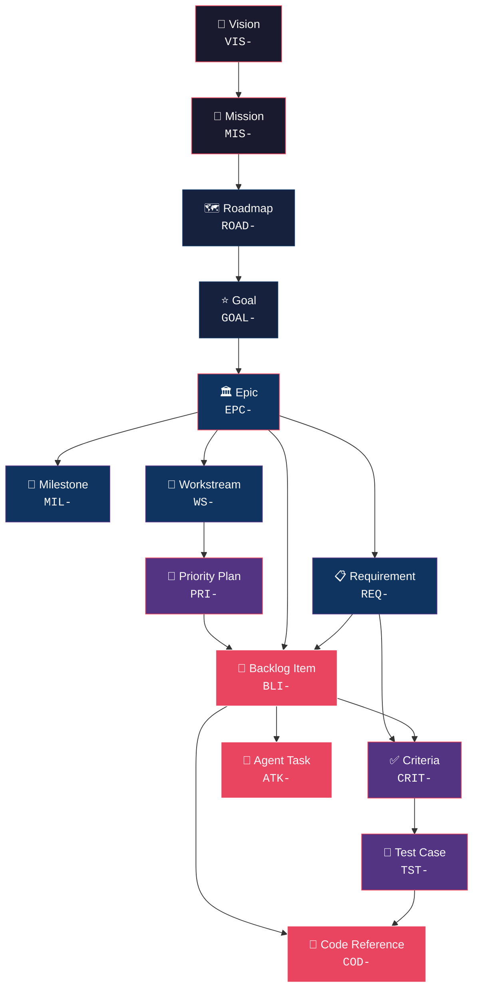
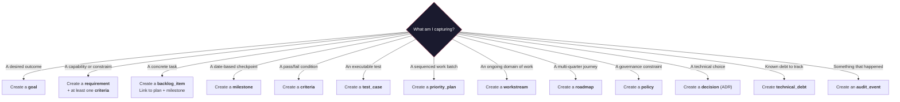

# ZQK System Objects & Lifecycles Guide

Welcome to the ZQK Knowledge Kernel. This guide is the definitive Rosetta Stone for both human and AI agents operating within the workspace. It defines every system object, its purpose, its lifecycle, and when it should be used.

**Core Philosophy:** Everything is a spec-driven object. By adhering to these objects and their lifecycles, we ensure maximum observability, traceability, and collaboration.

## The Object Hierarchy at a Glance



## The 7 Tiers

| Tier | Objects | Role |
|:---|:---|:---|
| **🔭 Strategic** | `vision`, `mission`, `roadmap`, `strategic_plan`, `strategic_context` | Define the *why* and *where* — the north star |
| **🎯 Planning** | `goal`, `epic`, `milestone`, `requirement`, `technical_spec`, `priority_plan`, `workstream` | Define the *what* — decompose strategy into deliverables |
| **🔧 Execution** | `backlog_item`, `agent_task`, `convergence_session`, `pipeline` | Define the *how* — assignable units of work |
| **✅ Verification** | `criteria`, `test_case`, `code_reference`, `verification_matrix` | Prove it — objective evidence of completion |
| **🤖 Orchestration** | `persona`, `role`, `team`, `agent_architecture`, `scheduler_job` | Define *who* does the work and *when* |
| **📊 Observability** | `audit_event`, `base_metric`, `vitality_report`, `maturation_report` | Measure — system health and progress signals |
| **⚙️ Infrastructure** | `lifecycle`, `object_spec`, `policy`, `rule`, `namespace`, `command_spec` | Configure — the kernel's own plumbing |

---

## The Draft Plane & Lifecycle Shockwave Rubric

Historically, early systems attempted to validate all structural integrity and reference constraints at initial object creation time. In a dynamic, agentic knowledge kernel, this creates friction and false failures. ZQK solves this through **The Draft Plane**, the **Five-Question State Machine Rubric**, and **Lifecycle Shockwaves**:

### 1. The Draft Plane (`conceptual` → `originated`)
- **Draft Plane Origin (`conceptual`):** New objects originate in the Draft Plane. In this preliminary phase, an object can be drafted, explored, and shaped incrementally without requiring all downstream references or satisfying strict operational preconditions.
- **CAS Membrane Crossing (`originated`):** Once an object crosses the Content-Addressable Storage (CAS) membrane, its identity and content are locked into the durable graph in `originated` status.
- **Lazy & Progressive Preconditions:** Operational constraints are evaluated at **state transitions**, not at initial instantiation. For example, a `backlog_item` may be originated without a priority plan or milestone, but transitioning it from `roadmap` to `planned` or `in_progress` strictly enforces the shovel-ready precondition requiring `priority_plan_ref` and `milestone_ref`.

### 2. The Five-Question State Machine Rubric
Every lifecycle in ZQK conforms to the standardized five-question state machine rubric (`docs/architecture/LIFECYCLE_STATE_MACHINE_RUBRIC.md`):
1. **Origin:** What is the initial state upon crossing the CAS membrane (`originated`, `not_started`, `draft`)?
2. **Preliminary / Draft:** Which states represent work that is not yet locked or committed for execution (`conceptual`, `grooming`, `planning`, `draft`, `review`)?
3. **Execution / Ready:** Which states indicate active execution or readiness (`planned`, `in_progress`, `active`, `published`)?
4. **Halted / System:** Which states indicate paused, blocked, or error states requiring intervention (`paused`, `blocked`, `halted`, `error`)?
5. **Terminal / Archive:** Which states represent permanent completion or archival (`complete`, `implemented`, `rejected`, `archived`, `deprecated`)?

### 3. Lifecycle Shockwaves
When an object undergoes a lifecycle state transition, it emits a **shockwave event** across the Knowledge Kernel graph:
- **Criteria Passing:** When a `test_case` runs green, it triggers a shockwave completing its linked `criteria`.
- **Remaining Open Draining:** As criteria and child backlog items complete, shockwaves decrement `remaining_open_count` counters on parent test cases, milestones, and priority plans.
- **Cascading Completion:** When the final child of an `open_countable` or `summarizes_children` container reaches terminal state, the shockwave catalyst automatically promotes the container object to `complete`.

---

## The Trait System & Framework

ZQK objects are composed of modular **traits** defined in object specs (`traits:`). Traits endow objects with standardized capabilities, fields, and reactive behaviors without duplicating procedural logic across kinds:

### Core Kernel Traits
- **`base_object_traits`**: Endows all primary objects with universal metadata, identity, and audit fields (`id`, `kind`, `namespace_id`, `created_at`, `created_by`, `updated_at`, `updated_by`, `version`).
- **`open_countable`**: Enables objects (like `milestone`, `priority_plan`, `test_case`) to maintain an atomic `remaining_open_count`. Listens for child shockwave events and handles drain transitions when all children reach completion.
- **`summarizes_children`**: Provides a kind-agnostic rollup processor that aggregates child status counts, calculates `percent_complete`, and summarizes effort distributions into structured `estimated_effort` and `actual_effort` metrics (with `total_hours`, `avg_hours`, `min_hours`, `max_hours`, and formatted human-readable durations).
- **`effort_aware`**: Normalizes and validates human-friendly effort expressions (such as `2h`, `30m`, `1d`) into standard floating-point hours, preventing invalid formats from entering the graph.
- **`status_reactive`**: Allows an object to subscribe to status change catalysts in adjacent objects across reverse-reference edges.

### Field-Level Traits
Field specs annotate properties with behavioral traits such as `filterable`, `listable`, `searchable`, `sortable`, `readable`, `writable`, and `groupable` to guide CLI flags, search indexers, and query parsers.

---

## Tier 1: Strategic Objects

### `vision`
> *"The single sentence that explains why this project exists."*

| | |
|:---|:---|
| **ID Prefix** | `VIS-` |
| **Namespace** | `zqk:kernel` |
| **Lifecycle** | `draft` → `active` → `archived`, `error` |
| **Required Fields** | `narrative` |
| **Reference Fields** | `goal_refs`, `mission_refs`, `workstream_refs` |

**Purpose:** The apex object. There should be exactly **one active vision** per project. Every other object in the system ultimately traces back to this.

**When to create:** At project inception. Rarely changes — it's aspirational and enduring.

**Key references:** None inbound. Everything flows *from* it.

**Example:** `VIS-001: "ZQK — The Agentic OS for hybrid AI+human teams"`

| ✅ Do | ❌ Don't |
|:---|:---|
| Keep it to one sentence | Create multiple visions |
| Make it aspirational, not tactical | Write implementation details |
| Review annually | Change it every sprint |

**FAQ:**
- *Q: Can I have more than one vision?* — No. Multiple visions create strategic ambiguity. If you need sub-visions, use `strategic_context` objects to capture domain-specific interpretations.
- *Q: What if the vision changes?* — Archive the old one, create a new one. The history matters for traceability.

---

### `mission`
> *"How we will achieve the vision — the operating philosophy."*

| | |
|:---|:---|
| **ID Prefix** | `MIS-` |
| **Lifecycle** | `draft` → `active` → `archived`, `error` |
| **Required Fields** | `mission_statement` |
| **Reference Fields** | `goal_refs`, `persona_refs`, `workstream_refs` |

**Purpose:** Translates the vision into an actionable operating mandate. Describes *how* the team will work, what principles guide decisions, and what success looks like. Also supports a `problem_statement` field for capturing pain points and a `vision` field for the desired future state narrative.

**When to create:** After vision is established. One active mission per project.

| ✅ Do | ❌ Don't |
|:---|:---|
| Describe operating principles | Duplicate the vision |
| Reference the vision explicitly | List specific features |
| Update when strategic direction shifts | Create per-sprint missions |

---

### `roadmap`
> *"The phased journey from here to the vision."*

| | |
|:---|:---|
| **ID Prefix** | `ROAD-` |
| **Lifecycle** | `draft` → `published` → `active` → `complete` → `archived` |
| **Reference Fields** | `goal_refs`, `milestone_refs`, `workstream_refs`, `timeline_start`, `timeline_end` |

**Purpose:** A time-oriented plan that sequences major milestones across a horizon (quarters, years). Roadmaps decompose into goals and milestones.

**When to create:** When planning multi-month or multi-quarter work. Multiple roadmaps are fine (e.g., per-year, per-domain).

| ✅ Do | ❌ Don't |
|:---|:---|
| Create per planning horizon (quarterly, annual) | Create per-feature — that's a `goal` |
| Include `timeline_start` and `timeline_end` | Leave them as vague wishlists |
| Transition to `complete` when horizon passes | Delete old roadmaps — history matters |

---

### `strategic_plan` / `strategic_context`
> *"Domain-specific strategy and environmental context."*

| | |
|:---|:---|
| **ID Prefixes** | `STRAT-PLAN-` / `SC-` |
| **Lifecycle** | `planning` → `active` → `complete` → `archived`, `error` |
| **Reference Fields** | `goal_refs`, `workstream_refs` |

**Purpose:** `strategic_plan` captures a formalized multi-year strategy (e.g., "STRAT-PLAN-001: 2026-2028"). `strategic_context` captures environmental factors that influence decisions (market trends, competitive landscape, constraints).

**When to create:** When strategy requires formalization beyond what a roadmap provides.

---

## Tier 2: Planning Objects

### `goal`
> *"A measurable outcome the project must achieve."*

| | |
|:---|:---|
| **ID Prefix** | `GOAL-` |
| **Lifecycle** | `planned` → `active` → `blocked` → `complete` → `archived` |
| **Required Fields** | None kind-specific (inherits `id` from base) |
| **Reference Fields** | `backlog_item_refs`, `milestone_refs`, `requirement_refs`, `workstream_refs`, `commit_hashes` |
| **Unique Fields** | `metric` (human-readable, max 120 chars), `target`, `current_value`, `achieved_at`, `authority` |

**Purpose:** The primary decomposition unit from strategy to execution. Goals are **outcome-oriented** (not activity-oriented). They answer: "What will be true when we're done?" Goals support quantitative tracking via `metric`, `target`, and `current_value` fields.

**When to create:** When a roadmap phase or strategic initiative needs concrete targets. Each goal should be independently verifiable.

**Example:** `GOAL-001: "CLI Analytical Intelligence — built-in tools to eliminate ad-hoc scripting for system analysis"`

| ✅ Do | ❌ Don't |
|:---|:---|
| Define a verifiable outcome | Describe an activity ("Build X") |
| Link to at least one requirement | Create orphan goals |
| Set a `priority_tier` (P0-P3) | Leave priority unset — everything becomes equal |
| Set `metric` and `target` for measurability | Leave goals qualitative-only |

**FAQ:**
- *Q: How many goals should be active?* — 3-7 at any time. More than 10 active goals means focus is too diffuse.
- *Q: Goal vs. Milestone?* — A goal is an *outcome*. A milestone is a *checkpoint along the way*. Goals have requirements; milestones gate work.
- *Q: Goal vs. Requirement?* — Goals describe *what we want*. Requirements describe *what the system must do* to achieve it.

---

### `epic`
> *"A bounded macro-objective and teleological enclave that groups compound goals, requirements, and child work units under verifiable invariant gates."*

| | |
|:---|:---|
| **ID Prefix** | `EPC-` |
| **Lifecycle** | `draft` → `conceptual` → `originated` → `planned` → `in_progress` → `paused` → `completed` → `archived` |
| **Required Fields** | Inherits `id`, `title` from base |
| **Reference Fields** | `goal_refs`, `requirement_refs`, `backlog_item_refs`, `workstream_refs`, `priority_plan_refs` |
| **Unique Fields** | `enclave_scope` (bounds permissions, blast radius, and architectural domain) |

**Purpose (The WHY):**
The Epic object serves as the macro-container for **Teleological PM Re-anchoring** (Layer 2 of the Cellular Knowledge Operating System). In a cellular architecture, planning structures cannot rely on ad-hoc task grouping or vendor-specific labels. Epics provide:
1. **Enclave Scope Bounding (`enclave_scope`):** Explicitly bounds the blast radius, authorization perimeter, and architectural domain that member work units and agent swarms are permitted to modify.
2. **Teleological Coherence:** Encapsulates compound, multi-phase initiatives (e.g. cellular microkernel migration, graph nervous system decoupling, or public open-core separation) across multiple execution cycles without overloading `priority_plan` (which is an operational, shovel-ready release batch) or `milestone` (which is a chronological Gantt anchor).
3. **Invariant Gatekeeping:** Enforces programmatic invariant gates before promotion to `completed`. An Epic cannot complete until all governed requirements, test criteria suites, and child work units reach verified terminal status.

**When to create (The WHEN):**
- **Create an Epic when:**
  - An initiative encompasses multiple discrete requirements (`REQ-`), technical specifications (`TSP-`), and delivery milestones (`MIL-`).
  - Execution spans multiple priority plans (`PRI-`) or coordinated workstreams (`WS-`).
  - You need to partition a subsystem or architectural migration into an isolated enclave with explicit boundaries.
- **Do NOT create an Epic when:**
  - Defining an isolated, individual system contract or capability — use a `requirement` (`REQ-`).
  - Preparing an immediate, shovel-ready iteration batch for swarm dispatch — use a `priority_plan` (`PRI-`).
  - Setting a chronological calendar checkpoint on a timeline — use a `milestone` (`MIL-`).
  - Defining a top-level measurable business or project outcome — use a `goal` (`GOAL-`).

**Example:**
`EPC-CELLULAR-MICROKERNEL-001: "Cellular Knowledge Operating System: 3-Layer Architecture & Teleological Governance"`

| ✅ Do | ❌ Don't |
|:---|:---|
| Define an explicit `enclave_scope` statement bounding domain and blast radius | Leave `enclave_scope` omitted, empty, or unbounded |
| Link upstream `goal_refs` to preserve strategic lineage | Mint orphan Epics detached from strategic goals |
| Decompose into concrete `requirement_refs` and shovel-ready `backlog_item_refs` | Dump monolithic or untracked tasks into an Epic |
| Associate `priority_plan_refs` as execution slices are scheduled onto the shoveling line | Treat an Epic as a replacement for execution-facing priority plans |
| Verify all child requirements and criteria pass before marking `completed` | Force an Epic to `completed` while child BLIs or criteria remain in flight |

**FAQ:**
- *Q: Epic vs. Goal?* — A Goal (`GOAL-`) defines a measurable *outcome* ("What must be achieved"). An Epic (`EPC-`) defines the *bounded enclave and structural delivery envelope* ("How the scope, requirements, and components are encapsulated").
- *Q: Epic vs. Milestone?* — A Milestone (`MIL-`) is a *temporal anchor* along a Gantt lane. An Epic is a *scope container* that may span across multiple milestones.
- *Q: Epic vs. Priority Plan?* — A Priority Plan (`PRI-`) is a *shovel-ready execution batch* (an iteration or release column). Epics are long-lived architectural containers that execute *through* one or more Priority Plans.
- *Q: How do children link to an Epic?* — Epics own references to their components via `goal_refs`, `requirement_refs`, `backlog_item_refs`, `workstream_refs`, and `priority_plan_refs`. Mutate references exclusively via `zqk object ref add <epic-id> <target-id>`.

**How to Operate (The HOW):**

```bash
# 1. Inspect schema and template the Epic
./bin/zqk object fields epic
./bin/zqk object template epic > /tmp/draft_epic.yaml

# 2. Materialize the Epic in the draft plane (draft/conceptual)
./bin/zqk object create epic --file /tmp/draft_epic.yaml

# 3. Promote through the draft plane to authoritative CAS
./bin/zqk object promote EPC-CELLULAR-MICROKERNEL-001

# 4. Link upstream goals, requirements, and workstreams
./bin/zqk object ref add EPC-CELLULAR-MICROKERNEL-001 GOAL-001 REQ-001 REQ-002 WS-CORE-001

# 5. Link child backlog items and active priority plans
./bin/zqk object ref add EPC-CELLULAR-MICROKERNEL-001 BLI-011 BLI-012 PRI-CELLULAR-001

# 6. Query and inspect the Epic and child status rollup
./bin/zqk object get EPC-CELLULAR-MICROKERNEL-001
```

---

### `requirement`
> *"A specific capability or constraint that must be satisfied."*

| | |
|:---|:---|
| **ID Prefix** | `REQ-` / `REQU-` |
| **Lifecycle** | `planned` → `active` → `complete` → `deferred` → `rejected` |
| **Required Fields** | `criteria_refs` (min 1), `goal_refs` (min 1) |
| **Reference Fields** | `backlog_item_refs`, `criteria_refs`, `goal_refs`, `milestone_refs`, `test_case_refs`, `technical_spec_refs`, `workstream_refs` |
| **Enum Fields** | `priority`: `p0`, `p1`, `p2`, `p3` (default: `p2`) |

**Purpose:** Decompose goals into testable, implementable specifications. Requirements are the bridge between "what we want" (goal) and "what we build" (backlog item).

> [!IMPORTANT]
> Requirements **require** at least one `criteria_refs` and one `goal_refs` at creation. This enforces the traceability chain: every requirement must be testable and goal-linked.

**When to create:** After a goal is defined. Every goal should have at least one requirement.

| ✅ Do | ❌ Don't |
|:---|:---|
| Provide `criteria_refs` at creation | Skip criteria — creation will fail |
| Link back to the parent goal via `goal_refs` | Create floating requirements |
| Include `acceptance_criteria` text as well | Rely solely on free-text criteria (use `CRIT-` objects) |

---

### `technical_spec`
> *"The implementation blueprint — how a requirement will be built."*

| | |
|:---|:---|
| **ID Prefix** | `TSP-` |
| **Lifecycle** | `proposed` → `approved` → `in_progress` → `implemented` → `archived`, `error` |
| **Required Fields** | `title`, `description`, `requirement_refs` (min 1) |
| **Reference Fields** | `requirement_refs` |
| **Key Fields** | `component` (target module), `description` (architectural explanation) |

**Purpose:** A technical spec describes *how* a requirement will be implemented at the architecture level. While a requirement says "the system must support X," a technical spec says "we will implement X by using approach Y in component Z, with these trade-offs."

**When to create:** After a requirement is defined and before implementation begins. Create a technical spec when the implementation approach is non-obvious, involves architectural decisions, or spans multiple components.

> [!IMPORTANT]
> **Goal vs. Technical Spec:** A goal is an *outcome* ("users can analyze objects by group"). A technical spec is an *implementation design* ("we'll add a `--group-by` flag to `zqk object list` using a map-reduce pattern over the storage engine"). Goals live at the planning tier; specs live at the planning-to-execution boundary.

| ✅ Do | ❌ Don't |
|:---|:---|
| Link to requirements via `requirement_refs` (required) | Create specs without a parent requirement |
| Describe the *approach*, trade-offs, and alternatives considered | Repeat the requirement text |
| Set `component` to identify the affected module | Write specs for trivial changes |
| Include architectural rationale in `description` | Use specs as task tracking (that's a `backlog_item`) |
| Transition to `implemented` when code lands | Leave specs in `approved` forever |

**FAQ:**
- *Q: Technical spec vs. Decision (ADR)?* — A spec is a forward-looking *design document* for a specific requirement. A decision (ADR) records a *choice already made* with rationale. If you're choosing between approaches, create an ADR. If you're detailing how to build something, create a spec.
- *Q: Do I always need a spec?* — No. Simple, well-understood requirements can go straight to BLIs. Specs are for non-trivial implementation where the "how" matters as much as the "what."
- *Q: Can a spec cover multiple requirements?* — Yes, `requirement_refs` is a list. A single spec can describe an implementation that satisfies multiple requirements.

---

### `milestone`
> *"A time-bound checkpoint proving progress."*

| | |
|:---|:---|
| **ID Prefix** | `MIL-` |
| **Lifecycle** | `not_started` → `in_progress` → `blocked` → `complete` → `deferred` → `archived` |
| **Required Fields** | `status` |
| **Reference Fields** | `blocked_by_refs`, `goal_refs`, `prerequisite_refs`, `requirement_refs`, `workstream_refs`, `commit_hashes` |
| **Traits** | `base_object_traits`, `open_countable`, `summarizes_children` |
| **Enum Fields** | `stage_type`: `tier`, `stage`, `prerequisite`, `validation`, `release_gate` |

**Purpose:** Mark points in time where specific conditions must be true. Milestones gate progress and aggregate deliverables.

**Standardized Child-Owned Membership:**
Milestones standardize on the same child-owned pattern as `priority_plan`:
- `milestone` does **not** store `backlog_item_refs` or `criteria_refs`.
- Instead, child `backlog_item` objects point to their parent milestone via the singular `milestone_ref` field.
- Milestone completion, open item counts, and progress roll up child backlog items automatically via the `summarizes_children` trait and `child_rollup` overlay.

**When to create:** When you need date-based coordination, release gates, or deliverable grouping. Use `prerequisite_refs` for ordering dependencies and `blocked_by_refs` for tracking impediments.

| ✅ Do | ❌ Don't |
|:---|:---|
| Set concrete `target_date` | Create milestones without dates |
| Have backlog items reference the milestone via `milestone_ref` | Attempt to manually store `backlog_item_refs` or `criteria_refs` on the milestone |
| Use `stage_type` for classification | Leave type unset |
| Set `prerequisite_refs` for ordering | Assume implicit ordering |

> [!NOTE]
> Backlog items in `planned` or `in_progress` status **must** have a valid `milestone_ref` (and `priority_plan_ref`).

---

### `priority_plan`
> *"A sequenced, prioritized batch of work for a specific period."*

| | |
|:---|:---|
| **ID Prefix** | `PRI-` / `PRIO-` |
| **Lifecycle** | `planning` → `grooming` → `prioritizing` → `active` → `in_progress` → `paused` → `blocked` → `complete` → `cancelled` → `archived` |
| **Required Fields** | `id` |
| **Reference Fields** | `release_ref`, `workflow_ref`, `workstream_ref`, `workstream_refs`, `persona_refs`, `team_configuration_ref`, `next_plan_id`, `previous_plan_id` |
| **Key Fields** | `active_order` (integer, lower = higher priority), `plan_date`, `rationale` |

**Purpose:** Groups backlog items into a coherent work plan with explicit priority ordering. This is the "sprint plan" or "iteration plan" — it answers: "What are we working on *right now*, in what order?"

> [!IMPORTANT]
> Plans **do not reference BLIs directly**. Instead, BLIs reference plans via their `priority_plan_ref` field. Plan completeness is calculated by aggregating the status of all BLIs that point to it.

**When to create:** When moving from planning to execution. Create one per active work context. **Keep the number of active plans minimal** (3-5 max).

**Lifecycle guidance:**
- `planning` → Draft, not yet groomed
- `grooming` → Items being refined and estimated
- `prioritizing` → Items being ordered by priority tier
- `active` → Currently being executed
- `complete` → All linked BLIs are terminal
- `archived` → No longer relevant (no BLIs, superseded, etc.)

| ✅ Do | ❌ Don't |
|:---|:---|
| Complete/archive plans when all BLIs are done | Leave old plans active forever |
| Set `active_order` to differentiate priority | Let all plans default to order=100 |
| Ensure BLIs reference the plan via `priority_plan_ref` | Describe BLIs in `note` field instead of linking |
| Set `rationale` explaining priority decisions | Create plans without justification |
| Use `plan_date` for temporal tracking | Lose track of when plans were created |
| Keep ≤5 plans active at once | Let plan count grow unbounded |

> [!CAUTION]
> **Anti-pattern — The Zombie Plan:** In June 2026, the system accumulated 324 active plans with 0 completed — because agents created plans but never closed them. This made `system status` and `whats-next` unusable. **Always transition plans through their lifecycle.**

> [!CAUTION]
> **Anti-pattern — The Umbrella Plan:** A plan with no BLIs that just references other objects in its `note` field. Plan completeness is calculated from BLI status via `priority_plan_ref`. A plan with 0 BLIs has no measurable progress.

**FAQ:**
- *Q: Priority plan vs. Workstream?* — A workstream is a *stream of related work* (ongoing, long-lived). A priority plan is a *time-boxed batch* from that stream (like a sprint).
- *Q: How do I know when to complete a plan?* — When all BLIs with `priority_plan_ref` pointing to it are in terminal status (`complete`, `archived`, `cancelled`).
- *Q: What's the `active_order` for?* — It determines which plan `system status` and `whats-next` report as the "current" plan. Lower number = higher priority.

---

### `workstream`
> *"An ongoing stream of related work."*

| | |
|:---|:---|
| **ID Prefix** | `WS-` |
| **Lifecycle** | `planned` → `active` → `paused` → `complete` → `archived` |
| **Required Fields** | `entry_point`, `owner_ref` |
| **Reference Fields** | `milestone_refs`, `owner_ref`, `prerequisites`, `requirement_refs`, `workflow_ref`, `workstream_refs` (sub-workstreams) |
| **Enum Fields** | `category`: `application`, `system`, `feature`, `component`, `ops`, `tooling` |

**Purpose:** Groups related work that spans multiple priority plans. Workstreams are long-lived (unlike plans, which are time-boxed). Think "team assignment" or "domain of responsibility."

**When to create:** When a domain of work will span multiple planning cycles. Examples: "CLI UX", "Graph Backend", "Agent Orchestration".

| ✅ Do | ❌ Don't |
|:---|:---|
| Set `owner_ref` (who's responsible) | Create ownerless workstreams |
| Set `entry_point` (canonical doc or script) | Leave `entry_point` blank — it's required |
| Use `category` for classification | Create workstreams for one-off tasks (use BLIs) |
| Use `prerequisites` for dependency ordering | Assume implicit dependencies |

---

## Tier 3: Execution Objects

### `backlog_item`
> *"The atomic unit of deliverable work."*

| | |
|:---|:---|
| **ID Prefix** | `BLI-` |
| **Lifecycle** | `exploring` → `validated` → `roadmap` → `deferred` → `planned` → `in_progress` → `complete` → `archived` → `rejected`, `error` |
| **Required Fields** | `status` |
| **Reference Fields** | `priority_plan_ref`, `milestone_ref`, `goal_refs`, `requirement_refs`, `convergence_session_ref`, `persona_refs`, `workstream_refs`, `commit_hashes`, `document_refs` |
| **Enum Fields** | `priority`: `critical`, `high`, `medium`, `low` |

**Purpose:** A concrete, assignable piece of work that produces a verifiable artifact. This is the workhorse of the system — where strategy meets code.

> [!IMPORTANT]
> **Lifecycle enforcement:** BLIs transitioning to `planned` or `in_progress` status **must** have both `priority_plan_ref` AND `milestone_ref` (singular string). This ensures every active work item is traceable through: BLI → Plan / Milestone → Workstream → Goal → Vision.

**When to create:** When work needs to be tracked, assigned, and verified.

**Lifecycle guidance:**
- `exploring` → Idea surfaced on Draft Plane, not yet validated
- `validated` → Confirmed as real need, not yet on roadmap
- `roadmap` → Accepted onto roadmap, not yet planned for a sprint
- `planned` → Assigned to a priority plan, ready to start (**requires** `priority_plan_ref` + `milestone_ref`)
- `in_progress` → Actively being worked (**requires** `priority_plan_ref` + `milestone_ref`)
- `complete` → Work done and verified (triggers shockwaves to milestone and priority plan)

| ✅ Do | ❌ Don't |
|:---|:---|
| Always set `priority_plan_ref` and `milestone_ref` before moving to `planned` | Create orphan BLIs with no plan or milestone |
| Link to requirements and criteria | Skip traceability links |
| Set singular `milestone_ref: "<MIL-ID>"` | Pass plural list `milestone_refs` |
| Complete BLIs when done (triggers plan and milestone shockwaves) | Leave BLIs in limbo |
| Use `acceptance_criteria` for per-BLI conditions | Assume "done" is obvious |

---

### `agent_task`
> *"A discrete unit of work assigned to a specific agent persona."*

| | |
|:---|:---|
| **ID Prefix** | `ATK-` |
| **Lifecycle** | `proposed` → `approved` → `in_progress` → `pending_verification` → `implemented` → `completed`, `error`, `archived` |
| **Reference Fields** | `assignee_persona_ref`, `pipeline_ref`, `policy_refs`, `requirement_refs`, `validation_criteria_refs` |

**Purpose:** Routes work to the right agent. Agent tasks are created by the orchestrator and assigned via `assignee_persona_ref`. They wrap one or more BLIs with agent-specific context, inputs, and expected outputs.

**When to create:** Automatically by the orchestration pipeline, or manually when assigning work to a specific agent persona.

---

### `convergence_session`
> *"A focused execution session with a defined objective."*

| | |
|:---|:---|
| **ID Prefix** | `CVS-` |
| **Lifecycle** | `draft` → `active` → `paused` → `completed` → `abandoned` → `escalated`, `error` |
| **Reference Fields** | `backlog_item_refs`, `glossary_term_ref`, `requirement_refs` |
| **Key Fields** | `hypothesis`, `current_phase` (C1–C6), `desired_end_state`, `before_state_snapshot`, `after_state_snapshot`, `delta_assessment` |

**Purpose:** Time-boxed, objective-driven work sessions. A convergence session groups agent activities toward a specific goal, with phased progress tracking (C1 through C6), built-in drift detection, and hypothesis-driven measurement.

---

### `pipeline`
> *"A multi-step workflow definition."*

| | |
|:---|:---|
| **ID Prefix** | `PIP-` |
| **Reference Fields** | `agent_task_refs`, `stages` |

**Purpose:** Defines ordered sequences of operations (e.g., "analyze → plan → execute → verify"). Pipelines are templates — they define *how* work flows, not *what* work is done.

---

## Tier 4: Verification Objects

### `criteria`
> *"A single, objective, testable condition."*

| | |
|:---|:---|
| **ID Prefix** | `CRIT-` |
| **Lifecycle** | `not_started` → `in_progress` → `validated` → `complete` → `blocked` → `rejected` |
| **Required Fields** | `category`, `status` |
| **Reference Fields** | `backlog_item_refs`, `goal_refs`, `milestone_refs`, `requirement_refs` |
| **Enum Fields** | `category`: `functional`, `non-functional`, `acceptance`, `test`, `performance`, `security`, `compliance`; `validation_method`: `manual_check`, `automated_test`, `metric_threshold`, `code_review`, `external_approval`; `priority`: `critical`, `high`, `medium`, `low` |

**Purpose:** The smallest unit of verification. Each criteria answers a yes/no question: "Is this condition met?" Criteria are referenced by requirements (which *require* at least one), BLIs, milestones, and goals. Multiple criteria define the complete acceptance boundary of a single requirement.

**Cardinality & Granularity (1 REQ : 1 TST : N CRIT):** A requirement typically has multiple criteria (N CRIT), but exactly **one** canonical test case (1 TST) that serves as the catalyst validating all linked criteria. Do NOT create one test case per criterion.

**When to create:** When defining what "done" means. Requirements link criteria as objective verification gates. Under the Draft Plane rubric, preliminary requirements and criteria can be drafted incrementally, with criteria linkages validated upon promotion to execution readiness.

| ✅ Do | ❌ Don't |
|:---|:---|
| Set `category` (it's required) | Leave as "uncategorized" |
| Set `validation_method` for clarity | Assume everything is manual |
| Link to requirements via refs | Create standalone criteria with no parent |
| Bundle all criteria under the requirement's single test case | Create 1:1 test cases per individual criterion |

---

### `test_case`
> *"Executable catalyst that validates all criteria of a requirement."*

| | |
|:---|:---|
| **ID Prefix** | `TST-` / `TEST-` |
| **Lifecycle** | `draft` → `active` → `metrics_captured` → `complete` → `archived`, `error` |
| **Reference Fields** | `backlog_item_refs`, `criteria_refs`, `milestone_refs`, `requirement_refs`, `workstream_refs` |
| **Enum Fields** | `scope`: `unit`, `integration`, `e2e`, `manual`, `scenario`; `priority`: `critical`, `high`, `medium`, `low` |
| **Key Fields** | `path_or_id` (file path, test ID, or command) |

**Purpose:** Maps a requirement and its criteria to an actual test suite or runner file that can be executed. Test cases produce pass/fail results and reference code via `path_or_id`.

**Cardinality Rule (1 REQ : 1 TST : N CRIT):**
- Exactly **one** test case per requirement.
- The test case references all `criteria_refs` associated with that requirement.
- Avoid hyper-granular 1:1 test cases per criterion; test cases represent runnable test targets/suites validating the requirement's full criteria set.

> [!NOTE]
> **Test Execution Standardization:** Test execution is standardized on the generic, non-zqk-specific `test_case` runner (`zqk test run`). The legacy scheduler `scan-tests` command is being deprecated and phased out in favor of this direct test case runner and shockwave event propagation.

**When to create:** After criteria are defined. TDD mandate: tests before implementation.

---

### `code_reference`
> *"A pointer to a specific code artifact."*

| | |
|:---|:---|
| **ID Prefix** | `COD-` |
| **Reference Fields** | `backlog_item_refs`, `goal_refs`, `milestone_refs`, `requirement_refs`, `test_case_refs`, `workstream_refs` |
| **Key Fields** | `file_path`, `function_name`, `line_start`, `line_end`, `commit_hash`, `change_type`, `lines_added`, `lines_removed` |

**Purpose:** Links system objects to actual code files, functions, or packages. This closes the traceability loop: Vision → Goal → Requirement → BLI → Code. Tracks both location and change metadata.

---

### `verification_matrix`
> *"A cross-reference table of requirements vs. their verification status."*

| | |
|:---|:---|
| **ID Prefix** | `VMX-` |

**Purpose:** Aggregates verification status across multiple requirements and criteria. Used for release gates and quality assessments.

---

## Tier 5: Orchestration Objects

### `persona`
> *"An agent archetype with specific capabilities and constraints."*

| | |
|:---|:---|
| **ID Prefix** | `PER-` |
| **Reference Fields** | `goal_refs`, `mission_refs` |

**Purpose:** Defines roles that agents can assume (e.g., "Technical Program Manager", "Go Architect", "QA Auditor"). Personas have defined capabilities, tool access, and behavioral constraints.

### `role`
> *"A named responsibility within the organization."*

| **ID Prefix** | `ROL-` |
|:---|:---|

### `team` / `team_configuration`
> *"A group of personas/roles working together."*

| **ID Prefixes** | `TEA-` / `TCFG-` |
|:---|:---|

### `agent_architecture`
> *"Agent system topology and integration design."*

| | |
|:---|:---|
| **ID Prefix** | `AGENT-ARCH-` |
| **Reference Fields** | `role_ref`, `components`, `integration_points` |

### `scheduler_job` / `scheduler_handler_binding`
> *"Automated recurring or triggered work."*

| | |
|:---|:---|
| **ID Prefixes** | `SCH-` / `SHB-` |
| **Lifecycle** | `active` → `disabled` → `archived`, `error` |

---

## Tier 6: Governance & Knowledge Objects

### `policy`
> *"A governance rule that constrains system behavior."*

| | |
|:---|:---|
| **ID Prefix** | `POL-*` (varies by category: `POL-CODE-`, `POL-TEST-`, etc.) |
| **Lifecycle** | `draft` → `under_review` → `active` → `deprecated` → `superseded` → `archived` |
| **Required Fields** | `body`, `category`, `id`, `policy_type` |
| **Enum Fields** | `policy_type`: `standard`, `requirement`, `guideline`, `best_practice`, `anti_pattern` |

### `decision`
> *"A technical choice with rationale — Architecture Decision Records."*

| | |
|:---|:---|
| **ID Prefix** | `DEC-` / `ADR-` |
| **Lifecycle** | `draft` → `under_review` → `active` → `approved` → `rejected` → `archived` |
| **Reference Fields** | `decision_refs`, `goal_refs`, `milestone_refs`, `requirement_refs`, `workstream_refs` |

### `technical_debt`
> *"A known shortcut, violation, or quality gap that needs remediation."*

| | |
|:---|:---|
| **ID Prefix** | `TDE-` |
| **Lifecycle** | `identified` → `planned` → `in_progress` → `verifying` → `resolved` → `deferred` → `archived`, `error` |
| **Required Fields** | `description`, `impact_assessment`, `target_resolution_date` |
| **Reference Fields** | `backlog_ref`, `policy_ref` |
| **Enum Fields** | `impact_assessment`: `low`, `medium`, `high`, `critical` |
| **Key Fields** | `file_path`, `function_name`, `linter_rule`, `mitigation_plan`, `resolution_notes`, `tags` |

**Purpose:** Track code quality issues, architectural shortcuts, and policy violations that need future remediation. Unlike a backlog item (which tracks *planned work*), technical debt tracks *known deficiencies* — things that are already in the codebase and need fixing.

**When to create:** When you encounter or introduce a known quality gap:
- Policy violations detected by pre-commit (e.g., `fmt.Print*` instead of structured logging per POL-CODE-007)
- Linter findings you can't fix immediately
- Architectural shortcuts taken under time pressure
- Patterns that work today but won't scale

> [!IMPORTANT]
> **Technical Debt vs. Backlog Item:** A BLI is *new work to be done*. Technical debt is *existing code that doesn't meet standards*. The lifecycle reflects this: debt starts as `identified` (discovered), gets a `mitigation_plan`, and progresses through `verifying` → `resolved`. A debt item can optionally link to a BLI via `backlog_ref` when remediation work is formally planned.

**Lifecycle enforcement:**
- `identified` → `planned`: Requires `mitigation_plan` and `target_resolution_date`
- `planned` → `in_progress`: Recommends `backlog_ref` (if tracked in backlog)
- `verifying` → `resolved`: Requires `resolution_notes`
- Any → `deferred`: Allowed from `identified` or `planned`

| ✅ Do | ❌ Don't |
|:---|:---|
| Set `impact_assessment` honestly (`low`→`critical`) | Mark everything as `low` — it hides real risk |
| Set `target_resolution_date` | Create debt without a remediation timeline |
| Link `policy_ref` when a policy identifies the debt | Ignore which policy the debt violates |
| Set `file_path` and `function_name` for code-level debt | Leave location vague ("somewhere in storage") |
| Add `tags` for categorization (`refactoring`, `performance`) | Skip tags — they enable group-by analysis |
| Write `mitigation_plan` before moving to `planned` | Jump straight to `in_progress` without a plan |
| Write `resolution_notes` when resolving | Resolve without documenting what changed |
| Link `backlog_ref` when a BLI is created for the fix | Track the same work in both systems disconnected |

**FAQ:**
- *Q: When do I use debt vs. a BLI?* — If it's a *new feature or enhancement*, use a BLI. If it's a *known deficiency in existing code*, use technical debt. Often they work together: the debt item identifies the problem, and a linked BLI tracks the fix.
- *Q: Should every linter finding become a debt item?* — For recurring or policy-violating findings, yes. For one-off trivial fixes, just fix them. The rule of thumb: if you can't fix it in this commit, track it.
- *Q: How do I find what policies a debt violates?* — Use `policy_ref` to link to the policy (e.g., `POL-CODE-007` for logging compliance). Run `zqk object list policy --filter category=code_quality` to see relevant policies.

---

### `risk_blocker`
> *"Known risk or impediment."*

| **ID Prefix** | `RIS-` |
|:---|:---|

### Vocabulary Objects
> *"Shared terminology and taxonomy."*

| Kind | ID Prefix | Purpose |
|:---|:---|:---|
| `vocabulary_scheme` | `VOC-` | Names a vocabulary graph (taxonomy/lens network). Fields: `context_scope`, `purpose`, `machine_hints` |
| `glossary_term` | `GLS-` | Operational glossary term. Fields: `definition`, `category`, `semantic_tags`, `agent_prompts`, `machine_hints` |
| `glossary_term_relation` | `GTR-` | Directed edge in vocabulary graph: `source_term_ref` → `target_term_ref` via `predicate_ref`, scoped by `scheme_ref` |

> [!NOTE]
> The vocabulary graph is a first-class knowledge structure: three parallel taxonomy schemes (GAPE lenses, VIS-001 strategic pillars, cross-walk) using typed edges over glossary term nodes. Predicates are themselves glossary terms tagged with `predicate_definition`.

---

## Tier 7: Observability Objects

### `audit_event`
> *"An immutable record of something that happened."*

| | |
|:---|:---|
| **ID Prefix** | `AUD-` |
| **Key Fields** | `target_id`, `target_kind`, `event_type`, `operation`, `severity` |

### `vitality_report` / `maturation_report`
> *"Periodic health assessments of the system."*

### Metric objects
| Kind | ID Prefix | Purpose |
|:---|:---|:---|
| `base_metric` | `BAS-` | Base metric definition |
| `command_metric` | `CMD-` | CLI command performance |
| `code_quality_metric` | `CQM-` | Code quality tracking |
| `scheduler_health_metric` | `SHM-` | Scheduler health |
| `base_sampler` | `BSA-` | Data collection config |
| `sampler_profile` | `SAM-` | Sampling configuration |
| `scalar_metric_sampler` | `SCA-` | Scalar metric sampling |
| `metrics_exchange_contract` | `MXC-` | Data contracts between metric producers/consumers |

---

## Tier 7: Infrastructure Objects

### `lifecycle`
> *"Defines valid states and transitions for an object kind."*

| **ID Prefix** | `LIFECYCLE-` / `LIF-` |
|:---|:---|

**Purpose:** Every object kind has a lifecycle that governs its state machine. There are 58 lifecycle definitions in the system. Manual status updates are blocked — use `--auto-status` or `--override --reason-code <code>`.

### `object_spec`
> *"The schema definition for an object kind."*

| **ID Prefix** | `OBJ-` |
|:---|:---|

128 object specs define the fields, validation rules, and semantic types for every kind.

### `namespace` / `namespace_registry`

| Namespace | Purpose |
|:---|:---|
| `zqk:kernel` | Core objects (goals, BLIs, plans, requirements, policies, etc.) |
| `domain:organizational` | Organizations, divisions, departments, teams, partnerships |
| `zqk:kernel:cli` | CLI profiles and configuration |
| `zqk:kernel:metrics` | Metrics profiles and sampler configuration |

### Other Infrastructure
| Kind | ID Prefix | Purpose |
|:---|:---|:---|
| `command_spec` | `CMS-` | CLI command interface definition |
| `workflow` | `WFL-` | Workflow definitions (referenced by plans and workstreams) |
| `auto_fix_rule` | `AFR-` | Auto-fix rules for system issues |
| `bucketing_strategy` | `BST-` | Object storage partitioning |
| `compression_policy` | `COMPOL-` | Data compression rules |
| `integrity_manifest` | `INT-` | Integrity verification manifests |

---

## The Traceability Chain

Every artifact in the system should be traceable back to the vision through this chain:

```
Vision → Mission → Roadmap → Goal → Requirement → Criteria → Test Case
                                  ↘ Milestone  ↗              ↓
                              Workstream → Priority Plan → Backlog Item → Code Reference
```

> [!IMPORTANT]
> **Lifecycle enforcement guarantees traceability:** BLIs cannot enter `planned` or `in_progress` without `priority_plan_ref` and `milestone_refs`. Requirements cannot be created without `criteria_refs` and `goal_refs`. This means the chain is enforced by the kernel itself, not just by convention.

**The golden rule:** If you can't trace an object back to a goal, it's either:
1. **Orphaned** — it lost its links (fix them)
2. **Speculative** — it was created without strategic justification (question whether it should exist)
3. **Infrastructure** — it's a Tier 5-7 object that supports the system itself (that's fine)

---

## Object Count Guidelines

| Object | Healthy Active Count | Warning Threshold | Action |
|:---|:---|:---|:---|
| `vision` | 1 | >1 | Archive the old one |
| `mission` | 1 | >1 | Merge or archive |
| `roadmap` | 1-3 | >5 | Review for consolidation |
| `goal` | 3-7 | >15 | Prioritize ruthlessly |
| `priority_plan` | 3-5 | >10 | Complete/archive done plans |
| `workstream` | 5-10 | >20 | Merge related streams |
| `backlog_item` (in_progress) | 10-30 | >50 | Too much WIP — focus |
| `convergence_session` (active) | 0-3 | >5 | Close idle sessions |

---

## Decision Tree: "Which Object Do I Create?"



---

## Common Anti-Patterns

| Anti-Pattern | Problem | Fix |
|:---|:---|:---|
| **The Umbrella Plan** | Plan references BLIs in `note` field instead of via `priority_plan_ref` on BLIs | Ensure BLIs have `priority_plan_ref` pointing to the plan |
| **The Zombie Plan** | Plans left `active` forever, never completed | Complete or archive plans when BLIs are done |
| **The Orphan BLI** | BLI with no `priority_plan_ref`, `requirement_refs`, or `goal_refs` | Always link BLIs to at least a plan, requirement, and milestone |
| **The Requirement Desert** | Goals with no requirements | Every goal needs ≥1 requirement with criteria |
| **The Criteria-less Requirement** | Requirements without `criteria_refs` | Creation will fail — create criteria first |
| **The Status Swamp** | Hundreds of objects in the same status | Use lifecycle transitions — complete what's done, archive what's abandoned |
| **The Test-Free Zone** | Criteria with no test cases | TDD mandate: every criteria needs a test case |
| **The God Object** | One BLI that does everything | Break into smaller, focused BLIs (≤1 day of work each) |
| **The Vision Sprawl** | Multiple active visions or missions | One of each. Archive the rest. |
| **The Floating Milestone** | Milestone with no `target_date` or `criteria_refs` | Set dates and pass/fail conditions |

---

## Complete Object Kind Index (128 kinds)

### Core Workflow (Tier 1-4) — 19 kinds
`vision`, `mission`, `roadmap`, `strategic_plan`, `strategic_context`, `goal`, `requirement`, `technical_spec`, `milestone`, `priority_plan`, `workstream`, `backlog_item`, `agent_task`, `convergence_session`, `pipeline`, `criteria`, `test_case`, `code_reference`, `verification_matrix`

### Orchestration (Tier 5) — 10 kinds
`persona`, `role`, `team`, `team_configuration`, `agent_architecture`, `agent_skill`, `agent_feed`, `agent_onboarding_preparation`, `scheduler_job`, `scheduler_handler_binding`

### Governance & Knowledge — 14 kinds
`policy`, `decision`, `rule`, `process_hygiene_rule`, `risk_blocker`, `technical_debt`, `question`, `doc_entry`, `narrative`, `prompt_template`, `template`, `vocabulary_scheme`, `glossary_term`, `glossary_term_relation`

### Organizational — 8 kinds
`organization`, `division`, `department`, `account`, `stakeholder_profile`, `partnership`, `corporate_initiative`, `organizational_change`

### Observability & Metrics — 18 kinds
`audit_event`, `audit_aggregation_metric`, `base_metric`, `command_metric`, `code_quality_metric`, `scheduler_health_metric`, `file_lock_metric`, `kind_mapping_metric`, `test_audit_aggregation_metric`, `base_sampler`, `sampler_profile`, `scalar_metric_sampler`, `list_metric_sampler`, `ordered_list_metric_sampler`, `status_history_metric_sampler`, `metrics_exchange_contract`, `metrics_feedback`, `vitality_report`

### Infrastructure & System — 22 kinds
`lifecycle`, `object_spec`, `namespace`, `namespace_registry`, `domain_registry`, `command_spec`, `workflow`, `workstream_transition`, `field_registry`, `extensible_object`, `kind_synonym`, `auto_fix_rule`, `bucketing_strategy`, `compression_policy`, `integrity_manifest`, `resolver`, `metadata_package`, `rollback_report`, `context_refresh_schedule`, `keystore_entry`, `certificate`, `auth_strategy`

### Specialized Domain — 18 kinds
`display`, `component`, `brand`, `brand_asset`, `digital_asset`, `visual_plan`, `commercial_sequence`, `scenario`, `test_command_rule`, `release`, `important_date`, `mcp_session`, `zqk_session`, `evolution_management`, `impact_analysis`, `import_tracking`, `fission_event`, `remote_kernel`

### Commercial / Career — 8 kinds
`capability`, `capacity_advertisement`, `compute_advertisement`, `economic_policy`, `infrastructure_adapter`, `job_listing`, `job_search_profile`

---

> [!IMPORTANT]
> This reference is a living document. As the ontology evolves, this document should evolve with it. For field-level detail on any specific kind, run `zqk object <kind> fields` or consult the object spec at `.zqk/specs/objects/`.
>
> **See also:** [CLI Command Taxonomy](CLI_COMMAND_TAXONOMY.md) for the companion operations reference.


## Auto-Generated Field Reference

## Table of Contents
- [account](#account)
- [agent_architecture](#agent_architecture)
- [agent_feed](#agent_feed)
- [agent_onboarding_preparation](#agent_onboarding_preparation)
- [agent_task](#agent_task)
- [audit_aggregation_metric](#audit_aggregation_metric)
- [audit_event](#audit_event)
- [auth_strategy](#auth_strategy)
- [auto_fix_rule](#auto_fix_rule)
- [backlog_item](#backlog_item)
- [base_metric](#base_metric)
- [base_sampler](#base_sampler)
- [brand](#brand)
- [bucketing_strategy](#bucketing_strategy)
- [certificate](#certificate)
- [change_journal_entry](#change_journal_entry)
- [code_quality_metric](#code_quality_metric)
- [code_reference](#code_reference)
- [command_metric](#command_metric)
- [command_spec](#command_spec)
- [component](#component)
- [compression_policy](#compression_policy)
- [context_refresh_schedule](#context_refresh_schedule)
- [convergence_session](#convergence_session)
- [corporate_initiative](#corporate_initiative)
- [criteria](#criteria)
- [decision](#decision)
- [department](#department)
- [display](#display)
- [division](#division)
- [doc_entry](#doc_entry)
- [domain_registry](#domain_registry)
- [evolution_management](#evolution_management)
- [extensible_object](#extensible_object)
- [field_registry](#field_registry)
- [file_lock_metric](#file_lock_metric)
- [glossary_term](#glossary_term)
- [glossary_term_relation](#glossary_term_relation)
- [goal](#goal)
- [impact_analysis](#impact_analysis)
- [import_tracking](#import_tracking)
- [important_date](#important_date)
- [integrity_manifest](#integrity_manifest)
- [keystore_entry](#keystore_entry)
- [kind_mapping_metric](#kind_mapping_metric)
- [kind_synonym](#kind_synonym)
- [library](#library)
- [lifecycle](#lifecycle)
- [list_metric_sampler](#list_metric_sampler)
- [mcp_session](#mcp_session)
- [metadata_package](#metadata_package)
- [metrics_exchange_contract](#metrics_exchange_contract)
- [metrics_feedback](#metrics_feedback)
- [milestone](#milestone)
- [mission](#mission)
- [namespace](#namespace)
- [namespace_registry](#namespace_registry)
- [object_spec](#object_spec)
- [ordered_list_metric_sampler](#ordered_list_metric_sampler)
- [organization](#organization)
- [organizational_change](#organizational_change)
- [partnership](#partnership)
- [persona](#persona)
- [pipeline](#pipeline)
- [policy](#policy)
- [priority_plan](#priority_plan)
- [process_hygiene_rule](#process_hygiene_rule)
- [prompt_template](#prompt_template)
- [question](#question)
- [release](#release)
- [requirement](#requirement)
- [resolver](#resolver)
- [risk_blocker](#risk_blocker)
- [roadmap](#roadmap)
- [role](#role)
- [rollback_report](#rollback_report)
- [rule](#rule)
- [sampler_profile](#sampler_profile)
- [scalar_metric_sampler](#scalar_metric_sampler)
- [scenario](#scenario)
- [scheduler_handler_binding](#scheduler_handler_binding)
- [scheduler_health_metric](#scheduler_health_metric)
- [scheduler_job](#scheduler_job)
- [stakeholder_profile](#stakeholder_profile)
- [status_history_metric_sampler](#status_history_metric_sampler)
- [strategic_context](#strategic_context)
- [strategic_plan](#strategic_plan)
- [team](#team)
- [technical_debt](#technical_debt)
- [template](#template)
- [test_audit_aggregation_metric](#test_audit_aggregation_metric)
- [test_case](#test_case)
- [test_command_rule](#test_command_rule)
- [verification_matrix](#verification_matrix)
- [vision](#vision)
- [vocabulary_scheme](#vocabulary_scheme)
- [workflow](#workflow)
- [workstream](#workstream)
- [workstream_transition](#workstream_transition)
- [zqk_session](#zqk_session)

## Object Definitions

### `account`

**Purpose**: No description provided.

- **Visibility**: `internal`
- **Extends**: `N/A`

**Key Fields**:
- `actual_effort` (string)
- `answer_due_by` (string)
- `archived_at` (datetime)
- `archived_by` (string)
- `artifacts` (list)
- `change_log` (list)
- `context` (text)
- `created_at` (datetime)
- `created_by` (string)
- `deadline` (string)
- `dependencies` (list)
- `display_name` (string)
- `email` (string)
- `estimated_effort` (string)
- `id` (string)
- `kind` (enum)
- `namespace_id` (string)
- `origin_project` (string)
- `origin_system` (string)
- `priority_tier` (enum)
- `profile_metadata` (object)
- `questions` (list)
- `related_object_refs` (list)
- `roles` (list)
- `schema_version` (string)
- `source_type` (enum)
- `spec_adherence` (object)
- `stakeholders` (list)
- `status` (enum)
- `status_history` (list)
- `target_date` (string)
- `title` (string)
- `tokens` (list)
- `updated_at` (datetime)
- `updated_by` (string)
- `username` (string)

---

### `agent_architecture`

**Purpose**: No description provided.

- **Visibility**: `internal`
- **Extends**: `N/A`

**Key Fields**:
- `actual_effort` (string)
- `agent_type` (enum)
- `answer_due_by` (string)
- `archived_at` (datetime)
- `archived_by` (string)
- `artifacts` (list)
- `change_log` (list)
- `components` (list)
- `context` (text)
- `created_at` (datetime)
- `created_by` (string)
- `deadline` (string)
- `dependencies` (list)
- `estimated_effort` (string)
- `id` (string)
- `integration_points` (list)
- `kind` (enum)
- `namespace_id` (string)
- `origin_project` (string)
- `origin_system` (string)
- `priority_tier` (enum)
- `questions` (list)
- `related_object_refs` (list)
- `role_ref` (string)
- `schema_version` (string)
- `source_type` (enum)
- `spec_adherence` (object)
- `stakeholders` (list)
- `status` (enum)
- `status_history` (list)
- `target_date` (string)
- `title` (string)
- `updated_at` (datetime)
- `updated_by` (string)

---

### `agent_feed`

**Purpose**: No description provided.

- **Visibility**: `internal`
- **Extends**: `N/A`

**Key Fields**:
- `actual_effort` (string)
- `answer_due_by` (string)
- `archived_at` (datetime)
- `archived_by` (string)
- `artifacts` (list)
- `change_log` (list)
- `config_path_override` (string)
- `context` (text)
- `contract_schema_version` (string)
- `created_at` (datetime)
- `created_by` (string)
- `deadline` (string)
- `delivery_mode` (enum)
- `dependencies` (list)
- `enabled` (bool)
- `estimated_effort` (string)
- `events_jsonl_path_override` (string)
- `id` (string)
- `kind` (enum)
- `namespace_id` (string)
- `note` (text)
- `origin_project` (string)
- `origin_system` (string)
- `priority_tier` (enum)
- `probe_command_substrings` (list)
- `probe_tool_allowlist` (list)
- `questions` (list)
- `related_object_refs` (list)
- `schema_version` (string)
- `source_type` (enum)
- `spec_adherence` (object)
- `stakeholders` (list)
- `status` (enum)
- `status_history` (list)
- `target_date` (string)
- `title` (string)
- `updated_at` (datetime)
- `updated_by` (string)

---

### `agent_onboarding_preparation`

**Purpose**: No description provided.

- **Visibility**: `internal`
- **Extends**: `N/A`

**Key Fields**:
- `actual_effort` (string)
- `agent_type` (enum)
- `answer_due_by` (string)
- `archived_at` (datetime)
- `archived_by` (string)
- `artifacts` (list)
- `change_log` (list)
- `context` (text)
- `created_at` (datetime)
- `created_by` (string)
- `deadline` (string)
- `dependencies` (list)
- `estimated_effort` (string)
- `id` (string)
- `kind` (enum)
- `namespace_id` (string)
- `origin_project` (string)
- `origin_system` (string)
- `preparation_status` (enum)
- `preparation_tasks` (list)
- `priority_tier` (enum)
- `questions` (list)
- `readiness_criteria` (list)
- `related_object_refs` (list)
- `schema_version` (string)
- `source_type` (enum)
- `spec_adherence` (object)
- `stakeholders` (list)
- `status` (enum)
- `status_history` (list)
- `target_date` (date)
- `target_workstream_ref` (string)
- `title` (string)
- `updated_at` (datetime)
- `updated_by` (string)

---

### `agent_task`

**Purpose**: A discrete unit of work assigned to a specific persona. It serves as the primary routing envelope.

- **Visibility**: `internal`
- **Extends**: `base_object`

**Key Fields**:
- `actual_effort` (string)
- `answer_due_by` (string)
- `artifacts` (list)
- `assignee_persona_ref` (string)
- `context` (text)
- `deadline` (string)
- `dependencies` (list)
- `estimated_effort` (string)
- `id` (string)
- `inputs` (list)
- `kind` (enum)
- `namespace_id` (string)
- `outputs` (list)
- `pipeline_ref` (string)
- `priority_tier` (enum)
- `questions` (list)
- `related_object_refs` (list)
- `schema_version` (string)
- `source_type` (enum)
- `spec_adherence` (object)
- `stakeholders` (list)
- `status` (enum)
- `status_history` (list)
- `target_date` (string)
- `title` (string)
- `validation_criteria_refs` (list)

---

### `audit_aggregation_metric`

**Purpose**: No description provided.

- **Visibility**: `internal`
- **Extends**: `N/A`

**Key Fields**:
- `actual_effort` (string)
- `aggregated_event_ids` (array)
- `aggregation_window_end` (string)
- `aggregation_window_start` (string)
- `answer_due_by` (string)
- `archived_at` (datetime)
- `archived_by` (string)
- `artifacts` (list)
- `batch_size` (integer)
- `change_log` (list)
- `collection_count` (integer)
- `compression_ratio` (number)
- `context` (text)
- `created_at` (datetime)
- `created_by` (string)
- `deadline` (string)
- `dependencies` (list)
- `error_event_count` (integer)
- `error_rate` (number)
- `estimated_effort` (string)
- `event_count` (integer)
- `event_type_counts` (object)
- `field_name` (string)
- `first_seen` (string)
- `id` (string)
- `kind` (enum)
- `last_seen` (string)
- `metric_type` (enum)
- `metric_type_specific` (string)
- `namespace_id` (string)
- `object_count` (integer)
- `object_kind` (string)
- `object_kind_counts` (object)
- `operation_counts` (object)
- `origin_project` (string)
- `origin_system` (string)
- `priority_tier` (enum)
- `questions` (list)
- `related_object_refs` (list)
- `sampled` (boolean)
- `schema_version` (string)
- `source` (string)
- `source_type` (enum)
- `spec_adherence` (object)
- `stakeholders` (list)
- `status` (enum)
- `status_counts` (object)
- `status_history` (list)
- `tags` (array)
- `target_date` (string)
- `title` (string)
- `updated_at` (datetime)
- `updated_by` (string)
- `window_end` (string)
- `window_start` (string)

---

### `audit_event`

**Purpose**: No description provided.

- **Visibility**: `internal`
- **Extends**: `N/A`

**Key Fields**:
- `actual_effort` (string)
- `aggregated_count` (integer)
- `aggregated_events` (array)
- `aggregation_window` (string)
- `answer_due_by` (string)
- `archived_at` (datetime)
- `archived_by` (string)
- `artifacts` (list)
- `change_log` (list)
- `context` (text)
- `created_at` (datetime)
- `created_by` (string)
- `deadline` (string)
- `dependencies` (list)
- `estimated_effort` (string)
- `event_type` (enum)
- `id` (string)
- `kind` (enum)
- `metadata` (object)
- `namespace_id` (string)
- `new_value` (string)
- `occurrence_count` (integer)
- `occurrence_timestamps` (list)
- `operation` (string)
- `origin_project` (string)
- `origin_system` (string)
- `original_value` (string)
- `preserved_samples` (array)
- `priority_tier` (enum)
- `questions` (list)
- `reason` (text)
- `recovery_method` (enum)
- `related_object_refs` (list)
- `schema_version` (string)
- `severity` (enum)
- `source_type` (enum)
- `spec_adherence` (object)
- `stakeholders` (list)
- `status` (enum)
- `status_history` (list)
- `target_date` (string)
- `target_id` (string)
- `target_kind` (string)
- `target_path` (string)
- `title` (string)
- `updated_at` (datetime)
- `updated_by` (string)

---

### `auth_strategy`

**Purpose**: No description provided.

- **Visibility**: `internal`
- **Extends**: `N/A`

**Key Fields**:
- `actual_effort` (string)
- `answer_due_by` (string)
- `archived_at` (datetime)
- `archived_by` (string)
- `artifacts` (list)
- `change_log` (list)
- `configuration` (object)
- `context` (text)
- `created_at` (datetime)
- `created_by` (string)
- `deadline` (string)
- `dependencies` (list)
- `description` (string)
- `enabled` (boolean)
- `estimated_effort` (string)
- `id` (string)
- `kind` (enum)
- `namespace_id` (string)
- `origin_project` (string)
- `origin_system` (string)
- `priority` (integer)
- `priority_tier` (enum)
- `questions` (list)
- `related_object_refs` (list)
- `schema_version` (string)
- `source_type` (enum)
- `spec_adherence` (object)
- `stakeholders` (list)
- `status` (enum)
- `status_history` (list)
- `strategy_type` (string)
- `target_date` (string)
- `title` (string)
- `updated_at` (datetime)
- `updated_by` (string)

---

### `auto_fix_rule`

**Purpose**: No description provided.

- **Visibility**: `internal`
- **Extends**: `N/A`

**Key Fields**:
- `actual_effort` (string)
- `answer_due_by` (string)
- `applies_to_kind` (string)
- `archived_at` (datetime)
- `archived_by` (string)
- `artifacts` (list)
- `change_log` (list)
- `condition_category` (string)
- `condition_message_contains` (string)
- `condition_rule` (string)
- `condition_tier` (integer)
- `context` (text)
- `created_at` (datetime)
- `created_by` (string)
- `deadline` (string)
- `dependencies` (list)
- `enabled` (boolean)
- `estimated_effort` (string)
- `fix_command_template` (string)
- `id` (string)
- `kind` (enum)
- `namespace_id` (string)
- `origin_project` (string)
- `origin_system` (string)
- `priority` (integer)
- `priority_tier` (enum)
- `questions` (list)
- `related_object_refs` (list)
- `schema_version` (string)
- `source_type` (enum)
- `spec_adherence` (object)
- `stakeholders` (list)
- `status` (enum)
- `status_history` (list)
- `target_date` (string)
- `title` (string)
- `updated_at` (datetime)
- `updated_by` (string)

---

### `backlog_item`

**Purpose**: No description provided.

- **Visibility**: `internal`
- **Extends**: `N/A`

**Key Fields**:
- `acceptance_criteria` (list)
- `actual_effort` (string)
- `answer_due_by` (string)
- `archived_at` (datetime)
- `archived_by` (string)
- `artifacts` (list)
- `benefits` (list)
- `category` (string)
- `change_log` (list)
- `commit_hashes` (list)
- `completed_at` (string)
- `components` (list)
- `considerations` (list)
- `context` (text)
- `convergence_session_profile` (string)
- `convergence_session_ref` (string)
- `created_at` (datetime)
- `created_by` (string)
- `date_captured` (date)
- `deadline` (string)
- `dependencies` (list)
- `description` (text)
- `document_refs` (list)
- `estimated_effort` (string)
- `goal_refs` (list)
- `id` (string)
- `kind` (enum)
- `milestone_ref` (string)
- `namespace_id` (string)
- `notes` (text)
- `origin_project` (string)
- `origin_system` (string)
- `priority` (enum)
- `priority_plan_ref` (string)
- `priority_tier` (enum)
- `questions` (list)
- `related_features` (list)
- `related_object_refs` (list)
- `requirement_refs` (list)
- `schema_version` (string)
- `source_type` (enum)
- `spec_adherence` (object)
- `stakeholders` (list)
- `status` (enum)
- `status_history` (list)
- `target_date` (string)
- `title` (string)
- `updated_at` (datetime)
- `updated_by` (string)
- `workstream_refs` (list)

---

### `base_metric`

**Purpose**: No description provided.

- **Visibility**: `internal`
- **Extends**: `N/A`

**Key Fields**:
- `actual_effort` (string)
- `answer_due_by` (string)
- `archived_at` (datetime)
- `archived_by` (string)
- `artifacts` (list)
- `batch_size` (integer)
- `change_log` (list)
- `collection_count` (integer)
- `context` (text)
- `created_at` (datetime)
- `created_by` (string)
- `deadline` (string)
- `dependencies` (list)
- `estimated_effort` (string)
- `field_name` (string)
- `first_seen` (string)
- `id` (string)
- `kind` (enum)
- `last_seen` (string)
- `metric_type` (enum)
- `metric_type_specific` (string)
- `namespace_id` (string)
- `object_count` (integer)
- `object_kind` (string)
- `origin_project` (string)
- `origin_system` (string)
- `priority_tier` (enum)
- `questions` (list)
- `related_object_refs` (list)
- `sampled` (boolean)
- `schema_version` (string)
- `source` (string)
- `source_type` (enum)
- `spec_adherence` (object)
- `stakeholders` (list)
- `status` (enum)
- `status_history` (list)
- `tags` (array)
- `target_date` (string)
- `title` (string)
- `updated_at` (datetime)
- `updated_by` (string)
- `window_end` (string)
- `window_start` (string)

---

### `base_sampler`

**Purpose**: No description provided.

- **Visibility**: `internal`
- **Extends**: `N/A`

**Key Fields**:
- `actual_effort` (string)
- `answer_due_by` (string)
- `archived_at` (datetime)
- `archived_by` (string)
- `artifacts` (list)
- `batch_size` (integer)
- `change_log` (list)
- `context` (text)
- `created_at` (datetime)
- `created_by` (string)
- `deadline` (string)
- `dependencies` (list)
- `description` (string)
- `enabled` (boolean)
- `estimated_effort` (string)
- `field_name` (string)
- `flush_interval` (string)
- `group_by_object_id` (boolean)
- `id` (string)
- `kind` (enum)
- `max_batch_size` (integer)
- `metric_type` (string)
- `namespace_id` (string)
- `object_kind` (string)
- `origin_project` (string)
- `origin_system` (string)
- `priority_tier` (enum)
- `questions` (list)
- `related_object_refs` (list)
- `schema_version` (string)
- `source_type` (enum)
- `spec_adherence` (object)
- `stakeholders` (list)
- `status` (enum)
- `status_history` (list)
- `target_date` (string)
- `title` (string)
- `updated_at` (datetime)
- `updated_by` (string)

---

### `brand`

**Purpose**: No description provided.

- **Visibility**: `internal`
- **Extends**: `N/A`

**Key Fields**:
- `actual_effort` (string)
- `answer_due_by` (string)
- `archived_at` (datetime)
- `archived_by` (string)
- `artifacts` (list)
- `brand_name` (string)
- `brand_variant` (string)
- `change_log` (list)
- `context` (text)
- `created_at` (datetime)
- `created_by` (string)
- `deadline` (string)
- `dependencies` (list)
- `dna_fields` (array)
- `dna_source_ref` (string)
- `dna_version` (string)
- `estimated_effort` (string)
- `id` (string)
- `kind` (enum)
- `metadata` (object)
- `namespace_id` (string)
- `origin_project` (string)
- `origin_system` (string)
- `overrides` (object)
- `priority_tier` (enum)
- `propagation_mode` (enum)
- `questions` (list)
- `related_object_refs` (list)
- `schema_version` (string)
- `scope` (object)
- `source_type` (enum)
- `spec_adherence` (object)
- `stakeholders` (list)
- `status` (enum)
- `status_history` (list)
- `substitution_patterns` (array)
- `target_date` (string)
- `title` (string)
- `updated_at` (datetime)
- `updated_by` (string)

---

### `bucketing_strategy`

**Purpose**: No description provided.

- **Visibility**: `internal`
- **Extends**: `N/A`

**Key Fields**:
- `applies_to` (array)
- `archive_strategy` (object)
- `archived_at` (datetime)
- `archived_by` (string)
- `change_log` (list)
- `created_at` (datetime)
- `created_by` (string)
- `enabled` (boolean)
- `field` (string)
- `format` (string)
- `origin_project` (string)
- `origin_system` (string)
- `retention_tolerance` (object)
- `strategy_name` (string)
- `strategy_type` (enum)
- `updated_at` (datetime)
- `updated_by` (string)

---

### `certificate`

**Purpose**: No description provided.

- **Visibility**: `internal`
- **Extends**: `N/A`

**Key Fields**:
- `actual_effort` (string)
- `answer_due_by` (string)
- `archived_at` (datetime)
- `archived_by` (string)
- `artifacts` (list)
- `change_log` (list)
- `context` (text)
- `created_at` (datetime)
- `created_by` (string)
- `credential_type` (string)
- `deadline` (string)
- `dependencies` (list)
- `estimated_effort` (string)
- `expires_at` (string)
- `holder_ref` (string)
- `id` (string)
- `issued_at` (string)
- `issuer_id` (string)
- `kind` (enum)
- `namespace_id` (string)
- `origin_project` (string)
- `origin_system` (string)
- `payload` (string)
- `priority_tier` (enum)
- `questions` (list)
- `related_object_refs` (list)
- `schema_version` (string)
- `scope` (string)
- `source_type` (enum)
- `spec_adherence` (object)
- `stakeholders` (list)
- `status` (enum)
- `status_history` (list)
- `target_date` (string)
- `title` (string)
- `updated_at` (datetime)
- `updated_by` (string)

---

### `change_journal_entry`

**Purpose**: No description provided.

- **Visibility**: `internal`
- **Extends**: `N/A`

**Key Fields**:
- `actual_effort` (string)
- `answer_due_by` (string)
- `archived_at` (datetime)
- `archived_by` (string)
- `artifacts` (list)
- `change_log` (list)
- `change_type` (enum)
- `changed_paths` (array)
- `context` (text)
- `created_at` (datetime)
- `created_by` (string)
- `deadline` (string)
- `dependencies` (list)
- `diff_summary` (text)
- `estimated_effort` (string)
- `id` (string)
- `kind` (enum)
- `namespace_id` (string)
- `object_ref` (string)
- `origin_project` (string)
- `origin_system` (string)
- `previous_state` (object)
- `priority_tier` (enum)
- `questions` (list)
- `related_object_refs` (list)
- `schema_version` (string)
- `source_type` (enum)
- `spec_adherence` (object)
- `stakeholders` (list)
- `status` (enum)
- `status_history` (list)
- `target_date` (string)
- `title` (string)
- `updated_at` (datetime)
- `updated_by` (string)

---

### `code_quality_metric`

**Purpose**: No description provided.

- **Visibility**: `internal`
- **Extends**: `N/A`

**Key Fields**:
- `actual_effort` (string)
- `answer_due_by` (string)
- `archived_at` (datetime)
- `archived_by` (string)
- `artifacts` (list)
- `batch_size` (integer)
- `change_log` (list)
- `collection_count` (integer)
- `compliance_percentage` (number)
- `context` (text)
- `created_at` (datetime)
- `created_by` (string)
- `deadline` (string)
- `dependencies` (list)
- `estimated_effort` (string)
- `field_name` (string)
- `first_seen` (string)
- `id` (string)
- `issue_count` (integer)
- `issue_type` (string)
- `kind` (enum)
- `last_seen` (string)
- `measurement_period` (enum)
- `metric_category` (enum)
- `metric_type` (enum)
- `metric_type_specific` (string)
- `namespace_id` (string)
- `object_count` (integer)
- `object_kind` (string)
- `origin_project` (string)
- `origin_system` (string)
- `policy_ref` (string)
- `priority_tier` (enum)
- `questions` (list)
- `related_object_refs` (list)
- `resolution_count` (integer)
- `sampled` (boolean)
- `schema_version` (string)
- `source` (string)
- `source_type` (enum)
- `spec_adherence` (object)
- `stakeholders` (list)
- `status` (enum)
- `status_history` (list)
- `tags` (array)
- `target_date` (string)
- `tier` (enum)
- `title` (string)
- `trend_direction` (enum)
- `updated_at` (datetime)
- `updated_by` (string)
- `window_end` (string)
- `window_start` (string)

---

### `code_reference`

**Purpose**: No description provided.

- **Visibility**: `internal`
- **Extends**: `N/A`

**Key Fields**:
- `actual_effort` (string)
- `answer_due_by` (string)
- `archived_at` (datetime)
- `archived_by` (string)
- `artifacts` (list)
- `author` (string)
- `author_email` (string)
- `backlog_item_refs` (list)
- `change_log` (list)
- `change_type` (string)
- `commit_date` (string)
- `commit_hash` (string)
- `context` (text)
- `created_at` (datetime)
- `created_by` (string)
- `deadline` (string)
- `dependencies` (list)
- `estimated_effort` (string)
- `file_path` (string)
- `function_name` (string)
- `goal_refs` (list)
- `id` (string)
- `kind` (enum)
- `line_end` (number)
- `line_start` (number)
- `lines_added` (number)
- `lines_removed` (number)
- `milestone_refs` (list)
- `namespace_id` (string)
- `origin_project` (string)
- `origin_system` (string)
- `priority_tier` (enum)
- `questions` (list)
- `related_object_refs` (list)
- `requirement_refs` (list)
- `schema_version` (string)
- `source_type` (enum)
- `spec_adherence` (object)
- `stakeholders` (list)
- `status` (enum)
- `status_history` (list)
- `target_date` (string)
- `test_case_refs` (list)
- `title` (string)
- `updated_at` (datetime)
- `updated_by` (string)
- `workstream_refs` (list)

---

### `command_metric`

**Purpose**: No description provided.

- **Visibility**: `internal`
- **Extends**: `N/A`

**Key Fields**:
- `actual_effort` (string)
- `answer_due_by` (string)
- `archived_at` (datetime)
- `archived_by` (string)
- `artifacts` (list)
- `avg_duration_seconds` (number)
- `baseline_duration_seconds` (number)
- `batch_size` (integer)
- `change_log` (list)
- `collection_count` (integer)
- `command` (string)
- `context` (text)
- `created_at` (datetime)
- `created_by` (string)
- `deadline` (string)
- `dependencies` (list)
- `error_rate` (number)
- `estimated_effort` (string)
- `failure_count` (integer)
- `fastest_duration_seconds` (number)
- `field_name` (string)
- `first_seen` (string)
- `id` (string)
- `invocation_count` (integer)
- `kind` (enum)
- `last_seen` (string)
- `metric_type` (enum)
- `metric_type_specific` (string)
- `namespace_id` (string)
- `normalized_cmd` (string)
- `object_count` (integer)
- `object_kind` (string)
- `origin_project` (string)
- `origin_system` (string)
- `priority_tier` (enum)
- `questions` (list)
- `related_object_refs` (list)
- `sampled` (boolean)
- `schema_version` (string)
- `slowest_duration_seconds` (number)
- `source` (string)
- `source_type` (enum)
- `spec_adherence` (object)
- `stakeholders` (list)
- `status` (enum)
- `status_history` (list)
- `success_count` (integer)
- `tags` (array)
- `target_date` (string)
- `timeout_count` (integer)
- `timeout_rate` (number)
- `title` (string)
- `updated_at` (datetime)
- `updated_by` (string)
- `window_end` (string)
- `window_start` (string)

---

### `command_spec`

**Purpose**: Defines the specification for a CLI command. Enables spec-driven command generation, automated help-text extraction, and tool discovery in the Sovereign Mesh.

- **Visibility**: `public`
- **Extends**: `base_object`

**Key Fields**:
- `id` (string): CSPEC- prefix followed by numeric identifier.
- `use` (string): The command usage string (e.g. "assess").
- `short` (string): Short description for the command.
- `long` (string): Detailed description including examples.
- `group_id` (string): Logical group for the command.
- `flags` (list): Defined flags and their types.
- `schema_version` (string)

---

### `component`

**Purpose**: No description provided.

- **Visibility**: `internal`
- **Extends**: `N/A`

**Key Fields**:
- `actual_effort` (string)
- `answer_due_by` (string)
- `archived_at` (datetime)
- `archived_by` (string)
- `artifacts` (list)
- `change_log` (list)
- `child_component_refs` (list)
- `component_type` (string)
- `constraint_contexts` (list)
- `context` (text)
- `created_at` (datetime)
- `created_by` (string)
- `dashboard_relationships` (list)
- `deadline` (string)
- `dependencies` (list)
- `display_ref` (string)
- `domain` (string)
- `estimated_effort` (string)
- `gantt_relationships` (list)
- `id` (string)
- `kanban_relationships` (list)
- `kind` (enum)
- `lifecycle_ref` (string)
- `namespace_id` (string)
- `object_ref` (string)
- `origin_project` (string)
- `origin_system` (string)
- `parent_component_refs` (list)
- `priority_tier` (enum)
- `questions` (list)
- `related_object_refs` (list)
- `schema_version` (string)
- `semantic_group_refs` (list)
- `source_type` (enum)
- `spec_adherence` (object)
- `spec_context_broker` (string)
- `spec_interpreter` (string)
- `stakeholders` (list)
- `status` (enum)
- `status_history` (list)
- `target_date` (string)
- `title` (string)
- `updated_at` (datetime)
- `updated_by` (string)

---

### `compression_policy`

**Purpose**: No description provided.

- **Visibility**: `internal`
- **Extends**: `N/A`

**Key Fields**:
- `actual_effort` (string)
- `answer_due_by` (string)
- `archived_at` (datetime)
- `archived_by` (string)
- `artifacts` (list)
- `change_log` (list)
- `compress_field_keys` (boolean)
- `context` (text)
- `created_at` (datetime)
- `created_by` (string)
- `deadline` (string)
- `dependencies` (list)
- `estimated_effort` (string)
- `id` (string)
- `kind` (enum)
- `namespace_id` (string)
- `origin_project` (string)
- `origin_system` (string)
- `priority_tier` (enum)
- `questions` (list)
- `related_object_refs` (list)
- `schema_version` (string)
- `source_type` (enum)
- `spec_adherence` (object)
- `stakeholders` (list)
- `status` (enum)
- `status_history` (list)
- `target_date` (string)
- `target_kind` (string)
- `title` (string)
- `updated_at` (datetime)
- `updated_by` (string)
- `zlib_threshold_bytes` (int)

---

### `context_refresh_schedule`

**Purpose**: No description provided.

- **Visibility**: `internal`
- **Extends**: `N/A`

**Key Fields**:
- `actual_effort` (string)
- `answer_due_by` (string)
- `archived_at` (datetime)
- `archived_by` (string)
- `artifacts` (list)
- `cadence` (string)
- `change_log` (list)
- `context` (text)
- `created_at` (datetime)
- `created_by` (string)
- `deadline` (string)
- `dependencies` (list)
- `estimated_effort` (string)
- `id` (string)
- `kind` (enum)
- `last_refresh` (string)
- `namespace_id` (string)
- `next_refresh` (string)
- `origin_project` (string)
- `origin_system` (string)
- `priority_tier` (enum)
- `questions` (list)
- `related_object_refs` (list)
- `schema_version` (string)
- `source_type` (enum)
- `spec_adherence` (object)
- `stakeholders` (list)
- `status` (enum)
- `status_history` (list)
- `target` (string)
- `target_date` (string)
- `title` (string)
- `updated_at` (datetime)
- `updated_by` (string)

---

### `convergence_session`

**Purpose**: No description provided.

- **Visibility**: `internal`
- **Extends**: `N/A`

**Key Fields**:
- `activity_log` (list)
- `actual_effort` (string)
- `after_state_snapshot` (object)
- `answer_due_by` (string)
- `archived_at` (datetime)
- `archived_by` (string)
- `artifacts` (list)
- `automation_hooks` (string)
- `backlog_item_refs` (list)
- `before_state_snapshot` (object)
- `change_log` (list)
- `context` (text)
- `created_at` (datetime)
- `created_by` (string)
- `current_phase` (enum)
- `deadline` (string)
- `debrief_notes` (text)
- `delta_assessment` (enum)
- `dependencies` (list)
- `desired_end_state` (text)
- `estimated_effort` (string)
- `flow_variant` (string)
- `glossary_term_ref` (string)
- `hypothesis` (text)
- `id` (string)
- `iteration_process` (text)
- `kind` (enum)
- `last_measurement_at` (string)
- `namespace_id` (string)
- `next_action` (text)
- `origin_project` (string)
- `origin_system` (string)
- `outcome_character` (enum)
- `predictions` (object)
- `priority_tier` (enum)
- `questions` (list)
- `related_object_refs` (list)
- `requirement_refs` (list)
- `schema_version` (string)
- `source_type` (enum)
- `spec_adherence` (object)
- `stakeholders` (list)
- `start_condition` (text)
- `status` (enum)
- `status_history` (list)
- `target_date` (string)
- `thresholds` (object)
- `title` (string)
- `updated_at` (datetime)
- `updated_by` (string)

---

### `corporate_initiative`

**Purpose**: No description provided.

- **Visibility**: `internal`
- **Extends**: `N/A`

**Key Fields**:
- `actual_effort` (string)
- `aggregated_db` (object)
- `aggregated_edd` (number)
- `aggregated_pcs` (number)
- `aggregation_status` (enum)
- `answer_due_by` (string)
- `archived_at` (datetime)
- `archived_by` (string)
- `artifacts` (list)
- `change_log` (list)
- `context` (text)
- `created_at` (datetime)
- `created_by` (string)
- `cross_project_dependencies` (list)
- `deadline` (string)
- `dependencies` (list)
- `estimated_effort` (string)
- `id` (string)
- `kind` (enum)
- `last_aggregated_at` (string)
- `namespace_id` (string)
- `origin_project` (string)
- `origin_system` (string)
- `owner_ref` (string)
- `priority_tier` (enum)
- `project_refs` (list)
- `questions` (list)
- `related_object_refs` (list)
- `resource_allocation` (object)
- `schema_version` (string)
- `source_type` (enum)
- `spec_adherence` (object)
- `stakeholders` (list)
- `status` (enum)
- `status_history` (list)
- `target_date` (string)
- `title` (string)
- `updated_at` (datetime)
- `updated_by` (string)

---

### `criteria`

**Purpose**: No description provided.

- **Visibility**: `internal`
- **Extends**: `N/A`

**Key Fields**:
- `actual_effort` (string)
- `answer_due_by` (string)
- `archived_at` (datetime)
- `archived_by` (string)
- `artifacts` (list)
- `backlog_item_refs` (list)
- `category` (enum)
- `change_log` (list)
- `context` (text)
- `created_at` (datetime)
- `created_by` (string)
- `deadline` (string)
- `dependencies` (list)
- `estimated_effort` (string)
- `goal_refs` (list)
- `id` (string)
- `kind` (enum)
- `milestone_refs` (list)
- `namespace_id` (string)
- `origin_project` (string)
- `origin_system` (string)
- `priority` (enum)
- `priority_tier` (enum)
- `questions` (list)
- `related_object_refs` (list)
- `requirement_refs` (list)
- `schema_version` (string)
- `source_type` (enum)
- `spec_adherence` (object)
- `stakeholders` (list)
- `status` (enum)
- `status_history` (list)
- `target_date` (string)
- `title` (string)
- `updated_at` (datetime)
- `updated_by` (string)
- `validation_method` (enum)
- `validation_threshold` (string)

---

### `decision`

**Purpose**: No description provided.

- **Visibility**: `internal`
- **Extends**: `N/A`

**Key Fields**:
- `actual_effort` (string)
- `answer_due_by` (string)
- `archived_at` (datetime)
- `archived_by` (string)
- `artifacts` (list)
- `change_log` (list)
- `context` (text)
- `created_at` (datetime)
- `created_by` (string)
- `deadline` (string)
- `decision_refs` (list)
- `dependencies` (list)
- `estimated_effort` (string)
- `goal_refs` (list)
- `id` (string)
- `impact` (text)
- `impact_level` (enum)
- `kind` (enum)
- `milestone_refs` (list)
- `namespace_id` (string)
- `origin_project` (string)
- `origin_system` (string)
- `priority_tier` (enum)
- `questions` (list)
- `related_object_refs` (list)
- `requirement_refs` (list)
- `revisit` (string)
- `schema_version` (string)
- `source_type` (enum)
- `spec_adherence` (object)
- `stakeholders` (list)
- `status` (enum)
- `status_history` (list)
- `target_date` (string)
- `title` (string)
- `updated_at` (datetime)
- `updated_by` (string)
- `workstream_refs` (list)

---

### `department`

**Purpose**: No description provided.

- **Visibility**: `internal`
- **Extends**: `N/A`

**Key Fields**:
- `actual_effort` (string)
- `answer_due_by` (string)
- `archived_at` (datetime)
- `archived_by` (string)
- `artifacts` (list)
- `change_log` (list)
- `context` (text)
- `created_at` (datetime)
- `created_by` (string)
- `deadline` (string)
- `department_name` (string)
- `dependencies` (list)
- `division_ref` (reference)
- `domain` (string)
- `estimated_effort` (string)
- `id` (string)
- `kernel_goals_refs` (list)
- `kind` (enum)
- `lifecycle_ref` (string)
- `namespace_id` (string)
- `origin_project` (string)
- `origin_system` (string)
- `priority_tier` (enum)
- `questions` (list)
- `related_object_refs` (list)
- `schema_version` (string)
- `source_type` (enum)
- `spec_adherence` (object)
- `spec_context_broker` (string)
- `spec_interpreter` (string)
- `stakeholders` (list)
- `status` (enum)
- `status_history` (list)
- `target_date` (string)
- `team_refs` (list)
- `title` (string)
- `updated_at` (datetime)
- `updated_by` (string)

---

### `display`

**Purpose**: No description provided.

- **Visibility**: `internal`
- **Extends**: `N/A`

**Key Fields**:
- `actual_effort` (string)
- `answer_due_by` (string)
- `archived_at` (datetime)
- `archived_by` (string)
- `artifacts` (list)
- `change_log` (list)
- `component_refs` (list)
- `constraint_contexts` (list)
- `context` (text)
- `created_at` (datetime)
- `created_by` (string)
- `deadline` (string)
- `dependencies` (list)
- `display_type` (string)
- `domain` (string)
- `estimated_effort` (string)
- `id` (string)
- `kind` (enum)
- `layout_config` (object)
- `lifecycle_ref` (string)
- `namespace_id` (string)
- `origin_project` (string)
- `origin_system` (string)
- `priority_tier` (enum)
- `questions` (list)
- `related_object_refs` (list)
- `schema_version` (string)
- `source_type` (enum)
- `spec_adherence` (object)
- `spec_context_broker` (string)
- `spec_interpreter` (string)
- `stakeholders` (list)
- `status` (enum)
- `status_history` (list)
- `target_date` (string)
- `title` (string)
- `updated_at` (datetime)
- `updated_by` (string)

---

### `division`

**Purpose**: No description provided.

- **Visibility**: `internal`
- **Extends**: `N/A`

**Key Fields**:
- `actual_effort` (string)
- `answer_due_by` (string)
- `archived_at` (datetime)
- `archived_by` (string)
- `artifacts` (list)
- `change_log` (list)
- `child_division_refs` (list)
- `context` (text)
- `created_at` (datetime)
- `created_by` (string)
- `deadline` (string)
- `dependencies` (list)
- `division_name` (string)
- `domain` (string)
- `estimated_effort` (string)
- `id` (string)
- `kernel_goals_refs` (list)
- `kind` (enum)
- `lifecycle_ref` (string)
- `namespace_id` (string)
- `origin_project` (string)
- `origin_system` (string)
- `parent_division_ref` (reference)
- `priority_tier` (enum)
- `questions` (list)
- `related_object_refs` (list)
- `schema_version` (string)
- `source_type` (enum)
- `spec_adherence` (object)
- `spec_context_broker` (string)
- `spec_interpreter` (string)
- `stakeholders` (list)
- `status` (enum)
- `status_history` (list)
- `target_date` (string)
- `team_refs` (list)
- `title` (string)
- `updated_at` (datetime)
- `updated_by` (string)

---

### `doc_entry`

**Purpose**: First-class representation of a document entry in the documentation index. Documents are core knowledge artifacts that link to goals, workstreams, requirements, and milestones for complete traceability, discoverability via `docman`, and drift detection.

- **Visibility**: `public`
- **Extends**: `base_object`
- **Traits**: `base_object_traits`
- **Lifecycle**: `conceptual` → `originated` → `draft` → `review` → `published` / `active` → `archived`, `deprecated`, `error`

**Key Fields**:
- `path` (string, required): Relative file system path or resolvable URL to the target document file.
- `summary` (string, required, max 200 chars): Brief description of the document's content and purpose for listings and previews.
- `category` (string): Fine-grained classification (e.g., `validation`, `architecture`, `onboarding`). Pattern: `^[a-z][a-z0-9_-]*$`.
- `group` (enum): Organization group (`project_goals`, `project_specific`, `tooling`, `process`, `onboarding`, `design`, `architecture`, `other`).
- `content_hash` (string): Cryptographic SHA-256 hash of the target document file for drift detection.
- `content_size` (integer): Byte size of the target document file.
- `content_searchable` (boolean, default true): Flag indicating if document content should be indexed for full-text search.
- `goal_refs` (list of strings): Related goals.
- `workstream_refs` (list of strings): Related workstreams.
- `requirement_refs` (list of strings): Related requirements.
- `milestone_refs` (list of strings): Related milestones.

**Validation Constraints & Preconditions**:
- `path` must be set and point to a reachable/resolvable file on disk.
- Transitioning from `draft` to `review` requires `title`, `summary`, and `path` to be populated.
- Advancing from `review` to `published` requires the target file to be readable on disk with `content_hash` computed and `content_size` measured.
- Advancing to `active` verifies that the `content_hash` matches current disk contents.
- `summary` has a recommended limit of 200 characters.

**How to Use**:
- Create via CLI: `zqk new object doc_entry --title "Subsystem Architecture"` (then populate `path`, `summary`, and promote)
- Discover and search: `zqk docman list` or query by category: `zqk object list doc_entry --filter category=architecture`

---

### `domain_registry`

**Purpose**: No description provided.

- **Visibility**: `internal`
- **Extends**: `N/A`

**Key Fields**:
- `actual_effort` (string)
- `answer_due_by` (string)
- `archived_at` (datetime)
- `archived_by` (string)
- `artifacts` (list)
- `change_log` (list)
- `context` (text)
- `created_at` (datetime)
- `created_by` (string)
- `deadline` (string)
- `dependencies` (list)
- `domains` (list)
- `estimated_effort` (string)
- `id` (string)
- `kind` (enum)
- `namespace_id` (string)
- `origin_project` (string)
- `origin_system` (string)
- `priority_tier` (enum)
- `questions` (list)
- `related_object_refs` (list)
- `schema_version` (string)
- `source_type` (enum)
- `spec_adherence` (object)
- `stakeholders` (list)
- `status` (enum)
- `status_history` (list)
- `target_date` (string)
- `title` (string)
- `updated_at` (datetime)
- `updated_by` (string)

---

### `evolution_management`

**Purpose**: No description provided.

- **Visibility**: `internal`
- **Extends**: `N/A`

**Key Fields**:
- `actual_effort` (string)
- `adaptive_adjustments` (list)
- `answer_due_by` (string)
- `archived_at` (datetime)
- `archived_by` (string)
- `artifacts` (list)
- `change_log` (list)
- `chaos_indicators` (list)
- `context` (text)
- `created_at` (datetime)
- `created_by` (string)
- `deadline` (string)
- `dependencies` (list)
- `estimated_effort` (string)
- `id` (string)
- `kind` (enum)
- `namespace_id` (string)
- `origin_project` (string)
- `origin_system` (string)
- `period` (string)
- `priority_tier` (enum)
- `questions` (list)
- `related_object_refs` (list)
- `schema_version` (string)
- `source_type` (enum)
- `spec_adherence` (object)
- `stakeholders` (list)
- `status` (enum)
- `status_history` (list)
- `strategy` (enum)
- `target_date` (string)
- `title` (string)
- `updated_at` (datetime)
- `updated_by` (string)

---

### `extensible_object`

**Purpose**: No description provided.

- **Visibility**: `internal`
- **Extends**: `N/A`

**Key Fields**:
- `actual_effort` (string)
- `answer_due_by` (string)
- `archived_at` (datetime)
- `archived_by` (string)
- `artifacts` (list)
- `change_log` (list)
- `context` (text)
- `created_at` (datetime)
- `created_by` (string)
- `deadline` (string)
- `dependencies` (list)
- `domain` (string)
- `estimated_effort` (string)
- `id` (string)
- `kind` (enum)
- `lifecycle_ref` (string)
- `namespace_id` (string)
- `origin_project` (string)
- `origin_system` (string)
- `priority_tier` (enum)
- `questions` (list)
- `related_object_refs` (list)
- `schema_version` (string)
- `source_type` (enum)
- `spec_adherence` (object)
- `spec_context_broker` (string)
- `spec_interpreter` (string)
- `stakeholders` (list)
- `status` (enum)
- `status_history` (list)
- `target_date` (string)
- `title` (string)
- `updated_at` (datetime)
- `updated_by` (string)

---

### `field_registry`

**Purpose**: No description provided.

- **Visibility**: `internal`
- **Extends**: `N/A`

**Key Fields**:
- `active_fields` (list)
- `actual_effort` (string)
- `answer_due_by` (string)
- `archived_at` (datetime)
- `archived_by` (string)
- `artifacts` (list)
- `change_log` (list)
- `context` (text)
- `created_at` (datetime)
- `created_by` (string)
- `deadline` (string)
- `dependencies` (list)
- `estimated_effort` (string)
- `id` (string)
- `kind` (enum)
- `namespace_id` (string)
- `origin_project` (string)
- `origin_system` (string)
- `priority_tier` (enum)
- `questions` (list)
- `related_object_refs` (list)
- `schema_version` (string)
- `source_type` (enum)
- `spec_adherence` (object)
- `stakeholders` (list)
- `status` (enum)
- `status_history` (list)
- `target_date` (string)
- `title` (string)
- `updated_at` (datetime)
- `updated_by` (string)

---

### `file_lock_metric`

**Purpose**: No description provided.

- **Visibility**: `internal`
- **Extends**: `N/A`

**Key Fields**:
- `actual_effort` (string)
- `answer_due_by` (string)
- `archived_at` (datetime)
- `archived_by` (string)
- `artifacts` (list)
- `avg_acquisition_time_ms` (number)
- `avg_wait_time_ms` (number)
- `batch_size` (integer)
- `change_log` (list)
- `collection_count` (integer)
- `contention_rate` (number)
- `context` (text)
- `created_at` (datetime)
- `created_by` (string)
- `deadline` (string)
- `dependencies` (list)
- `estimated_effort` (string)
- `field_name` (string)
- `first_seen` (string)
- `id` (string)
- `kind` (enum)
- `last_seen` (string)
- `max_acquisition_time_ms` (number)
- `max_wait_time_ms` (number)
- `measurement_window_end` (string)
- `measurement_window_start` (string)
- `metric_type` (enum)
- `metric_type_specific` (string)
- `namespace_id` (string)
- `object_count` (integer)
- `object_kind` (string)
- `origin_project` (string)
- `origin_system` (string)
- `peak_contention` (integer)
- `priority_tier` (enum)
- `questions` (list)
- `related_object_refs` (list)
- `sampled` (boolean)
- `schema_version` (string)
- `source` (string)
- `source_type` (enum)
- `spec_adherence` (object)
- `stakeholders` (list)
- `status` (enum)
- `status_history` (list)
- `success_rate` (number)
- `tags` (array)
- `target_date` (string)
- `title` (string)
- `total_acquisitions` (integer)
- `total_contention` (integer)
- `total_failures` (integer)
- `total_timeouts` (integer)
- `updated_at` (datetime)
- `updated_by` (string)
- `window_end` (string)
- `window_start` (string)

---

### `glossary_term`

**Purpose**: No description provided.

- **Visibility**: `internal`
- **Extends**: `N/A`

**Key Fields**:
- `actual_effort` (string)
- `agent_prompts` (string)
- `alias_refs` (list)
- `answer_due_by` (string)
- `archived_at` (datetime)
- `archived_by` (string)
- `artifacts` (list)
- `category` (string)
- `change_log` (list)
- `context` (text)
- `context_scope` (string)
- `created_at` (datetime)
- `created_by` (string)
- `deadline` (string)
- `definition` (string)
- `dependencies` (list)
- `estimated_effort` (string)
- `id` (string)
- `kind` (enum)
- `machine_hints` (string)
- `namespace_id` (string)
- `origin_project` (string)
- `origin_system` (string)
- `priority_tier` (enum)
- `questions` (list)
- `related_object_refs` (list)
- `schema_version` (string)
- `semantic_tags` (list)
- `source_type` (enum)
- `spec_adherence` (object)
- `stakeholders` (list)
- `status` (enum)
- `status_history` (list)
- `target_date` (string)
- `title` (string)
- `updated_at` (datetime)
- `updated_by` (string)

---

### `glossary_term_relation`

**Purpose**: No description provided.

- **Visibility**: `internal`
- **Extends**: `N/A`

**Key Fields**:
- `actual_effort` (string)
- `answer_due_by` (string)
- `archived_at` (datetime)
- `archived_by` (string)
- `artifacts` (list)
- `change_log` (list)
- `context` (text)
- `created_at` (datetime)
- `created_by` (string)
- `deadline` (string)
- `dependencies` (list)
- `estimated_effort` (string)
- `id` (string)
- `kind` (enum)
- `namespace_id` (string)
- `notes` (string)
- `origin_project` (string)
- `origin_system` (string)
- `predicate_ref` (string)
- `priority_tier` (enum)
- `questions` (list)
- `related_object_refs` (list)
- `schema_version` (string)
- `scheme_ref` (string)
- `sort_order` (integer)
- `source_term_ref` (string)
- `source_type` (enum)
- `spec_adherence` (object)
- `stakeholders` (list)
- `status` (enum)
- `status_history` (list)
- `target_date` (string)
- `target_term_ref` (string)
- `title` (string)
- `updated_at` (datetime)
- `updated_by` (string)

---

### `goal`

**Purpose**: No description provided.

- **Visibility**: `internal`
- **Extends**: `N/A`

**Key Fields**:
- `achieved_at` (string)
- `actual_effort` (string)
- `answer_due_by` (string)
- `archived_at` (datetime)
- `archived_by` (string)
- `artifacts` (list)
- `authority` (string)
- `backlog_item_refs` (list)
- `change_log` (list)
- `commit_hashes` (list)
- `context` (text)
- `created_at` (datetime)
- `created_by` (string)
- `current_value` (string)
- `deadline` (string)
- `dependencies` (list)
- `estimated_effort` (string)
- `id` (string)
- `kind` (enum)
- `metric` (string)
- `metric_template_id` (string)
- `milestone_refs` (list)
- `namespace_id` (string)
- `origin_project` (string)
- `origin_system` (string)
- `priority_tier` (enum)
- `questions` (list)
- `related_object_refs` (list)
- `requirement_refs` (list)
- `schema_version` (string)
- `source_type` (enum)
- `spec_adherence` (object)
- `stakeholders` (list)
- `status` (enum)
- `status_history` (list)
- `target` (string)
- `target_date` (string)
- `title` (string)
- `updated_at` (datetime)
- `updated_by` (string)
- `workstream_refs` (list)

---

### `impact_analysis`

**Purpose**: No description provided.

- **Visibility**: `internal`
- **Extends**: `N/A`

**Key Fields**:
- `actual_effort` (string)
- `affected_objects` (map)
- `answer_due_by` (string)
- `archived_at` (datetime)
- `archived_by` (string)
- `artifacts` (list)
- `change_log` (list)
- `change_ref` (string)
- `change_type` (string)
- `context` (text)
- `created_at` (datetime)
- `created_by` (string)
- `deadline` (string)
- `dependencies` (list)
- `estimated_effort` (string)
- `id` (string)
- `impact_categories` (list)
- `kind` (enum)
- `namespace_id` (string)
- `origin_project` (string)
- `origin_system` (string)
- `priority_tier` (enum)
- `questions` (list)
- `recommended_actions` (list)
- `related_object_refs` (list)
- `schema_version` (string)
- `source_type` (enum)
- `spec_adherence` (object)
- `stakeholders` (list)
- `status` (enum)
- `status_history` (list)
- `target_date` (string)
- `title` (string)
- `updated_at` (datetime)
- `updated_by` (string)

---

### `import_tracking`

**Purpose**: Tracks external ontology and schema imports (RDF/OWL, JSON Schema, etc.). Records source file metadata, hashes for drift detection, and translation status for traceability.

- **Visibility**: `internal`
- **Extends**: `base_object`

**Key Fields**:
- `id` (string): IMPTRK- prefix followed by numeric identifier.
- `source_file` (string): Path or identifier of the source file.
- `source_format` (string): Detected or specified format (e.g. turtle, rdf_owl).
- `source_hash` (string): SHA-256 hash of the source file for drift detection.
- `last_checked_at` (datetime): Timestamp of the last drift check.
- `status` (enum): Import status (ready, translated, failed).
- `imported_at` (datetime)
- `schema_version` (string)

---

### `important_date`

**Purpose**: No description provided.

- **Visibility**: `internal`
- **Extends**: `N/A`

**Key Fields**:
- `actual_effort` (string)
- `answer_due_by` (string)
- `archived_at` (datetime)
- `archived_by` (string)
- `artifacts` (list)
- `change_log` (list)
- `context` (text)
- `created_at` (datetime)
- `created_by` (string)
- `date` (string)
- `date_type` (string)
- `deadline` (string)
- `dependencies` (list)
- `estimated_effort` (string)
- `goal_refs` (list)
- `id` (string)
- `impact_scope` (string)
- `importance` (string)
- `kind` (enum)
- `milestone_refs` (list)
- `namespace_id` (string)
- `origin_project` (string)
- `origin_system` (string)
- `priority_tier` (enum)
- `questions` (list)
- `related_object_refs` (list)
- `schema_version` (string)
- `source_type` (enum)
- `spec_adherence` (object)
- `stakeholder_notifications` (list)
- `stakeholders` (list)
- `status` (enum)
- `status_history` (list)
- `target_date` (string)
- `title` (string)
- `updated_at` (datetime)
- `updated_by` (string)

---

### `integrity_manifest`

**Purpose**: No description provided.

- **Visibility**: `internal`
- **Extends**: `N/A`

**Key Fields**:
- `actual_effort` (string)
- `answer_due_by` (string)
- `archived_at` (datetime)
- `archived_by` (string)
- `artifacts` (list)
- `change_log` (list)
- `context` (text)
- `created_at` (datetime)
- `created_by` (string)
- `deadline` (string)
- `dependencies` (list)
- `entries` (list)
- `estimated_effort` (string)
- `hash_algorithm` (string)
- `id` (string)
- `kind` (enum)
- `namespace_id` (string)
- `origin_project` (string)
- `origin_system` (string)
- `priority_tier` (enum)
- `questions` (list)
- `related_object_refs` (list)
- `schema_version` (string)
- `scope` (list)
- `source_type` (enum)
- `spec_adherence` (object)
- `stakeholders` (list)
- `status` (enum)
- `status_history` (list)
- `target_date` (string)
- `title` (string)
- `updated_at` (datetime)
- `updated_by` (string)

---

### `keystore_entry`

**Purpose**: No description provided.

- **Visibility**: `internal`
- **Extends**: `N/A`

**Key Fields**:
- `account_id` (string)
- `actual_effort` (string)
- `answer_due_by` (string)
- `archived_at` (datetime)
- `archived_by` (string)
- `artifacts` (list)
- `change_log` (list)
- `context` (text)
- `created_at` (datetime)
- `created_by` (string)
- `credential_hash` (string)
- `deadline` (string)
- `dependencies` (list)
- `description` (string)
- `estimated_effort` (string)
- `expires_at` (string)
- `id` (string)
- `key_type` (string)
- `kind` (enum)
- `last_used_at` (string)
- `namespace_id` (string)
- `origin_project` (string)
- `origin_system` (string)
- `priority_tier` (enum)
- `questions` (list)
- `related_object_refs` (list)
- `revoked` (boolean)
- `revoked_at` (string)
- `salt` (string)
- `schema_version` (string)
- `source_type` (enum)
- `spec_adherence` (object)
- `stakeholders` (list)
- `status` (enum)
- `status_history` (list)
- `target_date` (string)
- `title` (string)
- `updated_at` (datetime)
- `updated_by` (string)

---

### `kind_mapping_metric`

**Purpose**: No description provided.

- **Visibility**: `internal`
- **Extends**: `N/A`

**Key Fields**:
- `actual_effort` (string)
- `answer_due_by` (string)
- `archived_at` (datetime)
- `archived_by` (string)
- `artifacts` (list)
- `backend_config_merges` (integer)
- `backend_switches` (integer)
- `batch_size` (integer)
- `cache_hits` (integer)
- `cache_misses` (integer)
- `change_log` (list)
- `collection_count` (integer)
- `config_load_duration_ms` (number)
- `config_load_failures` (integer)
- `config_loads` (integer)
- `context` (text)
- `created_at` (datetime)
- `created_by` (string)
- `deadline` (string)
- `dependencies` (list)
- `directories_scanned` (integer)
- `directory_lookups` (integer)
- `discovery_errors` (integer)
- `estimated_effort` (string)
- `field_name` (string)
- `first_seen` (string)
- `id` (string)
- `inference_rule_hits` (integer)
- `initialization_duration_ms` (number)
- `initializations` (integer)
- `kind` (enum)
- `kind_lookups` (integer)
- `last_seen` (string)
- `lookup_errors` (integer)
- `mappings_discovered` (integer)
- `max_initialization_time_ms` (number)
- `measurement_window_end` (string)
- `measurement_window_start` (string)
- `metric_type` (enum)
- `metric_type_specific` (string)
- `namespace_id` (string)
- `object_count` (integer)
- `object_kind` (string)
- `origin_project` (string)
- `origin_system` (string)
- `priority_tier` (enum)
- `questions` (list)
- `related_object_refs` (list)
- `sampled` (boolean)
- `schema_version` (string)
- `source` (string)
- `source_type` (enum)
- `spec_adherence` (object)
- `specs_scanned` (integer)
- `stakeholders` (list)
- `status` (enum)
- `status_history` (list)
- `tags` (array)
- `target_date` (string)
- `title` (string)
- `updated_at` (datetime)
- `updated_by` (string)
- `window_end` (string)
- `window_start` (string)

---

### `kind_synonym`

**Purpose**: No description provided.

- **Visibility**: `internal`
- **Extends**: `N/A`

**Key Fields**:
- `convention` (string)
- `description` (string)
- `id` (string)
- `priority` (integer)
- `synonym` (string)
- `target_kind` (string)

---

### `library`

**Purpose**: No description provided.

- **Visibility**: `internal`
- **Extends**: `N/A`

**Key Fields**:
- `actual_effort` (string)
- `answer_due_by` (string)
- `archived_at` (datetime)
- `archived_by` (string)
- `artifacts` (list)
- `change_log` (list)
- `composable_specs` (array)
- `connector_patterns` (array)
- `context` (text)
- `created_at` (datetime)
- `created_by` (string)
- `deadline` (string)
- `dependencies` (list)
- `dna_fields` (array)
- `dna_source_ref` (string)
- `dna_version` (string)
- `estimated_effort` (string)
- `id` (string)
- `kind` (enum)
- `library_name` (string)
- `library_type` (string)
- `metadata` (object)
- `namespace_id` (string)
- `origin_project` (string)
- `origin_system` (string)
- `overrides` (object)
- `priority_tier` (enum)
- `propagation_mode` (enum)
- `questions` (list)
- `related_object_refs` (list)
- `schema_version` (string)
- `scope` (object)
- `semantic_structure` (object)
- `source_type` (enum)
- `spec_adherence` (object)
- `stakeholders` (list)
- `status` (enum)
- `status_history` (list)
- `target_date` (string)
- `title` (string)
- `updated_at` (datetime)
- `updated_by` (string)

---

### `lifecycle`

**Purpose**: No description provided.

- **Visibility**: `internal`
- **Extends**: `N/A`

**Key Fields**:
- `actual_effort` (string)
- `answer_due_by` (string)
- `archived_at` (datetime)
- `archived_by` (string)
- `artifacts` (list)
- `change_log` (list)
- `context` (text)
- `created_at` (datetime)
- `created_by` (string)
- `deadline` (string)
- `dependencies` (list)
- `estimated_effort` (string)
- `extends` (string)
- `id` (string)
- `kind` (enum)
- `namespace_id` (string)
- `object_type` (string)
- `origin_project` (string)
- `origin_system` (string)
- `percent_complete` (object)
- `priority_tier` (enum)
- `questions` (list)
- `related_object_refs` (list)
- `schema_version` (string)
- `source_type` (enum)
- `spec_adherence` (object)
- `stakeholders` (list)
- `status` (enum)
- `status_history` (list)
- `status_mapping` (object)
- `statuses` (list)
- `target_date` (string)
- `title` (string)
- `transitions` (list)
- `updated_at` (datetime)
- `updated_by` (string)

---

### `list_metric_sampler`

**Purpose**: No description provided.

- **Visibility**: `internal`
- **Extends**: `N/A`

**Key Fields**:
- `actual_effort` (string)
- `answer_due_by` (string)
- `archived_at` (datetime)
- `archived_by` (string)
- `artifacts` (list)
- `batch_size` (string)
- `change_log` (list)
- `context` (text)
- `created_at` (datetime)
- `created_by` (string)
- `deadline` (string)
- `dependencies` (list)
- `description` (string)
- `enabled` (boolean)
- `estimated_effort` (string)
- `field_name` (string)
- `flush_interval` (string)
- `group_by_object_id` (string)
- `id` (string)
- `kind` (enum)
- `max_batch_size` (string)
- `metric_type` (string)
- `namespace_id` (string)
- `object_kind` (string)
- `origin_project` (string)
- `origin_system` (string)
- `priority_tier` (enum)
- `questions` (list)
- `related_object_refs` (list)
- `schema_version` (string)
- `source_type` (enum)
- `spec_adherence` (object)
- `stakeholders` (list)
- `status` (enum)
- `status_history` (list)
- `target_date` (string)
- `title` (string)
- `updated_at` (datetime)
- `updated_by` (string)

---

### `mcp_session`

**Purpose**: No description provided.

- **Visibility**: `internal`
- **Extends**: `N/A`

**Key Fields**:
- `account_id` (string)
- `actual_effort` (string)
- `answer_due_by` (string)
- `archived_at` (datetime)
- `archived_by` (string)
- `artifacts` (list)
- `authentication_status` (string)
- `change_log` (list)
- `client_id` (string)
- `client_name` (string)
- `context` (text)
- `created_at` (datetime)
- `created_by` (string)
- `deadline` (string)
- `dependencies` (list)
- `estimated_effort` (string)
- `id` (string)
- `kind` (enum)
- `last_activity` (datetime)
- `namespace_id` (string)
- `origin_project` (string)
- `origin_system` (string)
- `permissions` (array)
- `priority_tier` (enum)
- `questions` (list)
- `related_object_refs` (list)
- `roles` (array)
- `schema_version` (string)
- `source_type` (enum)
- `spec_adherence` (object)
- `stakeholders` (list)
- `status` (enum)
- `status_history` (list)
- `target_date` (string)
- `title` (string)
- `updated_at` (datetime)
- `updated_by` (string)

---

### `metadata_package`

**Purpose**: No description provided.

- **Visibility**: `internal`
- **Extends**: `N/A`

**Key Fields**:
- `actual_effort` (string)
- `answer_due_by` (string)
- `archived_at` (datetime)
- `archived_by` (string)
- `artifacts` (list)
- `change_log` (list)
- `collected_at` (string)
- `context` (text)
- `created_at` (datetime)
- `created_by` (string)
- `deadline` (string)
- `dependencies` (list)
- `estimated_effort` (string)
- `id` (string)
- `kind` (enum)
- `metrics` (object)
- `namespace_id` (string)
- `origin_project` (string)
- `origin_system` (string)
- `priority_tier` (enum)
- `questions` (list)
- `related_object_refs` (list)
- `schema_version` (string)
- `scope` (enum)
- `scope_id` (string)
- `source_type` (enum)
- `spec_adherence` (object)
- `stakeholders` (list)
- `status` (enum)
- `status_history` (list)
- `target_date` (string)
- `title` (string)
- `updated_at` (datetime)
- `updated_by` (string)

---

### `metrics_exchange_contract`

**Purpose**: No description provided.

- **Visibility**: `internal`
- **Extends**: `N/A`

**Key Fields**:
- `actual_effort` (string)
- `answer_due_by` (string)
- `archived_at` (datetime)
- `archived_by` (string)
- `artifacts` (list)
- `change_log` (list)
- `context` (text)
- `created_at` (datetime)
- `created_by` (string)
- `deadline` (string)
- `dependencies` (list)
- `enabled` (boolean)
- `estimated_effort` (string)
- `field_mapping` (object)
- `format` (enum)
- `id` (string)
- `kind` (enum)
- `namespace_id` (string)
- `operation_scope` (list)
- `origin_project` (string)
- `origin_system` (string)
- `priority_tier` (enum)
- `provider_scope` (list)
- `questions` (list)
- `related_object_refs` (list)
- `sample_rate` (number)
- `schema_version` (string)
- `sink_kind` (enum)
- `sink_target` (string)
- `source_type` (enum)
- `spec_adherence` (object)
- `stakeholders` (list)
- `status` (enum)
- `status_history` (list)
- `target_date` (string)
- `title` (string)
- `updated_at` (datetime)
- `updated_by` (string)

---

### `metrics_feedback`

**Purpose**: No description provided.

- **Visibility**: `internal`
- **Extends**: `N/A`

**Key Fields**:
- `actual_effort` (string)
- `analysis` (string)
- `answer_due_by` (string)
- `archived_at` (datetime)
- `archived_by` (string)
- `artifacts` (list)
- `change_log` (list)
- `context` (text)
- `created_at` (datetime)
- `created_by` (string)
- `deadline` (string)
- `dependencies` (list)
- `estimated_effort` (string)
- `id` (string)
- `kind` (enum)
- `metric_refs` (list)
- `namespace_id` (string)
- `origin_project` (string)
- `origin_system` (string)
- `priority_tier` (enum)
- `questions` (list)
- `related_object_refs` (list)
- `schema_version` (string)
- `source_type` (enum)
- `spec_adherence` (object)
- `stakeholders` (list)
- `status` (enum)
- `status_history` (list)
- `suggested_actions` (list)
- `target_date` (string)
- `target_report` (string)
- `title` (string)
- `updated_at` (datetime)
- `updated_by` (string)

---

### `milestone`

**Purpose**: Time-bound checkpoints and gating markers that prove progress across deliverables. Endowed with `summarizes_children` and `open_countable` traits to automatically summarize child `backlog_item` progress via child-owned `milestone_ref` links.

- **Visibility**: `public`
- **Extends**: `base_object`
- **Traits**: `base_object_traits`, `open_countable`, `summarizes_children`

**Key Fields**:
- `actual_effort` (string)
- `answer_due_by` (string)
- `archived_at` (datetime)
- `archived_by` (string)
- `artifacts` (list)
- `blocked_by_refs` (list)
- `change_log` (list)
- `commit_hashes` (list)
- `completed_at` (string)
- `completion_criteria` (list)
- `context` (text)
- `created_at` (datetime)
- `created_by` (string)
- `deadline` (string)
- `dependencies` (list)
- `estimated_effort` (string)
- `goal_refs` (list)
- `id` (string)
- `kind` (enum)
- `namespace_id` (string)
- `origin_project` (string)
- `origin_system` (string)
- `prerequisite_refs` (list)
- `priority_tier` (enum)
- `questions` (list)
- `related_object_refs` (list)
- `remaining_open_count` (integer)
- `requirement_refs` (list)
- `schema_version` (string)
- `source_type` (enum)
- `spec_adherence` (object)
- `stage_type` (enum)
- `stakeholders` (list)
- `status` (enum)
- `status_history` (list)
- `target_date` (string)
- `title` (string)
- `updated_at` (datetime)
- `updated_by` (string)
- `workstream_refs` (list)

---

### `mission`

**Purpose**: No description provided.

- **Visibility**: `internal`
- **Extends**: `N/A`

**Key Fields**:
- `actual_effort` (string)
- `answer_due_by` (string)
- `archived_at` (datetime)
- `archived_by` (string)
- `artifacts` (list)
- `change_log` (list)
- `context` (text)
- `created_at` (datetime)
- `created_by` (string)
- `deadline` (string)
- `dependencies` (list)
- `estimated_effort` (string)
- `goal_refs` (list)
- `id` (string)
- `kind` (enum)
- `mission_statement` (text)
- `namespace_id` (string)
- `origin_project` (string)
- `origin_system` (string)
- `persona_refs` (list)
- `priority_tier` (enum)
- `problem_statement` (text)
- `questions` (list)
- `related_object_refs` (list)
- `schema_version` (string)
- `source_type` (enum)
- `spec_adherence` (object)
- `stakeholders` (list)
- `status` (enum)
- `status_history` (list)
- `target_date` (string)
- `title` (string)
- `updated_at` (datetime)
- `updated_by` (string)
- `vision` (text)
- `workstream_refs` (list)

---

### `namespace`

**Purpose**: No description provided.

- **Visibility**: `internal`
- **Extends**: `N/A`

**Key Fields**:
- `actual_effort` (string)
- `answer_due_by` (string)
- `applicability` (object)
- `archived_at` (datetime)
- `archived_by` (string)
- `artifacts` (list)
- `change_log` (list)
- `context` (text)
- `created_at` (datetime)
- `created_by` (string)
- `deadline` (string)
- `dependencies` (list)
- `domain` (string)
- `estimated_effort` (string)
- `id` (string)
- `integration` (object)
- `isolation` (object)
- `kind` (enum)
- `layer` (enum)
- `namespace_id` (string)
- `origin` (object)
- `origin_project` (string)
- `origin_system` (string)
- `priority_tier` (enum)
- `questions` (list)
- `related_object_refs` (list)
- `schema_version` (string)
- `source_type` (enum)
- `spec_adherence` (object)
- `stakeholders` (list)
- `status` (enum)
- `status_history` (list)
- `target_date` (string)
- `title` (string)
- `updated_at` (datetime)
- `updated_by` (string)

---

### `namespace_registry`

**Purpose**: No description provided.

- **Visibility**: `internal`
- **Extends**: `N/A`

**Key Fields**:
- `actual_effort` (string)
- `answer_due_by` (string)
- `archived_at` (datetime)
- `archived_by` (string)
- `artifacts` (list)
- `change_log` (list)
- `context` (text)
- `created_at` (datetime)
- `created_by` (string)
- `deadline` (string)
- `dependencies` (list)
- `estimated_effort` (string)
- `id` (string)
- `kind` (enum)
- `namespace_id` (string)
- `namespaces` (list)
- `origin_project` (string)
- `origin_system` (string)
- `priority_tier` (enum)
- `questions` (list)
- `related_object_refs` (list)
- `schema_version` (string)
- `source_type` (enum)
- `spec_adherence` (object)
- `stakeholders` (list)
- `status` (enum)
- `status_history` (list)
- `target_date` (string)
- `title` (string)
- `updated_at` (datetime)
- `updated_by` (string)

---

### `object_spec`

**Purpose**: No description provided.

- **Visibility**: `internal`
- **Extends**: `N/A`

**Key Fields**:
- `actual_effort` (string)
- `answer_due_by` (string)
- `archived_at` (datetime)
- `archived_by` (string)
- `artifacts` (list)
- `change_log` (list)
- `context` (text)
- `created_at` (datetime)
- `created_by` (string)
- `deadline` (string)
- `dependencies` (list)
- `estimated_effort` (string)
- `file_path` (string)
- `id` (string)
- `kind` (enum)
- `namespace_id` (string)
- `ontology` (string)
- `origin_project` (string)
- `origin_system` (string)
- `priority_tier` (enum)
- `questions` (list)
- `related_object_refs` (list)
- `schema_version` (string)
- `source_type` (enum)
- `spec_adherence` (object)
- `stakeholders` (list)
- `status` (enum)
- `status_history` (list)
- `target_date` (string)
- `title` (string)
- `updated_at` (datetime)
- `updated_by` (string)

---

### `ordered_list_metric_sampler`

**Purpose**: No description provided.

- **Visibility**: `internal`
- **Extends**: `N/A`

**Key Fields**:
- `actual_effort` (string)
- `answer_due_by` (string)
- `archived_at` (datetime)
- `archived_by` (string)
- `artifacts` (list)
- `batch_size` (string)
- `change_log` (list)
- `context` (text)
- `created_at` (datetime)
- `created_by` (string)
- `deadline` (string)
- `dependencies` (list)
- `description` (string)
- `enabled` (boolean)
- `estimated_effort` (string)
- `field_name` (string)
- `flush_interval` (string)
- `group_by_object_id` (string)
- `id` (string)
- `kind` (enum)
- `max_batch_size` (string)
- `metric_type` (string)
- `namespace_id` (string)
- `object_kind` (string)
- `origin_project` (string)
- `origin_system` (string)
- `priority_tier` (enum)
- `questions` (list)
- `related_object_refs` (list)
- `schema_version` (string)
- `source_type` (enum)
- `spec_adherence` (object)
- `stakeholders` (list)
- `status` (enum)
- `status_history` (list)
- `target_date` (string)
- `title` (string)
- `updated_at` (datetime)
- `updated_by` (string)

---

### `organization`

**Purpose**: No description provided.

- **Visibility**: `internal`
- **Extends**: `N/A`

**Key Fields**:
- `actual_effort` (string)
- `answer_due_by` (string)
- `archived_at` (datetime)
- `archived_by` (string)
- `artifacts` (list)
- `change_log` (list)
- `context` (text)
- `created_at` (datetime)
- `created_by` (string)
- `deadline` (string)
- `dependencies` (list)
- `division_refs` (list)
- `domain` (string)
- `estimated_effort` (string)
- `id` (string)
- `kernel_goals_refs` (list)
- `kind` (enum)
- `lifecycle_ref` (string)
- `namespace_id` (string)
- `organization_name` (string)
- `origin_project` (string)
- `origin_system` (string)
- `partnership_refs` (list)
- `priority_tier` (enum)
- `questions` (list)
- `related_object_refs` (list)
- `schema_version` (string)
- `source_type` (enum)
- `spec_adherence` (object)
- `spec_context_broker` (string)
- `spec_interpreter` (string)
- `stakeholders` (list)
- `status` (enum)
- `status_history` (list)
- `target_date` (string)
- `title` (string)
- `updated_at` (datetime)
- `updated_by` (string)

---

### `organizational_change`

**Purpose**: No description provided.

- **Visibility**: `internal`
- **Extends**: `N/A`

**Key Fields**:
- `actual_effort` (string)
- `affected_objects` (map)
- `answer_due_by` (string)
- `archived_at` (datetime)
- `archived_by` (string)
- `artifacts` (list)
- `change_date` (datetime)
- `change_description` (text)
- `change_log` (list)
- `change_type` (string)
- `context` (text)
- `created_at` (datetime)
- `created_by` (string)
- `deadline` (string)
- `dependencies` (list)
- `estimated_effort` (string)
- `id` (string)
- `impact_analysis_refs` (list)
- `kind` (enum)
- `namespace_id` (string)
- `origin_project` (string)
- `origin_system` (string)
- `priority_tier` (enum)
- `questions` (list)
- `related_object_refs` (list)
- `schema_version` (string)
- `source_type` (enum)
- `spec_adherence` (object)
- `stakeholders` (list)
- `status` (enum)
- `status_history` (list)
- `target_date` (string)
- `title` (string)
- `updated_at` (datetime)
- `updated_by` (string)

---

### `partnership`

**Purpose**: No description provided.

- **Visibility**: `internal`
- **Extends**: `N/A`

**Key Fields**:
- `actual_effort` (string)
- `answer_due_by` (string)
- `archived_at` (datetime)
- `archived_by` (string)
- `artifacts` (list)
- `change_log` (list)
- `context` (text)
- `created_at` (datetime)
- `created_by` (string)
- `deadline` (string)
- `dependencies` (list)
- `domain` (string)
- `end_date` (date)
- `estimated_effort` (string)
- `id` (string)
- `kind` (enum)
- `lifecycle_ref` (string)
- `namespace_id` (string)
- `organization_refs` (list)
- `origin_project` (string)
- `origin_system` (string)
- `partnership_name` (string)
- `partnership_type` (enum)
- `priority_tier` (enum)
- `questions` (list)
- `related_object_refs` (list)
- `schema_version` (string)
- `source_type` (enum)
- `spec_adherence` (object)
- `spec_context_broker` (string)
- `spec_interpreter` (string)
- `stakeholders` (list)
- `start_date` (date)
- `status` (enum)
- `status_history` (list)
- `target_date` (string)
- `title` (string)
- `updated_at` (datetime)
- `updated_by` (string)

---

### `persona`

**Purpose**: No description provided.

- **Visibility**: `internal`
- **Extends**: `N/A`

**Key Fields**:
- `actual_effort` (string)
- `answer_due_by` (string)
- `archived_at` (datetime)
- `archived_by` (string)
- `artifacts` (list)
- `change_log` (list)
- `context` (text)
- `created_at` (datetime)
- `created_by` (string)
- `deadline` (string)
- `dependencies` (list)
- `estimated_effort` (string)
- `goal_refs` (list)
- `id` (string)
- `kind` (enum)
- `mission_refs` (list)
- `name` (string)
- `namespace_id` (string)
- `needs` (list)
- `origin_project` (string)
- `origin_system` (string)
- `priority_tier` (enum)
- `questions` (list)
- `related_object_refs` (list)
- `role` (string)
- `schema_version` (string)
- `source_type` (enum)
- `spec_adherence` (object)
- `stakeholders` (list)
- `status` (enum)
- `status_history` (list)
- `target_date` (string)
- `title` (string)
- `updated_at` (datetime)
- `updated_by` (string)

---

### `pipeline`

**Purpose**: Defines a directed acyclic graph (DAG) of tasks that agents must perform to achieve a higher-level goal.

- **Visibility**: `internal`
- **Extends**: `base_object`

**Key Fields**:
- `actual_effort` (string)
- `agent_task_refs` (list)
- `answer_due_by` (string)
- `artifacts` (list)
- `context` (text)
- `deadline` (string)
- `dependencies` (list)
- `estimated_effort` (string)
- `id` (string)
- `kind` (enum)
- `namespace_id` (string)
- `priority_tier` (enum)
- `questions` (list)
- `related_object_refs` (list)
- `schema_version` (string)
- `source_type` (enum)
- `spec_adherence` (object)
- `stages` (list)
- `stakeholders` (list)
- `status` (enum)
- `status_history` (list)
- `target_date` (string)
- `title` (string)
- `trigger` (map)

---

### `policy`

**Purpose**: No description provided.

- **Visibility**: `internal`
- **Extends**: `N/A`

**Key Fields**:
- `actual_effort` (string)
- `answer_due_by` (string)
- `applicability` (object)
- `archived_at` (datetime)
- `archived_by` (string)
- `artifacts` (list)
- `body` (text)
- `category` (string)
- `change_log` (list)
- `context` (text)
- `created_at` (datetime)
- `created_by` (string)
- `deadline` (string)
- `dependencies` (list)
- `effective_date` (string)
- `enforcement` (object)
- `estimated_effort` (string)
- `examples` (list)
- `goal_refs` (list)
- `id` (string)
- `kind` (enum)
- `milestone_refs` (list)
- `namespace_id` (string)
- `origin_project` (string)
- `origin_system` (string)
- `policy_type` (enum)
- `priority_tier` (enum)
- `questions` (list)
- `related_object_refs` (list)
- `related_patterns` (list)
- `review_date` (string)
- `schema_version` (string)
- `source_type` (enum)
- `spec_adherence` (object)
- `stakeholders` (list)
- `status` (enum)
- `status_history` (list)
- `target_date` (string)
- `title` (string)
- `updated_at` (datetime)
- `updated_by` (string)
- `version` (string)
- `workstream_refs` (list)

---

### `priority_plan`

**Purpose**: No description provided.

- **Visibility**: `internal`
- **Extends**: `N/A`

**Key Fields**:
- `active_order` (integer)
- `actual_effort` (string)
- `answer_due_by` (string)
- `archived_at` (datetime)
- `archived_by` (string)
- `artifacts` (list)
- `change_log` (list)
- `context` (text)
- `created_at` (datetime)
- `created_by` (string)
- `deadline` (string)
- `dependencies` (list)
- `description` (text)
- `estimated_effort` (string)
- `id` (string)
- `kind` (enum)
- `namespace_id` (string)
- `next_plan_id` (string)
- `note` (text)
- `origin_project` (string)
- `origin_system` (string)
- `plan_date` (string)
- `plan_version` (string)
- `previous_plan_id` (string)
- `priority_tier` (enum)
- `questions` (list)
- `rationale` (text)
- `related_object_refs` (list)
- `release_ref` (string)
- `schema_version` (string)
- `source_file` (string)
- `source_format` (string)
- `source_type` (enum)
- `spec_adherence` (object)
- `stakeholders` (list)
- `status` (enum)
- `status_history` (list)
- `target_date` (string)
- `title` (string)
- `updated_at` (datetime)
- `updated_by` (string)
- `workflow_ref` (string)
- `workstream_ref` (string)
- `workstream_refs` (list)

---

### `process_hygiene_rule`

**Purpose**: No description provided.

- **Visibility**: `internal`
- **Extends**: `N/A`

**Key Fields**:
- `actual_effort` (string)
- `answer_due_by` (string)
- `archived_at` (datetime)
- `archived_by` (string)
- `artifacts` (list)
- `change_log` (list)
- `context` (text)
- `created_at` (datetime)
- `created_by` (string)
- `deadline` (string)
- `dependencies` (list)
- `description` (string)
- `enabled` (boolean)
- `estimated_effort` (string)
- `id` (string)
- `kind` (enum)
- `match_equals` (string)
- `match_field` (string)
- `match_prefix` (string)
- `match_regex` (string)
- `match_suffix` (string)
- `namespace_id` (string)
- `origin_project` (string)
- `origin_system` (string)
- `priority_tier` (enum)
- `questions` (list)
- `related_object_refs` (list)
- `rule_id` (string)
- `schema_version` (string)
- `sort_order` (integer)
- `source_type` (enum)
- `spec_adherence` (object)
- `stakeholders` (list)
- `status` (enum)
- `status_history` (list)
- `target_date` (string)
- `title` (string)
- `updated_at` (datetime)
- `updated_by` (string)

---

### `prompt_template`

**Purpose**: No description provided.

- **Visibility**: `internal`
- **Extends**: `N/A`

**Key Fields**:
- `actual_effort` (string)
- `answer_due_by` (string)
- `archived_at` (datetime)
- `archived_by` (string)
- `artifacts` (list)
- `category` (string)
- `change_log` (list)
- `context` (text)
- `created_at` (datetime)
- `created_by` (string)
- `deadline` (string)
- `dependencies` (list)
- `doc_entry_refs` (list)
- `estimated_effort` (string)
- `expected_outcome_kinds` (list)
- `goal_refs` (list)
- `id` (string)
- `kind` (enum)
- `mandatory_constraints` (list)
- `namespace_id` (string)
- `origin_project` (string)
- `origin_system` (string)
- `originator_questionnaire_refs` (list)
- `priority_tier` (enum)
- `prompt_archetype` (enum)
- `prompt_body` (text)
- `questions` (list)
- `related_object_refs` (list)
- `risk_blocker_refs` (list)
- `schema_version` (string)
- `source_type` (enum)
- `spec_adherence` (object)
- `specificity_level` (enum)
- `stakeholders` (list)
- `status` (enum)
- `status_history` (list)
- `target_date` (string)
- `title` (string)
- `updated_at` (datetime)
- `updated_by` (string)

---

### `question`

**Purpose**: No description provided.

- **Visibility**: `internal`
- **Extends**: `N/A`

**Key Fields**:
- `actual_effort` (string)
- `answer` (text)
- `answer_due_by` (string)
- `answer_ref` (string)
- `archived_at` (datetime)
- `archived_by` (string)
- `artifacts` (list)
- `blocking_goal_refs` (list)
- `blocking_milestone_refs` (list)
- `change_log` (list)
- `context` (text)
- `created_at` (datetime)
- `created_by` (string)
- `deadline` (string)
- `dependencies` (list)
- `estimated_effort` (string)
- `id` (string)
- `kind` (enum)
- `namespace_id` (string)
- `origin_project` (string)
- `origin_system` (string)
- `priority_tier` (enum)
- `question_text` (text)
- `questions` (list)
- `related_object_refs` (list)
- `related_question_refs` (list)
- `schema_version` (string)
- `source_type` (enum)
- `spec_adherence` (object)
- `stakeholders` (list)
- `status` (enum)
- `status_history` (list)
- `target_date` (string)
- `title` (string)
- `updated_at` (datetime)
- `updated_by` (string)

---

### `release`

**Purpose**: No description provided.

- **Visibility**: `internal`
- **Extends**: `N/A`

**Key Fields**:
- `actual_effort` (string)
- `answer_due_by` (string)
- `archived_at` (datetime)
- `archived_by` (string)
- `artifacts` (list)
- `backlog_item_refs` (list)
- `change_log` (list)
- `context` (text)
- `created_at` (datetime)
- `created_by` (string)
- `criteria_refs` (list)
- `deadline` (string)
- `dependencies` (list)
- `estimated_effort` (string)
- `id` (string)
- `kind` (enum)
- `milestone_refs` (list)
- `namespace_id` (string)
- `origin_project` (string)
- `origin_system` (string)
- `priority_tier` (enum)
- `questions` (list)
- `related_object_refs` (list)
- `release_date` (string)
- `release_type` (enum)
- `requirement_refs` (list)
- `schema_version` (string)
- `source_type` (enum)
- `spec_adherence` (object)
- `stakeholders` (list)
- `status` (enum)
- `status_history` (list)
- `target_date` (string)
- `title` (string)
- `updated_at` (datetime)
- `updated_by` (string)
- `version` (string)

---

### `requirement`

**Purpose**: No description provided.

- **Visibility**: `internal`
- **Extends**: `N/A`

**Key Fields**:
- `acceptance_criteria` (list)
- `actual_effort` (string)
- `answer_due_by` (string)
- `archived_at` (datetime)
- `archived_by` (string)
- `artifacts` (list)
- `backlog_item_refs` (list)
- `change_log` (list)
- `completed_at` (string)
- `context` (text)
- `created_at` (datetime)
- `created_by` (string)
- `criteria_refs` (list)
- `deadline` (string)
- `dependencies` (list)
- `description` (text)
- `estimated_effort` (string)
- `goal_refs` (list)
- `id` (string)
- `kind` (enum)
- `milestone_refs` (list)
- `namespace_id` (string)
- `origin_project` (string)
- `origin_system` (string)
- `priority` (enum)
- `priority_tier` (enum)
- `questions` (list)
- `related_object_refs` (list)
- `schema_version` (string)
- `source_type` (enum)
- `spec_adherence` (object)
- `stakeholders` (list)
- `status` (enum)
- `status_history` (list)
- `target_date` (string)
- `test_case_refs` (list)
- `title` (string)
- `updated_at` (datetime)
- `updated_by` (string)
- `workstream_refs` (list)

---

### `resolver`

**Purpose**: No description provided.

- **Visibility**: `internal`
- **Extends**: `N/A`

**Key Fields**:
- `actual_effort` (string)
- `answer_due_by` (string)
- `archived_at` (datetime)
- `archived_by` (string)
- `artifacts` (list)
- `change_log` (list)
- `context` (text)
- `created_at` (datetime)
- `created_by` (string)
- `deadline` (string)
- `dependencies` (list)
- `estimated_effort` (string)
- `id` (string)
- `kind` (enum)
- `namespace_id` (string)
- `origin_project` (string)
- `origin_system` (string)
- `priority_tier` (enum)
- `questions` (list)
- `reference_format` (string)
- `related_object_refs` (list)
- `schema_version` (string)
- `scheme` (string)
- `source_type` (enum)
- `spec_adherence` (object)
- `stakeholders` (list)
- `status` (enum)
- `status_history` (list)
- `target_date` (string)
- `title` (string)
- `updated_at` (datetime)
- `updated_by` (string)
- `user_hint` (text)

---

### `risk_blocker`

**Purpose**: No description provided.

- **Visibility**: `internal`
- **Extends**: `N/A`

**Key Fields**:
- `actual_effort` (string)
- `affected_items` (list)
- `answer_due_by` (string)
- `archived_at` (datetime)
- `archived_by` (string)
- `artifacts` (list)
- `backlog_item_refs` (list)
- `change_log` (list)
- `context` (text)
- `created_at` (datetime)
- `created_by` (string)
- `deadline` (string)
- `dependencies` (list)
- `detected_by` (string)
- `estimated_effort` (string)
- `goal_refs` (list)
- `id` (string)
- `impact` (text)
- `kind` (enum)
- `milestone_refs` (list)
- `mitigation_plan` (text)
- `namespace_id` (string)
- `origin_project` (string)
- `origin_system` (string)
- `priority_tier` (enum)
- `probability` (enum)
- `questions` (list)
- `related_object_refs` (list)
- `related_risks` (list)
- `resolution_status` (enum)
- `resolved_at` (string)
- `resolved_by` (string)
- `risk_score` (number)
- `risk_type` (enum)
- `schema_version` (string)
- `severity` (enum)
- `source_type` (enum)
- `spec_adherence` (object)
- `stakeholders` (list)
- `status` (enum)
- `status_history` (list)
- `target_date` (string)
- `title` (string)
- `updated_at` (datetime)
- `updated_by` (string)

---

### `roadmap`

**Purpose**: No description provided.

- **Visibility**: `internal`
- **Extends**: `N/A`

**Key Fields**:
- `actual_effort` (string)
- `answer_due_by` (string)
- `archived_at` (datetime)
- `archived_by` (string)
- `artifacts` (list)
- `change_log` (list)
- `context` (text)
- `created_at` (datetime)
- `created_by` (string)
- `deadline` (string)
- `dependencies` (list)
- `estimated_effort` (string)
- `goal_refs` (list)
- `id` (string)
- `kind` (enum)
- `milestone_refs` (list)
- `namespace_id` (string)
- `origin_project` (string)
- `origin_system` (string)
- `priority_tier` (enum)
- `questions` (list)
- `related_object_refs` (list)
- `schema_version` (string)
- `source_type` (enum)
- `spec_adherence` (object)
- `stakeholders` (list)
- `status` (enum)
- `status_history` (list)
- `target_date` (string)
- `timeline_end` (string)
- `timeline_start` (string)
- `title` (string)
- `updated_at` (datetime)
- `updated_by` (string)
- `workstream_refs` (list)

---

### `role`

**Purpose**: No description provided.

- **Visibility**: `internal`
- **Extends**: `N/A`

**Key Fields**:
- `actual_effort` (string)
- `answer_due_by` (string)
- `archived_at` (datetime)
- `archived_by` (string)
- `artifacts` (list)
- `change_log` (list)
- `context` (text)
- `created_at` (datetime)
- `created_by` (string)
- `deadline` (string)
- `dependencies` (list)
- `description` (text)
- `estimated_effort` (string)
- `id` (string)
- `influence_level` (enum)
- `kind` (enum)
- `namespace_id` (string)
- `origin_project` (string)
- `origin_system` (string)
- `permissions` (list)
- `priority_tier` (enum)
- `questions` (list)
- `related_object_refs` (list)
- `role_id` (string)
- `schema_version` (string)
- `source_type` (enum)
- `spec_adherence` (object)
- `stakeholders` (list)
- `status` (enum)
- `status_history` (list)
- `target_date` (string)
- `title` (string)
- `updated_at` (datetime)
- `updated_by` (string)

---

### `rollback_report`

**Purpose**: No description provided.

- **Visibility**: `internal`
- **Extends**: `N/A`

**Key Fields**:
- `actual_effort` (string)
- `affected_objects` (list)
- `answer_due_by` (string)
- `archived_at` (datetime)
- `archived_by` (string)
- `artifacts` (list)
- `change_log` (list)
- `context` (text)
- `created_at` (datetime)
- `created_by` (string)
- `deadline` (string)
- `dependencies` (list)
- `estimated_effort` (string)
- `git_reference` (string)
- `id` (string)
- `kind` (enum)
- `namespace_id` (string)
- `origin_project` (string)
- `origin_system` (string)
- `priority_tier` (enum)
- `questions` (list)
- `related_object_refs` (list)
- `schema_version` (string)
- `source_type` (enum)
- `spec_adherence` (object)
- `stakeholders` (list)
- `status` (enum)
- `status_history` (list)
- `summary` (text)
- `target_date` (string)
- `title` (string)
- `updated_at` (datetime)
- `updated_by` (string)

---

### `rule`

**Purpose**: No description provided.

- **Visibility**: `internal`
- **Extends**: `N/A`

**Key Fields**:
- `actual_effort` (string)
- `answer_due_by` (string)
- `archived_at` (datetime)
- `archived_by` (string)
- `artifacts` (list)
- `body` (text)
- `change_log` (list)
- `context` (text)
- `created_at` (datetime)
- `created_by` (string)
- `deadline` (string)
- `dependencies` (list)
- `estimated_effort` (string)
- `goal_refs` (list)
- `id` (string)
- `kind` (enum)
- `namespace_id` (string)
- `origin_project` (string)
- `origin_system` (string)
- `priority_tier` (enum)
- `questions` (list)
- `related_object_refs` (list)
- `schema_version` (string)
- `scope` (string)
- `source_type` (enum)
- `spec_adherence` (object)
- `stakeholders` (list)
- `status` (enum)
- `status_history` (list)
- `target_date` (string)
- `title` (string)
- `type` (enum)
- `updated_at` (datetime)
- `updated_by` (string)
- `workstream_refs` (list)

---

### `sampler_profile`

**Purpose**: No description provided.

- **Visibility**: `internal`
- **Extends**: `N/A`

**Key Fields**:
- `actual_effort` (string)
- `answer_due_by` (string)
- `applies_to` (list)
- `archived_at` (datetime)
- `archived_by` (string)
- `artifacts` (list)
- `batch_size` (integer)
- `change_log` (list)
- `context` (text)
- `created_at` (datetime)
- `created_by` (string)
- `deadline` (string)
- `dependencies` (list)
- `description` (string)
- `enabled` (boolean)
- `estimated_effort` (string)
- `field_name` (string)
- `flush_interval` (string)
- `group_by_object_id` (boolean)
- `id` (string)
- `is_default` (boolean)
- `kind` (enum)
- `max_batch_size` (integer)
- `metric_type` (string)
- `namespace_id` (string)
- `object_kind` (string)
- `origin_project` (string)
- `origin_system` (string)
- `priority_tier` (enum)
- `profile_name` (string)
- `questions` (list)
- `related_object_refs` (list)
- `schema_version` (string)
- `source_type` (enum)
- `spec_adherence` (object)
- `stakeholders` (list)
- `status` (enum)
- `status_history` (list)
- `target_date` (string)
- `title` (string)
- `updated_at` (datetime)
- `updated_by` (string)

---

### `scalar_metric_sampler`

**Purpose**: No description provided.

- **Visibility**: `internal`
- **Extends**: `N/A`

**Key Fields**:
- `actual_effort` (string)
- `answer_due_by` (string)
- `archived_at` (datetime)
- `archived_by` (string)
- `artifacts` (list)
- `batch_size` (string)
- `change_log` (list)
- `context` (text)
- `created_at` (datetime)
- `created_by` (string)
- `deadline` (string)
- `dependencies` (list)
- `description` (string)
- `enabled` (boolean)
- `estimated_effort` (string)
- `field_name` (string)
- `flush_interval` (string)
- `group_by_object_id` (string)
- `id` (string)
- `kind` (enum)
- `max_batch_size` (string)
- `metric_type` (string)
- `namespace_id` (string)
- `object_kind` (string)
- `origin_project` (string)
- `origin_system` (string)
- `priority_tier` (enum)
- `questions` (list)
- `related_object_refs` (list)
- `schema_version` (string)
- `source_type` (enum)
- `spec_adherence` (object)
- `stakeholders` (list)
- `status` (enum)
- `status_history` (list)
- `target_date` (string)
- `title` (string)
- `updated_at` (datetime)
- `updated_by` (string)

---

### `scenario`

**Purpose**: No description provided.

- **Visibility**: `internal`
- **Extends**: `N/A`

**Key Fields**:
- `actual_effort` (string)
- `answer_due_by` (string)
- `archived_at` (datetime)
- `archived_by` (string)
- `artifacts` (list)
- `category` (string)
- `change_log` (list)
- `change_policy` (string)
- `cleanup_config` (object)
- `context` (text)
- `created_at` (datetime)
- `created_by` (string)
- `data_generation_config` (object)
- `deadline` (string)
- `dependencies` (list)
- `documentation_refs` (list)
- `edge_cases` (list)
- `environment_config` (object)
- `estimated_effort` (string)
- `fixtures` (list)
- `goal_refs` (list)
- `hash_mappings` (object)
- `id` (string)
- `infrastructure_config` (object)
- `kind` (enum)
- `last_run_info` (object)
- `namespace_id` (string)
- `objective` (text)
- `origin_project` (string)
- `origin_system` (string)
- `performance_targets` (object)
- `priority_tier` (enum)
- `questions` (list)
- `related_object_refs` (list)
- `scenario_refs` (list)
- `scheduler_config` (object)
- `schema_version` (string)
- `snapshot_hashes` (object)
- `snapshot_timestamp` (string)
- `source_object_ids` (list)
- `source_type` (enum)
- `spec_adherence` (object)
- `stakeholders` (list)
- `status` (enum)
- `status_history` (list)
- `tags` (list)
- `target_date` (string)
- `test_execution_config` (object)
- `title` (string)
- `updated_at` (datetime)
- `updated_by` (string)
- `validation_rules` (object)
- `workstream_refs` (list)

---

### `scheduler_handler_binding`

**Purpose**: No description provided.

- **Visibility**: `internal`
- **Extends**: `N/A`

**Key Fields**:
- `actual_effort` (string)
- `answer_due_by` (string)
- `archived_at` (datetime)
- `archived_by` (string)
- `artifacts` (list)
- `change_log` (list)
- `context` (text)
- `created_at` (datetime)
- `created_by` (string)
- `deadline` (string)
- `dependencies` (list)
- `enabled` (boolean)
- `estimated_effort` (string)
- `handler_key` (enum)
- `id` (string)
- `job_type` (enum)
- `kind` (enum)
- `namespace_id` (string)
- `notes` (text)
- `origin_project` (string)
- `origin_system` (string)
- `priority` (integer)
- `priority_tier` (enum)
- `questions` (list)
- `related_object_refs` (list)
- `schema_version` (string)
- `source_type` (enum)
- `spec_adherence` (object)
- `stakeholders` (list)
- `status` (enum)
- `status_history` (list)
- `target_date` (string)
- `title` (string)
- `updated_at` (datetime)
- `updated_by` (string)

---

### `scheduler_health_metric`

**Purpose**: No description provided.

- **Visibility**: `internal`
- **Extends**: `N/A`

**Key Fields**:
- `actual_effort` (string)
- `answer_due_by` (string)
- `archived_at` (datetime)
- `archived_by` (string)
- `artifacts` (list)
- `batch_size` (integer)
- `change_log` (list)
- `collection_count` (integer)
- `context` (text)
- `created_at` (datetime)
- `created_by` (string)
- `cron_restarts` (integer)
- `deadline` (string)
- `dependencies` (list)
- `estimated_effort` (string)
- `field_name` (string)
- `first_seen` (string)
- `goroutine_count` (integer)
- `health_check_duration_ms` (number)
- `health_checks` (integer)
- `id` (string)
- `kind` (enum)
- `last_seen` (string)
- `measurement_window_end` (string)
- `measurement_window_start` (string)
- `metric_type` (enum)
- `metric_type_specific` (string)
- `missed_triggers` (integer)
- `namespace_id` (string)
- `object_count` (integer)
- `object_kind` (string)
- `origin_project` (string)
- `origin_system` (string)
- `priority_tier` (enum)
- `questions` (list)
- `recovered_jobs` (integer)
- `related_object_refs` (list)
- `runtime_thread_count` (integer)
- `sampled` (boolean)
- `schema_version` (string)
- `source` (string)
- `source_type` (enum)
- `spec_adherence` (object)
- `stakeholders` (list)
- `status` (enum)
- `status_history` (list)
- `tags` (array)
- `target_date` (string)
- `title` (string)
- `updated_at` (datetime)
- `updated_by` (string)
- `window_end` (string)
- `window_start` (string)

---

### `scheduler_job`

**Purpose**: No description provided.

- **Visibility**: `internal`
- **Extends**: `N/A`

**Key Fields**:
- `action_ref` (string)
- `actual_effort` (string)
- `allow_parallel_execution` (boolean)
- `answer_due_by` (string)
- `archived_at` (datetime)
- `archived_by` (string)
- `artifacts` (list)
- `auth_config` (object)
- `auth_type` (enum)
- `callback_on_completion` (string)
- `callback_on_error` (string)
- `callback_on_status` (string)
- `callback_type` (enum)
- `category` (string)
- `change_log` (list)
- `command` (string)
- `command_args` (array)
- `context` (text)
- `created_at` (datetime)
- `created_by` (string)
- `deadline` (string)
- `dependencies` (list)
- `enabled` (boolean)
- `environment_variables` (object)
- `estimated_effort` (string)
- `execution_mode` (enum)
- `id` (string)
- `idle_shutdown_seconds` (integer)
- `job_type` (enum)
- `kind` (enum)
- `last_run_at` (string)
- `listener_path` (string)
- `listener_port` (integer)
- `log_level` (enum)
- `max_runtime_seconds` (integer)
- `namespace_id` (string)
- `next_run_at` (string)
- `origin_project` (string)
- `origin_system` (string)
- `priority` (enum)
- `priority_tier` (enum)
- `questions` (list)
- `related_object_refs` (list)
- `retry_count` (integer)
- `retry_delay_seconds` (integer)
- `route_handlers` (object)
- `schedule_expression` (string)
- `schema_version` (string)
- `source_type` (enum)
- `spec_adherence` (object)
- `stakeholders` (list)
- `status` (enum)
- `status_history` (list)
- `target_date` (string)
- `title` (string)
- `transactional` (boolean)
- `trigger_type` (enum)
- `updated_at` (datetime)
- `updated_by` (string)
- `working_directory` (string)

---

### `stakeholder_profile`

**Purpose**: No description provided.

- **Visibility**: `internal`
- **Extends**: `N/A`

**Key Fields**:
- `actual_effort` (string)
- `alignment_metrics` (list)
- `answer_due_by` (string)
- `archived_at` (datetime)
- `archived_by` (string)
- `artifacts` (list)
- `change_log` (list)
- `communication_preferences` (object)
- `context` (text)
- `created_at` (datetime)
- `created_by` (string)
- `deadline` (string)
- `dependencies` (list)
- `estimated_effort` (string)
- `expectations` (list)
- `id` (string)
- `kind` (enum)
- `namespace_id` (string)
- `origin_project` (string)
- `origin_system` (string)
- `priorities` (list)
- `priority_tier` (enum)
- `questions` (list)
- `related_object_refs` (list)
- `schema_version` (string)
- `source_type` (enum)
- `spec_adherence` (object)
- `stakeholder_type` (string)
- `stakeholders` (list)
- `status` (enum)
- `status_history` (list)
- `target_date` (string)
- `title` (string)
- `updated_at` (datetime)
- `updated_by` (string)

---

### `status_history_metric_sampler`

**Purpose**: No description provided.

- **Visibility**: `internal`
- **Extends**: `N/A`

**Key Fields**:
- `actual_effort` (string)
- `answer_due_by` (string)
- `archived_at` (datetime)
- `archived_by` (string)
- `artifacts` (list)
- `batch_size` (string)
- `change_log` (list)
- `context` (text)
- `created_at` (datetime)
- `created_by` (string)
- `deadline` (string)
- `dependencies` (list)
- `description` (string)
- `enabled` (boolean)
- `estimated_effort` (string)
- `field_name` (string)
- `flush_interval` (string)
- `group_by_object_id` (string)
- `id` (string)
- `kind` (enum)
- `max_batch_size` (string)
- `metric_type` (string)
- `namespace_id` (string)
- `object_kind` (string)
- `origin_project` (string)
- `origin_system` (string)
- `priority_tier` (enum)
- `questions` (list)
- `related_object_refs` (list)
- `schema_version` (string)
- `source_type` (enum)
- `spec_adherence` (object)
- `stakeholders` (list)
- `status` (enum)
- `status_history` (list)
- `target_date` (string)
- `title` (string)
- `updated_at` (datetime)
- `updated_by` (string)

---

### `strategic_context`

**Purpose**: No description provided.

- **Visibility**: `internal`
- **Extends**: `N/A`

**Key Fields**:
- `actual_effort` (string)
- `answer_due_by` (string)
- `archived_at` (datetime)
- `archived_by` (string)
- `artifacts` (list)
- `change_log` (list)
- `content` (string)
- `context` (text)
- `context_type` (string)
- `created_at` (datetime)
- `created_by` (string)
- `deadline` (string)
- `dependencies` (list)
- `estimated_effort` (string)
- `goal_refs` (list)
- `id` (string)
- `important_dates` (list)
- `kind` (enum)
- `namespace_id` (string)
- `origin_project` (string)
- `origin_system` (string)
- `policy_refs` (list)
- `priority_tier` (enum)
- `questions` (list)
- `related_object_refs` (list)
- `schema_version` (string)
- `source_type` (enum)
- `spec_adherence` (object)
- `stakeholder_refs` (list)
- `stakeholders` (list)
- `status` (enum)
- `status_history` (list)
- `target_date` (string)
- `title` (string)
- `updated_at` (datetime)
- `updated_by` (string)

---

### `strategic_plan`

**Purpose**: No description provided.

- **Visibility**: `internal`
- **Extends**: `N/A`

**Key Fields**:
- `actual_effort` (string)
- `answer_due_by` (string)
- `archived_at` (datetime)
- `archived_by` (string)
- `artifacts` (list)
- `change_log` (list)
- `context` (text)
- `created_at` (datetime)
- `created_by` (string)
- `deadline` (string)
- `dependencies` (list)
- `estimated_effort` (string)
- `goal_refs` (list)
- `id` (string)
- `kind` (enum)
- `namespace_id` (string)
- `origin_project` (string)
- `origin_system` (string)
- `phases` (list)
- `planning_horizon` (string)
- `priority_tier` (enum)
- `questions` (list)
- `related_object_refs` (list)
- `schema_version` (string)
- `source_type` (enum)
- `spec_adherence` (object)
- `stakeholders` (list)
- `status` (enum)
- `status_history` (list)
- `target_date` (string)
- `title` (string)
- `updated_at` (datetime)
- `updated_by` (string)
- `workstream_refs` (list)

---

### `team`

**Purpose**: No description provided.

- **Visibility**: `internal`
- **Extends**: `N/A`

**Key Fields**:
- `actual_effort` (string)
- `answer_due_by` (string)
- `archived_at` (datetime)
- `archived_by` (string)
- `artifacts` (list)
- `change_log` (list)
- `context` (text)
- `created_at` (datetime)
- `created_by` (string)
- `deadline` (string)
- `department_ref` (reference)
- `dependencies` (list)
- `division_ref` (reference)
- `domain` (string)
- `estimated_effort` (string)
- `id` (string)
- `kind` (enum)
- `lifecycle_ref` (string)
- `member_refs` (list)
- `namespace_id` (string)
- `origin_project` (string)
- `origin_system` (string)
- `priority_tier` (enum)
- `questions` (list)
- `related_object_refs` (list)
- `schema_version` (string)
- `source_type` (enum)
- `spec_adherence` (object)
- `spec_context_broker` (string)
- `spec_interpreter` (string)
- `stakeholders` (list)
- `status` (enum)
- `status_history` (list)
- `target_date` (string)
- `team_name` (string)
- `title` (string)
- `updated_at` (datetime)
- `updated_by` (string)
- `workstream_refs` (list)

---

### `technical_debt`

**Purpose**: No description provided.

- **Visibility**: `internal`
- **Extends**: `N/A`

**Key Fields**:
- `actual_effort` (string)
- `answer_due_by` (string)
- `archived_at` (datetime)
- `archived_by` (string)
- `artifacts` (list)
- `backlog_ref` (string)
- `change_log` (list)
- `complexity_score` (integer)
- `context` (text)
- `created_at` (datetime)
- `created_by` (string)
- `deadline` (string)
- `debt_type` (enum)
- `dependencies` (list)
- `description` (string)
- `estimated_effort` (string)
- `file_path` (string)
- `function_name` (string)
- `id` (string)
- `impact_assessment` (enum)
- `kind` (enum)
- `linter_rule` (string)
- `mitigation_plan` (string)
- `namespace_id` (string)
- `origin_project` (string)
- `origin_system` (string)
- `policy_ref` (string)
- `priority_tier` (enum)
- `questions` (list)
- `related_object_refs` (list)
- `resolution_notes` (string)
- `schema_version` (string)
- `source_type` (enum)
- `spec_adherence` (object)
- `stakeholders` (list)
- `status` (enum)
- `status_history` (list)
- `tags` (array)
- `target_date` (string)
- `target_resolution_date` (string)
- `title` (string)
- `updated_at` (datetime)
- `updated_by` (string)

---

### `template`

**Purpose**: No description provided.

- **Visibility**: `internal`
- **Extends**: `N/A`

**Key Fields**:
- `actual_effort` (string)
- `answer_due_by` (string)
- `archived_at` (datetime)
- `archived_by` (string)
- `artifacts` (list)
- `category` (enum)
- `change_log` (list)
- `context` (text)
- `created_at` (datetime)
- `created_by` (string)
- `deadline` (string)
- `dependencies` (list)
- `estimated_effort` (string)
- `flow_order` (number)
- `id` (string)
- `kind` (enum)
- `namespace_id` (string)
- `origin_project` (string)
- `origin_system` (string)
- `outputs` (list)
- `priority_tier` (enum)
- `questions` (list)
- `related_object_refs` (list)
- `schema_version` (string)
- `source_type` (enum)
- `spec_adherence` (object)
- `stakeholders` (list)
- `status` (enum)
- `status_history` (list)
- `target_date` (string)
- `title` (string)
- `updated_at` (datetime)
- `updated_by` (string)

---

### `test_audit_aggregation_metric`

**Purpose**: No description provided.

- **Visibility**: `internal`
- **Extends**: `N/A`

**Key Fields**:
- `actual_effort` (string)
- `aggregated_event_ids` (array)
- `aggregation_window_end` (string)
- `aggregation_window_start` (string)
- `answer_due_by` (string)
- `archived_at` (datetime)
- `archived_by` (string)
- `artifacts` (list)
- `batch_size` (integer)
- `change_log` (list)
- `collection_count` (integer)
- `compression_ratio` (number)
- `context` (text)
- `created_at` (datetime)
- `created_by` (string)
- `deadline` (string)
- `dependencies` (list)
- `error_event_count` (integer)
- `error_rate` (number)
- `estimated_effort` (string)
- `event_count` (integer)
- `event_type_counts` (object)
- `field_name` (string)
- `first_seen` (string)
- `id` (string)
- `kind` (enum)
- `last_seen` (string)
- `metric_type` (enum)
- `metric_type_specific` (string)
- `namespace_id` (string)
- `object_count` (integer)
- `object_kind` (string)
- `object_kind_counts` (object)
- `operation_counts` (object)
- `origin_project` (string)
- `origin_system` (string)
- `priority_tier` (enum)
- `questions` (list)
- `related_object_refs` (list)
- `sampled` (boolean)
- `schema_version` (string)
- `source` (string)
- `source_type` (enum)
- `spec_adherence` (object)
- `stakeholders` (list)
- `status` (enum)
- `status_counts` (object)
- `status_history` (list)
- `tags` (array)
- `target_date` (string)
- `title` (string)
- `updated_at` (datetime)
- `updated_by` (string)
- `window_end` (string)
- `window_start` (string)

---

### `test_case`

**Purpose**: No description provided.

- **Visibility**: `internal`
- **Extends**: `N/A`

**Key Fields**:
- `actual_effort` (string)
- `answer_due_by` (string)
- `archived_at` (datetime)
- `archived_by` (string)
- `artifacts` (list)
- `backlog_item_refs` (list)
- `category` (string)
- `change_log` (list)
- `context` (text)
- `created_at` (datetime)
- `created_by` (string)
- `criteria_refs` (list)
- `deadline` (string)
- `dependencies` (list)
- `description` (text)
- `estimated_effort` (string)
- `id` (string)
- `kind` (enum)
- `milestone_refs` (list)
- `namespace_id` (string)
- `origin_project` (string)
- `origin_system` (string)
- `path_or_id` (string)
- `priority` (enum)
- `priority_tier` (enum)
- `questions` (list)
- `related_object_refs` (list)
- `requirement_refs` (list)
- `schema_version` (string)
- `scope` (enum)
- `source_type` (enum)
- `spec_adherence` (object)
- `stakeholders` (list)
- `status` (enum)
- `status_history` (list)
- `target_date` (string)
- `title` (string)
- `updated_at` (datetime)
- `updated_by` (string)
- `workstream_refs` (list)

---

### `test_command_rule`

**Purpose**: No description provided.

- **Visibility**: `internal`
- **Extends**: `N/A`

**Key Fields**:
- `actual_effort` (string)
- `answer_due_by` (string)
- `archived_at` (datetime)
- `archived_by` (string)
- `artifacts` (list)
- `change_log` (list)
- `conditions` (list)
- `context` (text)
- `created_at` (datetime)
- `created_by` (string)
- `deadline` (string)
- `dependencies` (list)
- `description` (text)
- `estimated_effort` (string)
- `id` (string)
- `kind` (enum)
- `name` (string)
- `namespace_id` (string)
- `origin_project` (string)
- `origin_system` (string)
- `priority` (integer)
- `priority_tier` (enum)
- `questions` (list)
- `related_object_refs` (list)
- `schema_version` (string)
- `source_type` (enum)
- `spec_adherence` (object)
- `stakeholders` (list)
- `status` (enum)
- `status_history` (list)
- `target_date` (string)
- `title` (string)
- `updated_at` (datetime)
- `updated_by` (string)

---

### `verification_matrix`

**Purpose**: No description provided.

- **Visibility**: `internal`
- **Extends**: `N/A`

**Key Fields**:
- `actual_effort` (string)
- `answer_due_by` (string)
- `archived_at` (datetime)
- `archived_by` (string)
- `artifacts` (list)
- `change_log` (list)
- `context` (text)
- `created_at` (datetime)
- `created_by` (string)
- `csv_path_override` (string)
- `deadline` (string)
- `dependencies` (list)
- `estimated_effort` (string)
- `gate_policy_notes` (text)
- `gated_object_kind` (string)
- `gated_transition_to` (string)
- `id` (string)
- `kind` (enum)
- `linked_goal_refs` (list)
- `linked_milestone_refs` (list)
- `linked_roadmap_refs` (list)
- `matrix_role` (enum)
- `namespace_id` (string)
- `origin_project` (string)
- `origin_system` (string)
- `planning_notes` (text)
- `primary_convergence_session_ref` (string)
- `priority_tier` (enum)
- `profile_path_override` (string)
- `questions` (list)
- `registry_alias` (string)
- `related_object_refs` (list)
- `schema_version` (string)
- `source_type` (enum)
- `spec_adherence` (object)
- `stakeholders` (list)
- `status` (enum)
- `status_history` (list)
- `target_date` (string)
- `title` (string)
- `updated_at` (datetime)
- `updated_by` (string)

---

### `vision`

**Purpose**: No description provided.

- **Visibility**: `internal`
- **Extends**: `N/A`

**Key Fields**:
- `actual_effort` (string)
- `answer_due_by` (string)
- `archived_at` (datetime)
- `archived_by` (string)
- `artifacts` (list)
- `change_log` (list)
- `context` (text)
- `created_at` (datetime)
- `created_by` (string)
- `deadline` (string)
- `dependencies` (list)
- `estimated_effort` (string)
- `goal_refs` (list)
- `id` (string)
- `kind` (enum)
- `mission_refs` (list)
- `namespace_id` (string)
- `narrative` (text)
- `origin_project` (string)
- `origin_system` (string)
- `pillars` (list)
- `priority_tier` (enum)
- `questions` (list)
- `related_object_refs` (list)
- `schema_version` (string)
- `source_type` (enum)
- `spec_adherence` (object)
- `stakeholders` (list)
- `status` (enum)
- `status_history` (list)
- `target_date` (string)
- `title` (string)
- `updated_at` (datetime)
- `updated_by` (string)
- `workstream_refs` (list)

---

### `vocabulary_scheme`

**Purpose**: No description provided.

- **Visibility**: `internal`
- **Extends**: `N/A`

**Key Fields**:
- `actual_effort` (string)
- `answer_due_by` (string)
- `archived_at` (datetime)
- `archived_by` (string)
- `artifacts` (list)
- `change_log` (list)
- `context` (text)
- `context_scope` (string)
- `created_at` (datetime)
- `created_by` (string)
- `deadline` (string)
- `dependencies` (list)
- `estimated_effort` (string)
- `id` (string)
- `kind` (enum)
- `machine_hints` (string)
- `namespace_id` (string)
- `origin_project` (string)
- `origin_system` (string)
- `priority_tier` (enum)
- `purpose` (string)
- `questions` (list)
- `related_object_refs` (list)
- `schema_version` (string)
- `source_type` (enum)
- `spec_adherence` (object)
- `stakeholders` (list)
- `status` (enum)
- `status_history` (list)
- `summary` (string)
- `target_date` (string)
- `title` (string)
- `updated_at` (datetime)
- `updated_by` (string)

---

### `workflow`

**Purpose**: No description provided.

- **Visibility**: `internal`
- **Extends**: `N/A`

**Key Fields**:
- `actual_effort` (string)
- `answer_due_by` (string)
- `applicable_accounts` (list)
- `applicable_roles` (list)
- `archived_at` (datetime)
- `archived_by` (string)
- `artifacts` (list)
- `blocking_check_config_ref` (string)
- `category` (enum)
- `change_log` (list)
- `constraints` (object)
- `context` (text)
- `created_at` (datetime)
- `created_by` (string)
- `deadline` (string)
- `dependencies` (list)
- `description` (text)
- `enabled` (boolean)
- `estimated_effort` (string)
- `id` (string)
- `kind` (enum)
- `lifecycle_refs` (list)
- `mcp_config` (object)
- `metadata` (object)
- `namespace_id` (string)
- `origin_project` (string)
- `origin_system` (string)
- `policy_refs` (list)
- `priority_tier` (enum)
- `questions` (list)
- `related_object_refs` (list)
- `schema_version` (string)
- `source_type` (enum)
- `spec_adherence` (object)
- `stages` (list)
- `stakeholders` (list)
- `status` (enum)
- `status_history` (list)
- `target_date` (string)
- `template_refs` (list)
- `title` (string)
- `updated_at` (datetime)
- `updated_by` (string)

---

### `workstream`

**Purpose**: No description provided.

- **Visibility**: `internal`
- **Extends**: `N/A`

**Key Fields**:
- `actual_effort` (string)
- `answer_due_by` (string)
- `application` (string)
- `archived_at` (datetime)
- `archived_by` (string)
- `artifacts` (list)
- `blockers` (list)
- `category` (enum)
- `change_log` (list)
- `context` (text)
- `created_at` (datetime)
- `created_by` (string)
- `deadline` (string)
- `dependencies` (list)
- `description` (text)
- `entry_point` (string)
- `estimated_effort` (string)
- `id` (string)
- `kind` (enum)
- `metadata` (object)
- `milestone_refs` (list)
- `namespace_id` (string)
- `order` (integer)
- `origin_project` (string)
- `origin_system` (string)
- `owner_display` (string)
- `owner_ref` (reference)
- `prerequisites` (list)
- `priority_tier` (enum)
- `questions` (list)
- `related_docs` (list)
- `related_object_refs` (list)
- `requirement_refs` (list)
- `schema_version` (string)
- `source_type` (enum)
- `spec_adherence` (object)
- `stage_type` (string)
- `stakeholders` (list)
- `status` (enum)
- `status_history` (list)
- `target_date` (string)
- `title` (string)
- `updated_at` (datetime)
- `updated_by` (string)
- `workflow_ref` (string)
- `workstream_refs` (list)

---

### `workstream_transition`

**Purpose**: No description provided.

- **Visibility**: `internal`
- **Extends**: `N/A`

**Key Fields**:
- `actual_effort` (string)
- `agent_onboarding` (list)
- `answer_due_by` (string)
- `archived_at` (datetime)
- `archived_by` (string)
- `artifacts` (list)
- `change_log` (list)
- `context` (text)
- `created_at` (datetime)
- `created_by` (string)
- `deadline` (string)
- `dependencies` (list)
- `estimated_effort` (string)
- `from_workstream_ref` (string)
- `id` (string)
- `kind` (enum)
- `namespace_id` (string)
- `origin_project` (string)
- `origin_system` (string)
- `priority_tier` (enum)
- `questions` (list)
- `readiness_criteria` (list)
- `related_object_refs` (list)
- `schema_version` (string)
- `source_type` (enum)
- `spec_adherence` (object)
- `stakeholders` (list)
- `status` (enum)
- `status_history` (list)
- `target_date` (string)
- `title` (string)
- `to_workstream_ref` (string)
- `transition_date` (date)
- `trigger` (enum)
- `trigger_milestone_ref` (string)
- `updated_at` (datetime)
- `updated_by` (string)

---

### `zqk_session`

**Purpose**: No description provided.

- **Visibility**: `internal`
- **Extends**: `N/A`

**Key Fields**:
- `account_id` (string)
- `actual_effort` (string)
- `answer_due_by` (string)
- `archived_at` (datetime)
- `archived_by` (string)
- `artifacts` (list)
- `change_log` (list)
- `context` (text)
- `created_at` (datetime)
- `created_by` (string)
- `deadline` (string)
- `dependencies` (list)
- `estimated_effort` (string)
- `id` (string)
- `kind` (enum)
- `namespace_id` (string)
- `origin_project` (string)
- `origin_system` (string)
- `priority_tier` (enum)
- `questions` (list)
- `related_object_refs` (list)
- `schema_version` (string)
- `source_type` (enum)
- `spec_adherence` (object)
- `stakeholders` (list)
- `status` (enum)
- `status_history` (list)
- `target_date` (string)
- `title` (string)
- `updated_at` (datetime)
- `updated_by` (string)

---

