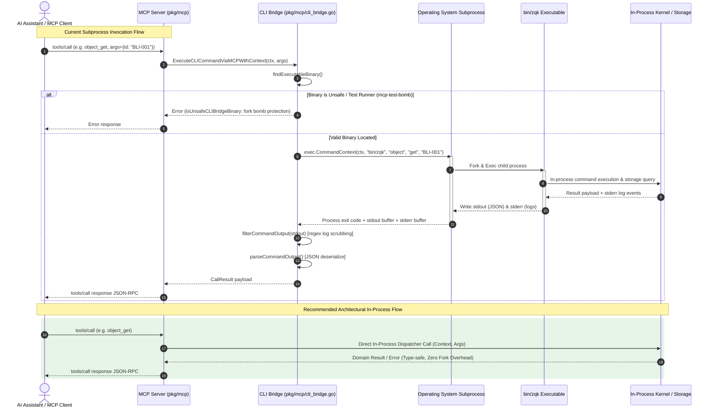

# MCP Subprocess Bridge vs In-Process Component Architecture (Sequence)

```mermaid
sequenceDiagram
    autonumber
    actor Client as AI Assistant / MCP Client
    participant Server as MCP Server (pkg/mcp)
    participant Bridge as CLI Bridge (pkg/mcp/cli_bridge.go)
    participant OS as Operating System Subprocess
    participant Binary as bin/zqk Executable
    participant Kernel as In-Process Kernel / Storage

    Note over Client,Server: Current Subprocess Invocation Flow
    Client->>Server: tools/call (e.g. object_get, args={id: "BLI-001"})
    Server->>Bridge: ExecuteCLICommandViaMCPWithContext(ctx, args)
    Bridge->>Bridge: findExecutableBinary()
    
    alt Binary is Unsafe / Test Runner (mcp-test-bomb)
        Bridge-->>Server: Error (isUnsafeCLIBridgeBinary: fork bomb protection)
        Server-->>Client: Error response
    else Valid Binary Located
        Bridge->>OS: exec.CommandContext(ctx, "bin/zqk", "object", "get", "BLI-001")
        activate OS
        OS->>Binary: Fork & Exec child process
        activate Binary
        Binary->>Kernel: In-process command execution & storage query
        Kernel-->>Binary: Result payload + stderr log events
        Binary-->>OS: Write stdout (JSON) & stderr (logs)
        deactivate Binary
        OS-->>Bridge: Process exit code + stdout buffer + stderr buffer
        deactivate OS
        
        Bridge->>Bridge: filterCommandOutput(stdout) [regex log scrubbing]
        Bridge->>Bridge: parseCommandOutput() [JSON deserialize]
        Bridge-->>Server: CallResult payload
        Server-->>Client: tools/call response JSON-RPC
    end

    Note over Client,Kernel: Recommended Architectural In-Process Flow
    rect rgb(230, 245, 230)
    Client->>Server: tools/call (e.g. object_get)
    Server->>Kernel: Direct In-Process Dispatcher Call (Context, Args)
    Kernel-->>Server: Domain Result / Error (Type-safe, Zero Fork Overhead)
    Server-->>Client: tools/call response JSON-RPC
    end
```
