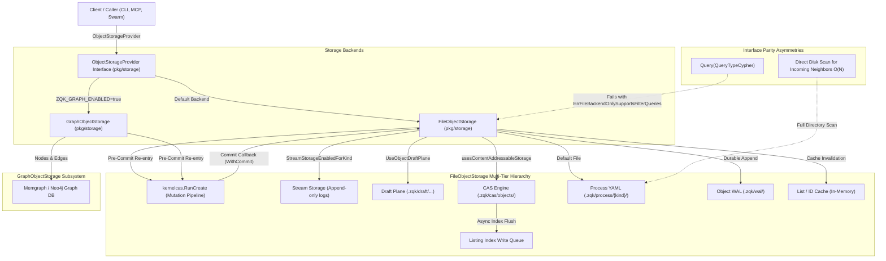

# Multi-Tier Storage Architecture & Mutation Lifecycle (C4-L3)

```mermaid
graph TD
    Client["Client / Caller (CLI, MCP, Swarm)"] -->|ObjectStorageProvider| SPI["ObjectStorageProvider Interface (pkg/storage)"]
    
    subgraph StorageBackends["Storage Backends"]
        SPI -->|Default Backend| FOS["FileObjectStorage (pkg/storage)"]
        SPI -->|ZQK_GRAPH_ENABLED=true| GOS["GraphObjectStorage (pkg/storage)"]
    end

    subgraph FileStorageSubsystem["FileObjectStorage Multi-Tier Hierarchy"]
        FOS -->|Pre-Commit Re-entry| KCAS["kernelcas.RunCreate (Mutation Pipeline)"]
        KCAS -->|"Commit Callback (WithCommit)"| FOS
        
        FOS -->|StreamStorageEnabledForKind| Stream["Stream Storage (Append-only logs)"]
        FOS -->|UseObjectDraftPlane| Draft["Draft Plane (.zqk/draft/...)"]
        FOS -->|usesContentAddressableStorage| CAS["CAS Engine (.zqk/cas/objects/)"]
        FOS -->|Default File| Direct["Process YAML (.zqk/process/{kind}/)"]
        
        CAS -->|Async Index Flush| WriteQueue["Listing Index Write Queue"]
        FOS -->|Durable Append| WAL["Object WAL (.zqk/wal/)"]
        FOS -->|Cache Invalidation| Cache["List / ID Cache (In-Memory)"]
    end

    subgraph GraphStorageSubsystem["GraphObjectStorage Subsystem"]
        GOS -->|Pre-Commit Re-entry| KCAS
        GOS -->|Nodes & Edges| Memgraph["Memgraph / Neo4j Graph DB"]
    end

    subgraph InterfaceParityBreaks["Interface Parity Asymmetries"]
        DirectYAML["Direct Disk Scan for Incoming Neighbors O(N)"] -.->|Full Directory Scan| Direct
        CypherFailure["Query(QueryTypeCypher)"] -.->|Fails with ErrFileBackendOnlySupportsFilterQueries| FOS
    end
```
