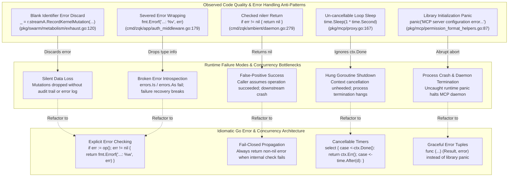

# Error Handling Anti-Patterns and Propagation Failures in ZQK Pipelines

```mermaid
flowchart TD
    subgraph DefectPatterns["Observed Code Quality & Error Handling Anti-Patterns"]
        A["Blank Identifier Error Discard\n_ = r.streamA.RecordKernelMutation(...)\n(pkg/swarm/metabolism/exhaust.go:120)"]
        B["Checked nilerr Return\nif err != nil { return nil }\n(cmd/zqk/ambient/daemon.go:279)"]
        C["Severed Error Wrapping\nfmt.Errorf('...: %v', err)\n(cmd/zqk/app/auth_middleware.go:179)"]
        D["Un-cancellable Loop Sleep\ntime.Sleep(1 * time.Second)\n(pkg/mcp/proxy.go:167)"]
        E["Library Initialization Panic\npanic('MCP server configuration error...')\n(pkg/mcp/permission_format_helpers.go:87)"]
    end

    subgraph FailureConsequences["Runtime Failure Modes & Concurrency Bottlenecks"]
        F["Silent Data Loss\nMutations dropped without audit trail or error log"]
        G["False-Positive Success\nCaller assumes operation succeeded; downstream crash"]
        H["Broken Error Introspection\nerrors.Is / errors.As fail; failure recovery breaks"]
        I["Hung Goroutine Shutdown\nContext cancellation unheeded; process termination hangs"]
        J["Process Crash & Daemon Termination\nUncaught runtime panic halts MCP daemon"]
    end

    subgraph RemediationPattern["Idiomatic Go Error & Concurrency Architecture"]
        K["Explicit Error Checking\nif err := op(); err != nil { return fmt.Errorf('...: %w', err) }"]
        L["Fail-Closed Propagation\nAlways return non-nil error when internal check fails"]
        M["Cancellable Timers\nselect { case <-ctx.Done(): return ctx.Err(); case <-time.After(d): }"]
        N["Graceful Error Tuples\nfunc (...) (Result, error) instead of library panic"]
    end

    A -->|Discards error| F
    B -->|Returns nil| G
    C -->|Drops type info| H
    D -->|Ignores ctx.Done| I
    E -->|Abrupt abort| J

    F -.->|Refactor to| K
    G -.->|Refactor to| L
    H -.->|Refactor to| K
    I -.->|Refactor to| M
    J -.->|Refactor to| N
```
