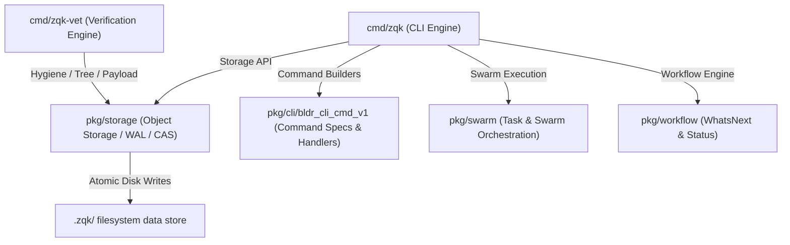

# ZQK Core Subsystems & Containers (C4-L2)

```mermaid
graph TD
    CLI["cmd/zqk (CLI Engine)"] -->|Storage API| Storage["pkg/storage (Object Storage / WAL / CAS)"]
    CLI -->|Command Builders| Builders["pkg/cli/bldr_cli_cmd_v1 (Command Specs & Handlers)"]
    CLI -->|Swarm Execution| Swarm["pkg/swarm (Task & Swarm Orchestration)"]
    CLI -->|Workflow Engine| Workflow["pkg/workflow (WhatsNext & Status)"]
    Vet["cmd/zqk-vet (Verification Engine)"] -->|Hygiene / Tree / Payload| Storage
    Storage -->|Atomic Disk Writes| Filesystem[".zqk/ filesystem data store"]
```
