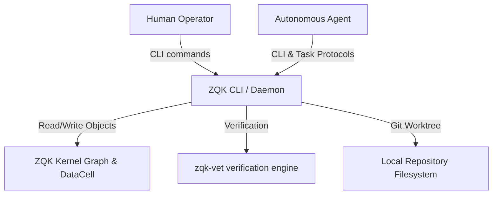

# ZQK System Context (C4-L1)

```mermaid
graph TD
    Operator["Human Operator"] -->|CLI commands| CLI["ZQK CLI / Daemon"]
    Agent["Autonomous Agent"] -->|CLI & Task Protocols| CLI
    CLI -->|Read/Write Objects| Kernel["ZQK Kernel Graph & DataCell"]
    CLI -->|Verification| Vet["zqk-vet verification engine"]
    CLI -->|Git Worktree| Worktree["Local Repository Filesystem"]
```
