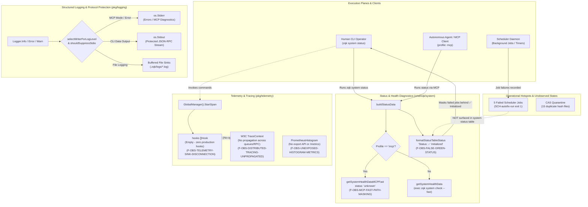

# D-OBS-PIPELINE-01: ZQK Observability Architecture, Diagnostic Flows, and Visibility Gaps

### Architectural Hotspot Summary

1. **False-Green Barrier (`F-OBS-FALSE-GREEN-STATUS`):** The primary human CLI status command (`zqk system status`) evaluates only directory presence for its main status badge, returning `✅ Initialized` even while the background scheduler reports persistent failures in `SCH-autofix-run`.
2. **MCP Fast-Path Disconnection (`F-OBS-MCP-FAST-PATH-MASKING`):** Agents executing with `--context mcp` are routed around system validation checks into `getSystemHealthDataMCPFast`, stubbing status to `unknown` and blinding autonomous agents to kernel degradation.
3. **Telemetry Sink Void (`F-OBS-TELEMETRY-SINK-DISCONNECTION`):** Tracing and metric hooks called by CLI dispatchers are dropped because `GlobalManager` contains zero registered production hooks and `Daemon.Aggregate` is a no-op stub.
4. **Isolated Latency Histograms (`F-OBS-UNEXPOSED-HISTOGRAM-METRICS`):** Exponential histogram buckets for IPC and ghost-drift MTTR cannot be exported or scraped.
5. **Trace Propagation Gap (`F-OBS-DISTRIBUTED-TRACING-UNPROPAGATED`):** W3C TraceContext headers are defined but not passed across storage contexts, worker pools, or daemon RPCs.
