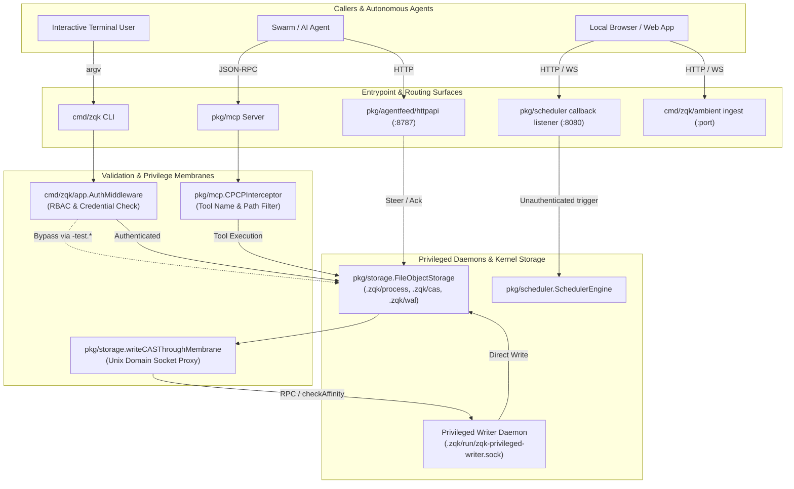

# ZQK Trust Boundaries, Privilege Membranes, and Attack Surfaces

```mermaid
flowchart TD
    subgraph UntrustedCallers["Callers & Autonomous Agents"]
        Agent["Swarm / AI Agent"]
        CLIUser["Interactive Terminal User"]
        BrowserClient["Local Browser / Web App"]
    end

    subgraph EntrySurfaces["Entrypoint & Routing Surfaces"]
        CLI["cmd/zqk CLI"]
        MCP["pkg/mcp Server"]
        HTTPAPI["pkg/agentfeed/httpapi (:8787)"]
        CallbackHTTP["pkg/scheduler callback listener (:8080)"]
        AmbientHTTP["cmd/zqk/ambient ingest (:port)"]
    end

    subgraph Membranes["Validation & Privilege Membranes"]
        AuthMid["cmd/zqk/app.AuthMiddleware\n(RBAC & Credential Check)"]
        CPCP["pkg/mcp.CPCPInterceptor\n(Tool Name & Path Filter)"]
        PWMembrane["pkg/storage.writeCASThroughMembrane\n(Unix Domain Socket Proxy)"]
    end

    subgraph Daemons["Privileged Daemons & Kernel Storage"]
        PWDaemon["Privileged Writer Daemon\n(.zqk/run/zqk-privileged-writer.sock)"]
        StorageEngine["pkg/storage.FileObjectStorage\n(.zqk/process, .zqk/cas, .zqk/wal)"]
        Scheduler["pkg/scheduler.SchedulerEngine"]
    end

    %% Invocations
    CLIUser -->|argv| CLI
    Agent -->|JSON-RPC| MCP
    BrowserClient -->|HTTP / WS| CallbackHTTP
    BrowserClient -->|HTTP / WS| AmbientHTTP
    Agent -->|HTTP| HTTPAPI

    %% Gating
    CLI --> AuthMid
    AuthMid -.->|Bypass via -test.*| StorageEngine
    AuthMid -->|Authenticated| StorageEngine

    MCP --> CPCP
    CPCP -->|Tool Execution| StorageEngine

    StorageEngine --> PWMembrane
    PWMembrane -->|RPC / checkAffinity| PWDaemon
    PWDaemon -->|Direct Write| StorageEngine

    CallbackHTTP -->|Unauthenticated trigger| Scheduler
    HTTPAPI -->|Steer / Ack| StorageEngine
```
