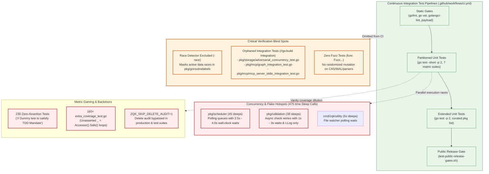

# ZQK Test Execution Architecture, Pipeline Gaps, and Concurrency Flake Hotspots

```mermaid
flowchart TD
    subgraph CIExecution["Continuous Integration Test Pipelines (.github/workflows/ci.yml)"]
        direction TB
        CIVet["Static Gates\n(gofmt, go vet, golangci-lint, payload)"]
        CIPartition["Partitioned Unit Tests\n(go test -short -p 2, 7 matrix suites)"]
        CIExtended["Extended Unit Tests\n(go test -p 2, curated pkg list)"]
        CIPayload["Public Release Gate\n(test-public-release-gates.sh)"]
        
        CIVet --> CIPartition
        CIPartition --> CIExtended
        CIExtended --> CIPayload
    end

    subgraph BlindSpots["Critical Verification Blind Spots"]
        direction TB
        NoRace["Race Detector Excluded (-race)\nMasks active data races in pkg/goroutinelabels"]
        OrphanedTags["Orphaned Integration Tests (//go:build integration)\n- pkg/storage/adversarial_concurrency_test.go\n- pkg/mcp/graph_integration_test.go\n- pkg/mcp/mcp_server_stdio_integration_test.go"]
        NoFuzz["Zero Fuzz Tests (func Fuzz...)\nNo randomized mutation on CAS/WAL/parsers"]
    end

    subgraph FlakeHotspots["Concurrency & Flake Hotspots (475 time.Sleep Calls)"]
        direction TB
        SchedSleep["pkg/scheduler (45 sleeps)\nPolling queues with 2.5s - 4.0s wall-clock waits"]
        ValSleep["pkg/validation (38 sleeps)\nAsync check retries with 1s - 3s waits & t.Log only"]
        UtilSleep["cmd/zqk/utility (6s sleeps)\nFile watcher polling waits"]
    end

    subgraph QualityAntiPatterns["Metric Gaming & Backdoors"]
        direction TB
        TDDStubs["230 Zero-Assertion Tests\n('// Dummy test to satisfy TDD Mandate')"]
        ExtraCoverage["160+ extra_coverage_test.go\n(Unasserted _ = Accessor().Safe() loops)"]
        AuditBypass["ZQK_SKIP_DELETE_AUDIT=1\nDelete audit bypassed in production & test suites"]
    end

    CIExecution -. "Omitted from CI" .-> BlindSpots
    CIPartition -. "Parallel execution races" .-> FlakeHotspots
    CIPartition -. "Vanity coverage dilution" .-> QualityAntiPatterns

    classDef warning fill:#ffebee,stroke:#c62828,stroke-width:2px;
    classDef gap fill:#fff3e0,stroke:#e65100,stroke-width:2px;
    classDef pass fill:#e8f5e9,stroke:#2e7d32,stroke-width:1px;

    class BlindSpots,NoRace,OrphanedTags,NoFuzz gap;
    class FlakeHotspots,SchedSleep,ValSleep,AuditBypass,TDDStubs,ExtraCoverage warning;
    class CIExecution,CIVet,CIPartition,CIExtended,CIPayload pass;
```
