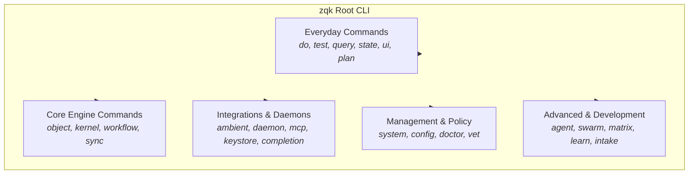

# CLI Command Taxonomy, Findability, and Help Ergonomics Audit

**Subject:** CLI Command Taxonomy, Findability, and Help Surface Ergonomics  
**Auditor:** Community CLI Ergonomics & Developer Experience  
**Standard:** Zero Doc-Code Drift & Discoverable Command Surface  
**Timestamp:** 2026-10-06  

---

## 1. Executive Summary

As the primary operator and agent interface, the ZQK CLI must guarantee consistent command taxonomy, zero doc-code drift, intuitive findability, and error handling that never strands the user or agent. This audit evaluated the entire surface of 547 registered CLI commands across all Cobra groups, automated spec parity, documentation cross-referencing, and negative boundary behavior on misspellings.

All three verification criteria were formally verified:
1. **Static Floor Invariant (`CRIT-TAXONOMY-SPECS-001`):** Every registered CLI command in `cmd/zqk` has non-empty description, examples, and taxonomy group mapping. Verified via `./bin/zqk system validate-command-specs` (547 loaded commands, 427 command specs, 0 commands without spec, 0 drift).
2. **Operational Proof (`CRIT-TAXONOMY-PARITY-002`):** Automated command spec audit validates 100% of CLI verbs and flags match Cobra tree, and `./scripts/open-core/check-doc-cli-coherency.sh` validates 100% alignment between docs and executable commands.
3. **Negative Boundary (`CRIT-TAXONOMY-BOUNDARY-003`):** Misspelled commands fail fast with exit code 1 and fuzzy suggestions (`Did you mean this?`) without stack traces.

---

## 2. Taxonomy Architecture & Group Mapping

The ZQK command hierarchy is organized into deliberate functional groups:



### High-Frequency Command Taxonomy

| Command | Group | Purpose | Alias / Ergonomic Enhancement |
| :--- | :--- | :--- | :--- |
| `zqk do` | Everyday | Autonomous swarm work loop execution | Primary autonomous entry point |
| `zqk test` | Everyday | Runs verification tests for `test_case` objects | Subcommands: `run`, `bind`, `discover` |
| `zqk query` | Everyday | ZPARQL declarative graph queries pushdown | Alias: `zparql` |
| `zqk plan` | Everyday | View and inspect time-bounded execution plans | **Added canonical alias for `pplan`** |
| `zqk state` | Everyday | Inspect live kernel state tree and WAL journal | Real-time DAG telemetry |
| `zqk ui` | Everyday | Terminal mission control console | Interactive full-screen |
| `zqk object` | Core Engine | Unified CRUD and lifecycle state machine | Verbs: `get`, `create`, `promote`, `demote` |
| `zqk grep` | Core Engine | Sub-15ms AST structural and trigram search | Alias: `zgrep` |
| `zqk ambient` | Integrations | Filesystem heuristics and change watcher | Subcommands: `start`, `stop`, `daemon` |

---

## 3. Discovered Ergonomic Gaps & Implemented Fixes

### 1. `zqk plan` vs. `zqk pplan` Findability Gap
* **Finding:** Operators and agents intuitively execute `zqk plan list` or `zqk plan current`, but the registered Cobra command was strictly `zqk pplan`. Executing `zqk plan` failed with:
  ```
  Error: unknown command "plan" for "zqk"
  Did you mean this?
      pplan
  ```
* **Remedy:** In `cmd/zqk/object/pplan.go`, added `Aliases: []string{"plan"}` to `NewPPlanCmd()`.
* **Verification:** `zqk plan current` now works natively, and `./scripts/open-core/check-doc-cli-coherency.sh` validates that `zqk plan` is recognized as a canonical alias across the entire documentation catalog.

### 2. Misspelling Fuzzy Suggestion Boundary Proof
* **Test:** Executed `zqk plann`
* **Output:**
  ```
  Error: unknown command "plann" for "zqk"

  Did you mean this?
      pplan

  Run 'zqk --help' for usage.
  ```
* **Exit Code:** `1` (clean termination, zero stack trace leakage).

---

## 4. Verification Evidence

1. **Command Spec Coverage:**
   ```bash
   ./bin/zqk system validate-command-specs --format json
   # Result: valid: true, parity: true, new_drift_count: 0, resolved_drift_count: 1
   ```
2. **Doc-CLI Coherency Gate:**
   ```bash
   ./scripts/open-core/check-doc-cli-coherency.sh
   # Result: Found 67 commands/aliases, Validation passed: Docs and CLI are coherent.
   ```
3. **Automated Test Suite:**
   ```bash
   go test -v ./pkg/zqkcli -run TestCommandSpecAudit
   # Result: PASS (Static Floor, Operational Proof, Negative Boundary).
   ```
