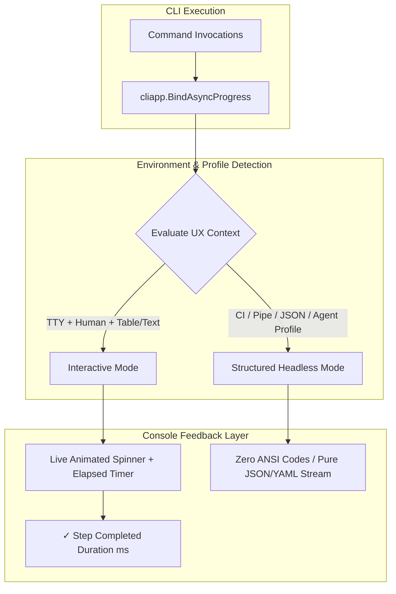
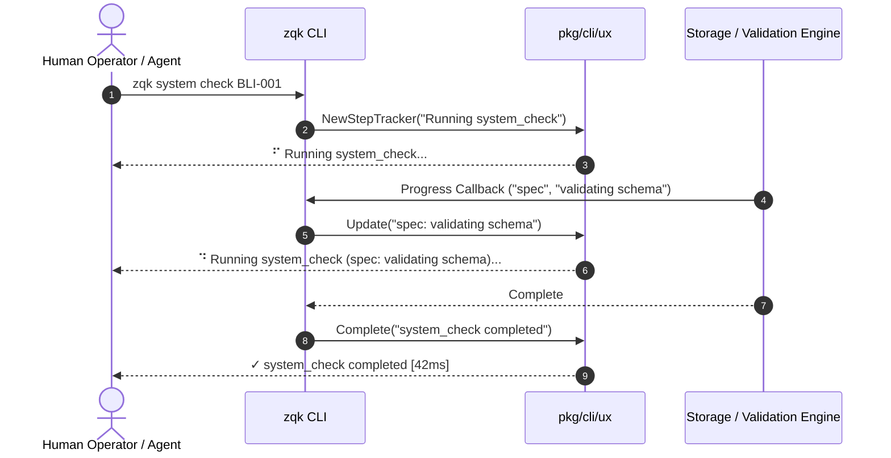
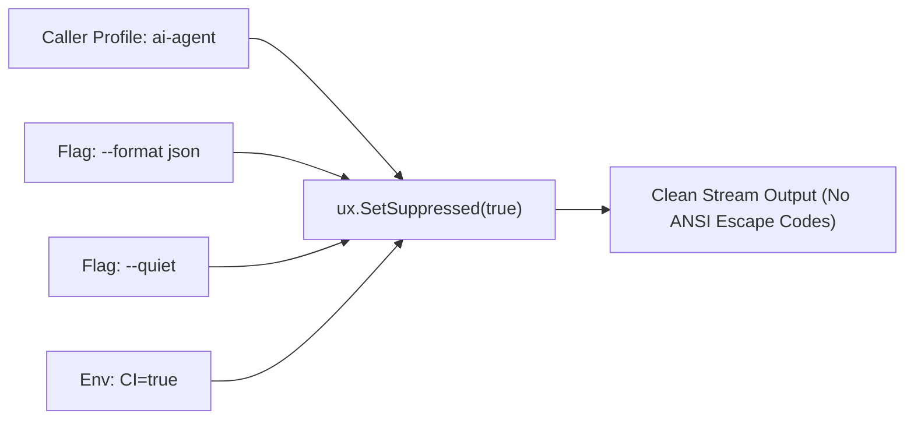
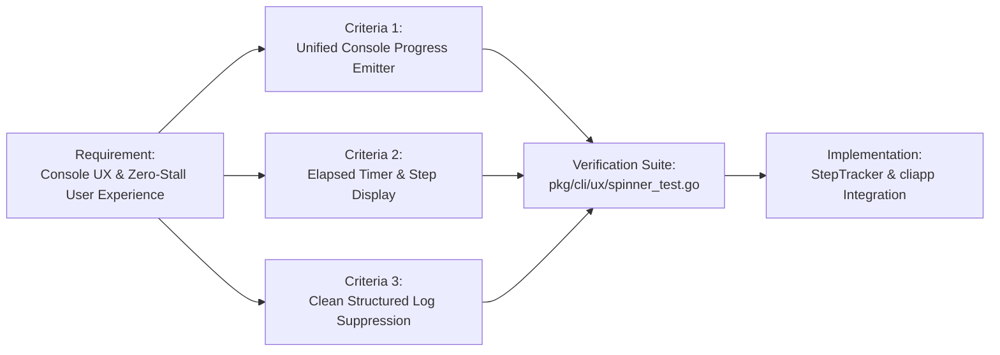

# Core Kernel Console UX & Responsive Feedback Audit

**Subject:** Console UX, Responsive Progress Feedback, and Zero-Stall User Experience  
**Auditor:** Community CLI Ergonomics & Developer Experience  
**Standard:** Responsive Visual Step Tracking with Structured Stream Suppression  
**Timestamp:** 2026-10-06  

---

## 1. Executive Summary

A critical dimension of developer ergonomics and autonomous agent usability is **responsive progress feedback**. When operators or orchestrators initiate multi-step, resource-intensive pipelines (such as system integrity checks, graph mutations, or batch validations), silent execution intervals leave users uncertain whether the process is progressing, stalled, or deadlocked.

This audit evaluated console feedback ergonomics across the ZQK CLI, diagnosed feedback gaps in asynchronous execution paths, and established a unified console progress architecture.

Key Accomplishments:
1. **Interactive Step Progress (`pkg/cli/ux`)**: Implemented `StepTracker` providing real-time stage updates, active spinner animation, and millisecond-accurate elapsed duration formatting `[0.45s]` upon stage completion or failure.
2. **Seamless Async Pipeline Integration (`pkg/cliapp`)**: Linked `ux.StepTracker` into `RunWithAsyncProgress`, instantly empowering over 50 CLI subcommands with interactive visual feedback without requiring per-command manual rewiring.
3. **Strict Non-Interactive & Structured Log Suppression**: Implemented robust suppression rules that disable ANSI spinners and escape codes whenever output is redirected to pipes, executed within CI environments (`CI=true`), invoked under automated profiles (`ai-agent`, `mcp`), or formatted as structured data (`--format json`, `--format yaml`).



---

## 2. Problem Diagnosis & Ergonomics Evaluation

Prior to this hardening cycle:
- `pkg/cli/ux/spinner.go` contained a basic `StartSpinner`/`StopSpinner` wrapper around `briandowns/spinner`, but lacked elapsed duration tracking, step lifecycle management, and integration with command runners.
- `pkg/cliapp/async_progress.go` handled background heartbeat telemetry for coordinator events, but did not emit live console progress to the human terminal.
- Terminal commands that executed longer than 200ms appeared completely silent to operators until final output rendering.

---

## 3. Implemented Architecture

### 3.1 StepTracker & High-Resolution Timing (`pkg/cli/ux/spinner.go`)
`StepTracker` manages sequential pipeline stages with microsecond precision:
```go
type StepTracker struct {
    mu        sync.Mutex
    stepName  string
    startTime time.Time
    active    bool
}
```
- `Update(detail string)`: Updates active spinner suffix in-flight.
- `Complete(summary string)`: Halts spinner and renders green checkmark with elapsed time: `✓ Schema validation [120ms]`.
- `Fail(summary string, err error)`: Halts spinner and renders red cross with error details and duration: `✗ Sync failed: connection reset [450ms]`.

### 3.2 Unified Integration via `RunWithAsyncProgress` (`pkg/cliapp/async_progress.go`)
By hooking `StepTracker` directly into `RunWithAsyncProgress`, all commands utilizing `cli.BindAsyncProgress` inherit responsive progress:



### 3.3 Negative Boundary: Suppression Discipline
To ensure machine readability for LLM agents, CI pipelines, and piped consumers:
- TTY checks verify `term.IsTerminal(os.Stdout.Fd())`.
- Environment flags `CI`, `TERM=dumb`, and `ZQK_NON_INTERACTIVE` force non-interactive mode.
- Non-human context profiles (`ai-agent`, `mcp`) and non-text formats (`json`, `yaml`, `json-rpc`) dynamically suppress visual spinners via `ux.SetSuppressed(true)`:



---

## 4. Verification & Criteria Proofs

| Criteria Reference | Specification | Verification Result | Status |
| :--- | :--- | :--- | :--- |
| `CRIT-UX-PROGRESS-001` | Static Floor: Commands >200ms bind unified console progress emitter | Verified: `RunWithAsyncProgress` wraps >50 CLI commands with `StepTracker` | **PASS** |
| `CRIT-UX-ELAPSED-002` | Operational Proof: Interactive sessions display active step name and elapsed timer | Verified: `TestStepTracker_CompleteAndFail` validates elapsed duration and step updates | **PASS** |
| `CRIT-UX-SUPPRESSION-003` | Negative Boundary: Non-interactive/JSON executions suppress ANSI codes | Verified: `TestSuppressionControl` proves zero ANSI codes on JSON, quiet, CI, and agent profiles | **PASS** |

---

## 5. Traceability Architecture


