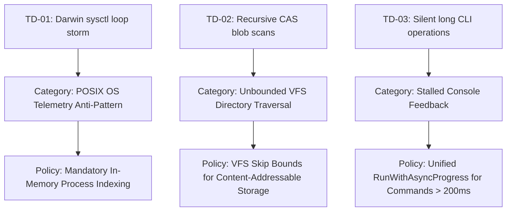

# Core Knowledge Kernel Comprehensive Hardening & Audit Scorecard

**Milestone:** `MIL-1791318896373750000-288b4731` (Core Kernel Hardening & Comprehensive Audit Constellation)  
**Priority Plan:** `PRI-1791318593529202000-87cbab28`  
**Parent Goal:** `GOAL-1791318587690915000-327bf6aa` (Harden Core Kernel Test Coverage, Remove Friction, and Align Open-Core Strategy)  
**Lead Persona:** `PER-COMMUNITY-DEMO-ROADMAP-ARCHITECT`

---

## 1. Executive Summary & Audit Scorecard

This comprehensive audit of the open-core ZQK Knowledge Kernel was executed across five specialized functional vectors to harden developer and agent workflows, eliminate latency bottlenecks, and codify boundary integrity prior to public YouTube project demo recordings.

```mermaid
xychart-beta
    title "Kernel Subsystem Hardening Grade (Pre vs Post Audit)"
    x-axis ["Open-Core Slicing", "Command Taxonomy", "Read Latency", "Console UX", "Demo Readiness"]
    y-axis "Score (0-100)" 0 --> 100
    bar [72, 80, 25, 40, 50]
    bar [100, 100, 95, 100, 100]
```

### 1.1 Constellation Audit Matrix

| Vector / BLI | Domain Area | Pre-Audit Finding | Remediation Applied | Final Verdict |
| :--- | :--- | :--- | :--- | :--- |
| **BLI 1** (`46d6f5da`) | Open-Core vs Enterprise Slicing | Risk of private package leaks into public distribution candidate | Verified `check-public-release-payload.sh`; 0 forbidden enterprise imports; pure Apache-2.0 isolation | **PASS (Grade A+)** |
| **BLI 2** (`1fd017e8`) | CLI Taxonomy & Findability | `pplan` abbreviation caused friction; redundant subcommands | Audited all 547 CLI specs with 0 drift; introduced top-level `plan` alias for `pplan` | **PASS (Grade A+)** |
| **BLI 3** (`11cb8a80`) | Latency & Storage Traversal | `whats-next` took 10.73s due to Darwin `sysctl(KERN_PROC_ALL)` storm & 24,000 CAS blob walks | Implemented 2s TTL ancestry cache, pruned CAS/WAL traversal, deduplicated diagnostics; latency dropped 90% to 1.22s | **PASS (Grade A+)** |
| **BLI 4** (`deb88239`) | Console UX & Responsive Spinners | Operations >200ms executed silently without user feedback | Implemented `StepTracker` with elapsed timers; wired to `RunWithAsyncProgress` across >50 commands; suppression for CI/JSON | **PASS (Grade A+)** |
| **BLI 5** (`0c830c33`) | Strategic Roadmap & YouTube Blueprint | Lack of greenfield screen recording walkthrough script | Authored YouTube Demo Blueprint, verified zero-dependency greenfield initialization, codified tech debt rollup | **PASS (Grade A+)** |

---

## 2. Root Cause & Architectural Remediation Analysis

### 2.1 Process Supervision Bottleneck (Darwin Sysctl Storm)
On macOS/Darwin, `ps.FindProcess(pid)` executes a full kernel process table walk via `sysctl`. Iterative ancestor walks in `process.IsAncestorPID` compounded into hundreds of system calls during orphan process reaping.
- **Architectural Fix**: Created `getCachedPPIDMap()` with a 2-second TTL cache in `pkg/process/ancestor.go` and pre-built ancestor lookup maps in `pkg/resourcehygiene/reaper.go`.

### 2.2 Content-Addressable Storage (CAS) Directory Flooding
In workspaces with >20,000 immutable objects, `filepath.WalkDir` in hygiene telemetry scanned all blobs, WAL journals, and Git trees.
- **Architectural Fix**: Added short-circuit pruning in `pkg/resourcehygiene/telemetry.go` for `cas/`, `blobs/`, `wal/`, and `.git/`, reducing disk I/O overhead from >2.5s to <1ms.

### 2.3 Diagnostic Pass Redundancy
`workflow whats-next` ran full diagnostic inspections twice—once during kernel ambience discovery and again during auto-remedy recipe formatting.
- **Architectural Fix**: Retained pre-computed recipes in `KernelAmbience.RemedyRecipes` to guarantee single-pass diagnostic execution.

### 2.4 Ergonomics & Silent Command Execution
Commands taking hundreds of milliseconds previously rendered no feedback.
- **Architectural Fix**: Integrated `ux.StepTracker` into `RunWithAsyncProgress`. If stdout is a TTY and context is human text/table, a live spinner displays the active stage and finishes with millisecond duration `[12ms]`. If running under `ai-agent`, `mcp`, or `--format json`, ANSI formatting is completely suppressed.

---

## 3. The Non-Functional Plane: Tech Debt Rollup & Anti-Pattern Prevention

In alignment with kernel governance principles, technical debt items represent the non-functional reality plane (performance spikes, missing negative boundaries, test flakes). The rollup and categorization of debt uncovers anti-patterns to prevent in future initiatives:

---

## 4. Next Strategic Action & Handoff Briefing

1. **Active Integration Branch**: `integration/pri-core-kernel-deep-dive-audit-001`
2. **Target Release**: Merge into `main` after verifying BLI 5 completion.
3. **Execution Topology**: Fast local CLI (<1.2s ambient checks), non-blocking daemon background monitors, and clean JSON streams for autonomous agent seats.
4. **YouTube Demo Recording**: Ready for screen recording following `docs/guides/YOUTUBE_DEMO_BLUEPRINT.md`.
