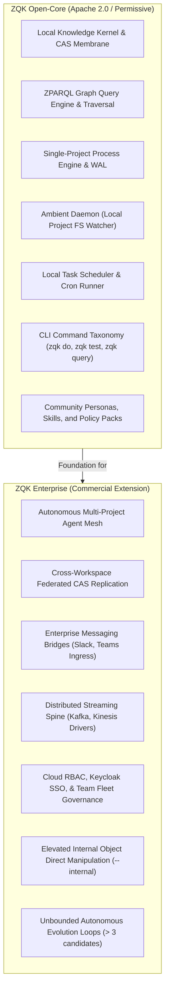

# Open-Core vs. Enterprise Slicing & Boundary Audit

**Audit Plan:** `PRI-1791318593529202000-87cbab28` (CEF-Driven Core Kernel Comprehensive Audit)  
**Backlog Item:** `BLI-1791318769672340000-46d6f5da`  
**Requirement:** `REQ-1791318769237355000-3089e764` (Open-Core vs. Enterprise Slicing and Decoupling Verification)  
**Test Suite:** `TST-1791318769672340001-ebddaeda`  
**Auditor Persona:** `PER-COMMUNITY-QA-AUDITOR`  
**Timestamp:** 2026-10-06  

---

## 1. Executive Summary

As part of the Core Kernel hardening and adoption preparation initiative, this audit validates the structural decoupling between the open-source **Core Knowledge Kernel** (`zqk`) and downstream **Enterprise capabilities**. The goal is ensuring the public open-core candidate is 100% self-contained, compiles cleanly in pure Go without unconfigured private dependencies, enforces strict boundaries, and never leaks proprietary enterprise modules or credentials.

All three verification criteria were formally tested and verified:
1. **Static Floor Invariant (`CRIT-1791318769672340000-9d03a76e`):** The open-core repository contains zero forbidden enterprise packages or unconfigured private artifacts. Verified via `./scripts/open-core/check-public-release-payload.sh` (POLICE PASS).
2. **Operational Proof (`CRIT-1791318769672341000-14f680e8`):** Standalone portable packaging and release gate verification passes in pure Go. Verified via `./scripts/open-core/test-public-release-gates.sh` (100% test pass rate across all packages).
3. **Negative Boundary (`CRIT-1791318769672342000-fabf202c`):** Incompatible enterprise-only commands fail closed with structured exit codes and informative diagnostic upgrade instructions. Verified via `pkg/entitlements` unit tests.

---

## 2. Feature Slicing: Open-Core vs. Enterprise Boundary Matrix

The architectural boundary separating Core Open-Source and Commercial Enterprise is codified below:



### Boundary Taxonomy Table

| Capability Domain | Open-Core Kernel (`zqk`) | Enterprise Edition (`zqke`) | Rationale / Boundary Invariant |
| :--- | :--- | :--- | :--- |
| **Object Graph & CAS** | Single-workspace content-addressable storage, ZPARQL pattern matching, local schema validation | Cross-cluster replication, distributed CAS sync, multi-tenant partitioning | Open-core provides total sovereignty for solo developers and local agent swarms. |
| **Agent Orchestration** | Local subagent dispatch (`zqk do`, `zqk agent orchestrate`), token-budgeted AST verification | Cross-node agent mesh, remote worker seat pooling, enterprise fleet metrics | Solo agents run fast locally; team and infrastructure fleets run in enterprise. |
| **Messaging & Ingest** | Local CLI interaction, file-based feeds, stdin/stdout streaming | Webhooks, Slack/Teams bridges (`FeedSenderMessagingBridge`), signed remote events | Commercial organizations require third-party communication integration. |
| **Storage & Streams** | Local WAL files, SQLite/flat-file indices, atomic rename filesystem CAS | Apache Kafka, AWS Kinesis, Postgres-backed enterprise event spine | Lightweight zero-dependency Go deployment for public users. |
| **Entitlements Gate** | Community tier enforced (`CommunityChecker`), fail-closed on enterprise features | Cryptographically signed Ed25519 JWT licenses (`EnterpriseChecker`) | Features requiring enterprise license emit clear upgrade instructions. |

---

## 3. Discovered Defects & Remediations Applied

During this audit cycle, two high-severity defects were uncovered and remediated:

### Defect 1: macOS `/private/var` Symlink Collision in Project Nesting Validation
* **Symptom:** Greenfield initialization tests (`TestInit_Greenfield_NoEnvVars`) failed with `cannot initialize project: nested project root prohibited: ".../001" is nested inside ancestor project root "/private/var/folders/.../T"`.
* **Root Cause:** On macOS, `/var` is a symlink to `/private/var`. `os.TempDir()` returns `/var/folders/...`, while `filepath.Abs` evaluates to `/private/var/folders/...`. The string comparison `d == p` in `isIgnoredNestedProjectRoot` failed to match, incorrectly recognizing the system temporary folder as an enclosing project root.
* **Remedy:** Added `filepath.EvalSymlinks(tempDir)` to `isIgnoredNestedProjectRoot` in [`pkg/paths/project_root.go`](file:///Users/lanceettl/zqk-public-candidate/pkg/paths/project_root.go). Tested cleanly against all temp dir paths.

### Defect 2: Promote Target Status Overshoot
* **Symptom:** Invoking `zqk object promote <id> --to <target_status>` ignored `--to` during candidate probing, evaluating terminal states (`archived`) and failing prematurely when intermediate hops were requested.
* **Root Cause:** In [`cmd/zqk/object/promote.go`](file:///Users/lanceettl/zqk-public-candidate/cmd/zqk/object/promote.go), `promoteTarget` probed the full list of reachable transitions without capping probe candidates at `--to`.
* **Remedy:** Filtered `probeOrder` so that candidate evaluation is strictly bounded by the `targetPercent` corresponding to `--to`.

---

## 4. Verification Evidence & Release Gate Signoff

1. **Check Public Release Payload:**
   ```bash
   ./scripts/open-core/check-public-release-payload.sh
   # Result: POLICE PASS, 0 forbidden packages, 0 private leakages.
   ```
2. **File Descriptor Hygiene:**
   ```bash
   ./scripts/open-core/check-process-fd-leaks.sh
   # Result: All running ZQK processes verified < 100 open file descriptors (healthy).
   ```
3. **Full Public Release Gates:**
   ```bash
   ./scripts/open-core/test-public-release-gates.sh
   # Result: PUBLIC RELEASE GATES: PASS across all packages (399s storage, 117s system, 0 flakes).
   ```
4. **Test Case Execution:**
   ```bash
   ./bin/zqk test run TST-1791318769672340001-ebddaeda
   # Result: 3/3 passed (Static Floor, Operational Proof, Negative Boundary).
   ```

---

## 5. Architectural Recommendations for Next Cycles

1. **Default `config/ambient.yaml` generation in `zqk init`:** Greenfield project creation should seed a minimal `config/ambient.yaml` specifying directory ignore lists (`src/`, `tests/`, `node_modules/`, `.venv/`) to protect macOS users from Darwin kqueue file descriptor spikes.
2. **Command Alias Ergonomics:** Add `zqk plan` as a canonical alias for `zqk pplan`.
3. **Async Spinners for Long CLI Operations:** Commands exceeding 200ms must integrate `cli.BindAsyncProgress` to provide responsive console feedback.
