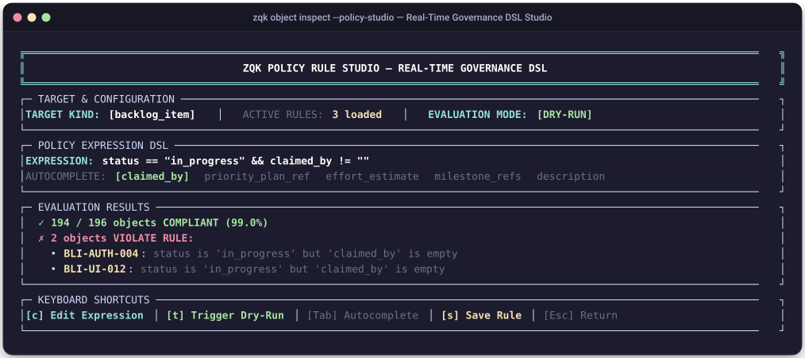

# Technical Specification: ZQK Interactive Object Inspector Console & Policy Studio

**Document ID:** `SPEC-OBJECT-INSPECTOR-CONSOLE-001`  
**Status:** Approved Architectural Specification  

---

## 1. Executive Summary & Vision

The **ZQK Knowledge Kernel** models all system artifacts (requirements, backlog items, priority plans, test cases, criteria, policies, prompts, personas, telemetry records) as discrete, typed objects governed by schema contracts, CAS storage, and lifecycle state machines.

Currently, human developers and autonomous agents inspect objects using CLI listing and retrieval commands:

- **Entity Listing**: `zqk object list [kind] --fields id:30,title:40,status:12 --filter ... --sort-by ...`
- **Entity Retrieval**: `zqk object get [kind] [id] -f yaml`

While powerful and scriptable, these existing surfaces impose high cognitive friction:

- **Human Friction**: Memorizing column widths, quoting filter arguments, and parsing massive raw YAML dumps cluttered with transport boilerplate (`metadata`, `etag`, `storage_profile`, `created_at_epoch`).
- **Agent Friction**: Token waste ingesting noisy unstructured YAML payloads when only essential attributes, relations, and current lifecycle state are needed.
- **Governance Friction**: Writing and validating policy constraints and CPCP boundary rules in text files without live dry-run validation against repository state.

The **ZQK Object Inspector** (`zqk object inspect` / `zqk ui --tab inspector`) delivers:

1. **Terminal Design System (TDS) Console**: Full-screen console for browsing any kernel kind with responsive keyboard navigation, instant status filtering, column cycling, and master-detail splits.
2. **Modular Property Modules**: Canonical rendering components for common complex structures (Lineage & Traceability Radar, CAS Storage Hygiene, Ontology Linkages, Role Entitlements).
3. **Role & Account Gated Action Palette**: Interactive state transitions, work claiming, and editor hooks gated by the active `SecurityContext`.
4. **Live Policy Rule Studio**: Interactive visual builder for validation DSL expressions with field auto-completion from `FieldRegistry` and real-time dry-run impact evaluation across active kernel objects.
5. **Dual Machine/Human Architecture**: Full-color ANSI TUI for human pair programming, paired with reduced semantic JSON/YAML projections (`--format json`) for autonomous agents.

---

## 2. Architecture & Domain Grammar

### 2.1 CLI Taxonomy & Command DNA

Conforming to `docs/architecture/CLI_COMMAND_TAXONOMY_STANDARDS.md`:

```bash
# Standalone CLI Entry Point
zqk object inspect [kind] [id] [flags]

# Aliases
zqk inspect [kind] [id]
zqk object browser [kind]
```

#### Command Flags & Invariants

| Flag | Short | Type | Default | Description |
| :--- | :--- | :--- | :--- | :--- |
| `--kind` | `-k` | `string` | `""` | Initial object kind to browse (e.g. `backlog_item`, `policy`). |
| `--id` | — | `string` | `""` | Jump directly into modal inspection for a specific object ID. |
| `--filter` | — | `stringArray` | `[]` | Filter expressions (`status=active`, `priority_tier=P0`). |
| `--sort-by` | — | `string` | `updated_at` | Sort field name. |
| `--sort-asc` | — | `bool` | `false` | Sort ascending (default is descending / newest first). |
| `--policy-studio` | — | `bool` | `false` | Launch directly into the Policy Rule Studio. |
| `--format` | `-f` | `string` | `table` | Output format: `table` (interactive TUI), `json`, `yaml`, `semantic-link`. |

---

## 3. Terminal User Interface (TUI) Layout & Interaction Model

### 3.1 Master-Detail Layout Specification

The Object Inspector operates in two primary modes: the **Main Scoreboard Table** for browsing entities of a selected kind, and the **Deep Inspection Modal** for drilling down into an entity's internal attributes, lineage, CAS provenance, and action palette.

#### Visual Terminal Screenshot: Object Inspector Scoreboard


#### Datapoint Breakdown & Operator Guidance

| Datapoint / Component | Visual Format | Semantic Meaning | Why It Is Useful & Operational Purpose |
| :--- | :--- | :--- | :--- |
| **Header Banner** | Double-line cyan box (`╔...╗`) | Active console context and application title | Confirms console subsystem identity and terminal width bounds. |
| **Kind Selector** | Cyan tag (`[backlog_item]`) | Active object kind being browsed | Indicates which schema registry definition governs displayed columns and filters. Press <kbd>Tab</kbd> to cycle. |
| **Filter Pills** | Pill list (`[ALL]`, `[ACTIVE]`, `[DRAFT]`, `[BLOCKED]`, `[COMPLETE]`) | Active lifecycle status filter | Prunes clutter so operators and agents focus on actionable workstreams. Press <kbd>f</kbd> to cycle. |
| **Sort Criterion** | Yellow badge (`[updated_at ▼]`) | Ordering property and sort direction | Identifies temporal or priority ranking. Press <kbd>s</kbd> to toggle ascending/descending. |
| **Inline Search** | Green prompt (`[/cas█]`) | Interactive substring and regex filter query | Filters rows in real-time across ID, title, and body attributes. |
| **Cursor Indicator** | Bright cyan arrow (`>`) | Currently focused object row | Marks the item that will be targeted upon pressing <kbd>Enter</kbd> for deep inspection. |
| **Table Scoreboard** | Standardized TDS Table (`┌...┐`) | Multi-column entity overview | Displays ID, lifecycle status, priority tier, title, and relative age with guaranteed column width bounds. |
| **Status Badge** | Color-coded status pill (`complete`, `in_progress`, `planned`, `blocked`) | Lifecycle state machine position | Visual indication of workflow progression. |
| **Priority Tier** | Color pill (`P0`, `P1`, `P2`) | Urgency and triage classification | Highlights mission-critical blockers (`P0`) vs standard backlog tasks. |
| **Action Footer** | Keycap menu (`[Enter] Deep Inspection`, `[p] Policy Studio`, `[q] Quit`) | Available keyboard accelerator bindings | Provides single-keypress hotkeys for fast operator navigation without leaving the terminal. |

#### Visual Terminal Screenshot: Deep Inspection Modal (<kbd>Enter</kbd>)


#### Datapoint Breakdown & Operator Guidance

| Datapoint / Component | Visual Format | Semantic Meaning | Why It Is Useful & Operational Purpose |
| :--- | :--- | :--- | :--- |
| **Entity Title & Status** | Top status banner with state icon | Selected object ID and current lifecycle state | Immediate identification of inspected node and its operational readiness. |
| **Lineage Radar** | Upward/downward tree nodes | Complete graph chain (`Goal ➔ Req ➔ BLI ➔ Test ➔ Criteria`) | Guarantees unbroken traceability and Definition of Done compliance before promotion. |
| **Integrity Badge** | Green check (`✓ 100% INTACT`) | Graph connectivity and constraint health | Confirms that the entity has no orphaned references or cyclic dependencies. |
| **CAS Provenance** | Hex SHA-256 hash & byte metrics | Content-addressed storage fingerprint and plane (`authoritative` vs `draft`) | Cryptographic audit trail verifying immutable CAS storage state. |
| **Action Palette** | Interactive hotkey list (`[p] Promote`, `[c] Claim`, `[e] Edit`) | Valid next-state lifecycle mutations | Executes atomic state transitions directly from keyboard without manual CLI typing. |

### 3.2 Navigation & Keyboard Shortcuts

| Key Binding | Target Action | Behavior & Operational Semantics |
| :--- | :--- | :--- |
| <kbd>Tab</kbd> / <kbd>Shift+Tab</kbd> | Cycle Schema Kind | Cycles through registered kernel kinds (`backlog_item` ➔ `requirement` ➔ `policy` ➔ `test_case`...). |
| <kbd>j</kbd> / <kbd>k</kbd> or <kbd>↓</kbd> / <kbd>↑</kbd> | Move Cursor | Moves the active row selection cursor (`▶`) up or down through the scoreboard list. |
| <kbd>f</kbd> | Filter by Status | Toggles status filter selector (`ALL`, `ACTIVE`, `DRAFT`, `BLOCKED`, `COMPLETE`). |
| <kbd>/</kbd> | Interactive Search | Opens real-time substring and regex search prompt across entity attributes. |
| <kbd>s</kbd> | Cycle Sort Field | Cycles ordering criteria (`updated_at` ➔ `created_at` ➔ `id` ➔ `priority`). |
| <kbd>Enter</kbd> | Deep Inspection | Opens the modal inspector and role-gated action palette for the selected object. |
| <kbd>e</kbd> | External Editor | Opens the object definition in `$EDITOR` for direct YAML editing. |
| <kbd>q</kbd> / <kbd>Esc</kbd> | Return / Exit | Dismisses active modal dialog or exits the console. |

---

## 4. Modular Display Modules

The Inspector decomposes verbose raw YAML into standardized TDS visual modules:

### 4.1 Module 1: Lineage & Traceability Radar

- **Upward References**: Dynamically queries `priority_plan_ref`, `goal_refs`, and `requirement_refs`.
- **Downward Bindings**: Traverses downstream `test_case` and `criteria` links.
- **Visual Traceability Chain**: Renders the complete end-to-end graph sequence:
  ```
  [Goal] ➔ [Requirement] ➔ [Backlog Item] ➔ [Test Case] ➔ [Criteria]
  ```
- **Integrity Status**: Displays connectivity badges such as `[✓ INTACT]` or `[✗ BROKEN: missing root]`.

### 4.2 Module 2: CAS Storage & Cryptographic Hygiene

- **Digest Verification**: Content-addressed SHA-256 hash and integrity status.
- **Storage Plane**: Distinguishes between `draft` plane and `authoritative` CAS master.
- **Storage Metrics**: Encapsulates byte footprint, POSIX permissions (`0644`), and line counts.
- **Mutation Tracking**: Tracks ETag revision identifier and last modified timestamp.

### 4.3 Module 3: Security & Role-Gated Action Palette (<kbd>Enter</kbd>)

Evaluates `proc.SecurityContext()` against the target object to present authorized state mutations:

- **Status Transition**: Lists valid next-state transitions permitted by the entity's lifecycle state machine.
- **Work Claiming**: Assigns or unassigns `claimed_by` to the authenticated caller identity.
- **Draft Promotion**: Invokes `storage.Promote` when operating on draft objects.
- **Authorization Guarding**: Disables unauthorized options with explanatory badges (e.g. `[Requires Role: Admin]`).

---

## 5. Live Policy Rule Studio (`--policy-studio`)

### 5.1 Concept & Workflow

Writing validation policies in raw YAML is error-prone. The **Policy Rule Studio** turns policy creation and testing into an interactive, fail-closed IDE experience.

#### Visual Terminal Screenshot: Policy Rule Studio



#### Datapoint Breakdown & Operator Guidance

| Datapoint / Component | Visual Format | Semantic Meaning | Why It Is Useful & Operational Purpose |
| :--- | :--- | :--- | :--- |
| **Header Banner** | Double-line cyan box (`╔...╗`) | Policy Studio subsystem identifier | Confirms active governance and DSL editing environment. |
| **Target Kind** | White badge (`[backlog_item]`) | Schema kind evaluated by the active rule | Binds DSL field autocompletion to the exact attribute definitions of this kind. |
| **Active Rules** | Yellow count pill (`3 loaded`) | Number of active policies registered for this kind | Indicates existing governance coverage. |
| **Evaluation Mode** | Green badge (`[DRY-RUN]`) | Execution safety plane | Confirms evaluations execute in memory across CAS live projections without mutating disk state. |
| **Expression DSL** | Cyan prompt & formatted expression string | Live boolean predicate condition | Declarative governance invariant (e.g. `status == "in_progress" && claimed_by != ""`). |
| **Autocomplete Bar** | Dim & highlighted tokens (`[claimed_by]`, `priority_plan_ref`, etc.) | Context-aware schema attributes and enums | Press <kbd>Tab</kbd> to insert valid field names discovered from the kind's schema specification. |
| **Evaluation Matrix** | Summary metrics (`194 / 196 objects COMPLIANT (99.0%)`) | Real-time population compliance rate | Immediate visual proof of policy impact across the entire repository. |
| **Violation Triage** | Red bulleted list (`✗ 2 objects VIOLATE RULE:`) | Specific entity IDs and descriptive failure reasons | Identifies non-compliant entities (e.g. `BLI-AUTH-004`, `BLI-UI-012`) needing operator remediation. |
| **Action Hotkeys** | Keyboard shortcuts (`[c] Edit`, `[t] Dry-Run`, `[s] Save`, `[Esc] Return`) | Interactive studio control commands | Enables rapid test-driven policy iteration and certified promotion to `.zqk/process/policy/`. |

### 5.2 Autocompletion Engine

The autocompletion engine inspects `objects.GetGlobalFieldRegistry()` dynamically:

- **Field Name Discovery**: Introspects registered attributes for the target kind (e.g., `status`, `priority_tier`, `claimed_by`).
- **Enum Value Suggestions**:
  - `status` suggests `["draft", "planned", "in_progress", "complete", "blocked"]`.
  - `priority_tier` suggests `["P0", "P1", "P2", "P3"]`.
- **Operator Selection**: Suggests valid comparison and membership operators (`==`, `!=`, `>`, `<`, `in`, `matches_regex`, `all_satisfied`).
- **In-Memory Validation**: Uses `pkg/when` and the Validation Rule DSL engine to evaluate rules against active kernel objects in memory without mutating repository state.

---

## 6. Dual Human & Machine-Readable Interfaces

### 6.1 Human Interface (Interactive TUI)

Interactive full-screen ANSI TUI rendering powered by the ZQK Terminal Design System (`tds.Panel`, `tds.NewTable`, and `tds.StatRow`), with color-coded status badges, real-time keyboard navigation, and responsive master-detail layouts.

### 6.2 Agent / Machine Interface (`--format json`)

Autonomous agents calling `./bin/zqk object inspect <kind> [id] -f json` receive a streamlined, high-signal projection:

```json
{
  "kind": "backlog_item",
  "id": "BLI-001",
  "status": "in_progress",
  "priority": "P0",
  "title": "Implement TUI 7-Tab View",
  "claimed_by": "agent-alpha",
  "lineage": {
    "goal": "GOAL-001",
    "requirement": "REQ-012",
    "test_cases": ["TST-030-01"],
    "is_intact": true
  },
  "criteria_summary": {
    "total": 3,
    "satisfied": 3,
    "pending": 0
  },
  "actions_available": [
    "transition_status",
    "unclaim",
    "edit_properties"
  ]
}
```

---

## 7. Implementation Components

The Object Inspector and Policy Studio architecture is structured into eight core modules:

### 7.1 CLI Core & Dual Semantic Agent Projection
- **Handler**: `cmd/zqk/object/inspect.go`.
- **Capabilities**: Argument and flag validation (`--fields`, `--sort-by`, `--group-by`, `--filter`).
- **Machine Interface**: Streamlined, high-signal semantic JSON projection (`-f json`) for autonomous agents.

### 7.2 TUI Shell, Dynamic Field Registry & Drill-Down Navigation
- **Shell**: Interactive master-detail terminal application.
- **Schema Auto-Discovery**: Driven dynamically by `FieldRegistry`.
- **Ergonomics**: Quick-filter bar (<kbd>f</kbd>), inline search (<kbd>/</kbd>), and sort cycling (<kbd>s</kbd>).

### 7.3 Universal Message Line & View Continuity
- **Notification Pipeline**: Universal Line 6 dynamic message notification pipeline across all views.
- **Continuity Guarantees**: Prevents header disappearance, buffer clearing, and layout jitter during view transitions.

### 7.4 Modular Display Cards & Role-Gated Action Palette
- **Display Modules**: Standardized Lineage & Traceability Radar, CAS Storage Profile, and Ontology Card.
- **Action Palette**: Interactive action dialog (<kbd>Enter</kbd>) gated by active caller role and permissions.

### 7.5 Unified QA Tab & Test Dashboard Integration
- **Test Integration**: Integrated QA verification view.
- **Visual Harmonization**: Matches console styling and key bindings across all views with interactive test inspection.

### 7.6 Policy Rule Studio & Field DSL Autocompleter
- **Visual Studio**: Interactive validation DSL editor launched via `--policy-studio`.
- **Autocompleter**: Real-time attribute token discovery from `objects.GetGlobalFieldRegistry()`.
- **Dry-Run Engine**: Evaluates rule invariants in memory against active kernel objects before saving.

### 7.7 End-to-End Verification Suite
- **Test Coverage**: Automated test suites in `cmd/zqk/object/inspect_test.go`.
- **Scenarios**: Verified keyboard navigation, filter cycling, sorting, JSON serialization, and error recovery.

### 7.8 User Documentation & Interactive Tutorials
- **Operator Guides**: Reference manual in `docs/manual/OBJECT_INSPECTOR_AND_POLICY_STUDIO.md`.
- **Interactive Walkthroughs**: Step-by-step tutorial in `docs/tutorials/INTERACTIVE_OBJECT_INSPECTION_TUTORIAL.md`.
