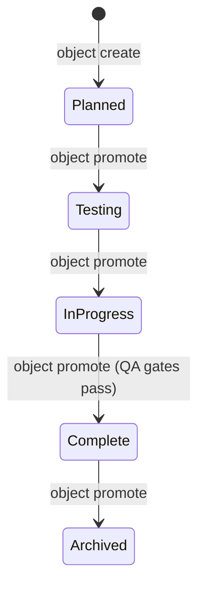

# Tutorial: Object Lifecycle Management

In ZQK, every entity is a typed system object governed by a formal finite-state machine. This tutorial guides you through the progression from conception to completion.

---

## The Lifecycle Stages

Most work items (Backlog Items, Agent Tasks, Technical Debt) follow these standard lifecycle stages, while macro-containers (Epics, Priority Plans) govern aggregated completion across their children:



1. **Planned (`planned` / `grooming`):**
   - Object is minted with title, problem statement, and initial effort estimate.
   - Grooming phase: Link `requirement_refs`, `criteria_refs`, and `persona_refs` to make the item shovel-ready.
2. **Testing / In Progress (`in_progress`):**
   - Active work is underway.
   - Associated with a Git feature/integration branch (`integration/pri-*`).
3. **Complete (`complete`):**
   - Verified against linked criteria.
   - Pre-commit gates pass, commits are stamped to the object.
4. **Archived (`archived`):**
   - Work is historical and immutable.

---

## Lifecycle Commands in Practice

```bash
# Check available fields for any kind
zqk object fields backlog_item

# Forward-promote to the highest valid satisfying state
zqk object promote BLI-xxxx

# Reverse-demote with an audit rationale if criteria fail
zqk object demote BLI-xxxx planned --reason "Additional acceptance criteria discovered"
```
