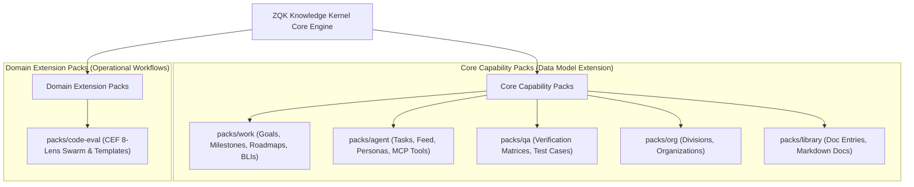

<!-- tags: packs, architecture, extensions, domains, codegen, lifecycles -->

# ZQK Knowledge Kernel Packs (`packs/`)

## 1. Philosophical Context & Guiding Architecture

In ZQK, a **Pack** is a bounded compile-time Go module that encapsulates a cohesive architectural domain. 

Rather than maintaining an unbounded monolithic schema where all entity kinds, lifecycles, and builders reside in a single flat directory, ZQK decomposes its ontological universe into modular domain packs:



---

## 2. Pack Composition & Anatomy

A standard **Core Capability Pack** (such as `packs/work` or `packs/agent`) provides the complete vertical slice for its domain entities:

```text
packs/<domain>/
├── specs/                  # Declarative Object Metaschemas (*.yaml)
├── lifecycles/             # State Machine Lifecycle Definitions (*_lifecycle.yaml)
├── bldr_v2/                # Strongly-typed Fluent Go Entity Builders
├── bldr_instance_v1/       # Concrete Instance Instantiation Constructors
├── bldr_lifecycle_v1/      # Lifecycle State Machine Constructors
├── bldr_enum_v1/           # Strongly-typed Domain Enums & Status Constants
└── pack.go                 # Pack Registration Metadata & Directory Pointers
```

### Components Explained:
1. **`specs/*.yaml`**: The single source of truth for the domain's entity schemas. Defines fields, types, foreign key relations, constraints, and validation rules.
2. **`lifecycles/*_lifecycle.yaml`**: The formal state machine graph governing allowable entity transitions, initial states, terminal states, manual/automatic hops, and preconditions.
3. **`bldr_v2/*.go`**: SpecBuilder-generated Go builders enabling fluent, type-safe construction of kernel entity payloads with zero runtime reflection.
4. **`bldr_instance_v1/*.go`**: Factory constructors that convert raw YAML or JSON into validated struct instances.
5. **`bldr_lifecycle_v1/*.go`**: Go representations of the lifecycle state machine used by validators and CLI transition engines.
6. **`bldr_enum_v1/`**: Strongly-typed enum definitions for statuses, priority tiers, and kind-specific constants.

---

## 3. Core Capability Packs vs. Domain Extension Packs

There is a fundamental philosophical distinction between the two types of packs in the repository:

| Dimension | Core Capability Pack (e.g. `packs/agent`, `packs/work`) | Domain Extension Pack (e.g. `packs/code-eval`) |
| :--- | :--- | :--- |
| **Primary Purpose** | Extends the **Knowledge Kernel Data Model** with new first-class CAS entity kinds. | Extends **Operational Workflows** with reusable orchestration templates and policies. |
| **Introduces Schemas?** | Yes (`specs/` define entities like `agent_task`, `goal`, `backlog_item`). | No (relies on existing kernel entities or evaluation scores). |
| **Introduces Lifecycles?** | Yes (`lifecycles/` define state machines). | No (state transitions follow standard task or session lifecycles). |
| **Generated Go Code** | Extensive (`bldr_v2/`, `bldr_instance_v1/`, `bldr_enum_v1/`). | Minimal or none (operates at the orchestration layer). |
| **Runtime Swarm Manifests** | None (agents are defined as data objects). | Yes (`swarm.yaml`, `templates/`, `membranes/`). |
| **Storage Mechanism** | Backed by CAS entities (`.zqk/process/`) or Streams (`.zqk/state/`). | Evaluated via CLI runtime (`zqk swarm run` or `zqk agent orchestrate`). |

---

## 4. Disambiguation: Compile-Time Packs vs. Swarm Manifests

- **Go Code Pack (`packs/<domain>/`)**: A compile-time Go package compiled directly into the `zqk` binary. It defines types, serialization rules, and validation logic.
- **Swarm Pack / Manifest (`swarm.yaml` under `examples/swarms/` or `packs/code-eval/`)**: A declarative, runtime configuration file interpreted by `zqk swarm run` or `zqk agent orchestrate`. It defines multi-agent roles, task dependencies, membranes, and model assignments.

---

## 5. Pack Authoring Guidelines

When adding a new domain to ZQK:
1. **Choose the Category**:
   - If introducing new persistent entities with state machines, create a **Core Capability Pack** with `specs/`, `lifecycles/`, and codegen builders.
   - If introducing an autonomous workflow or evaluation harness, create a **Domain Extension Pack** with `templates/` and `swarm.yaml`.
2. **Adhere to Code Generation Discipline**: Run `make codegen` to generate builders; never manually edit files inside `bldr_v2/` or `bldr_instance_v1/`.
3. **Register in `pkg/paths/spec_layout.go`**: Add the new domain directory to `ObjectSpecDomainDirs` so that `FindObjectSpecFile` and `FindLifecycleFile` automatically resolve entities from the pack.
4. **Enforce Static Floors**: Add unit tests in `pkg/validation/` to ensure 100% of the pack's lifecycles and specs satisfy validation invariants.
